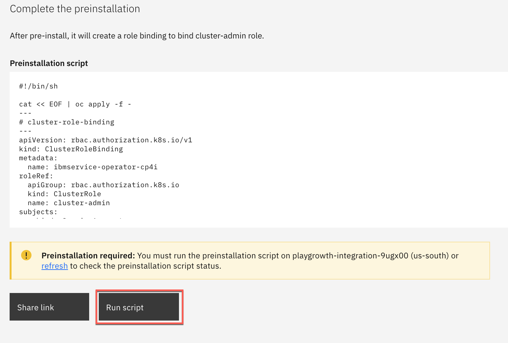
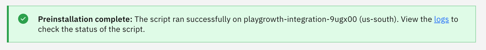
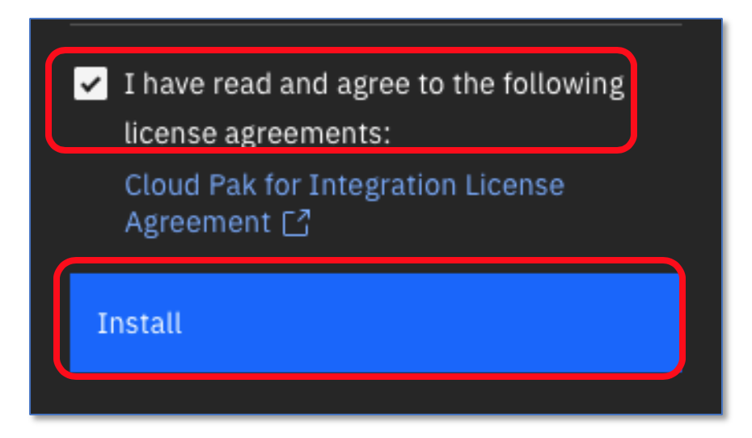
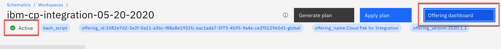
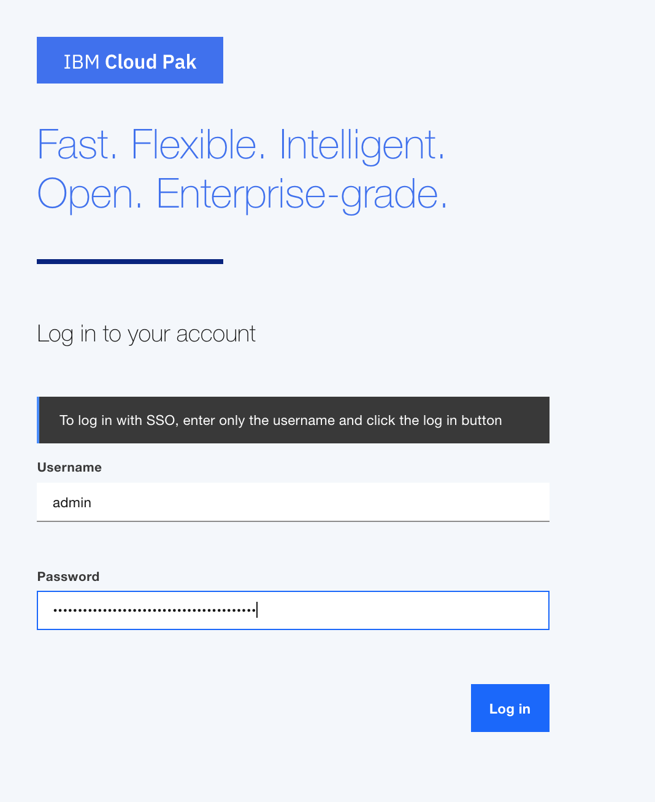
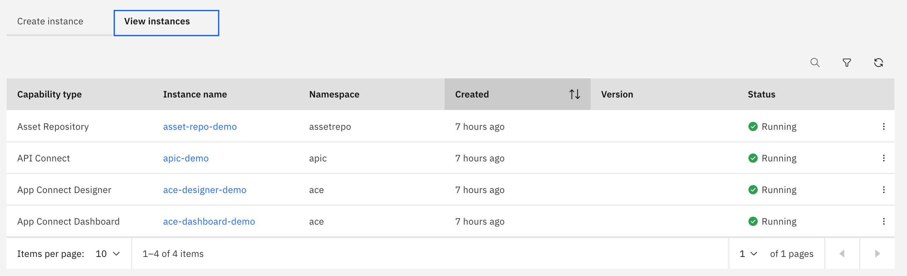

IBM Cloud Pak for Integration brings together IBM's market-leading
middleware capabilities to support a broad range of integration styles
and use cases. With powerful deployment, lifecycle management, and
production services running on Red Hat OpenShift, it enables clients to
leverage the latest agile integration practices, simplify the management
of their integration architecture, and reduce cost. Getting started with
**Cloud Pak for Integration (CP4I)** on **Red Hat** OpenShift
**Kubernetes Service (ROKS)** on IBM Cloud has never been easier with
one-click install. The following guide walks you through how to deploy
Cloud Pak Integration on ROKS cluster.

You will complete the following high level tasks:

-   Create a ROKS cluster in IBM Cloud

-   Install Cloud Pak for Integration on ROKS Cluster

-   Prepare the demo environment

-   Use integrated sales demos or DTE Hands on Labs for your workshops or customer engagements

Create a ROKS cluster in IBM Cloud 
----------------------------------

Cloud Pak for Integration ROKS cluster can be provisioned from IBMDemos
for demo purposes, self-learning or Proof of Concept projects. If you
have not already provisioned a cluster, follow these steps.

1.  Login to <https://www.ibm.com/demos/> using your IBM credentials

2.  From the featured Collection, select Cloud Pak for Integration

    

3.  From the Demo Environments section, select Cloud Pak for Integration
    ROKS 4.4 Cluster (Express). If you are interetsed in running CP4I 2020.1.1 select ROKS 4.3 cluster.

    

4.  Clock on **Reserve Instance**. If prompted for login, use your IBM
    ID credentials.

5.  Enter your **Opportunity number**, **Purpose**, **Provision
    duration** and **country/region**. The environment can be
    provisioned immediately by selecting the checkbox for a duration up
    to 14 days. Make sure you change the duration before you click
 **Create**.

    

6.  The reservation status is shown in the next screen if there is an
    available cluster from the pool for immediate use. Otherwise, an
    email notification will be sent when the cluster is ready.

    

7.  The reservation details can be viewed by selecting **Details**.

     

You are ready to install Cloud Pak for Integration!

Install Cloud Pak for Integration on ROKS cluster 
-------------------------------------------------

1.  Login to <https://cloud.ibm.com/catalog> if have not already

2.  From the Catalog, select **Cloud Pak for Integration**

    

3.  Select the Redhat Openshift Cluster that you just created from the
    list. The DTE provisioned cluster name starts with playgrowth. Enter
    a project name, and a tag name to identify your cluster.

    

4.  Skip this step if you are using Cloud Pak for Integration 2020.2.1 or higher. If you are using the schematics for CP4I 2020.1.1 
    you must run the preinstallation script before you install the Cloud
    Pak. There is no need to modify the content of the script, simply
    click on Run Script to complete the pre-installation step.

    

    Once the pre-installation step is complete, you may proceed with the
    installation.

    

5.  Enter a value for csDefaultAdminPassword. It is important that you
    choose a password that is 32 characters in length and it conforms to
    the password rule - number, letter, -.

     Note: Currently password validation is not enforced on this page. If you proceed with an invalid password you will be able to start the installation but it will fail. There is no way to recover from this error other than provisioning a new cluster.

6.  Scroll down to 'Parameters with default values' and click on the
    'twisty' to open them. There is no need to change the default values
    except for the parameters that start with demo.

    

    If you do have an SMTP email server and accounts that you can use, you
    may sign up for a free mailtrap.io account using
    [https://mailtrap.io](https://mailtrap.io/). Mailtrap.io is a free cloud
    service that mimics an SMTP server. It is used for
    development/demonstration purposes only.

    Fill in the following fields:

    demoPreparation: Set to 'true'

    demoAPICEmailAddress: if you're using mailtrap.io, use any email
    address. Use 'apicadmin@example.com' to be safe -- example.com is
    guaranteed to not be a real domain. If you're using your own mail
    server, use an email address that you can receive and read.

    demoAPICMailServerPort: if you're using mailtrap, leave this as 2525

    demoAPICMialServerUsername: Set this to your mailtrap user name

    demoAPICMailServerPassword: Set this to your mailtrap password.

7.  Accept the license agreement and click **Install** to install Cloud
    Pak for Integration. The installation will take up to 60 minutes.

    

8.  You can view the progress in the Schematics progress bar or check
    the details in view log.

    

9. When you see the **Active** status, you will be able to access Cloud
    Pak for Integration Platform Navigator by selecting **Offering
    Dashboard** on the upper right corner of the page.

    

    You can also get to the platform navigator page from a browser by
    manually entering navigator-integration.<yourcluster-domain-name\>.
    Your cluster domain is shown in the Details section in Reserved
    Instances.

    

10. Click on **view instances** to view the instances for API Connect,
    App Connect Designer, App Connect Dashboard and Asset Repository.
    Additional instances for any of the Integration Capabilities can be
    created by selecting **create instance.**

    

    You have successfully completed cluster provisioning, Cloud Pak for
    Integration installation and deployment of API Connect and App Connect.
    You are ready to proceed to Sales Demos that are supported on Cloud Pak for Integration
    on ROKS.