IBM Cloud Pak for Integration brings together IBM's market-leading
middleware capabilities to support a broad range of integration styles
and use cases. With powerful deployment, lifecycle management, and
production services running on Red Hat OpenShift, it enables clients to
leverage the latest agile integration practices, simplify the management
of their integration architecture, and reduce cost. Getting started with
**Cloud Pak for Integration (CP4I)** on **Red Hat** OpenShift
**Kubernetes Service (ROKS)** on IBM Cloud has never been easier with
one-click install. The following guide walks you through how to deploy
Cloud Pak Integration on ROKS cluster.

You will complete the following high level tasks:

<AnchorLinks>
  <AnchorLink>Create a ROKS cluster in IBM Cloud</AnchorLink>
  <AnchorLink>Install Cloud Pak for Integration on ROKS Cluster</AnchorLink>
</AnchorLinks>

***

##Create a ROKS cluster in IBM Cloud

Cloud Pak for Integration ROKS cluster can be provisioned from IBMDemos for demo purposes, self-learning or Proof of Concept projects. If you have not already provisioned a cluster, follow these steps.

1.Access the [IBM Asset Repo site](https://assetrepo.ibm.com/) and log in using your IBM credentials.

2.On the home page, scroll down and open the **Cloud Pak for Integration Activation Kit**.

  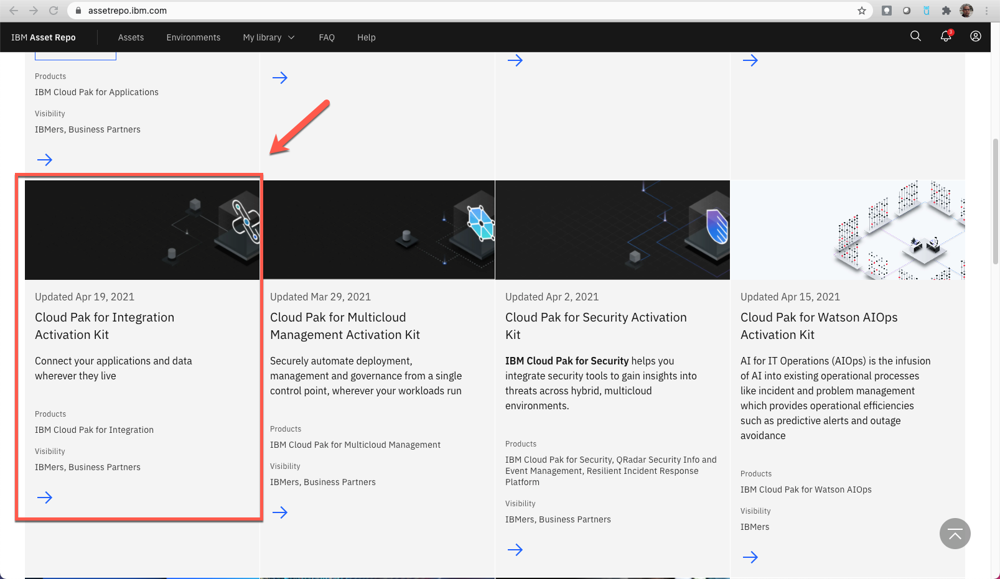

3.Open the **Environments** tab.

  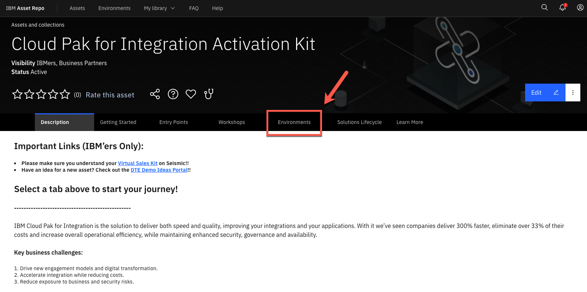

4.Select the ROKS cluster that you want (the simplest way is to select the latest version of the Express instalation).

  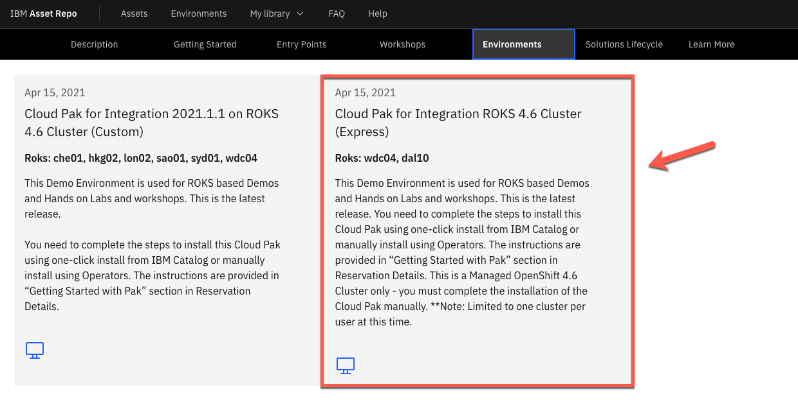

5.Follow the **Create a reservation** form to define the details of your ROKS Reservation.

  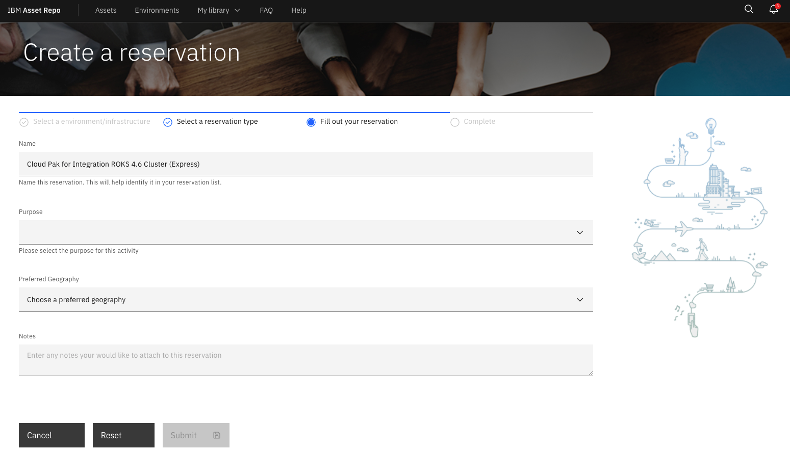

  After few minutes, your ROKS environment is ready. Now you are ready to move to the next step and install Cloud Pak for Integration!

***

## Install Cloud Pak for Integration on ROKS cluster

1.  Login to <https://cloud.ibm.com/catalog> if have not already

2.  Confirm that you are using the DTE organization.

    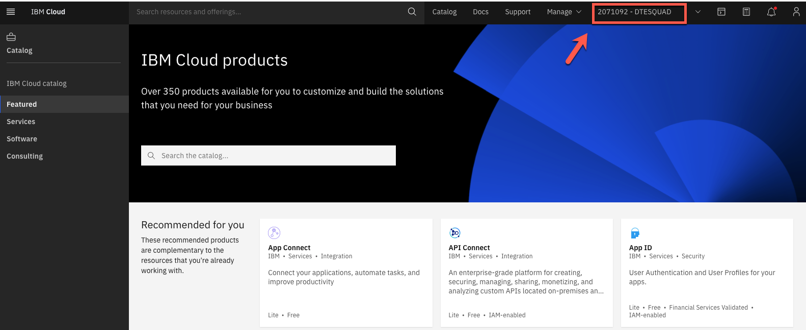

3.  From the Catalog, select **Cloud Pak for Integration**

    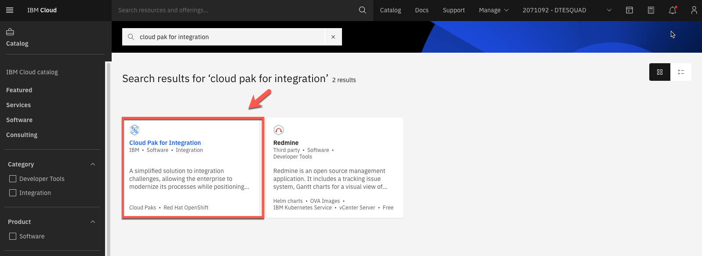

3.  Select the Redhat Openshift Cluster that you just created from the list. The DTE provisioned cluster name starts with dteroks or playgrowth.

    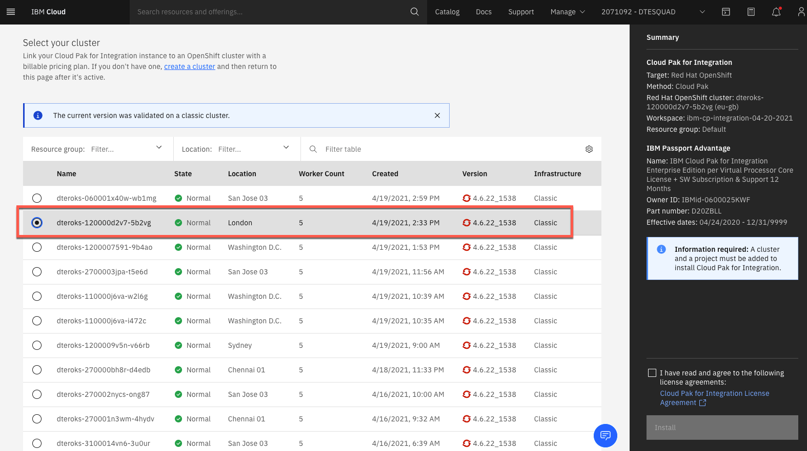

4.  Click **Add project** Enter a project name, and a tag name to identify your cluster.

    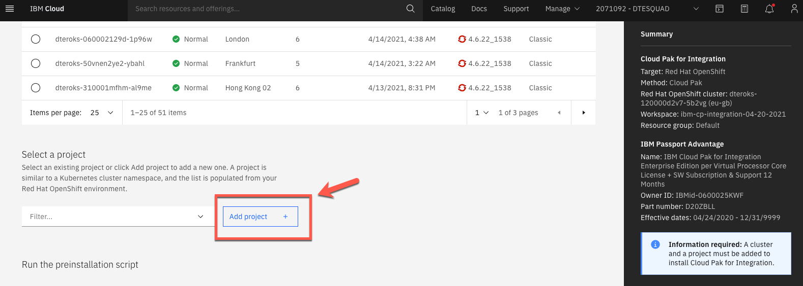

5.  Enter **cp4i** as Project name and click **Add**.

    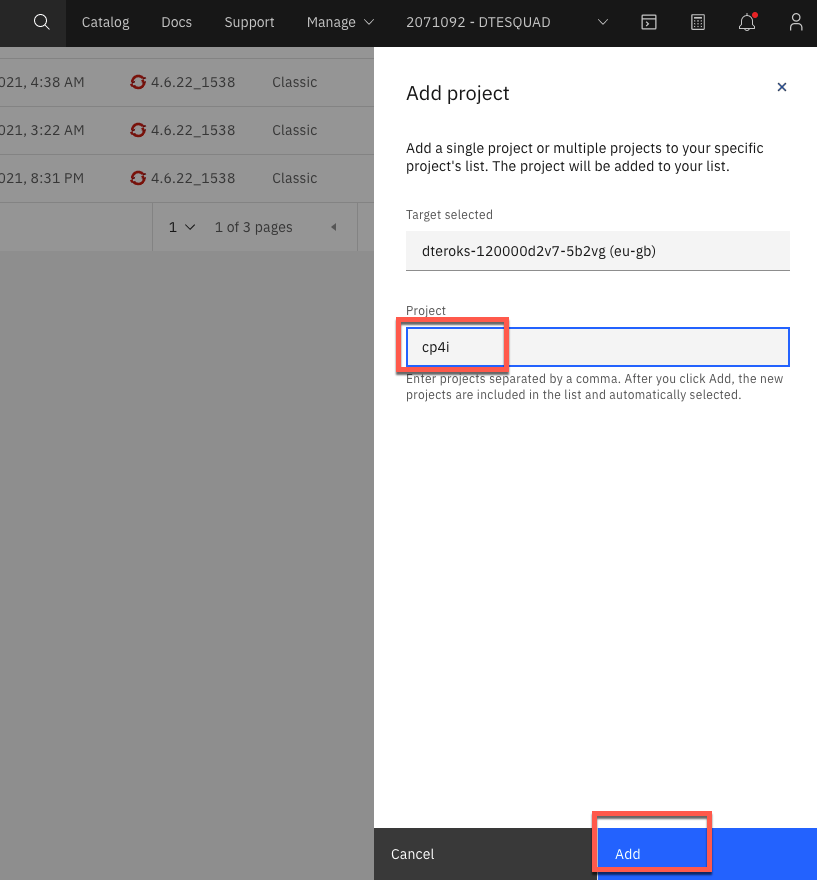

6.  Scroll down. On *Set the deployment values* section. Unmark the **Use an existing secret?** to define a new password and enter a value for csDefaultAdminPassword. It is important that you choose a password that is 32 characters in length and it conforms to the password rule - number, letter, -.

     *Note: Currently password validation is not enforced on this page. If you proceed with an invalid password you will be able to start the installation but it will fail. There is no way to recover from this error other than provisioning a new cluster.*

     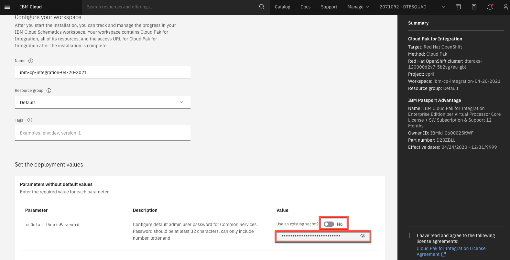

7.  Scroll down to 'Parameters with default values' and click on the 'twisty' to open them. There is no need to change the default values except for the parameters that start with demo.

    

    If you do have an SMTP email server and accounts that you can use, you may sign up for a free mailtrap.io account using [https://mailtrap.io](https://mailtrap.io/). Mailtrap.io is a free cloud service that mimics an SMTP server. It is used for development/demonstration purposes only.

    Fill in the following fields:

    demoPreparation: Set to 'true'

    demoAPICEmailAddress: if you're using mailtrap.io, use any email address. Use 'apicadmin@example.com' to be safe -- example.com is guaranteed to not be a real domain. If you're using your own mail server, use an email address that you can receive and read.

    demoAPICMailServerPort: if you're using mailtrap, leave this as 2525

    demoAPICMialServerUsername: Set this to your mailtrap username.

    demoAPICMailServerPassword: Set this to your mailtrap password.

    You are welcome to set true in drivewayDentDeletionDemo and eventEnabledInsuranceDemo, if you desire.

7.  Accept the license agreement and click **Install** to install Cloud
    Pak for Integration. The installation will take up to 90 minutes.

    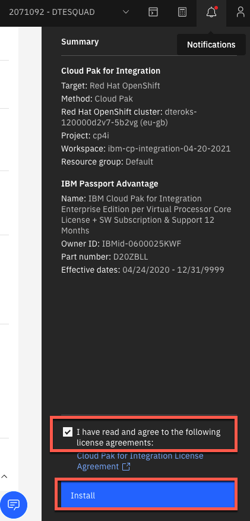

8.  You can view the progress in the Schematics progress bar or check the details in view log.

    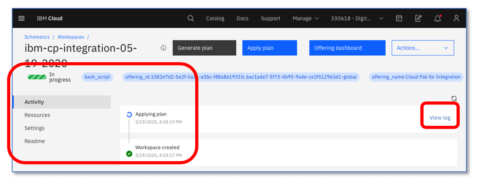

9.  When you see the **Active** status, you will be able to access Cloud Pak for Integration Platform Navigator by selecting **Offering Dashboard** on the upper right corner of the page.

    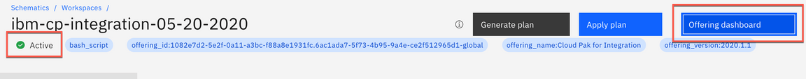

    You can also get to the platform navigator page from a browser by manually entering **cpd-cp4i.<yourcluster-domain-name\>**. Your cluster domain is shown in the Details section in Reserved Instances.

10. On **Log in** page, select the authentication type **IBM provided credentials (admin only)**.

    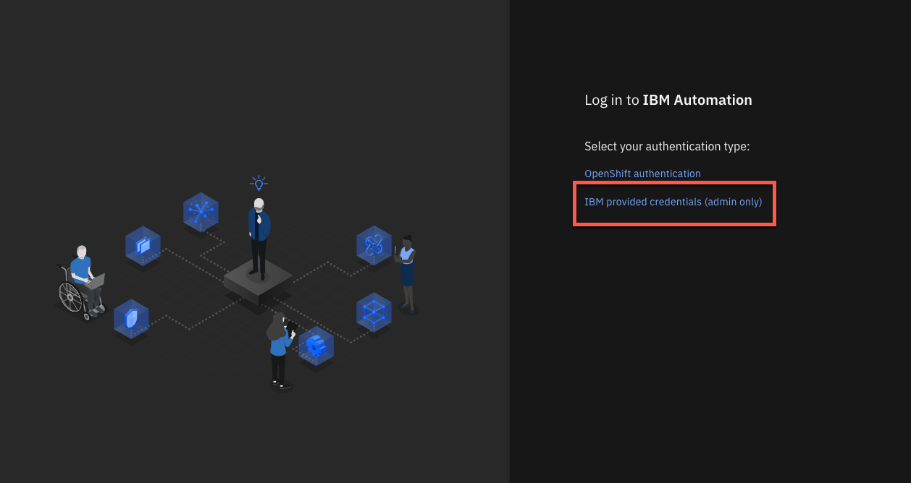

11. Log in with your admin user and password.

    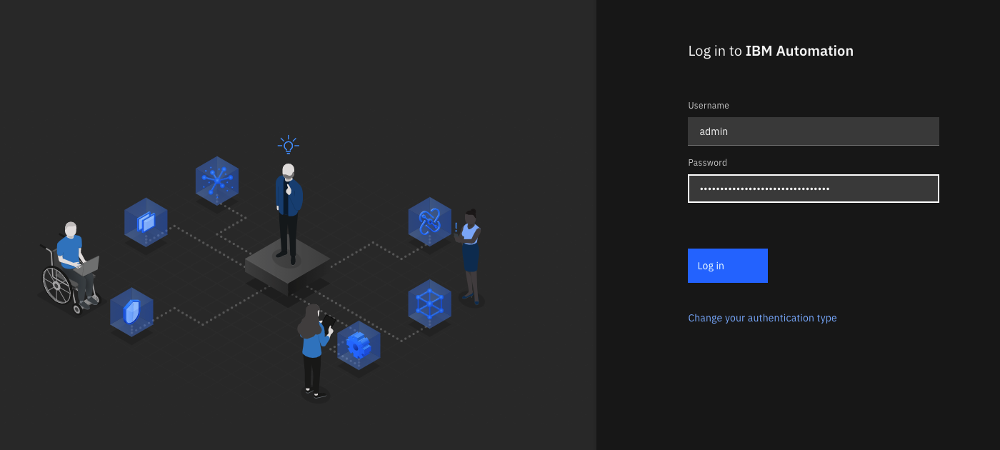

12. Click on **View capabilities**.

    

13. Here you are able to view the instances for API Connect, App Connect Designer, App Connect Dashboard and Asset Repository. Additional instances for any of the Integration Capabilities can be created by selecting **Create capabilities.**

    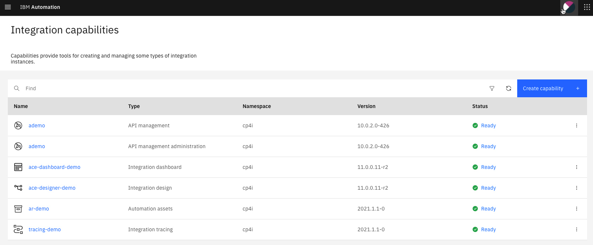

    You have successfully completed cluster provisioning, Cloud Pak for Integration installation and deployment of API Connect and App Connect. You are ready to proceed to Sales Demos or CP4I Labs that are supported on Cloud Pak for Integration on ROKS.
