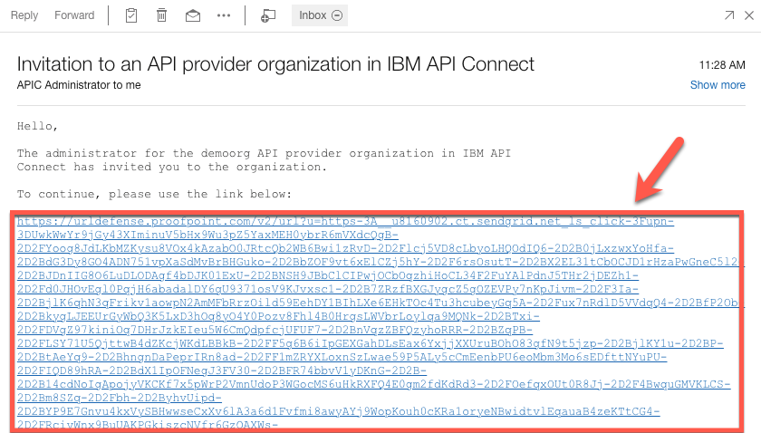

IBM Cloud Pak for Integration brings together IBM's market-leading
middleware capabilities to support a broad range of integration styles
and use cases. With powerful deployment, lifecycle management, and
production services running on Red Hat OpenShift, it enables clients to
leverage the latest agile integration practices, simplify the management
of their integration architecture, and reduce cost. In this document you
request access to a shared Cloud Pak for Integrations on ROKS, to be used in
Sales Demos. The environment is pre-installed with demo assets, and you just
need to follow the Demo Script. Remember, this is a shared environment, please
don't customize or change anything there. If you need your own environment,
follow the directions from [Request your own CP4I environment on ROKS](/cp4i-on-roks/).

You will complete the following high level tasks:

<AnchorLinks>
  <AnchorLink>Requesting Access to the shared Environment</AnchorLink>
  <AnchorLink>Accessing the Environment</AnchorLink>
</AnchorLinks>

***

## Requesting Access to the shared Environment

1.Access the [Cloud Pak Outcomes](https://assetrepo.ibm.com/collection/cloud-pak-outcomes) collection on IBM Asset Repo and log in using your IBM credentials.

2.On the Outcomes Environments, click on the **Environments** section (1) and select **Cloud Pak for Integration - Outcomes** (2).

  

3.Select your *Reservation type*.

  

4.Follow the **Create a reservation** form to define the details of your ROKS Reservation.

  

5.After few seconds, your Cloud Pak for Integration Outcomes Demonstration is ready.

  

***

## Accessing the Environment

1.Check, your email. You should have received two emails, one from IBM Cloud and the second one from APIC Administrator. Let's start with the IBM Cloud's email (next section you will use the APIC Administrator's email). In this first email, you should have the Environment URL, login and password (take note of them, you will use them multiple times during the demo). Open the **URL**.

  

2.If necessary, accept the risks. On the *Log in* page, click on **Enterprise LDAP** link.

  

3.Log in, using the username and password that you received in your email.

  

***

## Accepting the Invitation for API Provider Organizations

1.As part of the demo, you will need to access the Demo API Provider Organization in IBM API Connect. You should have received an email from APIC Administrator to joint the Demo Organization. Open this email, and click the link to accept the invitation.

  

2. Select the **LDAP User Registry for Outcomes** authentication type.

  

3.Log in, using the username and password.

  

4.Now you should see a **Registration completed successfully** screen. Great, you are ready to demo!

  
