# Lab 1 - Introduction to IBM MQ 

If you haven't reviewed the introduction and overview you can find it here:

[View an introduction to IBM MQ](https://ibm.box.com/s/gkflgmtlsq1ipihj0rkljgi564pdh9wq)

## Objectives for Lab 1

* Create Queue Managers
* Work with Queues (create, test, browse.delete)
* Connect queue managers using channels, and explore distributed queuing
* Create a Queue Manager Group (or Set)
* Administer a Group of Queue Managers Collectively
* Use Filters

In this lab you will be introduced to the IBM MQ Explorer, the primary interface for administering an IBM MQ environment. Using this eclipse-based tool you will have an opportunity to see how easy it is to create various MQ objects, view their status, and manipulate them. In a later lab exercise you will use the IBM MQ Console, a web-based administration interface.

You will also exercise some basic command line facilities that will allow you to place messages onto queues and remove messages from queues. 

## Create a Queue Manager  

Before you can do any useful work in an IBM MQ environment you must have a queue manager present.    

1. Once the Windows VMware image starts up, you should have a window that looks similar to the screen capture below.    
    
 
1. Click the mouse or hit enter to bring up the sign-on panel. Sign in as ibmdemo which should be pre-filled. Enter passw0rd for the password and click the right arrow or hit enter.  
    
 
1. You are now signed on as ibmdemo and the desktop will appear.  
    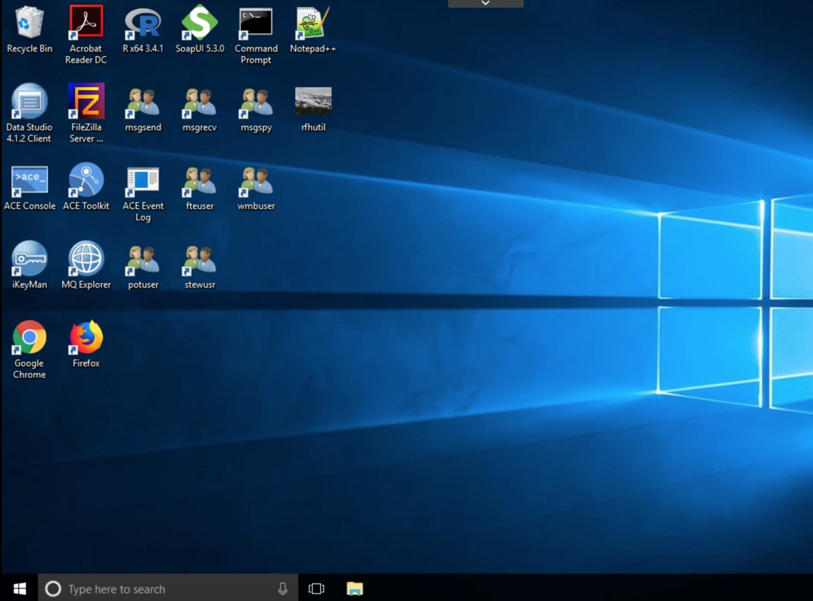
 
1. Click the hidden icons on the toolbar to show what is running. The indicated icon represents IBM MQ on this system.  
    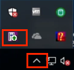 
 
1. Start the IBM MQ Explorer by double-clicking its icon on the desktop.  
    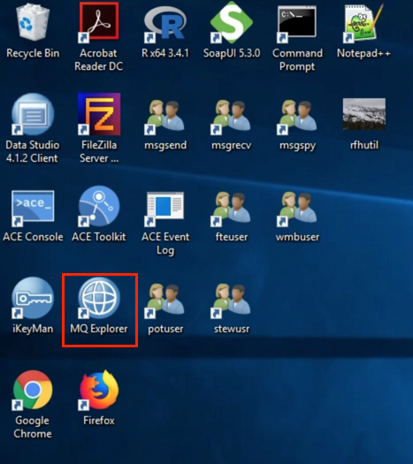
 
1. The welcome screen provides a nice selection of resources for the product. Note the various options on the Welcome screen and explore them if you would like. The first time you launch IBM MQ Explorer after an install of IBM MQ this Welcome screen will be displayed automatically.   
    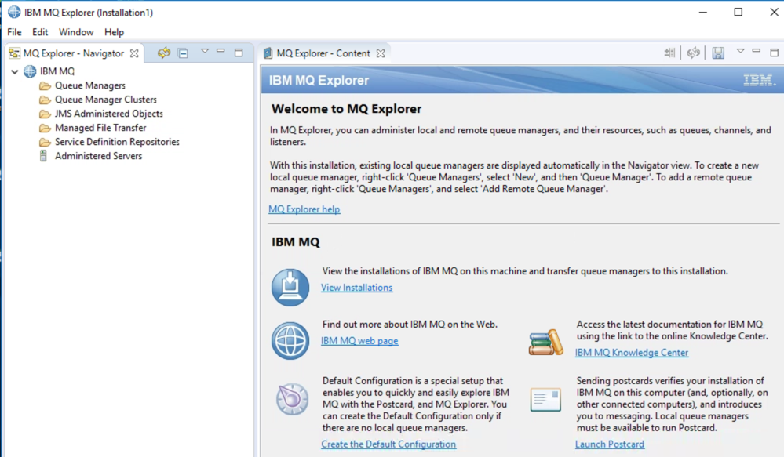
 
1. The left-hand pane in IBM MQ Explorer is called the Navigation pane. In the navigation pane, locate the Queue Managers folder.  

    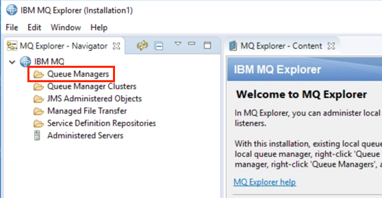 
 
1. Right-click Queue Managers and select New then Queue Manager.   
    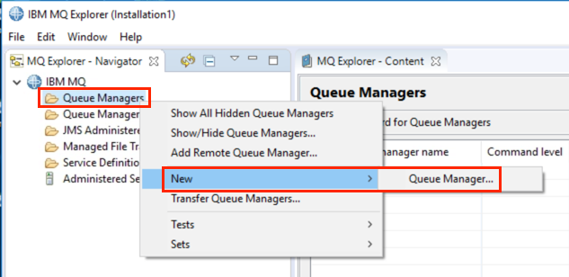
  
1. Create a new queue manager and name it **MQPOT**. Check the box to make this the **default queue manager**. Note that the use of a default queue manager is not recommended in a production environment as it allows requests from a program or command to complete successfully without the inclusion of a queue manager name. We are using this option here in the labs as a convenience to reduce typing for you.               

                                    

1. Specify *SYSTEM.DEAD.LETTER.QUEUE* as the dead letter queue, and then click the Next button.   
    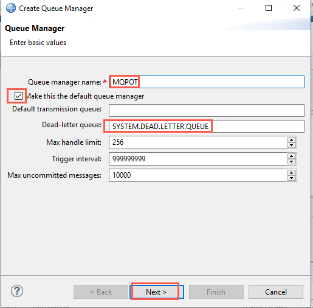 
 
1. Leave the defaults for the log values and click Next.   
    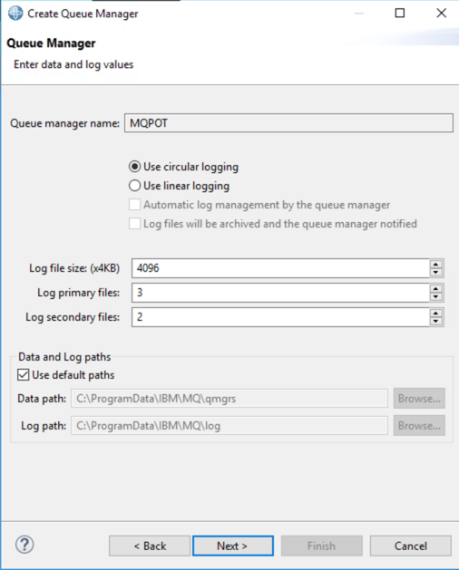 
    
1.  Also leave the defaults on the next pane and click Next.   
    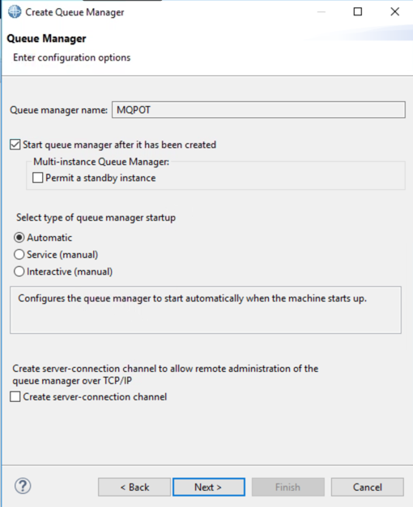   
    
1. The default listener port (1414) is being used for another Queue manager. Use another listener port: **2414**.

    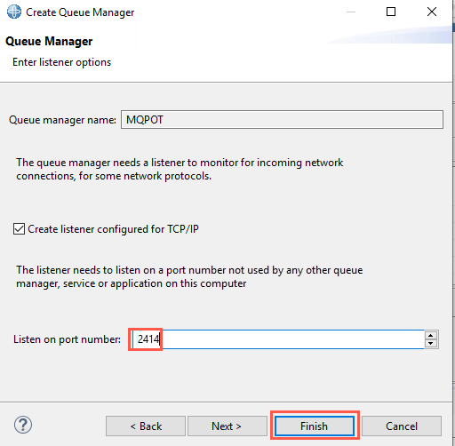
                                             
1. The create queue manager process takes a few seconds during which time the following panel is displayed…    
    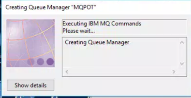 

1. The newly created queue manager is displayed in the IBM MQ Explorer. Click queue manager MQPOT. In the Content pane on the right-hand side you can see details about the queue manager, such as its status, properties, etc.  
    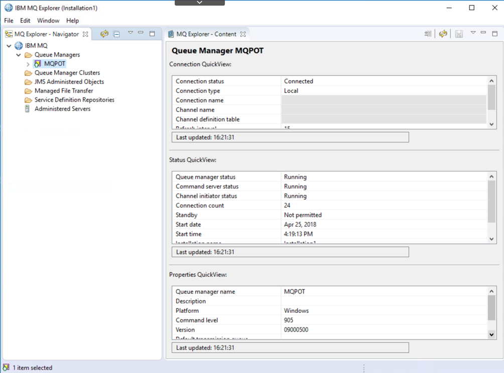
 
*This concludes this portion of Lab 1.*
 
## Testing Basic Functionality 

In this section of the lab you will create a local queue, place a test message on the queue, browse the message, clear it from the queue and finally delete the queue. 

1. Expand the new MQPOT queue manager by clicking the “\>” symbol in front of it in the navigation tree.   

    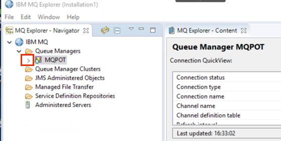 
 
1. Observe the tree structure that is displayed in the Navigator pane. There are separate folders for Queues, Topics and Subscriptions, Channels, just to name a few.   
    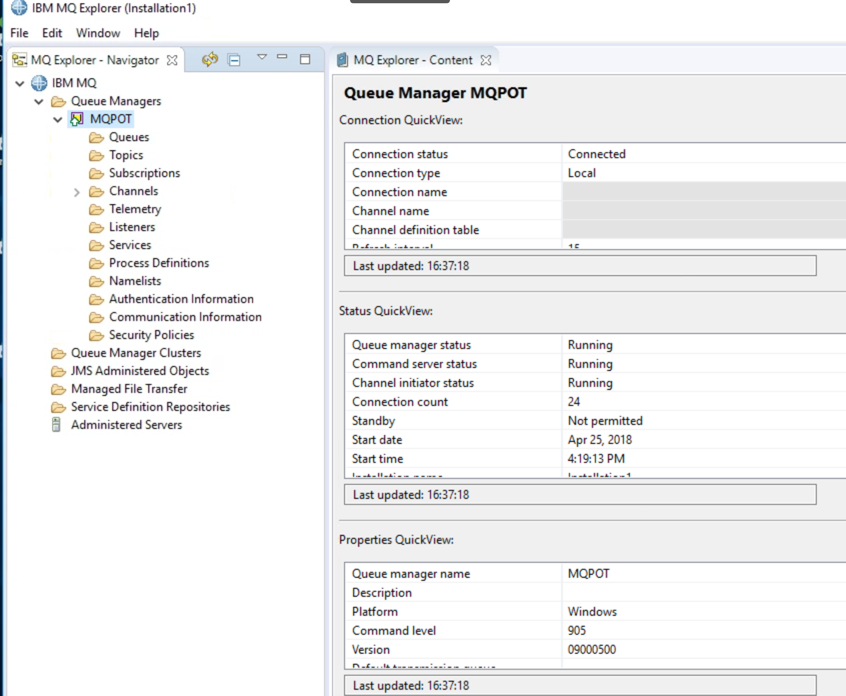 
 
1. Now you will create a new queue. Within the MQPOT queue manager right-click Queues then select New then Local Queue.   
    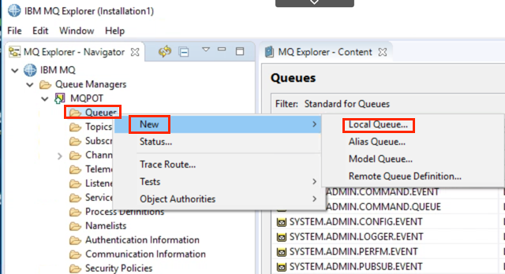  

1. Name the new queue **QL01** then click the Next button.   
    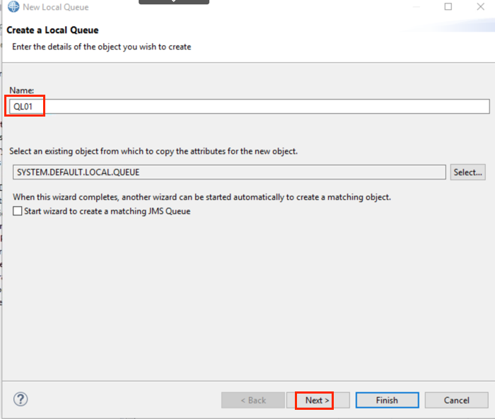
 
1. Note the variety of tabs on the left. There are many characteristics or properties for a queue. Explore some of them if so desire. In most cases you can utilize the defaults. For purposes of this lab you can accept all of the defaults – click Finish to create the queue.   
    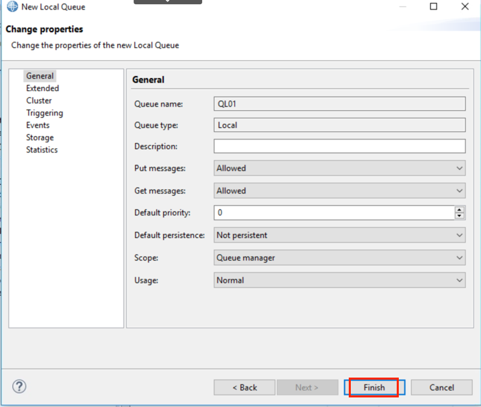

1. Dismiss the completion panel by clicking the OK button.  
    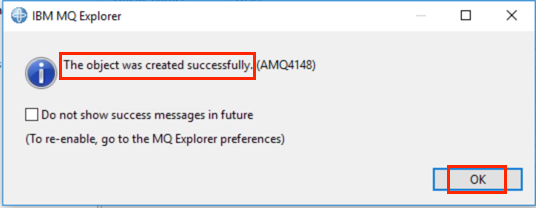
 
1. If the SYSTEM.* queues are displayed, you may click the toggle button in the top right corner to hide the SYSTEM.* queues. 
In the Content pane on the right-hand side the newly created queue is displayed along with its various properties. The Current queue depth property is a measure of how many messages are currently in the queue. Note that the current queue depth is 0 as you would expect since you just created the queue.  
    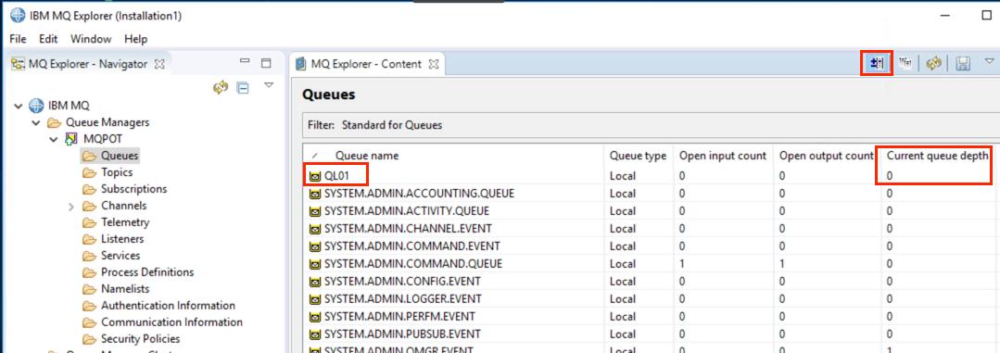
 
                               
1. Next you will place a message in the queue. Right-click the QL01 queue and select *Put Test Message*.   
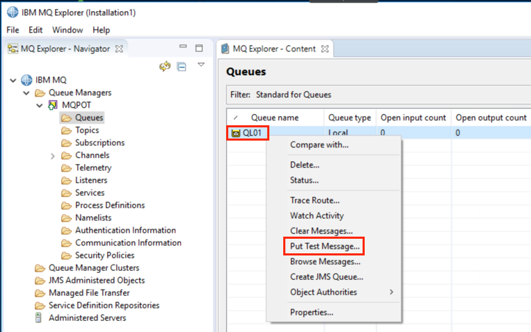
 
1. Enter a test message by typing something of your choosing in the Message data field and click the *Put message* button.   
                                             
    
 
1. Close the Put test message panel by clicking the Close button.   
    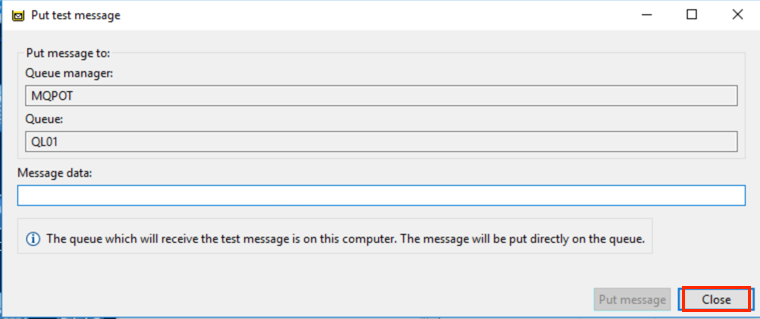  
                        
1. When you return to the display of queues, note that the Current queue depth count is now 1. This represents the test message you just placed into the queue.  
                                             
    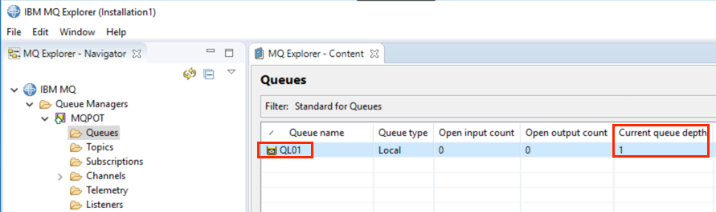
 
1. You can view details about the messages on a queue – right-click queue QL01 and select Browse Messages.    
    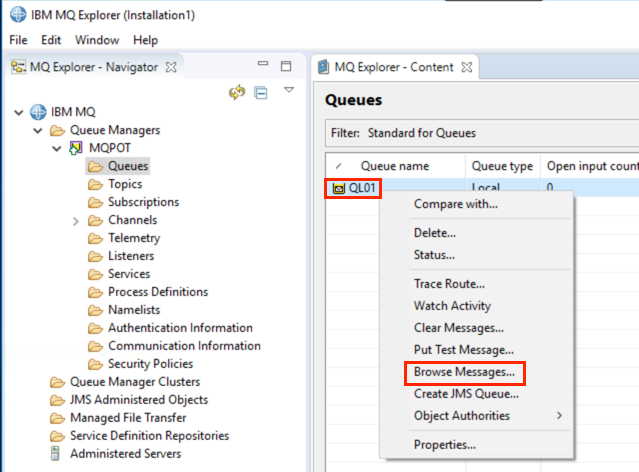
 
1. Here is the resulting display. Note that there is a scroll bar at the bottom that allows you to view additional data that is not currently in view. There will be one such line displayed for each message in the queue. Click the Close button.  
    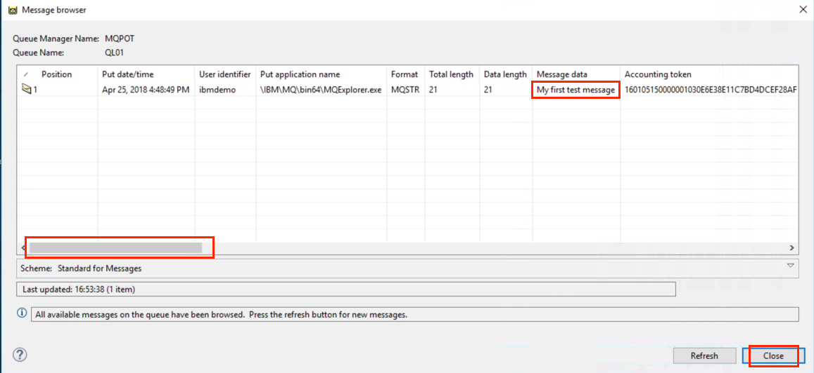   
                        
1. You will now delete your test message from the queue. Right-click queue QL01 and select *Clear Messages…*. Note that this action will remove all messages from the queue.   
                                             
    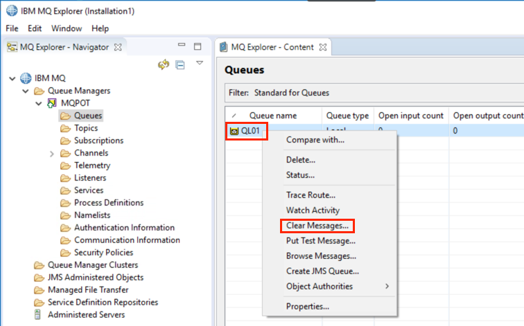
 
1. Accept the default selection of using the CLEAR command. This option cannot be used if any application has the queue open. In that case the second option would be required. Click the Clear button.  
    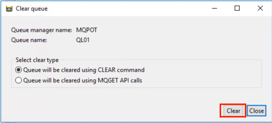
 
1. Click the OK button to dismiss the confirmation panel.  
    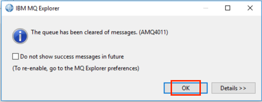
 
    You can now see that the queue is indeed empty.   
    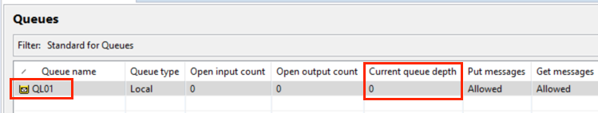  
                        
1. You will now delete the queue. Right-click the QL01 queue and select *Delete…*.  
                                             
    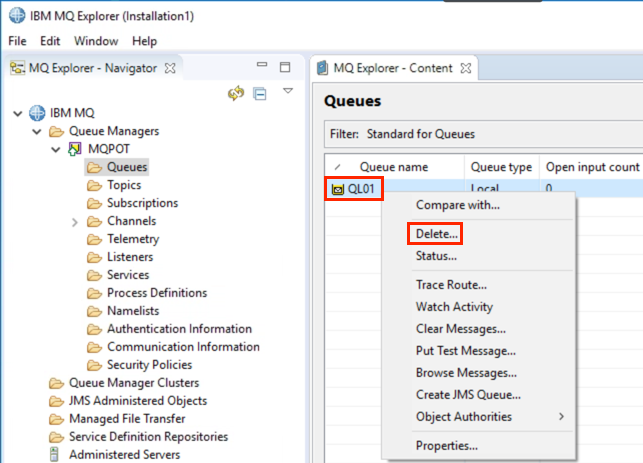
 
1. Confirm the request by clicking the Delete button.   
    
 
1. Dismiss the confirmation panel by clicking the OK button.  
    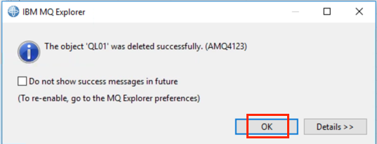
 
*This concludes this portion of Lab 1.*
 
## Grouping Queue Managers
                        
In this portion of the lab you will use a feature of IBM MQ Explorer that allows grouping of queue managers into Sets. This offers a convenient way to view and/or manage a subset of queue managers. A particular queue manager may be a member of one Set or many Sets or no Set at all. The only restriction is that a set may not contain another Set.
 
Using the IBM MQ Explorer, you will now create the following queue manager and assign it the indicated port number for the listener:

| Queue Manager | Listener port number |
|:-----------:|:-------:|
|MQPROD    |   2415 | 
                                             

1. Right-click Queue Managers and select New, then Queue Manager.   
    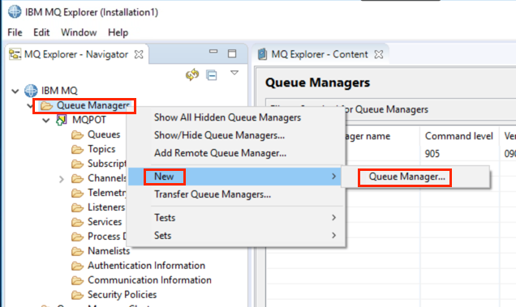
 
1. Enter MQPROD as the name and click the Next button.    
    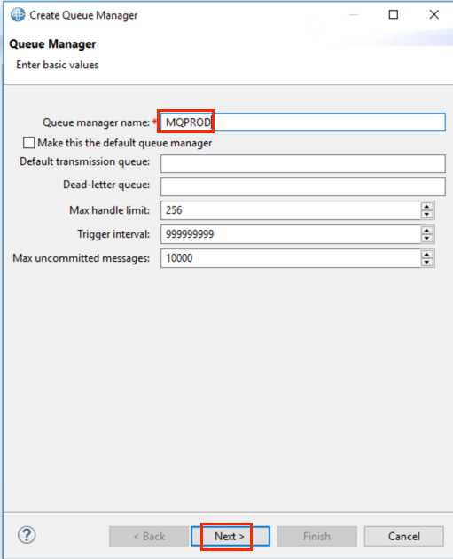 
 
1. Click the Next button to accept these defaults….    
    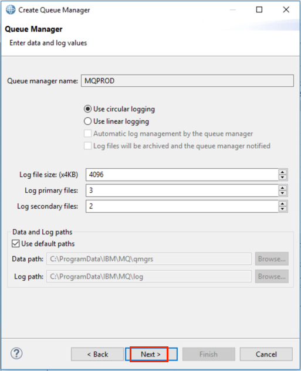
 
1. Click the Next button to accept these defaults….    
    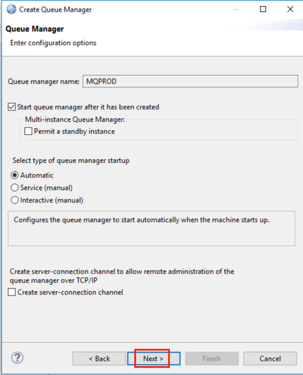
                              
1. Enter 2415 as the port number and click the Finish button.   
    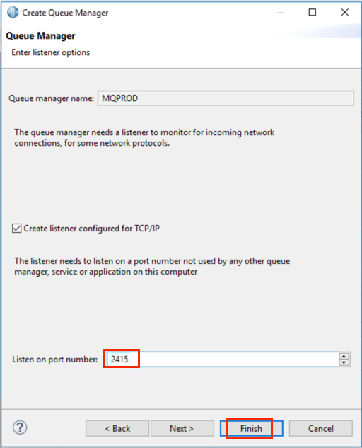
    
1.  Using IBM MQ Explorer and the steps shown above create another queue manager and assign it the indicated port number for the listener:
    
    | Queue Manager | Listener port number |
|:-----------:|:-------:|
|MQQA01    |   2416 | 

1. Check the Content pane and make sure all three of the queue managers have been created, and that the Queue manager status for each is Running.  
    

1. To include Sets in the IBM MQ Explorer display, right-click Queue Managers and select Sets then Show Sets. 
    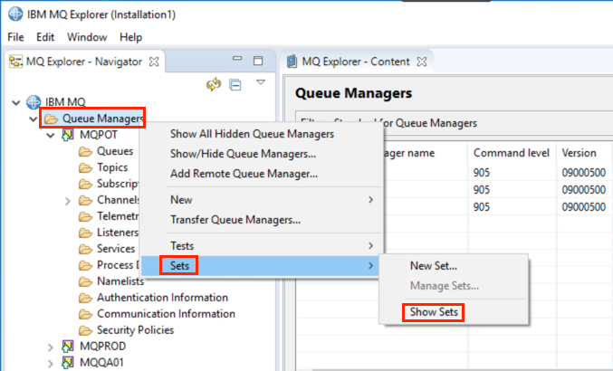
  
    You now see that you have a default set called All that contains every queue manager that is defined.     
    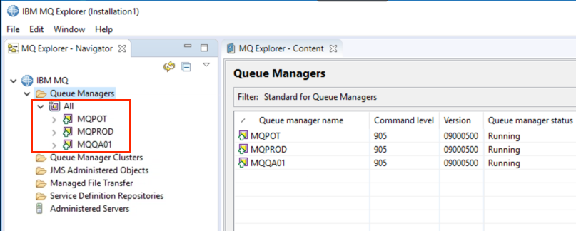
 
1. To define a new Set, right-click Queue Managers and select Sets then New Set.    
    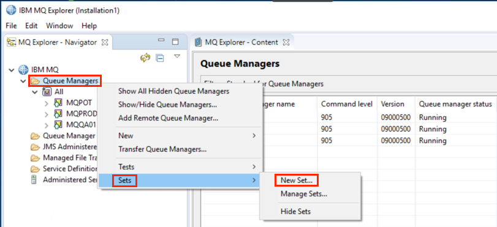
 
1. Enter PROD.QMGRS as the name, leave the Select type as Manual and click the Next button. 
    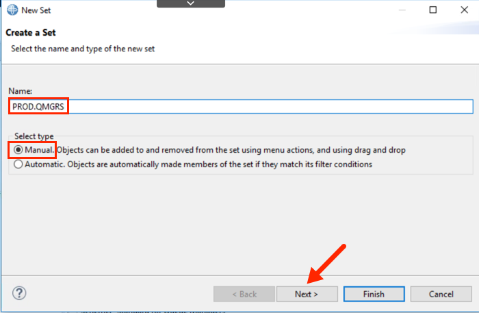
 
1. Click the check box for MQPROD to indicate that this queue manager is to be included in the Set and click the Finish button.   
    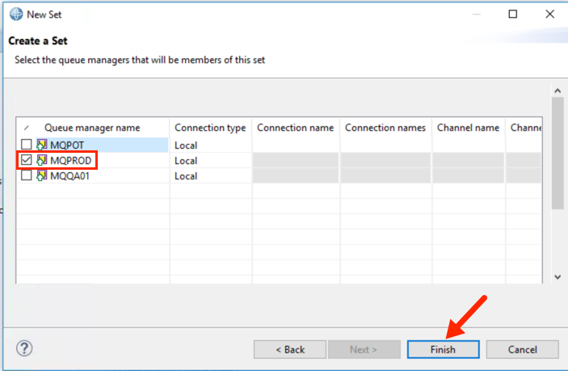 
 
                               
1. Click the "\>" sign to expand the PROD.QMGRS Set. Note that MQPROD is a member of both the All Set and the PROD.QMGRS Set.          
    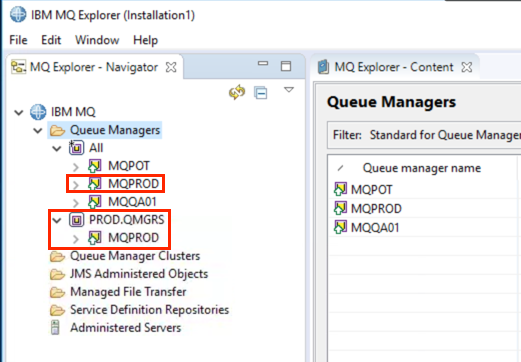

    Once a Set has been created you can take an action against the entire Set of queue managers by issuing a single request. For example you can:

    * Show/Hide All
    * Connect/Disconnect All
    * Start/Stop All Local
    * Run Default/Custom Tests

1. To take some joint action against a Set of queue managers, right-click the Set and choose the desired action in the pulldown list. Right-click PROD.QMGRS and select Stop Local Queue Managers…   
    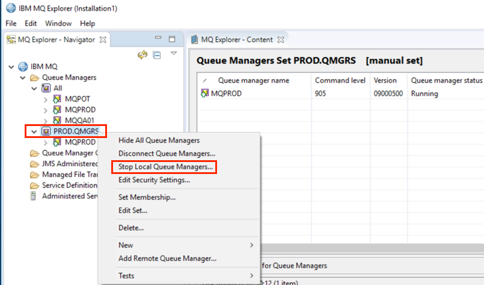
 
1. Choose Immediate for the Stop Method (not a good option for a production queue manager!) and click OK.   
    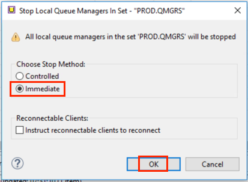 
 
1. After a few seconds the queue manager will show a status of stopped. Click the Close button to remove the Set Action panel.   
    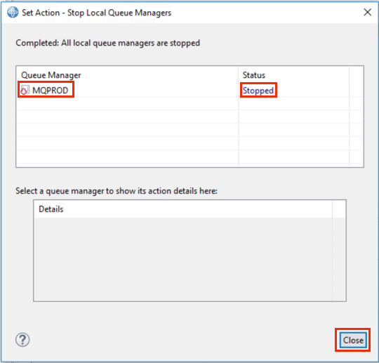  
 
    In the previous example, you performed your queue manager grouping in a manual fashion. Grouping can also be done automatically based on a filter you specify. To illustrate this you will create another Set and define it so that it will automatically add the appropriate queue manager(s) to the Set based on a portion of the queue manager name.
 
1. Right-click Queue Managers and select Sets then New Set.   
    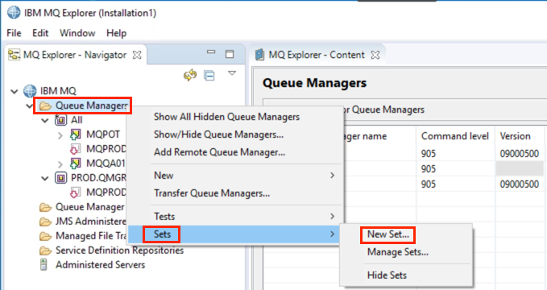 
 
1. Name the Set QA.QMGRS, select Automatic and click the Next button.   
    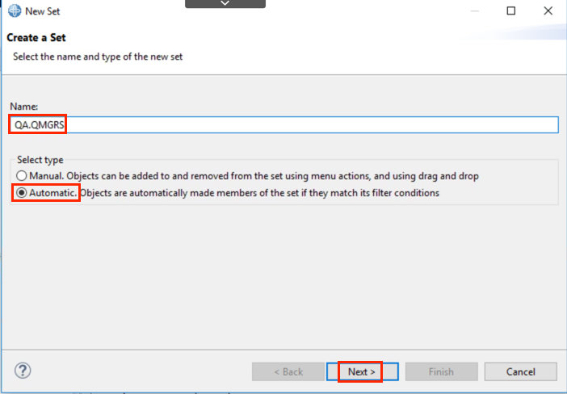    
                        
1. This panel shows some predefined filters that can be used to choose queue managers for this Set. You can see that you could filter based on IBM MQ version and release level or on the operating system platform the queue manager is running on. You are going to create a new filter. Click the Manage Filters button.    
                                             
    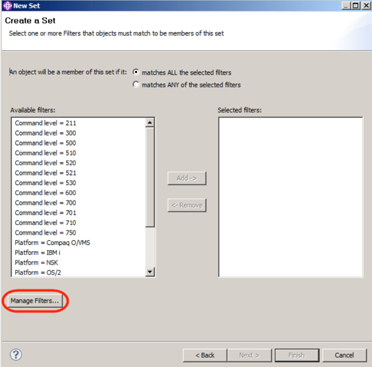
 
1. Next, click the Add button to indicate that you want to add a new filter.   
    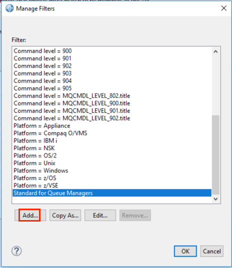

1. Enter “QA qmgrs prefixed by MQQA” for the Filter Name. Enter “MQQA*” for the Queue manager name like field. The * is a wild card in this case, any queue manager name that begins with MQQA will satisfy this filter. Click the OK button. 
    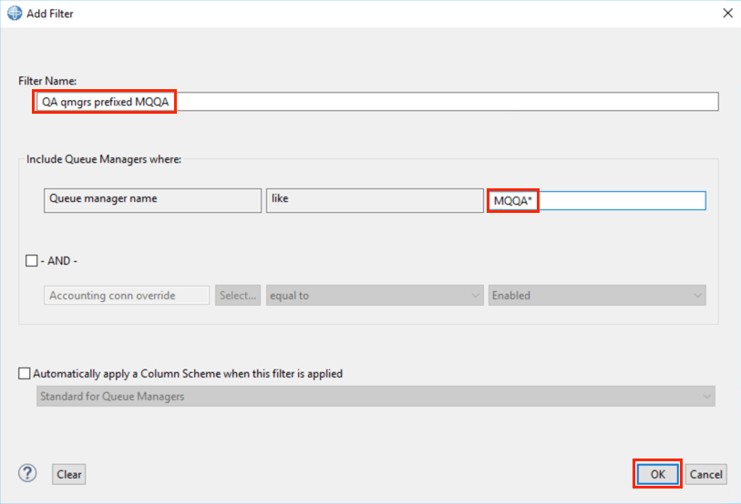
 
1. The new filter now appears in the filter list. Click the OK button.   
    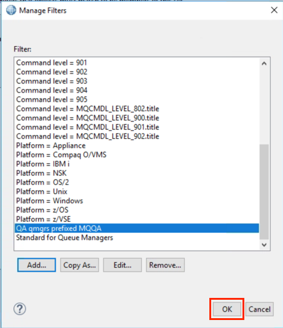
 
1. Click the QA qmgrs prefixed by MQQA in the Available filters list to select it. Then click the Add button to move it to the Selected filters box.    
    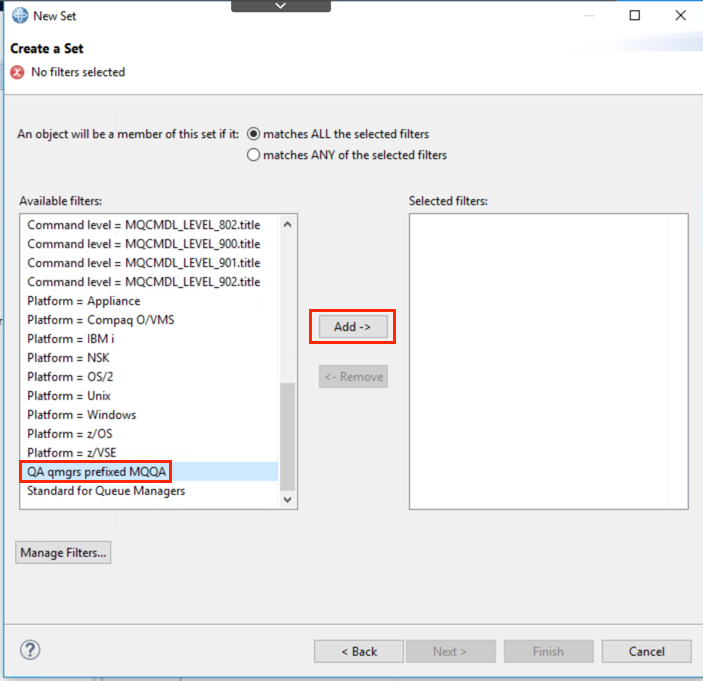
 
1. Then click Finish.    
    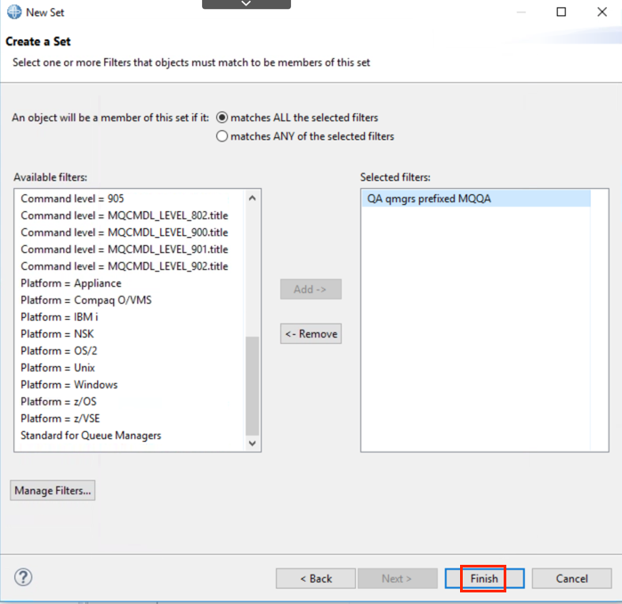     
                        
1. In the main IBM MQ Explorer menu you can see that the new Set has been created and queue manager MQQA01 has been automatically added to the QA.QMRGRS group as it satisfied the filter you specified.     
    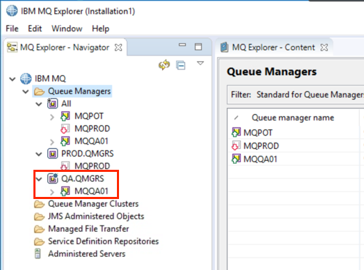
 
If you created a new queue manager whose name satisfied your filter it would also get automatically added to the QA.QMRGS Set. 

This is the end of this portion of Lab 1. 

## Distributed queuing
Your next step will be to explore distributed queuing. Since the primary reason to have an enterprise messaging product like IBM MQ is to move messages reliably between systems, this lab will give you a simple example of the steps involved in connecting two queue managers and moving messages between them. Here is a diagram of the configuration you will create:    
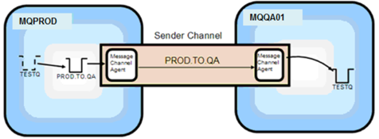
 
Here are the MQ objects you will be creating and working with: 

* MQPROD:
    * A Remote queue definition called TESTQ 
    * A Transmission queue called PROD.TO.QA 
    * A Sender Channel called PROD.TO.QA 
* MQQA01:
    * A Local queue called TESTQ 
    * A Receiver Channel called PROD.TO.QA 
    
                               
You will then use one of the sample programs supplied with IBM MQ (called amqsput) to send messages from the MQPROD queue manager, and another sample program called amqsget to read those messages off the destination queue on MQQA01.
                                             

1. In a previous step you stopped the MQPROD queue manager. You want to restart it now. In the navigator pane, you should see the icon representing the MQPROD queue manager with a red arrow pointing down, as in the picture below; this indicates that the queue manager is stopped (a green arrow pointing up indicates that the queue manager is running).    
    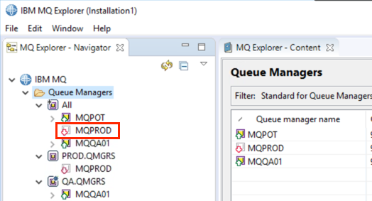
 
1. Right-click the MQPROD queue manager, and select Start, as shown below.   
    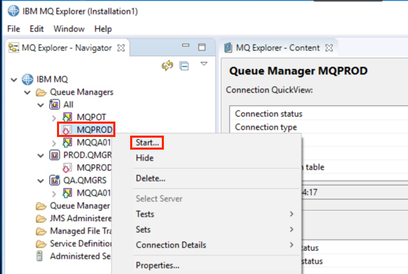
 
1. Choose Start as created (for the purpose of this lab) for the Start Method. Then click Ok.  
    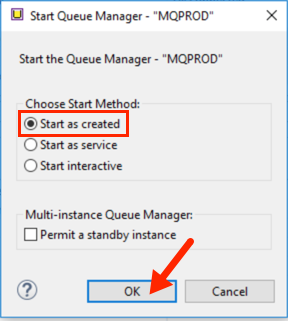
 
    You will see a pop-up like the one below for several seconds while the queue manager starts.   
    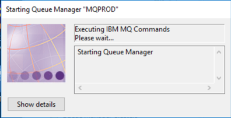
 
    With MQPROD running, you will now go through the steps needed to connect it to MQQA01.       
                        
1. First you will create a Transmission queue. Click the "\>" sign next to MQPROD to expand the tree, and then right-click the Queues folder, select New and then Local Queue…    
    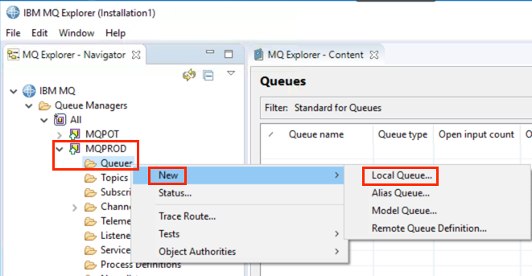
 
    A Transmission queue is a special type of local queue, associated with a Sender Channel that holds messages safely until they are transferred to the queue manager on the other end of the channel. A typical nomenclature used for naming transmission queues and channels is \<sourceqm\>.TO.\<targetqm\>. You will use an abbreviated form for purposes of this lab, calling the transmission queue PROD.TO.QA.

1. Enter the name **PROD.TO.QA** as shown below, and click Next.   
    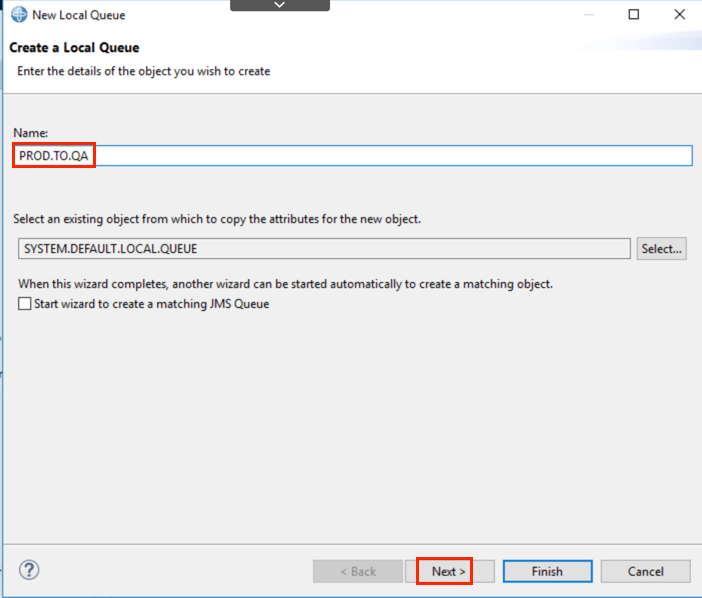
 
1. Since this queue will be used as a transmission queue, indicate that by using the dropdown labeled *Usage*, and click Finish.  
                                             
    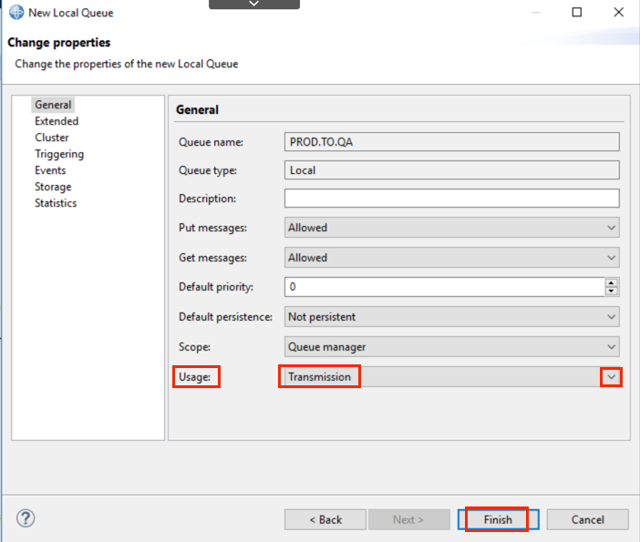 
 
1. Click OK on the confirmation popup.   
    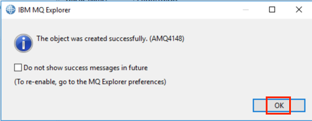
 
1. Next, you will create the Sender Channel this transmission queue will be associated with. Right-click the Channels folder under MQPROD, select New and then Sender Channel.   
    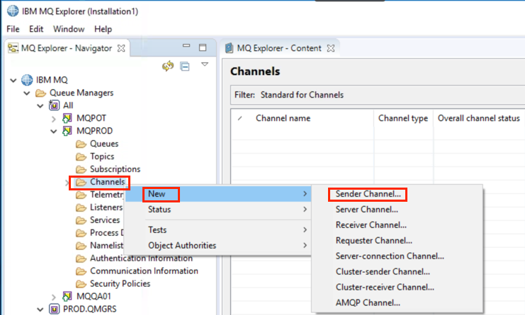
 
1. Enter the name PROD.TO.QA as shown below, and click Next.  
    
 
1. You now need to identify the network location of the queue manager this channel is to connect to. Remember when you created the MQQA01 queue manager, you assigned it a listener port of 2416. Specify that now, using localhost as the Connection name, as shown below. Also enter the name of the Transmission queue you created earlier, PROD.TO.QA. Then click Finish.   
    
 
1. Click OK on the confirmation popup. The channel has been created.  
    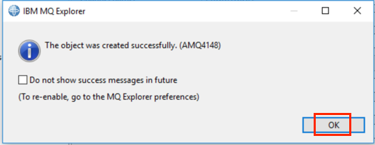 
 
1. In the Content pane on the right-hand side, you should see the details of the channel you just created. Notice that, in addition to the name, you see listed the Channel type of Sender, the Overall channel status as Inactive, and a Conn name of localhost(2416).  
    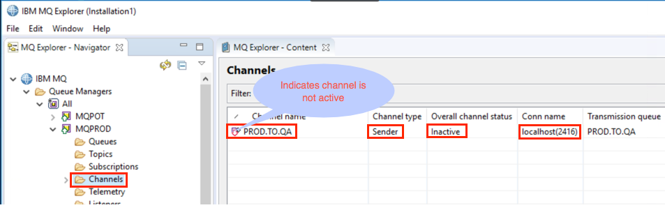
 
1. The last task remaining on MQPROD is to create a Remote queue definition. This definition will act as an alias of the real target queue that you will be creating shortly on MQQA01. To create the remote queue definition, right-click the Queues folder under MQPROD, select New and then Remote Queue Definition…  
    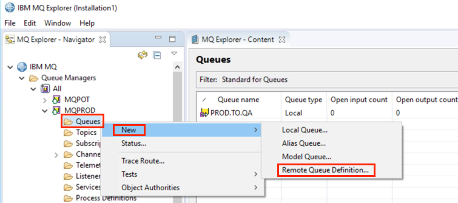
 
1. Name the remote queue definition TESTQ, and click Next.   
    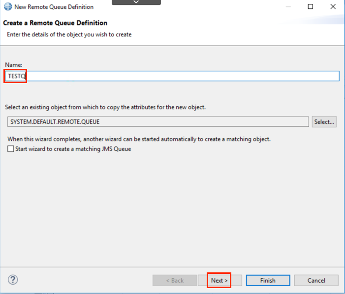 
 
1. Identify the name of the Remote queue (i.e. the name of the actual target queue) as TESTQ. Specify the Queue manager name where the target queue resides (MQQA01), and indicate the Transmission queue to be used to reach that queue manager (PROD.TO.QA). When those have been entered, click Finish.   
    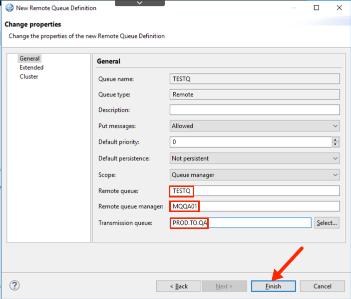 
 
1. Click OK on the confirmation popup. The remote queue definition has been created.   
    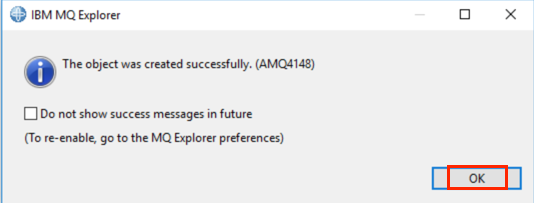
 
1. You should now see your new queue definition under MQPROD, with a Queue type of Remote.    
    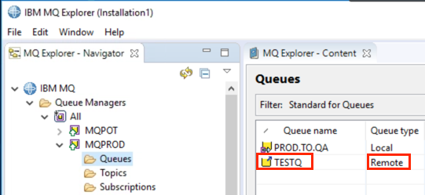
 
    Let’s review what you have configured so far. Look at the left-hand side of the diagram below:   
    
 
    On MQPROD you created a Remote queue definition of TESTQ, which points to a Transmission queue called PROD.TO.QA, which is associated with a Sender channel also called PROD.TO.QA that will connect to MQQA01. 
With the Sender side setup complete, you now need to create the corresponding definitions on MQQA01.
 
1. You previously created a Remote queue definition called TESTQ. As mentioned then, this definition is an alias for the actual local queue you are about to create. Expand the folder tree for queue manager MQQA01, right-click the Queues folder, click New, then Local Queue…    
    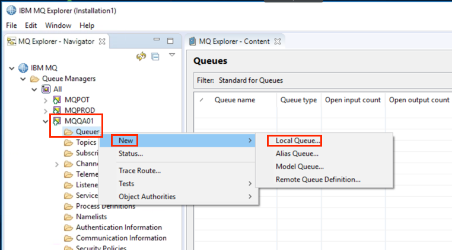
 
1. Enter **TESTQ** as the Name. The default values are acceptable for this queue, so click Finish.    
    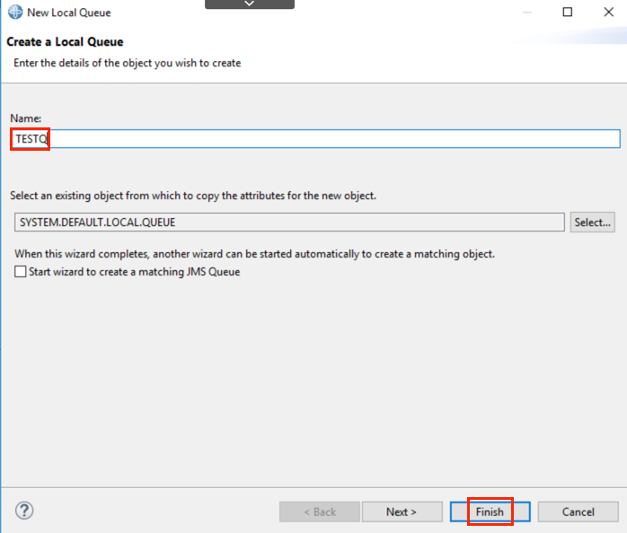
 
1. Click OK on the confirmation popup.  
    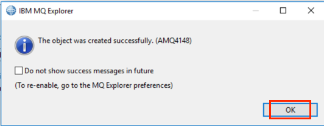
                               
1. Next you will create the Receiver Channel. This channel must have the same name as the corresponding Sender channel you created earlier. Right-click the Channels folder tree under MQQA01, then select New, then *Receiver Channel…*.    
    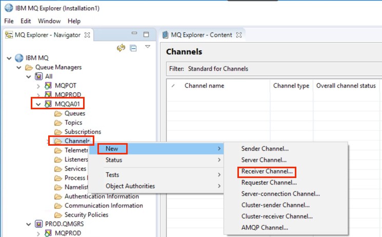
 
1. Enter the name **PROD.TO.QA** as shown below. No other properties are required for a Receiver channel, so click Finish.   
    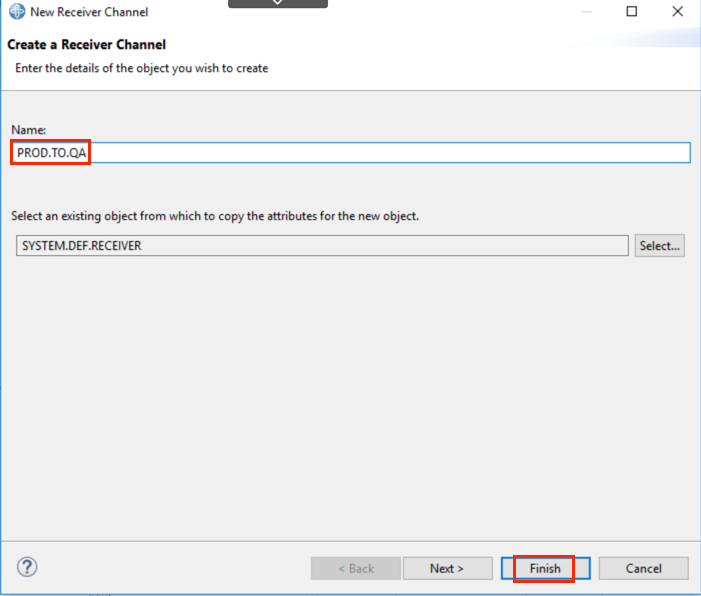 
 
1. Click OK on the confirmation popup. The channel has been created.    
    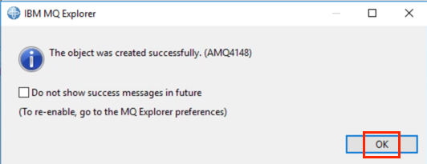 
    
1. In the Content pane on the right-hand side, you should see the details of the channel you just created. You should see the Name, **PROD.TO.QA**, with a Channel type of *Receiver* and an Overall channel status of *Inactive*.   
    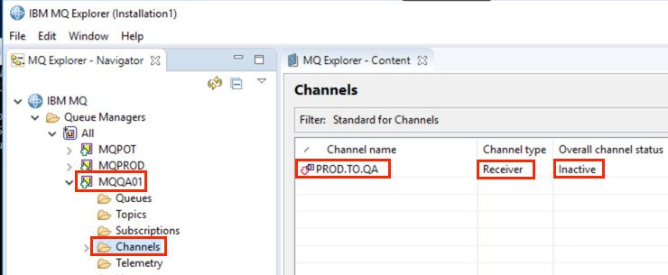  
    
1. Your configuration should now be complete. Let’s review what you have configured, looking at the right-hand side of the diagram below:    
    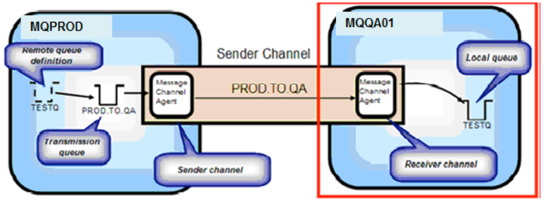 
    
    On MQQA01 you created a Local queue called **TESTQ**, which will be the target queue for your test. You also created a Receiver channel as a partner for the Sender channel you created in MQPROD, called **PROD.TO.QA**. With the Receiver side setup complete, you are now ready to test your configuration and see how IBM MQ moves messages.

1. Launch a command window by clicking the icon on the desktop.    
    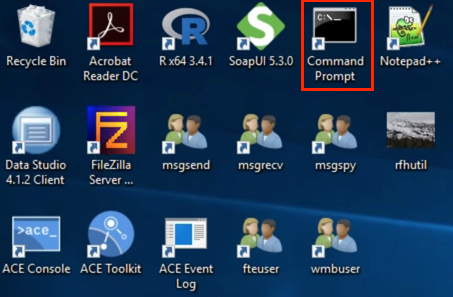
 
1. For testing the putting (or sending) side, you will use a sample program supplied with IBM MQ called amqsput. The format of this command is:  
    ***amqsput <q_name> <qmgr_name>***

    For your test, you will be putting messages to the TESTQ remote queue definition on queue manager MQPROD, so enter the following command:     
    ***amqsput TESTQ MQPROD***
    
    You should see the following when you enter this in the command window:    
                        
    On MQQA01 you created a Local queue called **TESTQ**, which will be the target queue for your test. You also created a Receiver channel as a partner for the Sender channel you created in MQPROD, called **PROD.TO.QA**. With the Receiver side setup complete, you are now ready to test your configuration and see how IBM MQ moves messages.
                                        
    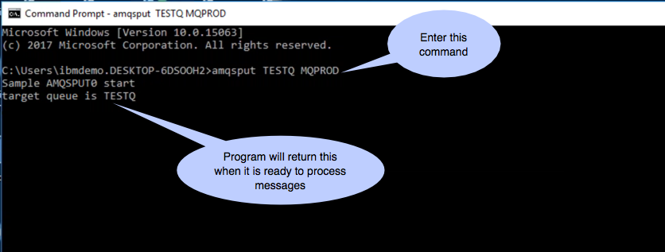 
 
    The amqsput sample program will take each line of text that you enter, and put each line as a separate message to the named queue.

1. Enter three lines of text, as shown below:    
    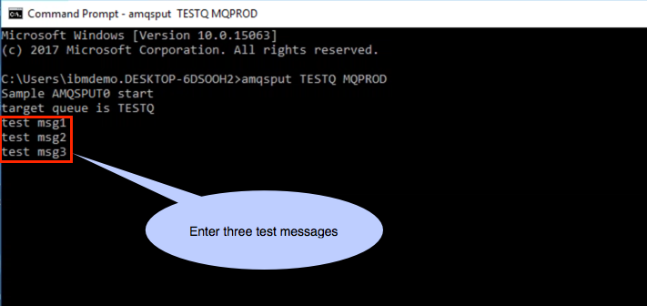
 
    Each line will be put on the target queue as a separate message.     
                        
1. Return to the IBM MQ Explorer. In the Navigator pane, if necessary, expand the tree under MQPROD by clicking the plus sign, and select the Queues folder. You should see the following:    
    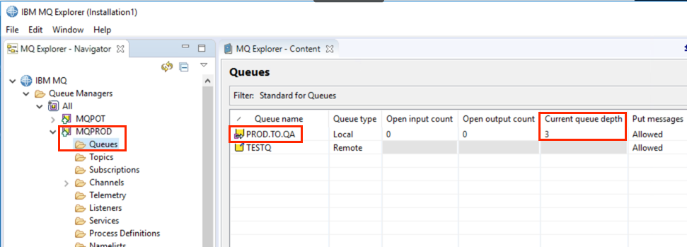
 
    Look at the Current queue depth column and consider what you see here. Notice that TESTQ has no messages, and in fact this field is grayed out. Why???
    
    Remember that a remote queue definition is like an alias; it is not an actual queue, but is instead a reference to one. In this case, it is a reference to the transmission queue associated with the channel that points to the queue manager where the actual TESTQ instance resides. If you look at the current queue depth of transmission queue PROD.TO.QA you see that it contains three messages. But why are they sitting here??? Why haven’t they been transferred to the MQQA01 queue manager?

1. To find out, click the Channels folder on queue manager MQPROD, and look at the Overall channel status for Channel PROD.TO.QA. Notice that the channel is Inactive! In order to move messages, the channel must have a status of Running. It is possible to configure the channel such that it will start automatically when a message arrives on its transmission queue, but we did not do that for purposes of this lab. Instead, you will start the channel manually.   
    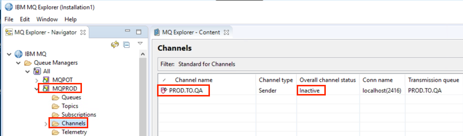
 
1. Right-click the PROD.TO.QA Sender channel entry, and click Start.   
    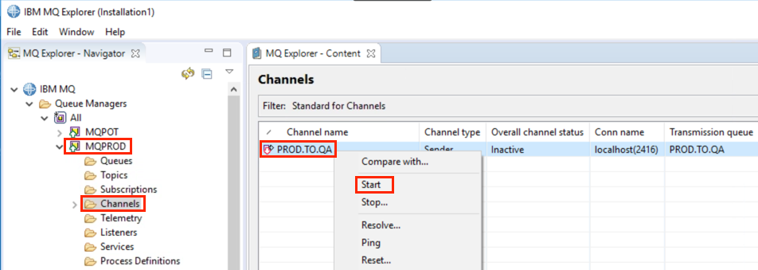 
 
1. Click OK on the confirmation popup.     
    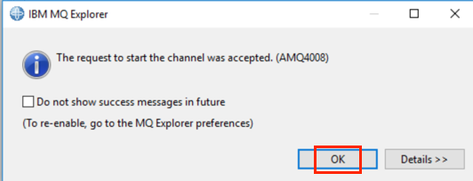
                               
1. Returning to the Overall channel status, you may see it go through several states (Initializing, Binding, etc) over a few seconds until it reaches *Running* status, as shown below.   
    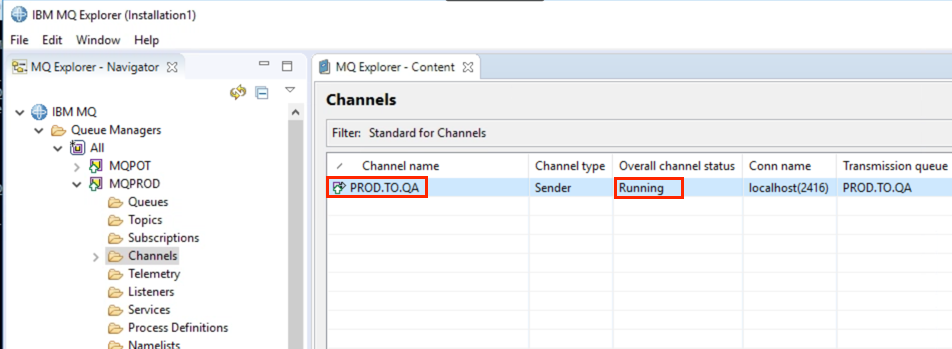
 
1. With the channel now running, click the *Queues* folder again for queue manager **MQPROD**, and look at the Current queue depth for transmission queue **PROD.TO.QA**. Notice that now the queue is empty.     
    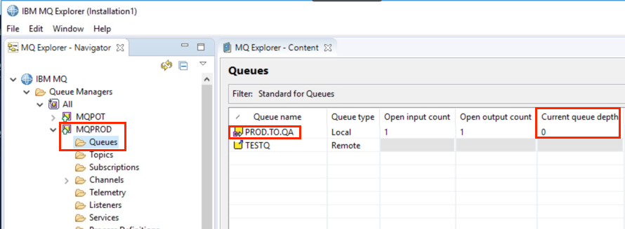
 
1. In the IBM MQ Explorer navigator pane, expand the tree below the **MQQA01** queue manager, click the *Queues* folder, and look at the Current queue depth for Queue **TESTQ**. Notice the queue depth of the target queue is three, indicating that your messages have been moved here from the WMQ75PROD queue manager.    
    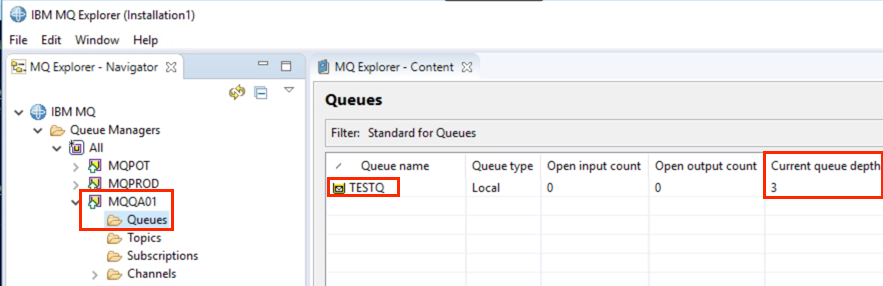
 
1. To confirm that these are actually the messages that you put using amqsput, you will use another sample program supplied with IBM MQ, called amqsget. Open another command window by right-clicking the icon found on the taskbar and select Command Prompt.   
     
 
1. The amqsget sample program will open the specified queue and wait for messages. The format of this command is:   
    ***amqsget <q_name> <qmgr_name>***
    
    For your test, you will be getting the messages from the TESTQ local queue definition on queue manager WMQ75QA01, so enter the following command:
    
    ***amqsget TESTQ MQQA01*** 
    
    You should see the following when you enter this in the command window:   
    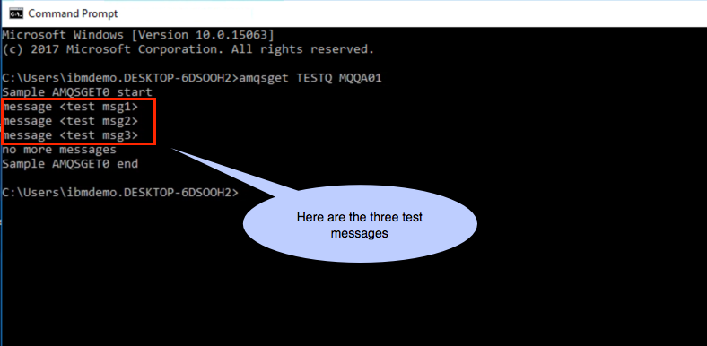
 
    If you wish, you can go back to the amqsput window and enter some more lines of text. If you then return to the amqsget window, you will see that the messages are delivered immediately (or nearly so), because the channel is now running.

    

This is the end of this portion of Lab 1.

## Lab Cleanup
Since you will make no further use in future labs of the last two queue managers you created, you are going to delete them.
 
First you will remove the two Sets you created as they contain only these queue managers and would be empty after the queue managers are deleted.

Then you will stop the queue managers as you cannot delete one that is running. And then you will delete them.      
                        
1. Bring the IBM MQ Explorer into view, right-click the QA.QMGRS Set and select Delete.     
                                             
    
 
1. Confirm the delete by clicking the Delete button…   
    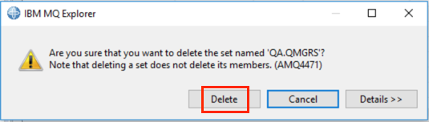
 
1. Right-click the PRODS.QMGRS Set and select Delete.    
    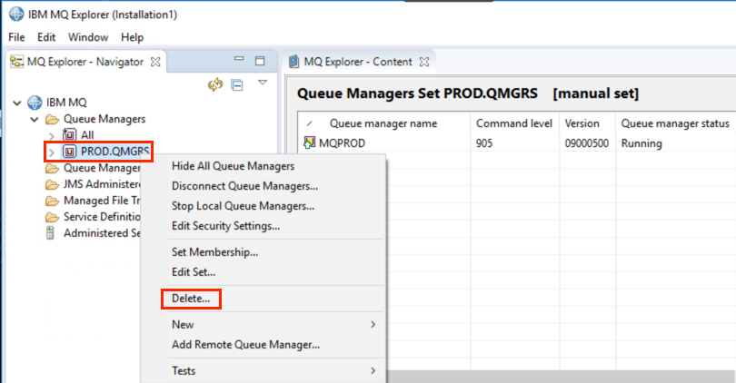
 
1. Confirm the delete by clicking the Delete button…      
    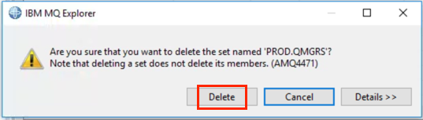        
                        
1. Expand the All set, then right-click the MQQA01 queue manager and select Stop > Immediate.        
                                             
    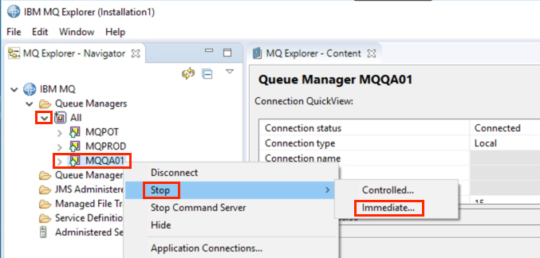 
 
1. Select the Immediate radio button and click OK.   
    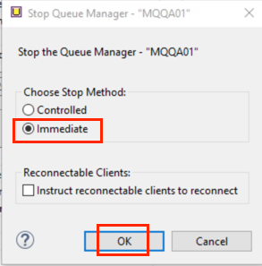  
                        
1. The following progress panel will appear… .  
                                             
    
 
1. Right-click the MQPROD queue manager and select Stop > Immediate.   
    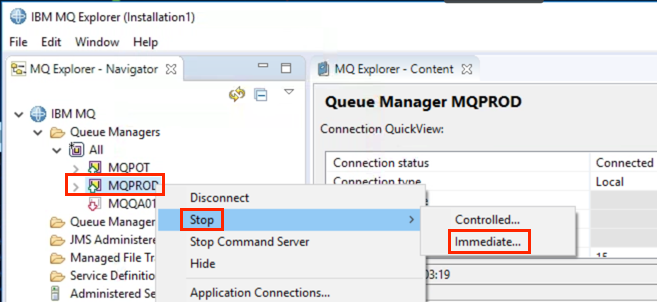
    
1. Select the Immediate radio button and click OK.        
    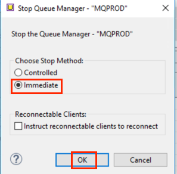       
                        
1. The following progress panel will appear… .         
                                             
    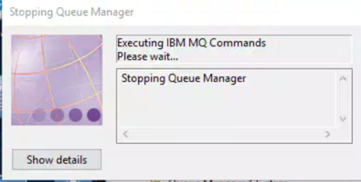
 
1. Now both queue managers should be stopped.   
    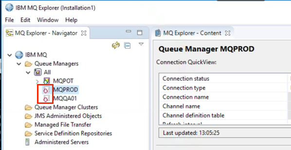
 
1. Right-click the MQQA01 queue manager and select Delete….   
    
                               
1. Confirm the delete by clicking the Delete button… .   
    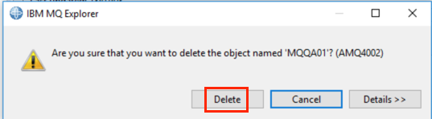
 
1. A second confirmation window appears, confirm by clicking the Delete button… .  
    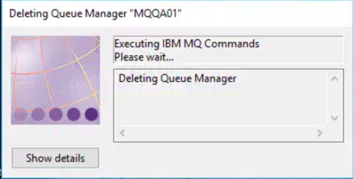                

1. Right-click the MQPROD queue manager and select Delete….   
    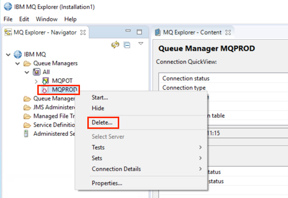
 
1. Confirm the delete by clicking the Delete button….   
    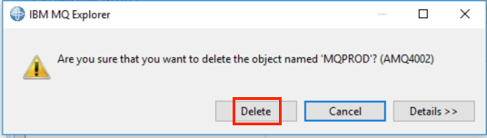
 
1. A second confirmation window appears, confirm by clicking the Delete button…   
    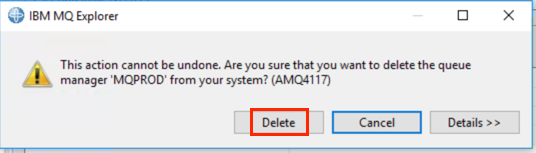
 
1. The following progress panel will be displayed….   
    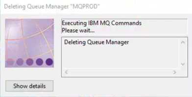
 
1. You should now have just a single queue manager, MQPOT.     
    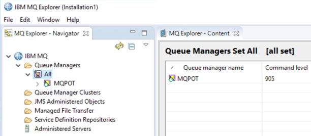
 
This concludes Lab 1. 

[Continue to Lab 2](mq_basic_pot_lab2.html)

[Return MQ Basic Menu](mq_basic_pot_overview.html)
