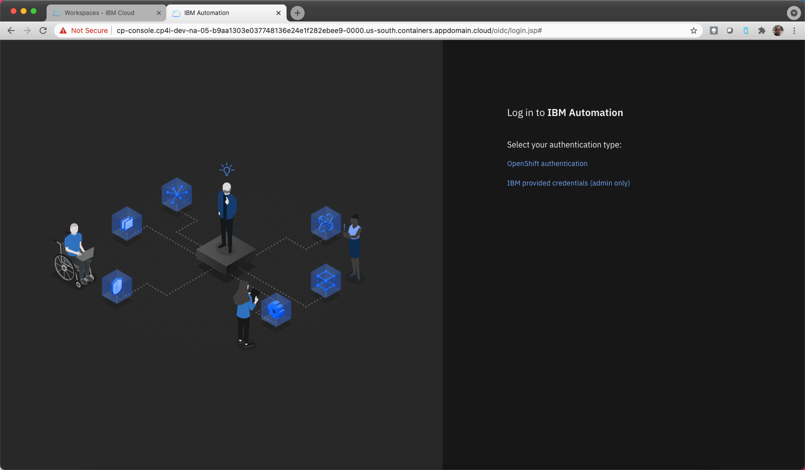
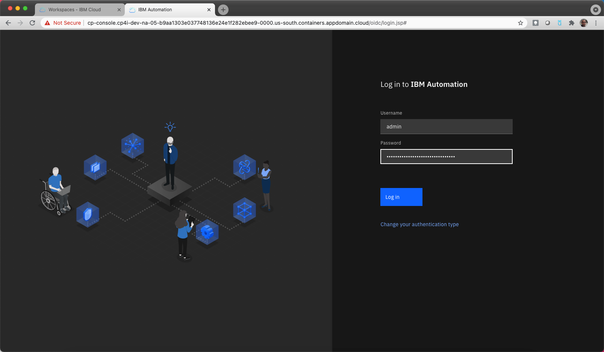
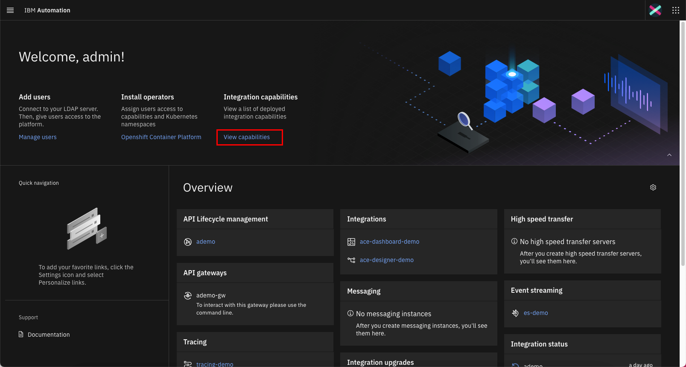
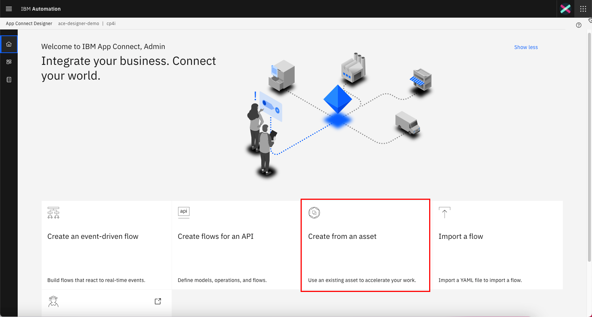
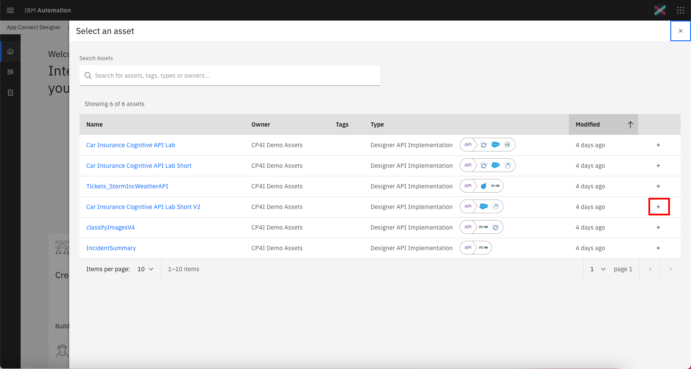

export const Title = () => Cognitive API Demo - 301 Demo Script

<FeatureCard
  title="301 Demo Script"
  color="dark"
  >

</FeatureCard>

This Demo Script has multiple tasks, that have multiple steps. In each step you have the details about what you need to do (**Actions**) and what you can say delivering this demo step (**Talking Points**). This Demo Script is a suggestion, but you are welcome to customize based in your sales opportunity. Enjoy it and good sales!

<AnchorLinks>
  <AnchorLink>1 - Accessing the Environment</AnchorLink>
  <AnchorLink>2 - Importing the Flow</AnchorLink>
  <AnchorLink>3 - Reviewing the Flow</AnchorLink>
  <AnchorLink>4 - Testing the Flow</AnchorLink>
  <AnchorLink>5 - Deploying the Flow</AnchorLink>
  <AnchorLink>6 - Managing API in API Connect</AnchorLink>
  <AnchorLink>7 - Exploring the Developer's Portal</AnchorLink>
</AnchorLinks>

***

## 1 - Accessing the Environment

1.1 - Log in CP4I

 
import panel as pn
from bokeh.resources import INLINE

SimpleTable = pn.panel("""

| **Log in CP4I** |   |
| :---         | :--- |
| **Actions**             | Open CP4I and click **IBM provided credentials (admin only)** and **Log i**. |
| **Talking Points**      | In the road to digital transformation, every organization seeks to move faster than before. But going fast without the right approach, guided by real-world operational data, has caused 70% of digital transformations to fail. A new approach with automation and continuous improvement fed by AI algorithms is required. IBM Cloud Pak for Integration is a hybrid integration solution that provides an automated and closed-loop lifecycle across multiple styles of enterprise integration. With IBM Cloud Pak for Integration, companies can speed integration development, reduce costs and maintain enhanced security, governance and availability. Let's see IBM Cloud Pak for Integration in action. Here I have a cloud version of the product on IBM Cloud. Let me log in here.|
| **Screenshots**         | &nbsp;        |

1.2 - CP4I Home

 

| **CP4I Home** |   |
| :---         | :--- |
| **Actions**             | Show the Home Page and click on **Integration Capabilities**. |
| **Talking Points**      | Welcome to IBM Cloud Pak for Integration! We’re now at the home screen showing all the capabilities of the pak, brought together in one place.  Specialized integration capabilities —for API management, application integration, messaging and more —are built on top of powerful automation services. Let's see the Integration Capabilities available in this Cloud Pak for Integration.|
| **Screenshots**         | &nbsp;     |

1.3 - Integration Capabilities

 

| **Integration Capabilities** |   |
| :---         | :--- |
| **Actions**             | Show the Integration Capabilities page and open the Designer (**ace-designer-demo**). |
| **Talking Points**      | As you can see, through a single interface you are able to access all the integration capabilities your team needs. Including API Lifecycle Management, Application & Data Integration, Enterprise Messaging, Events and High Speed Transfer. In this Demo, we will explore App Connect for Application Integration, API Connect for API Management and Asset Repository as our centralized hub for allowing our teams to work together with Integration assets. Let's open our App Connect Designer. |
| **Screenshots**         | &nbsp;    |

***

## 2 - Importing the Flow

2.1 - Create from an asset

 

| **Create from an asset** |   |
| :---         | :--- |
| **Actions**             | Click **Create from an Asset**. |
| **Talking Points**      | Here we are on the designer tooling. This is where we can create all of our API integration flows and also manage our connectivity to our services and endpoints. At the moment, there’s nothing here yet, so let’s build some integration logic. Let's see how simple to create our flow from the Asset Repository.|
| **Screenshots**         | &nbsp;     |

2.2 - Select an asset

 

| **Select an asset** |   |
| :---         | :--- |
| **Actions**             | Click on the **+** sign to the right on the **Car Insurance Cognitive API Lab Short V2**. |
| **Talking Points**      | We have a flow to use already stored in the Asset Repository, let's use it to simplify our demonstration.|
| **Screenshots**         | &nbsp;     |

***

## 3 - Reviewing the Flow

3.1 - Review properties

 

| **Review properties** |   |
| :---         | :--- |
| **Actions**             | Show the **Properties view** and click on **Operations** |
| **Talking Points**      | Designer builds your API for you – you don’t need to worry about OpenAPI specs or Swagger editors – it’s all built in.  These are the fields we are going to use for our API. Note that we tell our API which field is the key – in our case, CaseReference.|
| **Screenshots**         | &nbsp;     |

3.2 - Review operations

 

| **Review operations** |   |
| :---         | :--- |
| **Actions**             | Show the **Operations view** and click on **Edit flow** |
| **Talking Points**      | On Operations view are the actions that the API exposes with the data. In this demo, we’re going to build just one operation – we can add more if we wish. Let's check the flow logic.|
| **Screenshots**         | &nbsp;     |

3.3 - Review the flow

 

| **Review the flow** |   |
| :---         | :--- |
| **Actions**             | Initially **close** the Request dialog. Explain the Flow and Scroll through all of the connectors in the flow. After that, open the **Request** again, by clicking the first step of the flow. |
| **Talking Points**      | Here we have our demo flow. In the designer flow editor, we are able to edit and change our flow.   We are a Car Repair company: We take in vehicles with problems and repair them.
We want to create an API which enables customers to send us photos of their cars along with descriptions of what needs to be done. With this information, we will create a case in Salesforce and use Watson to analyze if the customer is angry or upset. Let's explore our flow in details.|
| **Screenshots**         | &nbsp;     |

***

## 4 - Testing the Flow

***

## 5 - Deploying the Flow

***

## 6 - Managing API in API Connect

***

## 7 - Exploring the Developer's Portal
