export const Title = () => Cognitive API Demo - 301 Demo Script

<FeatureCard
  title="301 Demo Script"
  color="dark"
  >

</FeatureCard>

This Demo Script has multiple tasks, that have multiple steps. In each step you have the details about what you need to do (**Actions**) and what you can say delivering this demo step (**Talking Points**). This Demo Script is a suggestion, but you are welcome to customize based in your sales opportunity. Enjoy it and good sales!

<AnchorLinks>
  <AnchorLink>1 - Accessing the Environment</AnchorLink>
  <AnchorLink>2 - Importing the Flow</AnchorLink>
  <AnchorLink>3 - Reviewing the Flow</AnchorLink>
  <AnchorLink>4 - Testing the Flow</AnchorLink>
  <AnchorLink>5 - Deploying the Flow</AnchorLink>
  <AnchorLink>6 - Managing API in API Connect</AnchorLink>
</AnchorLinks>

***

## 1 - Accessing the Environment

1.1 - Log in CP4I

 

| **Log in CP4I** |   |
| :---         | :--- |
| **Actions**             | Open CP4I and click **IBM provided credentials (admin only)** and **og in** with your admin user and password. |
| **Talking Points**      | In the road to digital transformation, every organization seeks to move faster than before. But going fast without the right approach, guided by real-world operational data, has caused 70% of digital transformations to fail. A new approach with automation and continuous improvement fed by AI algorithms is required. IBM Cloud Pak for Integration is a hybrid integration solution that provides an automated and closed-loop lifecycle across multiple styles of enterprise integration. With IBM Cloud Pak for Integration, companies can speed integration development, reduce costs and maintain enhanced security, governance and availability. Let's see IBM Cloud Pak for Integration in action. Here I have a cloud version of the product on IBM Cloud. Let me log in here.|
| **Screenshots**         | &nbsp;        |

1.2 - CP4I Home

 

| **CP4I Home** |   |
| :---         | :--- |
| **Actions**             | Show the Home Page and click on **Integration Capabilities**. |
| **Talking Points**      | Welcome to IBM Cloud Pak for Integration! We’re now at the home screen showing all the capabilities of the pak, brought together in one place.  Specialized integration capabilities —for API management, application integration, messaging and more —are built on top of powerful automation services. Let's see the Integration Capabilities available in this Cloud Pak for Integration.|
| **Screenshots**         | &nbsp;     |

1.3 - Integration Capabilities

 

| **Integration Capabilities** |   |
| :---         | :--- |
| **Actions**             | Show the Integration Capabilities page and open the Designer (**ace-designer-demo**). |
| **Talking Points**      | As you can see, through a single interface you are able to access all the integration capabilities your team needs. Including API Lifecycle Management, Application & Data Integration, Enterprise Messaging, Events and High Speed Transfer. In this Demo, we will explore App Connect for Application Integration, API Connect for API Management and Asset Repository as our centralized hub for allowing our teams to work together with Integration assets. Let's open our App Connect Designer. |
| **Screenshots**         | &nbsp;    |

***

## 2 - Importing the Flow

2.1 - Create from an asset

 

| **Create from an asset** |   |
| :---         | :--- |
| **Actions**             | Click **Create from an Asset**. |
| **Talking Points**      | Here we are on the designer tooling. This is where we can create all of our API integration flows and also manage our connectivity to our services and endpoints. At the moment, there’s nothing here yet, so let’s build some integration logic. Let's see how simple to create our flow from the Asset Repository.|
| **Screenshots**         | &nbsp;     |

2.2 - Select an asset

 

| **Select an asset** |   |
| :---         | :--- |
| **Actions**             | Click on the **+** sign to the right on the **Car Insurance Cognitive API Lab Short V2**. |
| **Talking Points**      | We have a flow to use already stored in the Asset Repository, let's use it to simplify our demonstration.|
| **Screenshots**         | &nbsp;     |

***

## 3 - Reviewing the Flow

3.1 - Review properties

 

| **Review properties** |   |
| :---         | :--- |
| **Actions**             | Show the **Properties view** and click on **Operations** |
| **Talking Points**      | Designer builds your API for you – you don’t need to worry about OpenAPI specs or Swagger editors – it’s all built in.  These are the fields we are going to use for our API. Note that we tell our API which field is the key – in our case, CaseReference.|
| **Screenshots**         | &nbsp;     |

3.2 - Review operations

 

| **Review operations** |   |
| :---         | :--- |
| **Actions**             | Show the **Operations view** and click on **Edit flow** |
| **Talking Points**      | On Operations view are the actions that the API exposes with the data. In this demo, we’re going to build just one operation – we can add more if we wish. Let's check the flow logic.|
| **Screenshots**         | &nbsp;     |

3.3 - Review the flow

 

| **Review the flow** |   |
| :---         | :--- |
| **Actions**             | Initially **close** the Request dialog. Explain the Flow and Scroll through all of the connectors in the flow. After that, open the **Request** again, by clicking the first step of the flow. |
| **Talking Points**      | Here we have our demo flow. In the designer flow editor, we are able to edit and change our flow.   We are a Car Repair company: We take in vehicles with problems and repair them. We want to create an API which enables customers to send us photos of their cars along with descriptions of what needs to be done. With this information, we will create a case in Salesforce and use Watson to analyze if the customer is angry or upset. Let's explore our flow in details.|
| **Screenshots**         | &nbsp;     |

3.4 - Review Request

 

| **Review Request** |   |
| :---         | :--- |
| **Actions**             | Show the *Request* dialog (1). Click to *open* the **if** step (2). |
| **Talking Points**      | Our flow start by receiving the customer's car repair request with photo via an API.  Designer automatically creates an API “Request” and “Response” node for your API flow.|
| **Screenshots**         | &nbsp;     |

3.5 - Checking the Photo

 

| **Checking the Photo** |   |
| :---         | :--- |
| **Actions**             | Explore the *if* step (1) and click on **Salesforce Connector - Retrieve contacts** (2). |
| **Talking Points**      | Second, we validate the photo. Here, we have a really simple if statement, that check if the PhotoOfCar is empty. |
| **Screenshots**         | &nbsp;     |

3.6 - Retrieve contacts

 

| **Retrieve contacts** |   |
| :---         | :--- |
| **Actions**             | Explore the *Salesforce Connector - Retrieve contacts* (1). Change the *Contact name* to **Andrew Young** (2). And **test** the connection (3). Change back the *Contact Full name* to **Andy Young** (4) and **test** again (5). Open **View details** (6). On the *Output*, open the **Contact1** object (7). **Close** all the dialog tabs. Click on the **Salesforce – Create case node** (8). |
| **Talking Points**      | Third, we use a connector to create a case in Salesforce with the date from the API. This Case is where we store the details and progress of our repair. We are using a hard-code contact: 'Andy Young'.  He's the contact for the insurance company that sends customers. Salesforce Developer Accounts have a prepopulated set of data that you can use to test. ‘Andy Young’ is one of those prepopulated contacts. Let's test our connection with Salesforce. Let me change here the contact to Andrew Young, and test the connection. Ok, the test shows that we don't have Andrew Young. Let's change back to Andy Young and test again. Great, now we received a success response. That prove that our connection is working. Let's check  the details. Here we can see the Output returned from SalesForce, including the Contact ID.  |
| **Screenshots**         | &nbsp;       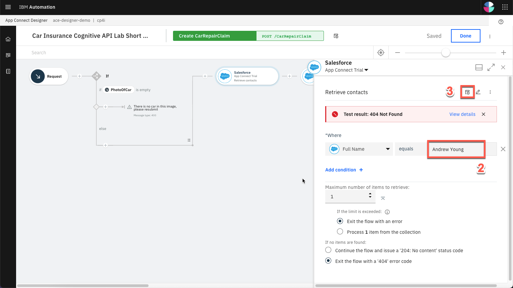         |

3.7 - Create Case

 

| **Create Case** |   |
| :---         | :--- |
| **Actions**             | Explore the *Salesforce – Create case node*. **Close** the Salesforce connector dialog. Open the **Salesforce - Create Attachment** node. |
| **Talking Points**      | Now we have the ID that we need, let’s create our Salesforce case. Note that we just re-use the same connector but with a different operation and data. Here we can see that our contact ID comes from the previous ‘retrieve contact’ Salesforce Call. The Name and email come from the API Request. The connector ‘knows’ that fields like ‘Case Type’ have a limited number of values in Salesforce – so it automatically converts them into pull-down lists of values for you to choose from. |
| **Screenshots**         | &nbsp;     |

3.8 - Create Attachment

 

| **Create Attachment** |   |
| :---         | :--- |
| **Actions**             | Explore the *Salesforce – Create Attachment node* (1). **Close** the Salesforce connector dialog. Open the **IBM Watson Tone Analyzer** node (2). |
| **Talking Points**      | To add a photograph, we need to create a salesforce attachment – that’s easy, just use the connector again. Note that we use the Case ID that is a returned value from the ‘Create Case’ connector call – it’s been kept in the flow automatically. We send the PhotoOfCar as a base64 string and we tell Salesforce that the content Type is image/jpeg. |
| **Screenshots**         | &nbsp;     |

3.9 - Analyze the description

 

| **Analyze the description** |   |
| :---         | :--- |
| **Actions**             | Explore the *Watson Tone Analyzer* connector (1). **Close** the Tone Analyzer connector dialog. Open the **Salesforce - Create case comment** (2). |
| **Talking Points**      | Here, the Watson Tone Analyzer services, analyse the description shared by the customer, to identify if the customer is angry or upset, that demands further action or treat them more carefully. |
| **Screenshots**         | &nbsp;     |

3.10 - Create case comment

 

| **Create case comment** |   |
| :---         | :--- |
| **Actions**             | Explore the **Salesforce – Create case comment** node (1). Close the Salesforce connector dialog. Open the **Response**. (2) |
| **Talking Points**      | Then we’ll add a comment to the case with the Salesforce connector and give it the tone name from Watson. |
| **Screenshots**         | &nbsp;     |

3.11 - Response

 

| **Response** |   |
| :---         | :--- |
| **Actions**             | Explore the *Response* dialog (1). Click **Done** (2). |
| **Talking Points**      | Here, we have the response that we submit back to the customer after the API call. This response incluse their Salesforce case reference for future enquiries and also an estimate of how long it will take to repair and how much it will cost.   Great. we've built the flow, let's start it! |
| **Screenshots**         | &nbsp;     |

***

## 4 - Testing the Flow

4.1 - Starting the Flow

 

| **Starting the Flow** |   |
| :---         | :--- |
| **Actions**             | Click **Start API** on the *three dot menu* at the top right |
| **Talking Points**      | Now we’ve looked at the integration flow, let’s start it up. Great! Now our flow is running, we need to test it.  |
| **Screenshots**         | &nbsp;    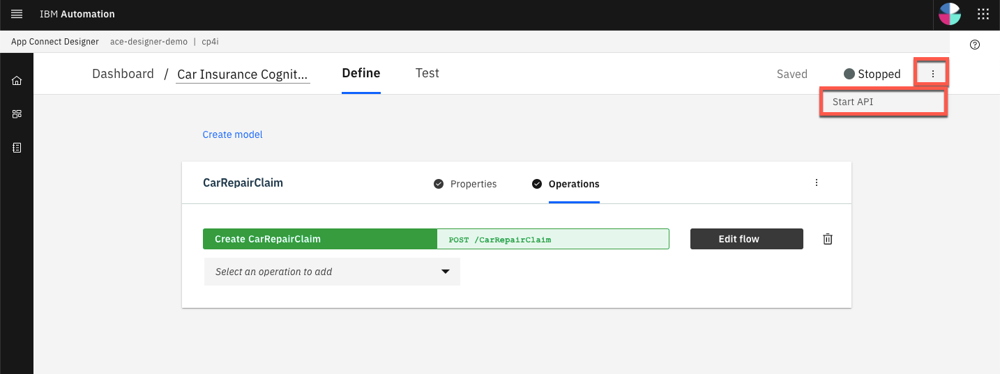 |

4.2 - Setting Environment Variables

 

| **Setting Environment Variables** |   |
| :---         | :--- |
| **Actions**             | Open the **Test** tab (1). Copy the **Endpoint URL** (2). Open **POST /CarRepairClaim** (3). Open **Try it** (4).  Copy the **Username** (5) and **Password** (6). In your script folder, on *terminal* window, *edit* the **00-variables** file (e.g.: *vi 00-variables*) and update the **BASEPATH** (7), **USERNAME** (8) and **PASSWORD** (9). Execute **source exportVariables.sh** (10) |
| **Talking Points**      | Now we’ve built our API, we need to test it. APIs can be tested in a number of different ways, for example using the IBM API Test and Monitor tool. During this demo, we do 3 different tests, one in the designer tool, another when our API is deployed to the Cloud Pak App Connect Runtime. And the last test, will be calling thru a Gateway.   For simplicity and speed, as we’re using base64 pictures, we will use simple curl scripts so that we can call the APIs from the command line. Before go ahead and execute the script to call our API, we need to configure our script to point to our environment. To get the credentials for the designer, we go to the ‘Manage’ tab in designer. Now, let's change our variable files to use this credentials. Great, let's export now these variables.   |
| **Screenshots**         | &nbsp;    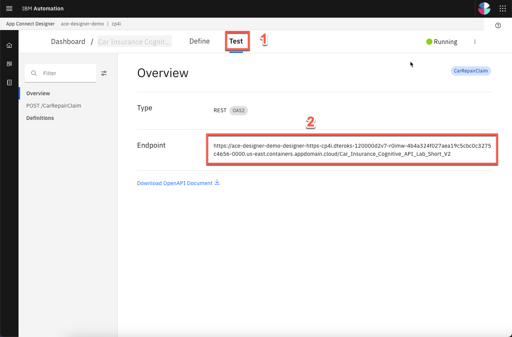   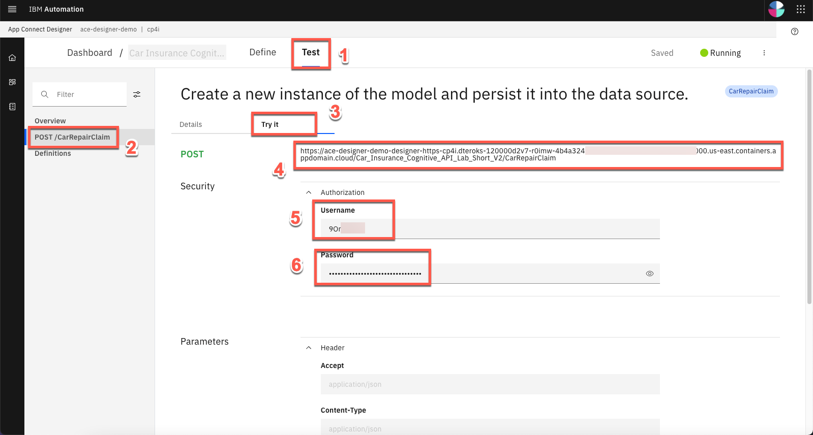       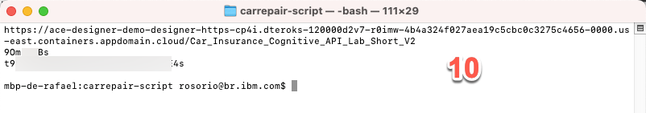 |

4.3 - Running the Test

 

| **Running the Test** |   |
| :---         | :--- |
| **Actions**             | Edit the **demotestcar.sh** script (1). Explore and close the file. Execute **./demotestcar.sh** (2). |
| **Talking Points**      | Now, it is time to run the script. Let's check the script. Here we can see that we have a simple curl command that call our api, passing the user and password. And our data request, is a json with all the information about the case, including a picture with a Subaru SUV. It is ready. Let's run this script. Great, we received the expected response with the case information.   |
| **Screenshots**         | &nbsp;    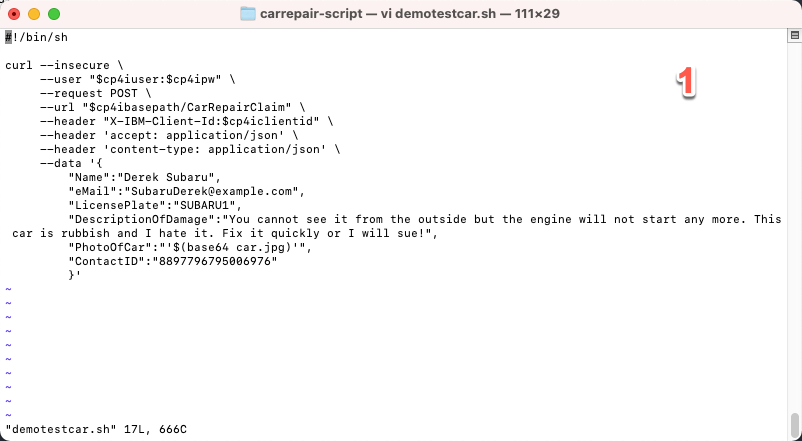   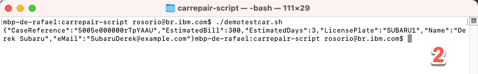 |

4.4 - Checking Salesforce

 

| **Checking Salesforce** |   |
| :---         | :--- |
| **Actions**             | Open the **Salesforce Dev Account** site (1). On the *App Launcher* menu, search for **cases** (2). Open the **Cases** page (3). On *Cases* view, open the latest **Car Breakdown case** (4). Explore all fields, including picture and Watson analysis (5).  |
| **Talking Points**      | Let's see our Salesforce system, to check if we have a new case. Let's open the Cases page. And in the Recently Viewed, we can check all open cases. Great! Here we have our case with all the information, including the picture, and the Watson tone analysis. With this information, our Customer Relationship team is able to work to support our customer.  |
| **Screenshots**         | &nbsp;    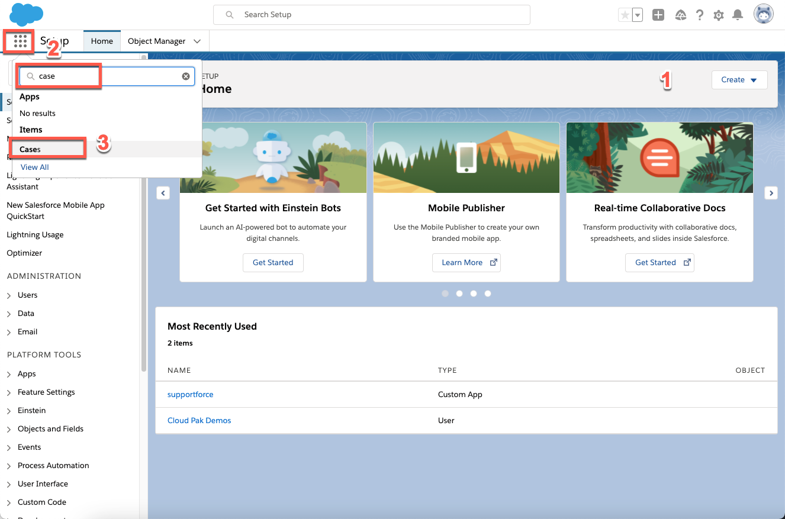   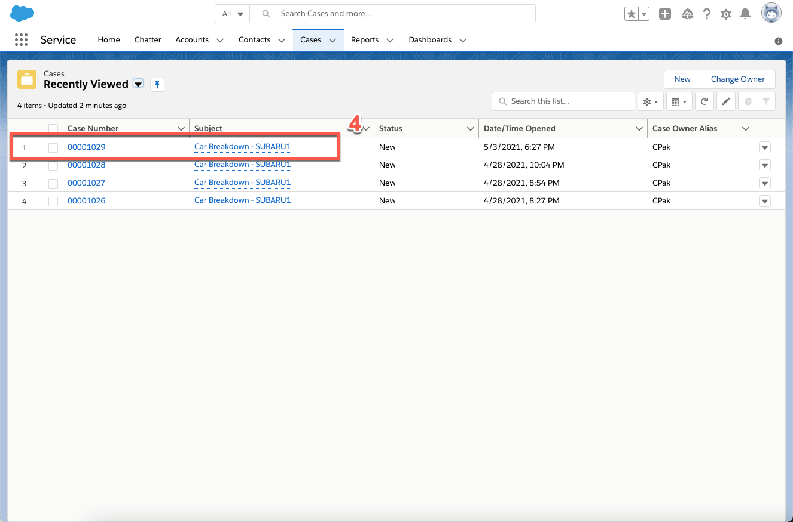   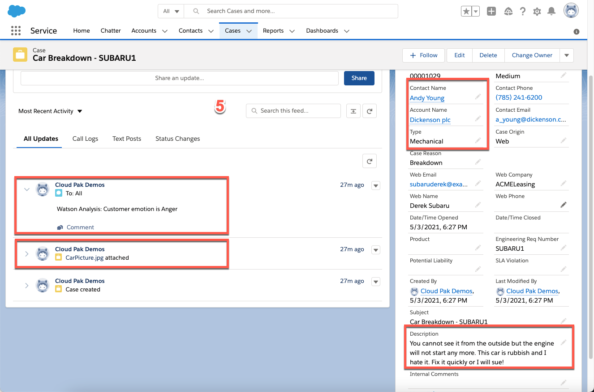 |

***

## 5 - Deploying the Flow

5.1 - Export the BAR File

 

| **Export the BAR File** |   |
| :---         | :--- |
| **Actions**             | Into the *Designer Dashboard* (1), click the **menu** (2) and click **Export** (3).   Select **Runtime flow asset (BAR)** (4) and click **Export** (5).  |
| **Talking Points**      | To deploy the flow to an integration server, you must export it as a BAR file. All the configuration settings, other than the connection credentials for your accounts, are preserved in the exported archive. Let's export an executable bar file. From the dashboard, locate the flow, open its menu, and then click Export. When you export a flow, you can choose to export its configuration as a YAML or BAR file, or as an OpenAPI document. In our case, we export as a BAR File.  |
| **Screenshots**         | &nbsp;    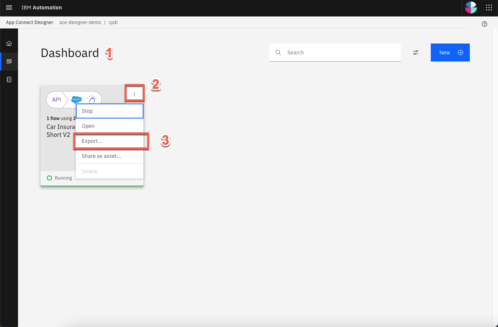   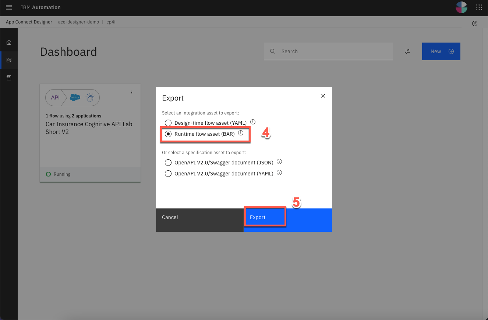 |

5.2 - Import the BAR File

 

| **Import the BAR File** |   |
| :---         | :--- |
| **Actions**             | Open the **Main Menu** (1), and click **Run > Integrations** (2).  Click **Create a server** (3). Select **Quick start designer integration** (4) and click **Next** (5). **Upload the BAR** file (6) and click **Next** (7). Select **ace-designerdemo-designer-acc** (8) and click **Next** (9). Enter a *name* for our integration server (10). Set **Enable Operations Dashboard tracing** to **On** (11). Enter **cp4i** as *Operations Dashboard namespace (12). Click **Create** (13)   |
| **Talking Points**      | Now, let's open the the App Connect Dashboard and create a new server. We need to create an integration server to run our integration. An integration server is a Kubernetes pod which has the containers needed to run our .bar file. Now we need to select the kind of tooling we used to build the integration. We used the Designer. Now, we just need to upload the BAR file that we exported from designer. And here we choose which configurations we want. Here we enter the information that we want for our Integration server. Great, let's create it!|
| **Screenshots**         | &nbsp;    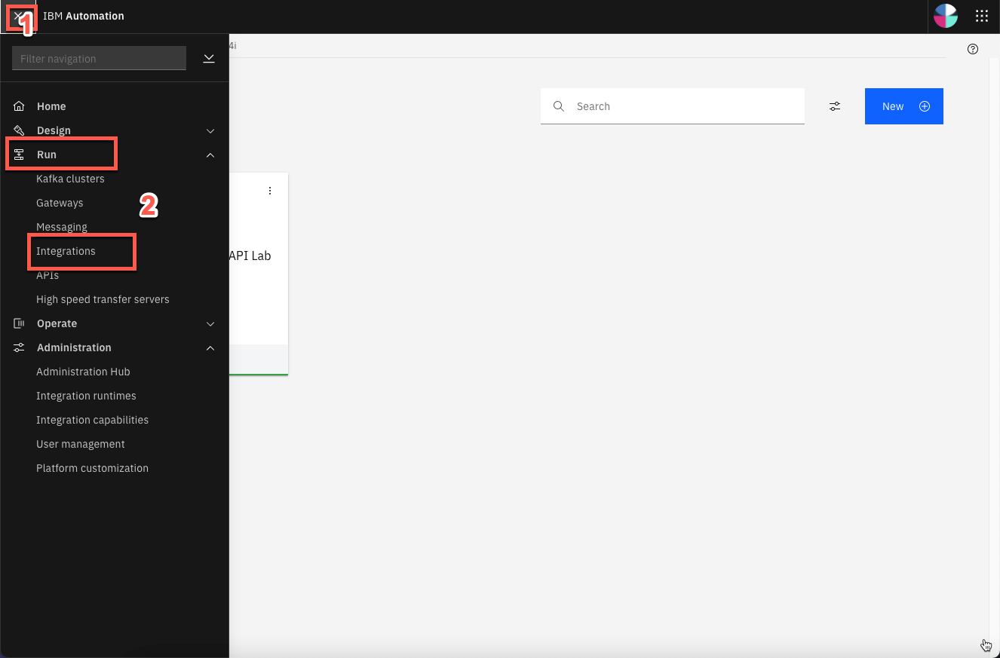   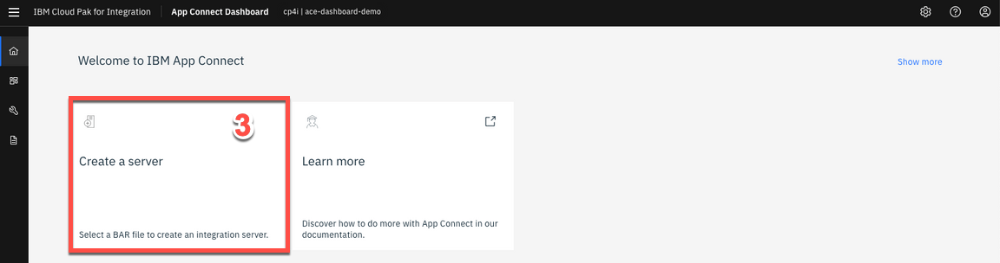   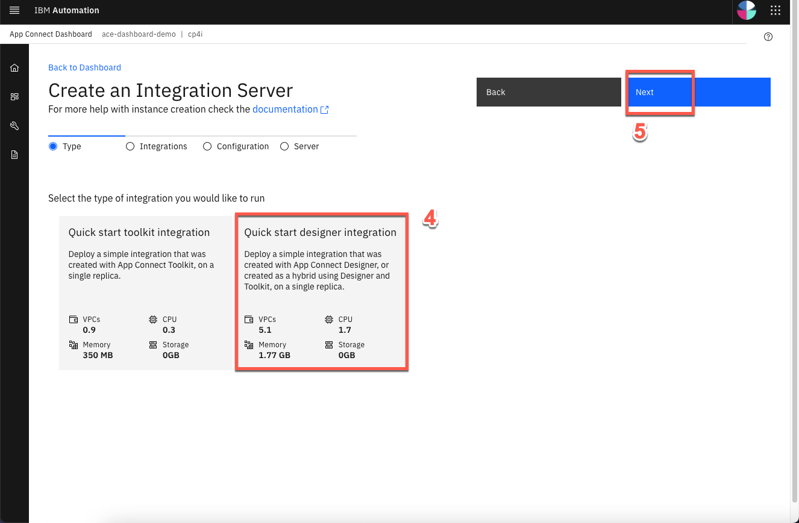   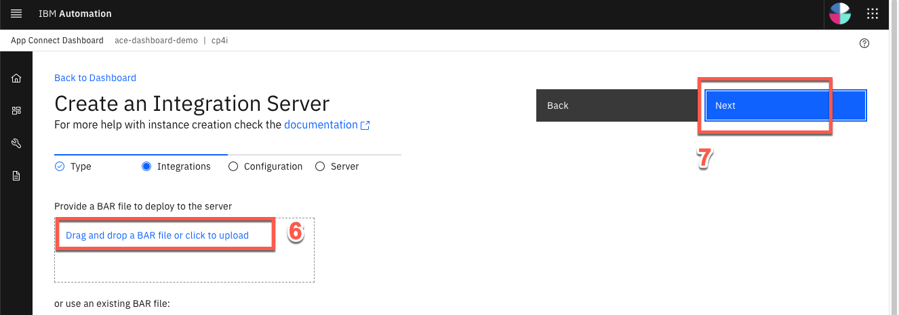   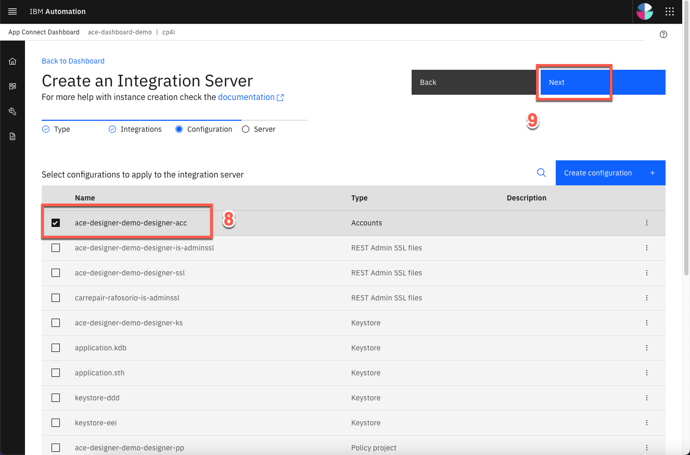   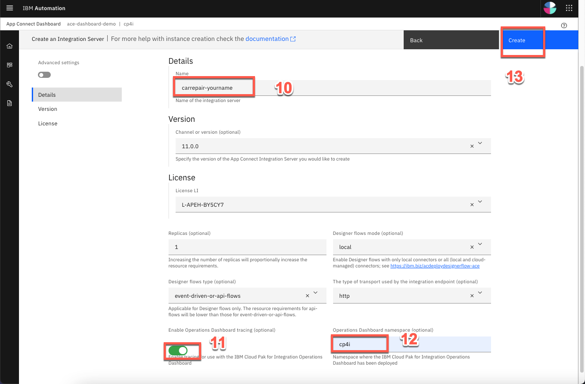|

5.3 - Verify the Server

 

| **Verify the Server** |   |
| :---         | :--- |
| **Actions**             | Click on our **Integration Server** (1). Open our **API Flow** (2). Explore the API detais (3). |
| **Talking Points**      | Great, here we have our new Integration server. We need to wait some time to start the pods. At this point, the integration is running on the cloud pak. Opening the server, we can see our API Flow. And click again, we'll drill down further and see our API details. We can see the REST operation, the base URL and we can even download the OpenAPI document.|
| **Screenshots**         | &nbsp;    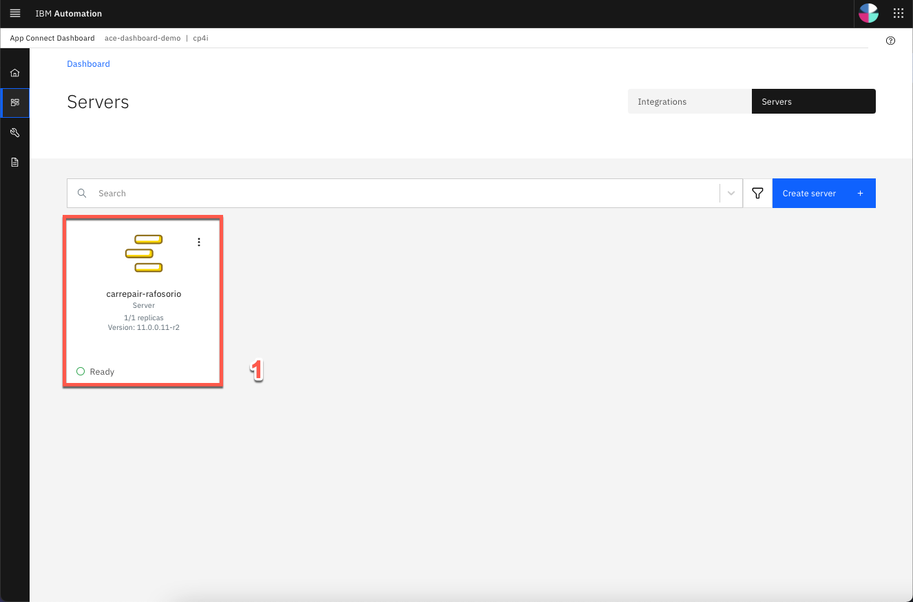       |

***

## 6 - Managing API in API Connect
