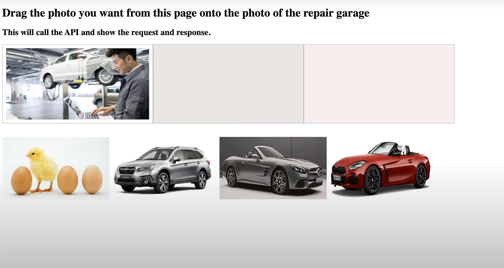
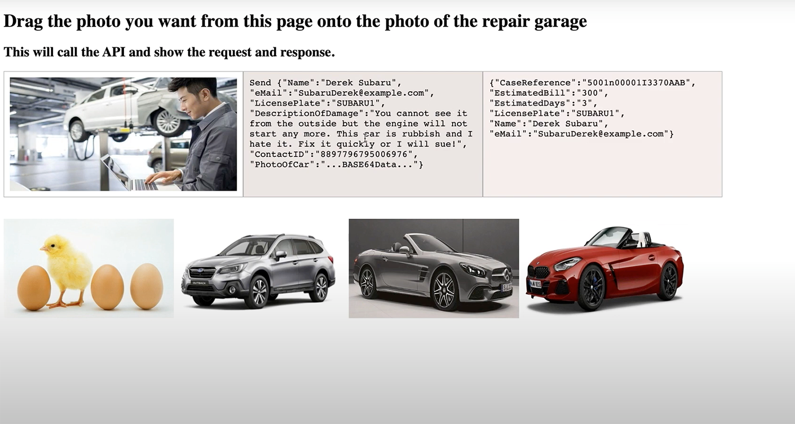
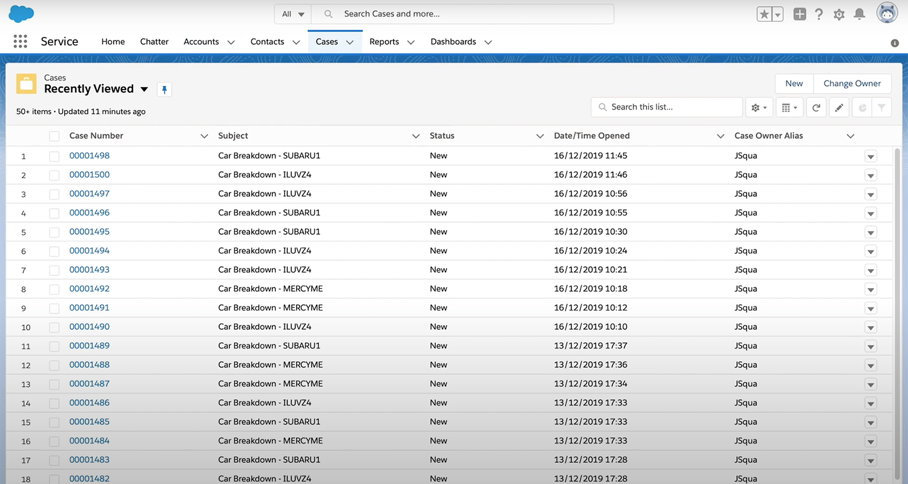
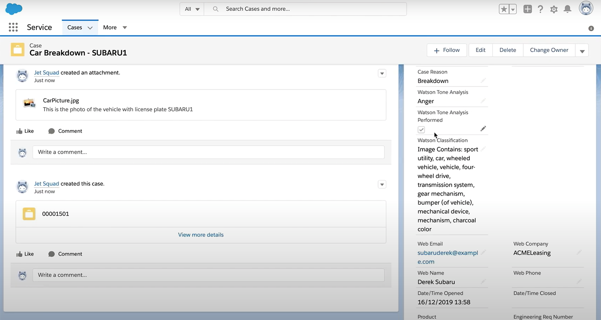

export const Title = () => Car Crash Repair - Guided Tour

## Guided Tour

1 - Scenario Introduction - Car Crash Repair

<Row>
<Column colLg={5} colMd={5}>

**Demo Screenshot**

</Column>
<Column colLg={7} colMd={7}>

**Demo Outline**

1. Use Case Overview
1. Focus Corp Demo Dashboard review
1. Customer persona
    1. Submit rejected invoice
    1. Turn on decision labels, fix $0 and submit approved
    1. Submit invoice that should be rejected, but is approved
1. Operations Specialist persona
    1. Week 1 dashboard
1. Rule Manager persona
    1. Decision model review
    1. Create new branch
    1. Add a new row in the table for IN / Inc scenario
    1. Validate
    1. Simulate rules and compare with original simulation report
    1. Deploy new version
1. Customer persona
    1. Turn on new rule version
    1. Same invoice is correctly rejected
1. Operations Specialist persona
    1. Week 2 dashboard
1. Use case review and value of decision services

 

</Column>
</Row>

2 - API Request

 

1. Navigate back to the **Focus Corp Demos Dashboard** browser window/tab
2. Click on **Week 2** under the picture of the **Operations Specialist**
3. Review the dashboard metrics and note the following:
    1. Lower average invoice processing time below 100 minutes
    1. Less deviation from the final result per week

 

 

3 - Image Recognition

 

1. Navigate back to the **Focus Corp Demos Dashboard** browser window/tab
2. Click on **Week 2** under the picture of the **Operations Specialist**
3. Review the dashboard metrics and note the following:
    1. Lower average invoice processing time below 100 minutes
    1. Less deviation from the final result per week

 

 

4 - Error Handling

 

1. Navigate back to the **Focus Corp Demos Dashboard** browser window/tab
2. Click on **Week 2** under the picture of the **Operations Specialist**
3. Review the dashboard metrics and note the following:
    1. Lower average invoice processing time below 100 minutes
    1. Less deviation from the final result per week

 

 

5 - Salesforce Integration

 

1. Navigate back to the **Focus Corp Demos Dashboard** browser window/tab
2. Click on **Week 2** under the picture of the **Operations Specialist**
3. Review the dashboard metrics and note the following:
    1. Lower average invoice processing time below 100 minutes
    1. Less deviation from the final result per week

 

 

6 - Summary

 

We just used decision automation, a capability within IBM Cloud Pak for Automation, to automate an accounts payable process. With growing volumes of invoices, business rule automation helps reduce the amount of human intervention for account processing, detect issues earlier, and incorporate changes quickly when needed.

