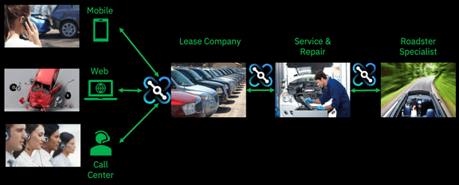

import ArticleDetails from '../../../../src/gatsby-theme-carbon/components/ArticleDetails'

<ArticleDetails name="Andy Garratt" lastUpdated="October 2020" readTimeMinutes="120" />

The Car Crash Repair Demo is a comprehensive API led solution built
using powerful Cloud Pak for Integration Capabilities. The demo
will show you how to rapidly build APIs that connect with SaaS
applications and Watson services and securely expose them to partners.

<Row className="resource-card-group">
  <Column colMd={4} colLg={4} noGutterSm>
  <ResourceCard
    subTitle="Storyboard"
    title="Demo Video"
    aspectRatio="2:1"
    actionIcon="video"
    href="https://www.youtube.com/watch?v=TRzO26kawu4">

  </ResourceCard>
  </Column>

  <Column colMd={4} colLg={4} noGutterSm>
  <ResourceCard
    subTitle="Demo Tour"
    title="Quikdemo"
    actionIcon="arrowRight"
    aspectRatio="2:1"
    href="https://pages.github.ibm.com/ravi-katikala/esd/carrepairdemo/">

  </ResourceCard>
</Column>
 <Column colMd={4} colLg={4} noGutterSm>
  <ResourceCard
    subTitle="Detailed steps"
    title="Demo Instructions"
    aspectRatio="2:1"
    actionIcon="download"
    href=" /cp4i-demohub/pdf/carrepair-v0.1.pdf">

  </ResourceCard>
  </Column>

  <Column colMd={4} colLg={4} noGutterSm>
  <ResourceCard
    subTitle="Resources and code samples"
    title="Demo Artifacts"
    actionIcon="arrowRight"
    aspectRatio="2:1"
    href="https://github.com/IBM/cp4i-demos/tree/main/cognitive-car-insurance-claims">

  </ResourceCard>
</Column>

</Row>

## Business Scenario

We are a Car Repair company: We take in vehicles with problems and
repair them -- seems simple but..

-   We want to gain business advantage by allowing multiple car leasing
    companies to use us to repair their cars -- these companies insist
    that we expose APIs for them to call to do business with them.

-   We want to allow their customers to book their cars in for repair
    and get an estimate for price and number of days in real time -- in
    seconds. Later we will build more APIs to allow customers to query
    the status of their repairs, or make updates or add comments to
    their repair cases.

-   We want to allow them to send photos of their cars so we can check
    for type, damage etc.

-   We want to check for errors and issues up-front as quickly as
    possible to feed back to the customer in real time. Photo not valid?
    No car in the photo? We'll tell you instantly so you can re-submit.

-   We want to minimize manual processes and have the repair request
    automatically create a repair case in our CRM system (Salesforce).
    If a customer wants to book a repair at 3am on a Sunday, they can --
    it's their choice.

-   If the car is a convertible/roadster, we don't repair it, it's a
    specialist job. We want convertibles to automatically create a
    repair case in our partner's system (ServiceNow) as well. (Extension
    scenario)

-   Our partner speaks Spanish -- we don't! We need the requests
    translating from English. (Extension scenario)

-   We are wanting to grow our business fast with this new model and
    expect the use of APIs to really increase the number of requests we
    get. We need our solution to be scalable and highly available.

The diagram below shows how all the parties of our business are related:

Get started with the demo by reviweing the storyboard/video instructions, detailed instructions and additional artifcats.
