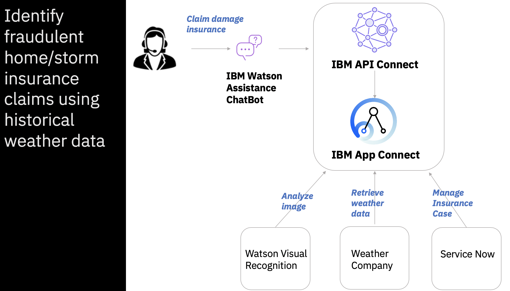
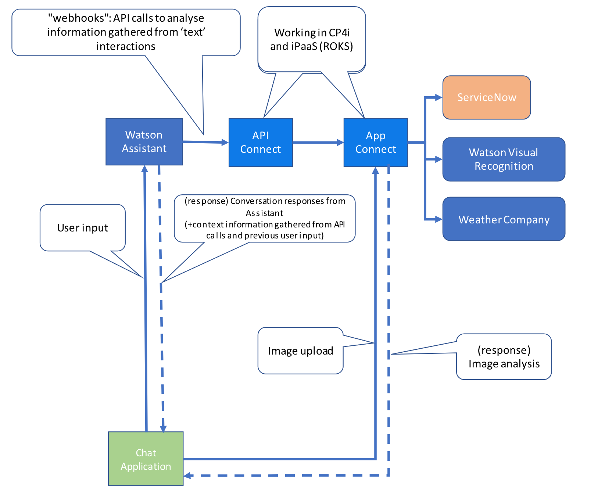

import ArticleDetails from '../../../../src/gatsby-theme-carbon/components/ArticleDetails'

<ArticleDetails name="Ulas Cubuk" lastUpdated="December 2020" readTimeMinutes="120" />

This demo shows how Watson Assistant on IBM cloud can be used together with CP4i to create an 
engaging chatbot experience which allows users to make online insurance claims and also upload 
photographs of the items for which they wish to claim.

<Row className="resource-card-group">
  
  <Column colMd={4} colLg={4} noGutterSm>
  <ResourceCard
    subTitle="Storyboard"
    title="Avoid the chaos with integrated cognitive technology"
    aspectRatio="2:1"
    actionIcon="Blog"
    href="https://community.ibm.com/community/user/middleware/blogs/ulas-cubuk1/2020/09/09/integrated-cognitive-technology">

  </ResourceCard>
  </Column>

 <Column colMd={4} colLg={4} noGutterSm>
  <ResourceCard
    subTitle="Detailed steps"
    title="Demo Instructions"
    aspectRatio="2:1"
    actionIcon="download"
    href=" /cp4i-demohub/pdf/chatbot-v0.1.pdf">

  </ResourceCard>
  </Column>

  <Column colMd={4} colLg={4} noGutterSm>
  <ResourceCard
    subTitle="Resources and code samples"
    title="Demo Artifacts"
    actionIcon="arrowRight"
    aspectRatio="2:1"
    href="https://github.com/IBM/cp4i-demos/tree/main/ace-weather-chatbot">

  </ResourceCard>
</Column>

</Row>

## Overview and description

An insurance company that specializes in 'Storm insurance' wants to streamline its claims process. 
They have a chatbot that verifies that there was a storm on the date and location provided by the 
customer and provides an initial estimate for property damage, by analysing images uploaded by the 
customer and raises a ticket for human followup.

This demo shows how Watson Assistant on IBM cloud can be used together with CP4i to create an 
engaging chatbot experience which allows users to make online insurance claims and also upload 
photographs of the items for which they wish to claim.

It shows how we can securely link cloud applications to CP4i - whether running on the cloud or 
on-premise by exposing APIs securely via the IBM DataPower Gateway. 

The demo creates three separate API implementations which are independently deployable and scalable 
but are brought together to support one application.

This also leverages Watson AI for image recognition and also IBM's Weather service using the CP4i 
built-in TWC Connector.

This demo includes a Node.js GUI for the chatbot.

## Solution Architecture 

### Other resources

- [Flows for Designer, API Connect, Watson Assistant](https://github.ibm.com/PHIPPEN/demos-2020)
- [Chatbot Node UI](https://github.ibm.com/PHIPPEN/watson-assistant )

Get started with the demo by reviweing the storyboard/video instructions, detailed instructions and additional artifcats.
