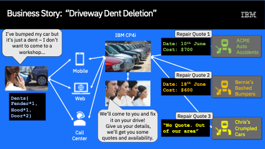

export const Title = () => Driveway Dent Deletion - Accelerate Delivery

<AnchorLinks>
  <AnchorLink>Demo Scenario</AnchorLink>
  <AnchorLink>Demo Video</AnchorLink>
  <AnchorLink>Demo Flow</AnchorLink>
</AnchorLinks>

***

## Demo Scenario

The business scenario for this demo is a common one where a user wishes to enter a request for a service or product and have multiple quotes for that service returned from different vendors so that they can choose which one is best for them.

It might not be a case of “I’ll take the cheapest” as that may  not be available quickly enough, in the right colour, or at the right time. For example when requesting quotes to fly from New York to Los Angeles, a direct flight may be more expensive than a stop over: Whether it is worth the extra money to fly direct is up to the user.

Our scenario concerns someone who has incurred minor damage to their car –it’s not serious, more of a small dent. They wantit repaired at home, on their driveway by a mobile repairer.

They use an app to get some quotes from three repair companies.They provide their name, eMail, License Plate, State and the number of dents in each part of their car.

Each company providesa quote for the repair and the earliest date that they could perform the repair. These quotes are returned to the user but also stored in a database so that the user can retrieve them for future reference.

In a real-world application, we could have the user accepting the quote, changing their appointment time etc, all through the API. We supply the source for all of the artefacts so you can extend the scenario if you wish.

***

### Demo Video
Do you want to understand better the Dent Deletion Demo? Check this [video](https://ibm.ent.box.com/s/7wghq4i0iwye39yxmgywttw15meemauo).

***

### Demo Flow
Here is the list of the macro steps of this Demo:

  - Scenario Introduction
  - Deployments using a fully automated CI/CD pipeline
  - Multiple components being deployed and bound together automatically
  - Updating integration code with zero downtime
  - Applying fixpacks with zero downtime
  - Cross-Component Tracing through the stack (Coming)
  - Different environments (Dev, Test) showing route to live and isolation of environments
  - Environment-Specific Configuration and Policy overrides.
  - Summary

On the Deliver page, you have the Guided Tour for each Delivery Option, explaining everything that you will do in each macro step.

***
