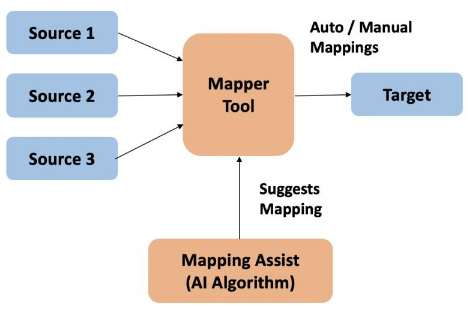
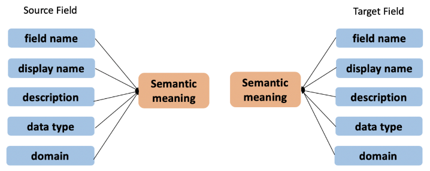

export const Title = () => Mapping Assist - AI Powered Integration Demo

<AnchorLinks>
  <AnchorLink>Demo Scenario</AnchorLink>
  <AnchorLink>Demo Video</AnchorLink>
  <AnchorLink>Demo Flow</AnchorLink>
</AnchorLinks>

***

## Demo Scenario

As part of IBM Cloud Pak® for Integration 2020.2.1, IBM® App Connect has added Artificial Intelligence (AI) powered Mapping Assist to help organizations integrate applications and data more quickly compared to manual mapping.

Mapping Assist uses a pre-trained AI algorithm to provide organizations with intelligent, customized data map suggestions at the point of building integrations. The algorithm is trained and curated to provide suggestions on flat structures as well as complex, nested mapping fields. This feature accelerates the speed of development, shortens time to value, and improves overall user experience.

The need for digital modernization is more important than ever before. During this age of cloud and digital transformation, doing business faster and easier is the goal of every successful organization. Organizations need to be able to rapidly respond to changing business requirements in order to remain competitive in their markets. With an increase in the diversity and number of applications coupled with a broad range of skills across a business, from line-of-business users to integration experts, it is a challenge to build integrations quickly, consistently, and accurately.

Data mapping is among the most important design steps in building an integration flow. This design-time task is usually the most tedious, time-consuming, complex and error-prone because it requires deep understanding of all the data fields on the source and target systems. Building a successful data mapping also requires business analysis, domain expertise and technical knowledge on both source and target systems.

Our goal behind creating Mapping Assist was to simplify and automate data mapping, and when coupled with the extensive list of pre-built, security rich connectors, so that every user across the enterprise, from integration experts to line-of-business professionals, can accelerate the delivery of value to the business through integration.

Mapping Assist has been designed with an architectural approach to provide AI based mapping suggestions within a containerized environment. With this approach IBM App Connect along with Mapping Assist works along-side your integrations, either within your on-prem OR on any cloud environment where containers are deployed. This feature works perfectly even if the product is running on a laptop, as the minimal resources required to run this feature is just 1 CPU and 1 GB of memory.

Integrations are not always point to point-mapping data from one source to one target. In reality, data from multiple sources systems are mapped to the target based on the business requirement. One of the key features of Mapping Assist is that it can analyze fields from multiple source systems and suggest the relevant mappings for the given target system.

Now let’s talk about how it all works internally, in terms of how the algorithm determines the relevant mapping suggestions for a given target system and the list of source systems.

Our Al algorithm is pre-trained and designed to provide suggestions purely based on the metadata available from the source and target systems. The metadata used are field name, display name, description, data type and more importantly the domain knowledge.

By taking all these metadata the AI algorithm derives a semantic meaning separately for each source and target field, and then predicts how similar both these fields are by providing a confidence score if they are mappable.

***

### Demo Video
Do you want to understand better the Mapping Assist Demo? Check the video below.

<iframe width="560" height="315" src="https://www.youtube.com/embed/kWc8-k2G3IY" frameborder="0" allow="accelerometer; autoplay; clipboard-write; encrypted-media; gyroscope; picture-in-picture" allowfullscreen></iframe>

***

### Demo Flow
Here is the list of the macro steps of this Demo:

- Scenario Introduction
- Auto map all fields wherever the matching confidence is higher than 80%.
- Relevant and fine-grained field level suggestions are provided when confidence is between 30%-100%.
- Suggestions are provided based on multiple sources, including all the previous nodes in the flow, for greater accuracy.
- Mapping suggestions for flat structures as well as complex, nested mapping fields are provided.
- Previously selected mappings are remembered and shown as top suggestions when a similar source and target mapping is attempted.
- Summary

On the Deliver page, you have the Guided Tour for each Delivery Option, explaining everything that you will do in each macro step.

***
