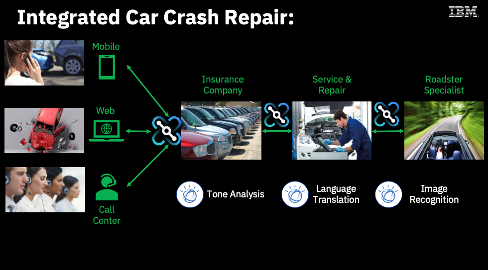

export const Title = () => Vaccine Delivery - Respond to Events

<AnchorLinks>
  <AnchorLink>Demo Scenario</AnchorLink>
  <AnchorLink>Demo Video</AnchorLink>
  <AnchorLink>Demo Flow</AnchorLink>
</AnchorLinks>

***

## Demo Scenario

The vaccine lots need to be kept at a constant temperature for a period of time. The sensor telemetry data coming from the refrigerated shipping containers is processed to assess cold-chain violations.

The solution for this use case includes streaming telemetry events, a stateful microservice to implement aggregation & alarm generation, and integration with a microservice to log issues against the refrigerated shipping container.

The diagram below describes this scenario:

***

### Demo Video
Do you want to understand better the Vaccine Deliver Demo? Check the video below.

<iframe width="560" height="315" src="https://www.youtube.com/embed/TRzO26kawu4" frameborder="0" allow="accelerometer; autoplay; clipboard-write; encrypted-media; gyroscope; picture-in-picture" allowfullscreen></iframe>

***

### Demo Flow
Here is the list of the macro steps of this Demo:

  - Scenario Introduction
  - Capture Event
  - Event Analyzis
  - Anomaly detection
  - Salesforce Integration
  - Problem Resolution
  - Summary

On the Deliver page, you have the Guided Tour for each Delivery Option, explaining everything that you will do in each macro step.

***
