import ArticleDetails from '../../../../src/gatsby-theme-carbon/components/ArticleDetails'

<FeatureCard
  title="Access backend systems using APIs and Messaging"
  color="dark"
  >


</FeatureCard>

<AnchorLinks>
  <AnchorLink>Lab Overview</AnchorLink>
  <AnchorLink>Prerequisites</AnchorLink>
  <AnchorLink>Configure IBM MQ</AnchorLink>
  <AnchorLink>Working with App Connect Enterprise toolkit</AnchorLink>
  <AnchorLink>Deploying a BAR file</AnchorLink>
  <AnchorLink>Using Operational Dashboard</AnchorLink>
  <AnchorLink>Summary</AnchorLink>
</AnchorLinks>

***

<ArticleDetails name="Carlos Hirata, Ravi Katikala" lastUpdated="April 2021" readTimeMinutes="45" />

***

## Lab Overview

In this tutorial, you use the Cloud Pak for Integration 2021.1.1 to create an App Integration flow (IBM App Connect Enterprise) that sends messages to a queue (IBM MQ) on OpenShift 4.6.


### Takeaways

- Configuring IBM MQ
- Creating an integration flow that connects to a message queue
- Deploy the integration flow as a container in Kubernetes
- Checking the message using MQ Web Console
- Checking this message using Operational Dashboard (tracing)

***

## Prerequisites

  - You need to have your personal CP4I on ROKS environment. [Check here how to request it](https://ibm-garage-tsa.github.io/cp4i-demohub/cp4i-on-roks/)
  - You need to have the OC CLI and you should have logged in your ROKS cluster via command line. [Check here how to do it](https://ibm-garage-tsa.github.io/cp4i-demohub/cp4i-on-roks/#access-your-roks-cluster-by-command-line)
  - You should have an MQ Queue Manager runtime pre-created in your CP4I on ROKS environment.
  - You need to have the IBM App Connect Enterprise Toolkit installed in your desktop. Follow the sections **Download IBM App Connect Enterprise for Developers** and **Install IBM App Connect Enterprise** from [this tutorial](https://www.ibm.com/docs/en/app-connect/11.0.0?topic=started-get-hands-experience) to install it.

***

## Configuring IBM MQ

### Task 1 - Configure Message Queue (IBM MQ) to Authorize and Accept Data

As this is a brand-new deployment of the Cloud Pak for Integration, all instances of integrations, message queues, and APIs are deployed as microservices. You need to authorize the Message Queue service to accept incoming data from the integration running on a separate server.

1.Let's configure the MQ security. Open a browser and go to [https://github.com/ibm-cloudintegration/dte-labs/tree/master/Lab2-AccessBackendSystems/resources](https://github.com/ibm-cloudintegration/dte-labs/tree/master/Lab2-AccessBackendSystems/resources).


2.Click **Download** for both zip files.


3.Open a terminal window and enter **unzip es-mq.zip**. Unzip creates a directory mqconf.zip ~/Downloads/ directory. Do not unzip ace-mq.zip (this is a App Connect Interchange Project).

)

4.In terminal window, find the mq pods, using this command: **oc get pods | grep mq**. Copy the mq pods (mq-quickstart-ibm-mq-0).

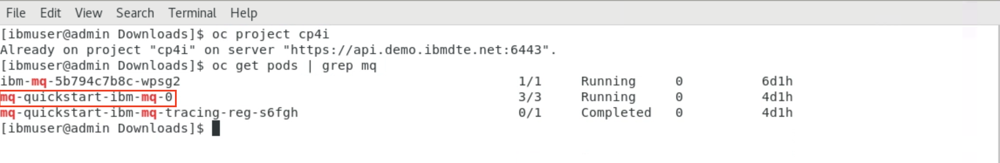)

5.Execute the shell script to run MQ configuration (update the channel and security). Go to **~/Downloads/mqconf** directory and enter **./loadmq.sh mq-quickstart-ibm-mq-0**. The MQ configuration will be updated for this lab.


6.Open a browser and go to your **Cloud Pak for Integration Platform Navigation**. From here, you are able to navigate to all the integration runtimes and capabilities available in the platform. Capabilities include: API Connect, App Connect Dashboard, App Connect Designer , Asset Repository and Operations Dashboard. Let's explore the Message Runtime. IBM MQ for Cloud Pak for Integration has a web GUI, which the Integration Developer, with security authorization, is able to manage the different MQ objects (queues, channels, topics and so on). On the *Cloud Pak for Integration Home*, scroll down to see the **Message** box, and click to open your **MQ Queue Manager Runtime**.


7.Now you are on the IBM MQ Welcome Page. Let's create a queue: click **Create a queue**.

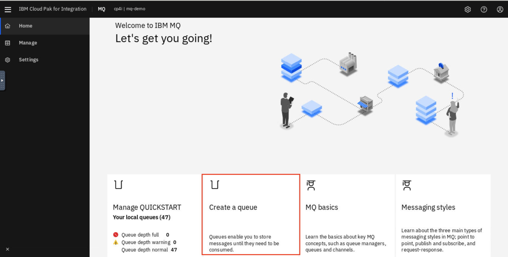

8.In Create a queue page. Choose **Local** as your queue type.

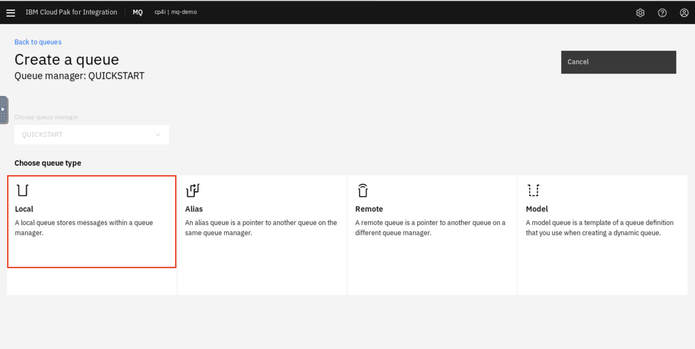

9.Enter the queue name: **NEWORDER**, keep the default values and the click **Create**.


10.In the **Manage** page, locate the queues and click **NEWORDER** queue link.

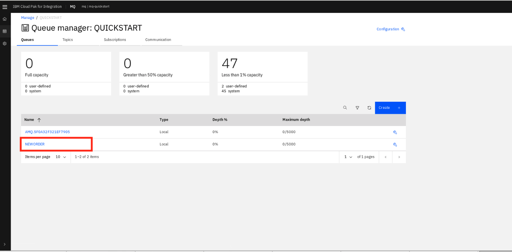

11.Here, you can see that the **NEWORDER** queue is empty. Ok, let's return to the queue manager screen. On the breadcrumbs, click **QUICKSTART** link.


***

## Working with App Connect Enterprise toolkit

### Task 2 - Configuring the app integration flow

In this task, take an existing integration flow in ACE and modify it to send only the payload data to the NEWORDER queue.

1.Open a terminal window by right-clicking on the desktop and selecting Open Terminal.

2.Before starting App Connect Enterprise toolkit, let’s check IBM MQ IP address. In th terminal window, enter the OpenShift command, **oc get svc -n cp4i | grep mq** to get a list of services in the namespaces. and copy the IP address (**172.30.152.157**) which the port is **1414**.

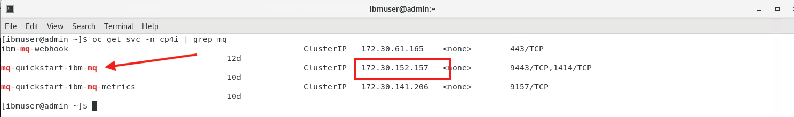

3.Enter **ace toolkit** to open the App Connect Enterprise Toolkit.


4.In the Workspace Launcher window, create the workspace **/IBM/ACET11/workspace/ace-mq**. Click **OK**.

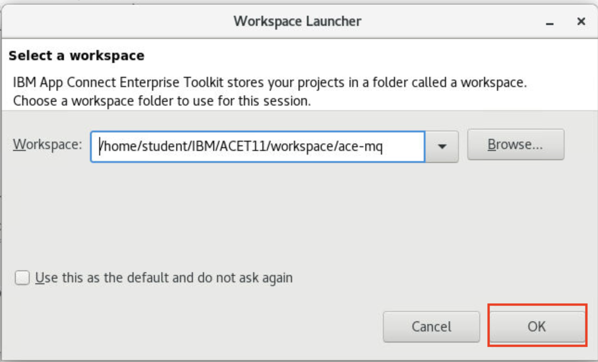

5.The toolkit opens the project. Import the ace-mq.zip file that you downloaded ( see ~/Downloads/ace-mq.zip ). Select **File->Import->Project Interchange** and click **Next**.

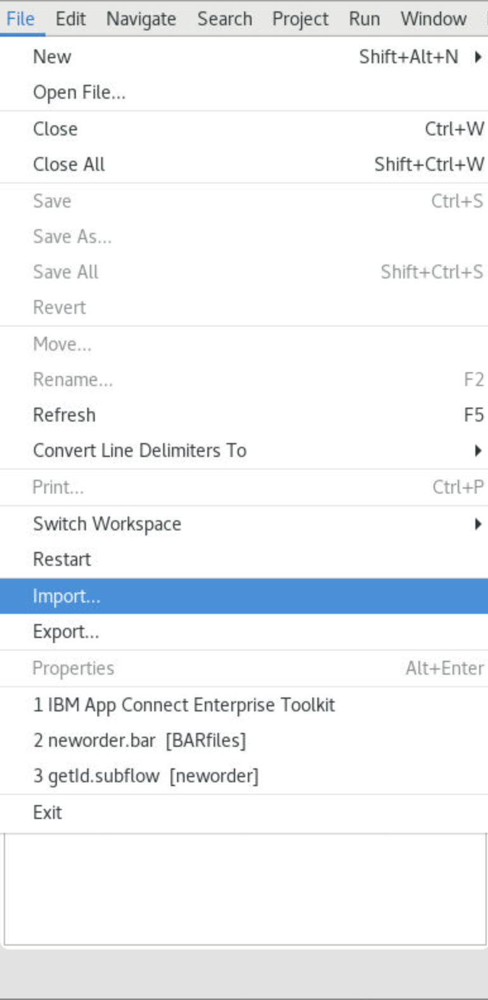


6.Select ace-mq.zip in Downloads folder and then click Ok.


7.Verify **neworder** project is checked and click **Finish**. To view the integration flow that you deploy, click **neworder -> Resources -> Subflows -> getid.subflow**.

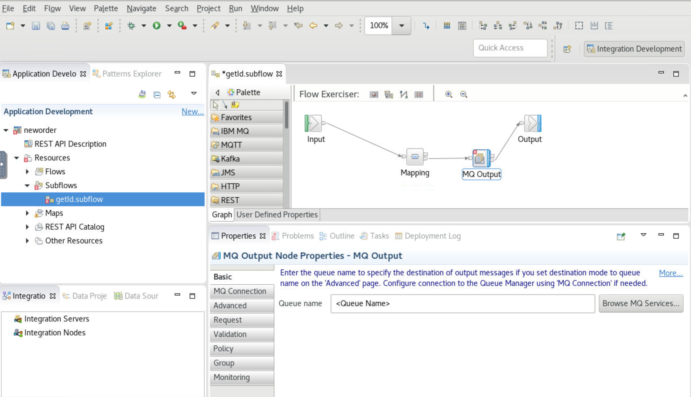

8.Click the **MQ Output** tile. In the lower-right of the Properties pane, open the Properties tab and click **Basic**. Enter the queue name: **NEWORDER**.

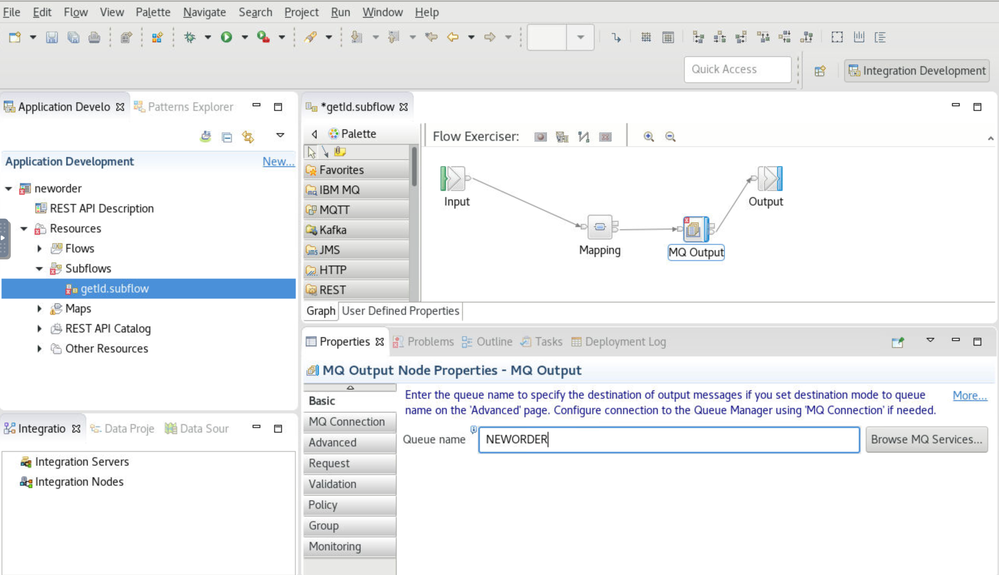

9.Click the MQ Connection parameter and enter the following settings:

```
  1.	Connection*: Select **MQ client connection properties** from the drop-down.
  2.	Destination queue manager name: **QUICKSTART** (case-sensitive).
  3.	Queue manager hostname: **172.30.152.157**. (When you entered **oc get svc**)
  4.	Listener: **1414**.
  5.	Channel name: **SYSTEM.DEF.SRVCONN** (Server Connection).
  6.  Save the flow (**CRTL+S**)

```


10.Now, you need to generate a bar (broker archive) file. The App Connect Enterprise server uses BAR (Broker Archive) files to save compiled message flows, libraries, etc. We have created a file **neworder.bar** for this lab. In the Application Development window in the upper-left, on **neworder application**, right-click and select New then **BAR** file.

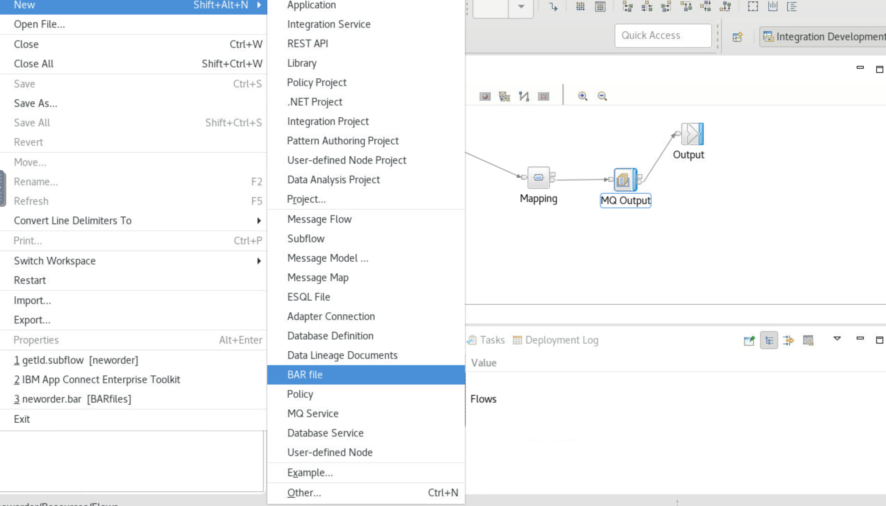

11.On the Window New Bar file, type the name of bar file: **neworder**.


12.	App Connect Enterprise opens a window: **Prepare window** .

```

  1.	Check REST APIs
  2.	Check Compile and inline resources
  3.	Click Build and Save
  4.	A popup window displays “Operation completed successfully.”
  5.	Click Ok and exit out of the toolkit.

App Connect Enterprise Toolkit saves and compile message flows, sub flows into a BAR file.

```


***

## Deploying a BAR file

### Task 3 - Deploy Integration BAR file as containers


In this task, deploy the integration flow as App Connect Enterprise containers running in Kubernetes on the Cloud Pak for Integration. You then test the integration API by calling the API to create a new order and confirm the response payload and data in the queue.

1.In your browser, return to the IBM Cloud Pak for Integration.Under **Capabilities**, select the **App Connect Dashboard** line and click the instance.

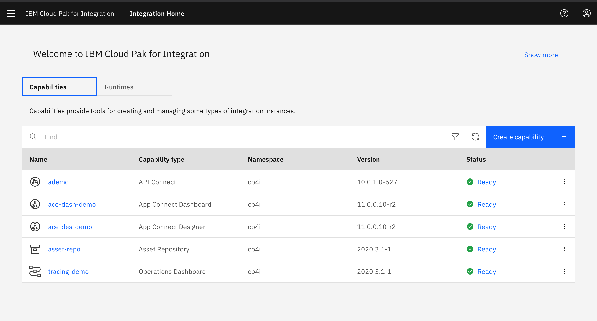

2.When you deploy a BAR file, you create a new instance of App Connect Enterprise. Click **Create Server**.

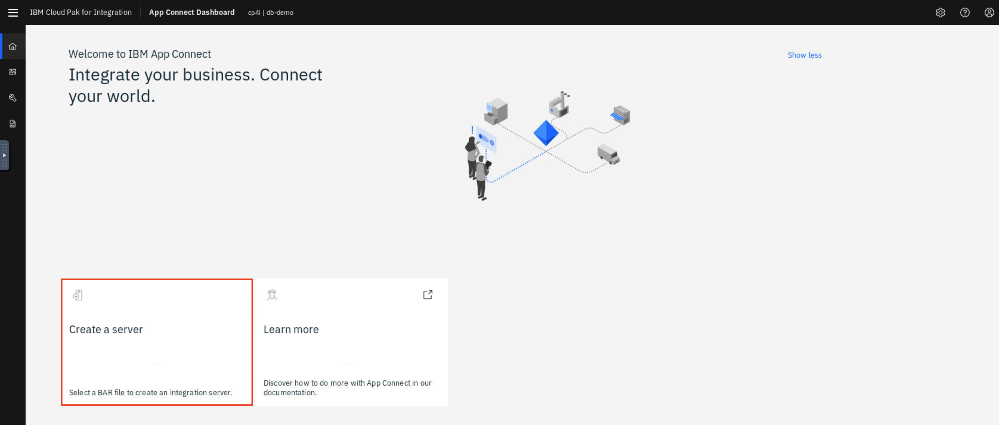

3.Now, in the Create an **App Connect Integration Server** page, define which integration tool generated the **BAR File**. Select **Toolkit Integration** and then click **Next**.


4.In this step, drag a BAR file or click to upload

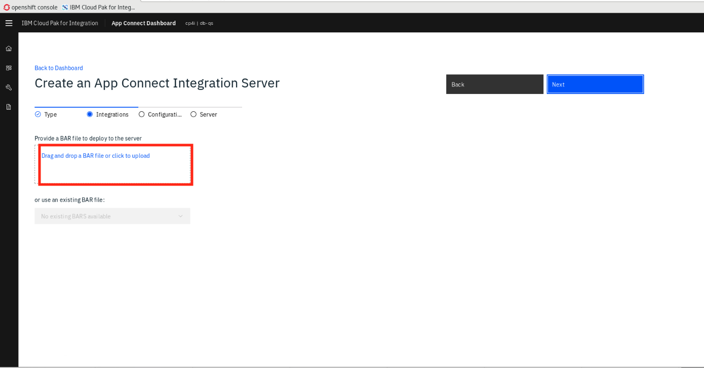

5.In the File Upload window. Open **/home/student/IBM/ACET11/workspace/ace-mq/BARfiles** and select the file new **neworder.bar** and click **Open**. Verify the path routes to the **ace-mq** folder.

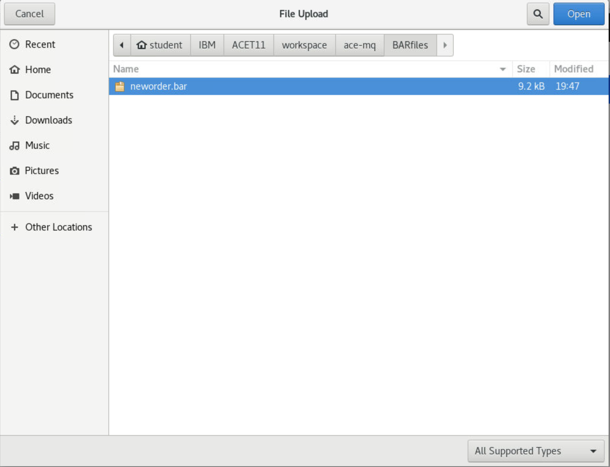

6.You see that **neworder.bar** has uploaded to be deployed. Click **Next**.

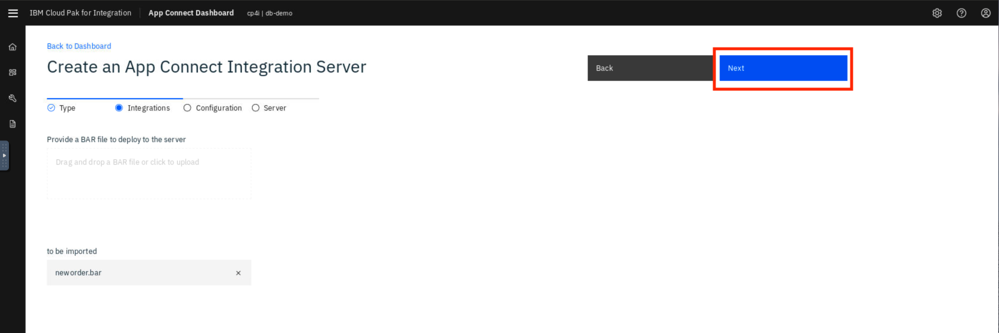

7.You do not need to use the configuration package (**Configuration package contains the files that you can use for App Connect Enterprise works with Databases, Event Streams, etc**) click **Next**.


8.Now you configure App Connect, enter the parameters:

```

  1.	Enter Integration Server name: **neworder**.
  2.	Switch to **ON** to use **Operational Dashboard (tracing)**.
  3.	Enter Operational Dashboard instance namespace: **cp4i**.
  4.	Click **Create** .

```


9.You see the **App Connect Enterprise Dashboard** with the Integration Server **neworder** deployed and started. Click the **neworder** server icon.

**Note:** The deployment process takes up to 5 minutes, refresh the browser to see the BAR file deployed and started.

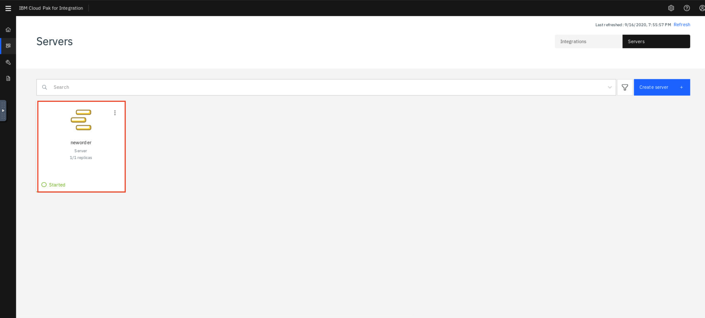

10.Click the **neworder API** icon.

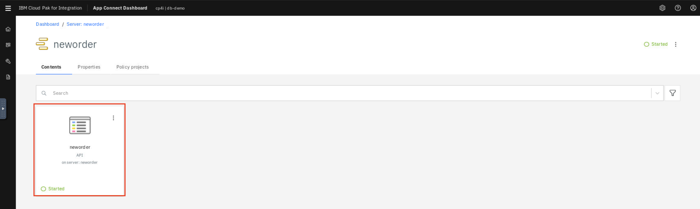

11.This page displays and copy the REST API Base URL (**Endpoint**), use the base URL (in the example :  http://neworder-http-cp4i.mycluster-dal12-c3c-32x-4e85092308b6e4e8c206c47df210f622-0000.us-south.containers.appdomain.cloud:80/neworder/v1/). It might be different.
In this page, you can download a swagger file (you can import this file in API Connect and access by way of API Connect).

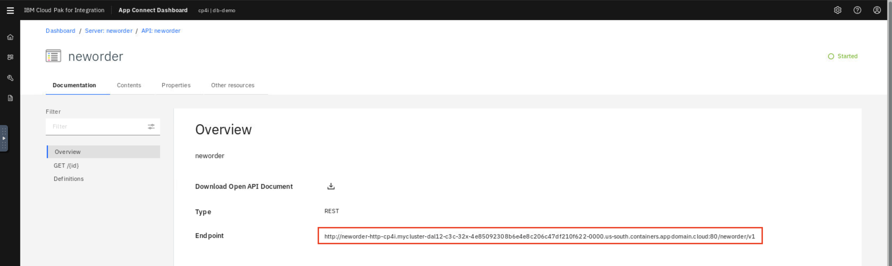

12.Open a terminal window and enter the curl command: curl -k  --request GET http://neworder-http-cp4i.mycluster-dal12-c3c-32x-4e85092308b6e4e8c206c47df210f622-0000.us-south.containers.appdomain.cloud:80/neworder/v1/00000. And see the results

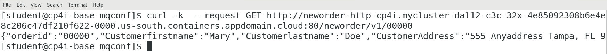

13.You check the message arrived in queue **NEWORDER** in IBM MQ (**QUICKSTART**). You can check using IBM MQ Console. Open a browser and click **Cloud Pak Platform Navigator** and go to **Runtimes** and click **mq-demo** in the instance **Queue Manager**.

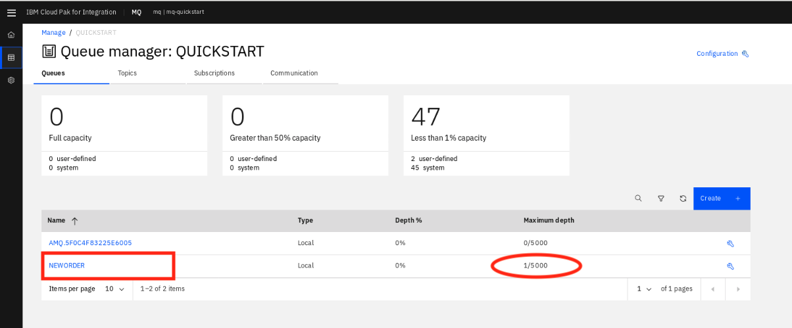

14.You see a new message has arrived in **NEWORDER** queue.

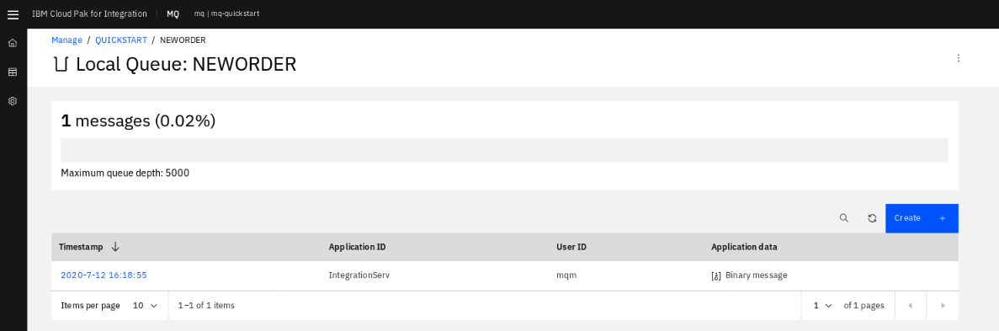

***

## Using Operational Dashboard

Cloud Pak for Integration - Operations Dashboard Add-on is based on Jaeger open source project and the OpenTracing standard to monitor and troubleshoot microservices-based distributed systems. Operations Dashboard can distinguish call paths and latencies. DevOps personnel, developers, and performance specialists now have one tool to visualize throughput and latency across integration components that run on Cloud Pak for Integration. Cloud Pak for Integration - Operations Dashboard Add-on is designed to help organizations that need to meet and ensure maximum service availability and react quickly to any variations in their systems.

1.Back to the browser with Operations Dashboard opened. Click the Overview option and you see all the tracing of **MQ, App Connect and APIC** (You see how to configure tracing in APIC lab). Operations Dashboard Add-on is based on Jaeger open source project and the **OpenTracing** standard to monitor and troubleshoot microservices-based distributed systems. Operations Dashboard can distinguish call paths and latencies. DevOps personnel, developers, and performance engineers now have one tool to visualize throughput and latency across integration components that run on Cloud Pak for Integration. Cloud Pak for Integration - Operations Dashboard Add-on is designed to help organizations that need to meet and ensure maximum service availability and react quickly to any variations in their systems.

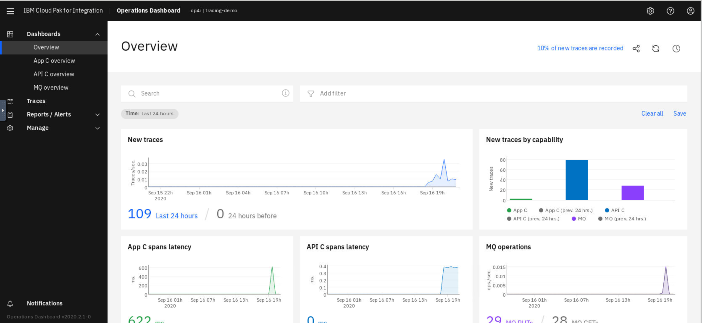

2.You can see also MQ tracing, click **MQ Overview** in Dashboard.

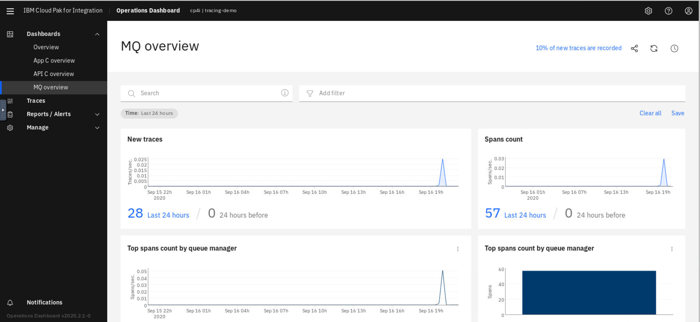

3.You can see **App C tracing**, click **App C Overview** in Dashboard.


4.In the tracing page in **Dashboards**, select **Traces** the menu on the left.

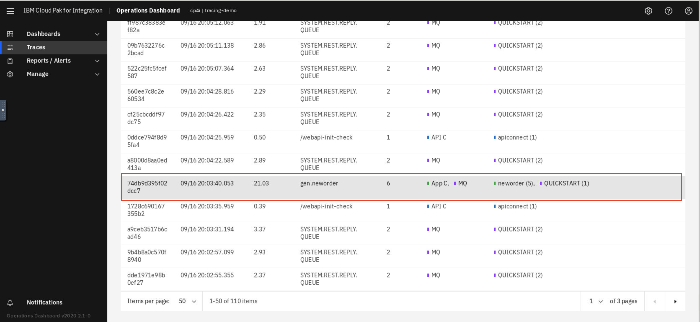

5.Operations Dashboard generated a list of tracing. Select a line to analyze the trace of MQ and App Connect Enterprise.


***

## Summary

You've completed this tutorial. In this lab you learned how to:
1.	Increase efficiency by creating, testing, and debugging an integration flow with a message queue within a single, unified experience
2.	Increase scale by deploying integration flows and message queues as containers on Kubernetes.
