import ArticleDetails from '../../../../src/gatsby-theme-carbon/components/ArticleDetails'

<ArticleDetails name="Carlos Hirata, Ravi Katikala" lastUpdated="September 2020" readTimeMinutes="45" />

In this tutorial, you use the Cloud Pak for Integration 2020.2.1 to create an App Integration flow (IBM App Connect Enterprise) that sends messages to a queue (IBM MQ) on OpenShift 4.4 .

<AnchorLinks>
  <AnchorLink>Introduction</AnchorLink>
  <AnchorLink>Prepare the environment</AnchorLink>
  <AnchorLink>Configure IBM MQ</AnchorLink>
  <AnchorLink>Working with App Connect Enterprise toolkit</AnchorLink>
  <AnchorLink>Deploying a BAR file</AnchorLink>
  <AnchorLink>Using Operational Dashboard</AnchorLink>
  <AnchorLink>Summary</AnchorLink>
</AnchorLinks>

## Introduction

Implement enterprise grade messaging that is secure and reliable for any application across your backend integration architecture. Modern applications and APIs all need the ability to communicate data reliably between mission critical systems across internal/external data sources, networks, and regions. In mission critical environments your messaging infrastructure must be robust, reliable, and secure with the ability to integrate into your applications and APIs at pace and scale. In this tutorial, you create a message queue that receives order data from an API call to a retail ordering system. The red box in the diagram shows what you are creating and where it fits in the overall architecture of a mobile retail buying application.

## Takeaways

- Exploring multiple integration capabilities within a single platform
- Configuring IBM MQ
- Creating an integration flow that connects to a message queue
- Deploy the integration flow as a container in Kubernetes
- Checking the message using MQ Web Console
- Checking this message using Operational Dashboard (tracing)


## Preparing the environment

As this is a new deployment of the Cloud Pak for Integration, you must execute some steps to prepare the environment. Initial setup steps are only needed for a fresh installation of the platform. They do not need to be repeated.
You can use your workstation (MAC OSX) for working in this lab.

In your workstation open a browser and enter http://cloud.ibm.com and enter your ibmid  and click continue and password to login IBM Cloud.

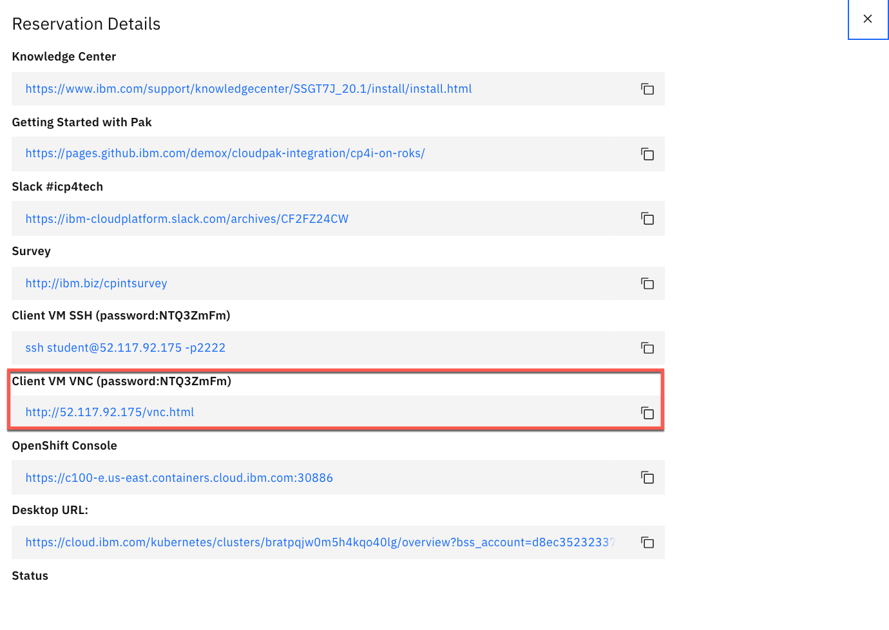

Use the password specified in parenthesis to login to VNC


1.In your workstation open a browser and enter http://cloud.ibm.com and enter your **ibmid** and click continue and password to login IBM Cloud.


2.Enter your IBM userid  and the password and then enter the verify code.


3.In the IBM Cloud Dashboard. You see all information about the infrastructure. On the Resource summary. Observe if you have one cluster and click **Cluster** link.

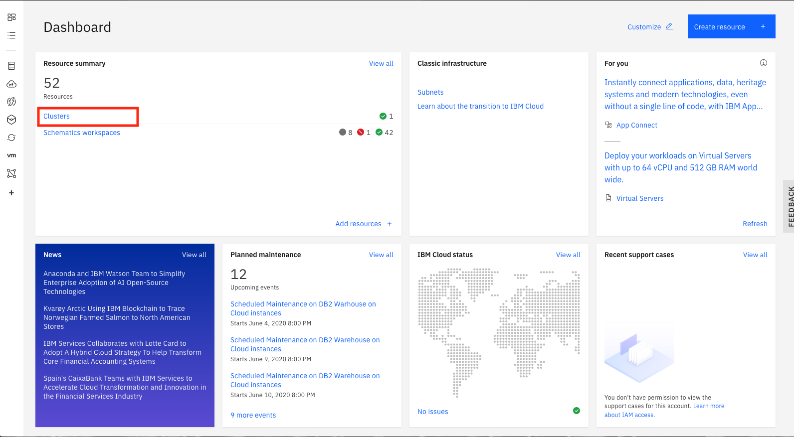

4.You see the  available resources for your cluster. Select Clusters arrow and click your cluster line.

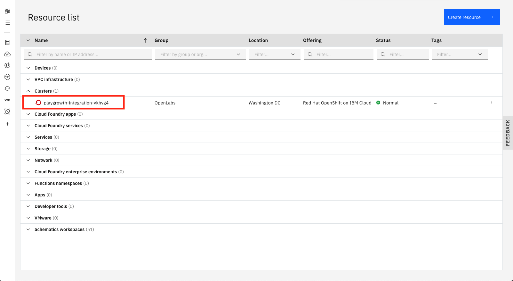

5.In the cluster page, you see the status of your cluster infrastructure,. such as worker node, CPU and Memory usage. Click **OpenShift Web Console**.


6.In the OpenShift console. Select the following:

```
    1. **Networking**

    2. **Routes**

    3. Drill down the Project to **Integration**

    5. Click the **Navigator** link.

```


7.Select **Default authentication** as authentication type.


8.You might need to login screen for IBM Cloud Pak might be displayed, enter the username: admin and Password (Enter the 32 characters password that you created when you made the Cloud Pak provisioning) and Click Log in.
Tip: You might need to use the password. You can use the Clipboard to save the password.


9.In the Cloud Pak Welcome page, you see Capabilities and Runtimes instances.


10.You need to have access to Openshift cluster. In a browser go to **Openshift Console** and right top click **IAM#(your userid)** and click **Copy Login Command**.

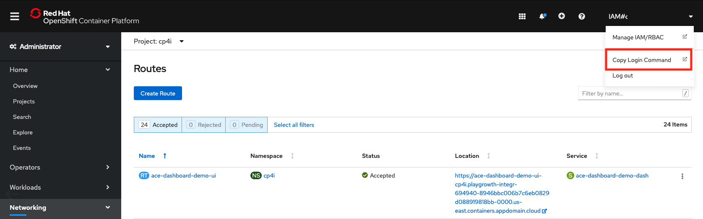

11.Click Display Token link and then copy the log in command:


12.Open a terminal window and Paste the oc command.


## Configuring IBM MQ

IBM Cloud Pak for Integration provides a single solution for all of your enterprise integration needs. The platform provides a comprehensive set of industry-leading capabilities. Combine powerful integration capabilities to create, manage, and monitor all of your integrations across applications, messaging, events, APIs, and more.

In this task, you create a local queue using MQ Console and check the MQ configuration. You create the queue, which accepts the resulting data from the call to the "NEWORDER" API.

1.Open a browser and enter https://github.com/ibm-cloudintegration/dte-labs .You need to configure the MQ security.


2.Select and click **Lab2-AccessBackendSystem** folder.


3.Download two zip files (**ace-mq.zip and mqconf.zip**). Click over the **ace-mq.zip** file.


4.Click **Download** and save to your download directory (**/home/student/Downloads** ).


5.Download **mqconf.zip** and save in **/home/student/Downloads**.

6.You need to configure IBM MQ permissions in MQ Runtime, before creating a local queue. Open a terminal window.


7.In **/home/student** directory, create a work directory **mq-lab**. Use **mkdir -p mq-lab** .

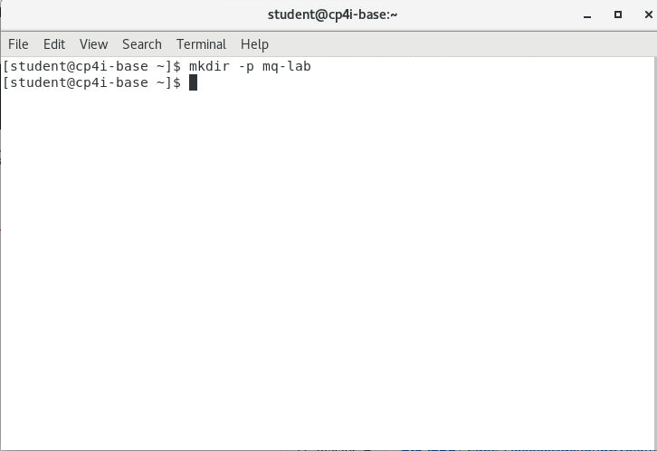

8.Move the two files(**ace-mq.zip** and **mqconf.zip**) from **/home/student/Downloads** to **/home/student/mq-lab**. Use mv **/home/student/Downloads/ace-mq.zip /home/student/mq-lab** and **mv /home/student/Downloads/ace-mqconfig.zip /home/student/mq-lab**.

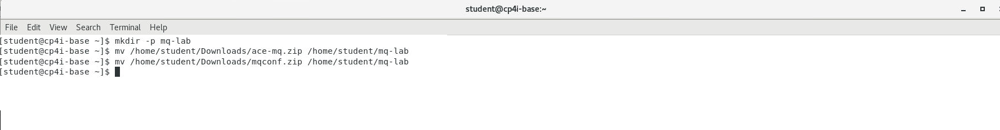

9.Go to **/home/student/mq-lab** directory and uncompressing the **mqconfig.zip** . (**Do not uncompress ace-mq.zip**)

10.The uncompressing process creates a directory **mqconf**. This directory contains IBM MQ Queue Manager security configuration. Go to **/home/student/mq-lab/mqconfig** and enter **./loadmq.sh** shell script.

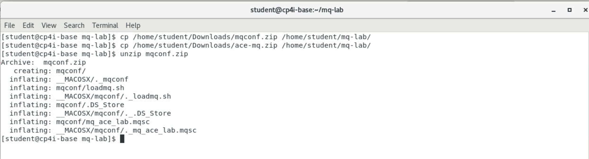

11.You have the MQ server configured to be accessed by App Connect Enterprise.

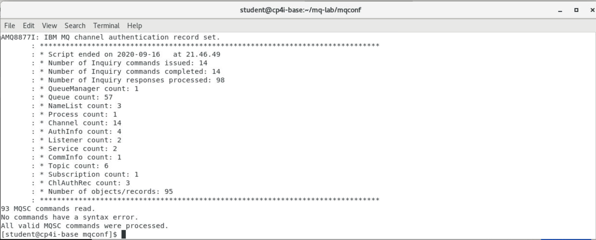

12.Open browser and go to **Welcome IBM Cloud Pak for Integration**. Select **Runtimes** and click **mq-demo** to work with IBM MQ.


13.You might see this warning (Potential Security Risk Ahead). Click Advance.  And then click the link, Accept the Risk and Continue). Don’t worry there is no Risk for your workstation.

14.In the **Welcome IBM MQ page** (**QUICKSTART** is the name of queue manager). This page, you can manage queue manager, create queues, learn MQ basics, and get more information about IBM MQ. Click **Create a queue**.


15.In Create a queue page. You can choose queue type: Local, Alias, Remote, and Model. Click **Local** to create a queue.


16.Enter the queue name: **NEWORDER** and keep the default values and the click **Create**.


17.In the **Manage** page, locate the queues and click **NEWORDER** queue link.


18.You see that the **NEWORDER** queue is empty. Click **QUICKSTART** link (the queue manager).


19.Verify MQ Server hostname. Open a terminal window and enter **oc get svc** . Locate the **mq-demo-ibm-mq**  **ClusterIP address**. In this case is: 172.21.26.194.

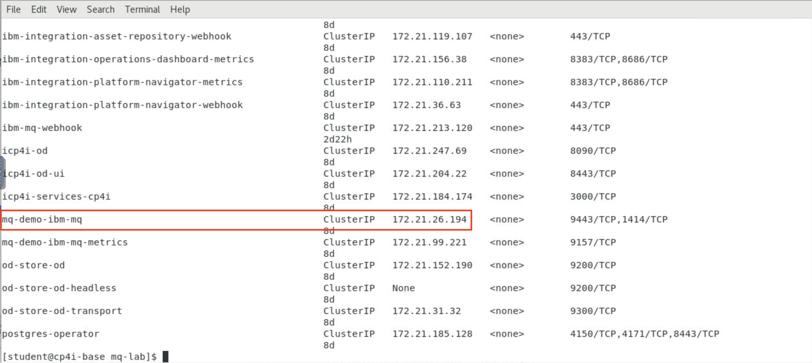

## Working with App Connect Enterprisa Toolkit (integration)

In this task, take an existing integration flow in ACE and modify it to send only the payload data to the NEWORDER queue.

1.Open a terminal window by right-clicking on the desktop and selecting Open Terminal.

2.Enter **ace toolkit** to open the App Connect Enterprise Toolkit.


3.In the Workspace Launcher window, create the workspace **/home/student/IBM/ACET11/workspace/ace-mq**. Click **OK**.


4.Import App Connect Enterprise project. Click **File -> Import**.


5.Select Project Interchange and click **Next** .


6.Go to **/home/student/mq-lab** and select **ace-mq.zip**.


7.Check the project name **neworder** and click **Finish**.

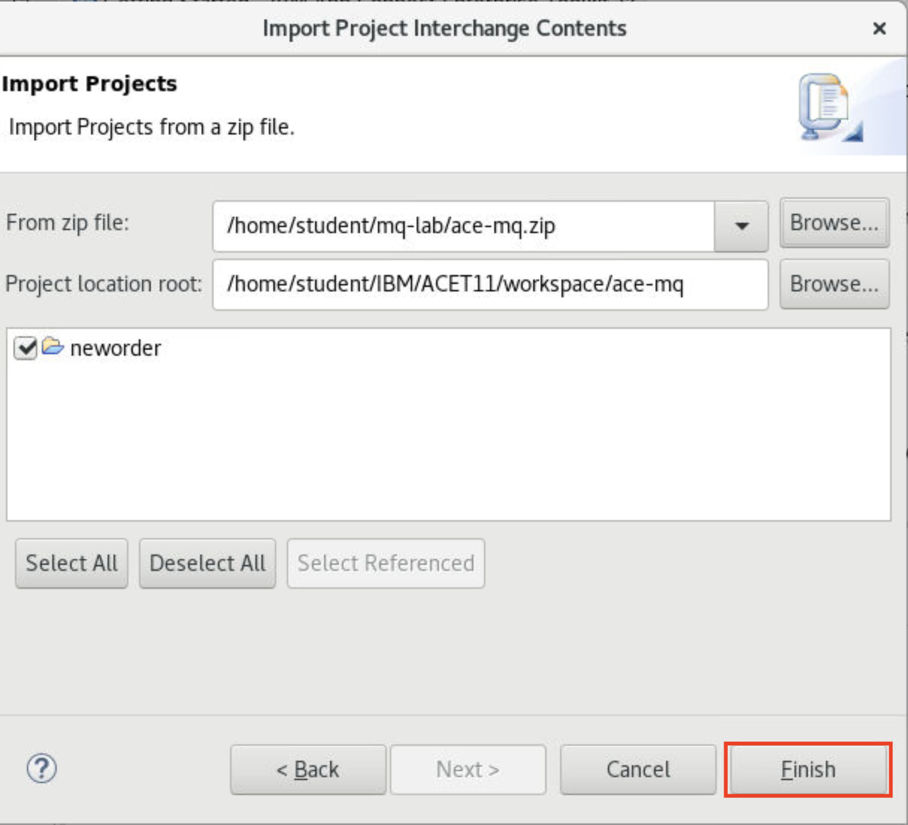

8.Click **neworder > Resources > Subflows > getId.subflow** on the left pane.


9.Click the **MQ Output** tile. In the lower-right of the Properties pane, open the Properties tab and click **Basic**. Enter the queue name: **NEWORDER**.


10.	Click the MQ Connection parameter and enter the following settings:

```
  1.	Connection*: Select **MQ client connection properties** from the drop-down.
  2.	Destination queue manager name: **QUICKSTART** (case-sensitive).
  3.	Queue manager hostname: **172.21.26.194**. (When you entered **oc get svc**)
  4.	Listener: **1414**.
  5.	Channel name: **SYSTEM.DEF.SRVCONN** (Server Connection).

```


11.Save your flow. Click the **save button** .

12.Now, you need to generate a bar (broker archive) file. The App Connect Enterprise server uses BAR (Broker Archive) files to save compiled message flows, libraries, etc. We have created a file **neworder.bar** for this lab. In the Application Development window in the upper-left, on **neworder application**, right-click and select New then **BAR** file.


13.On the Window New Bar file, type the name of bar file: **neworder**.


14.	App Connect Enterprise opens a window: **Prepare window** .

```

  1.	Check REST APIs
  2.	Check Compile and inline resources
  3.	Click Build and Save
  4.	A popup window displays “Operation completed successfully.”
  5.	Click Ok and exit out of the toolkit.

App Connect Enterprise Toolkit saves and compile message flows, sub flows into a BAR file.

```


## Deploying a BAR file

In this task, deploy the integration flow as App Connect Enterprise containers running in Kubernetes on the Cloud Pak for Integration. You then test the integration API by calling the API to create a new order and confirm the response payload and data in the queue.

1.In your browser, return to the IBM Cloud Pak for Integration.Under **Capabilities**, select the **App Connect Dashboard** line and click **db-demo** instance.


2.When you deploy a BAR file, you create a new instance of App Connect Enterprise. Click **Create Server**.


3.Now, in the Create an **App Connect Integration Server** page, define which integration tool generated the **BAR File**. Select **Toolkit Integration** and then click **Next**.


4.In this step, drag a BAR file or click to upload


5.In the File Upload window. Open **/home/student/IBM/ACET11/workspace/ace-mq/BARfiles** and select the file new **neworders.bar** and click **Open**. Verify the path routes to the **ace-mq** folder.


6.You see that **neworder.bar** has uploaded to be deployed. Click **Next**.


7.You do not need to use the configuration package (**Configuration package contains the files that you can use for App Connect Enterprise works with Databases, Event Streams, etc**) click **Next**.


8.Now you configure App Connect, enter the parameters:

```

  1.	Enter Integration Server name: **neworder**.
  2.	Change the replicas to: **1** . (This is a lab and do not need more replicas)
  3.	Switch to **ON** to use **Operational Dashboard (tracing)**.
  4.	Enter Operational Dashboard instance namespace: **cp4i**.
  5.	Update the App Connect Enterprise version to the latest: **11.0.0.9 r3** .
  6.	Click **Create** .

```
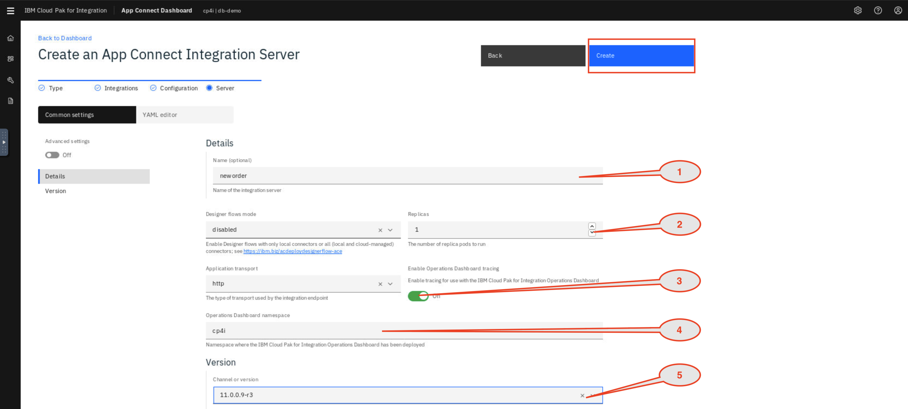

9.You see the **App Connect Enterprise Dashboard** with the Integration Server **neworder** deployed and started. Click the **neworder** server icon.

**Note:** The deployment process takes up to 5 minutes, refresh the browser to see the BAR file deployed and started.


10.Click the **neworder API** icon.


11.This page displays and copy the REST API Base URL (**Endpoint**), use the base URL (in the example :  http://neworder-http-cp4i.mycluster-dal12-c3c-32x-4e85092308b6e4e8c206c47df210f622-0000.us-south.containers.appdomain.cloud:80/neworder/v1/). It might be different.
In this page, you can download a swagger file (you can import this file in API Connect and access by way of API Connect).


12.Open a terminal window and enter the curl command: curl -k  --request GET http://neworder-http-cp4i.mycluster-dal12-c3c-32x-4e85092308b6e4e8c206c47df210f622-0000.us-south.containers.appdomain.cloud:80/neworder/v1/00000. And see the results


13.You check the message arrived in queue **NEWORDER** in IBM MQ (**QUICKSTART**). You can check using IBM MQ Console. Open a browser and click **Cloud Pak Platform Navigator** and go to **Runtimes** and click **mq-demo** in the instance **Queue Manager**.


14.You see a new message has arrived in **NEWORDER** queue.


## Using Operations Dashboard (tracing)


Cloud Pak for Integration - Operations Dashboard Add-on is based on Jaeger open source project and the OpenTracing standard to monitor and troubleshoot microservices-based distributed systems. Operations Dashboard can distinguish call paths and latencies. DevOps personnel, developers, and performance specialists now have one tool to visualize throughput and latency across integration components that run on Cloud Pak for Integration. Cloud Pak for Integration - Operations Dashboard Add-on is designed to help organizations that need to meet and ensure maximum service availability and react quickly to any variations in their systems.

1.Back to the browser with Operations Dashboard opened. Click the Overview option and you see all the tracing of **MQ, App Connect and APIC** (You see how to configure tracing in APIC lab). Operations Dashboard Add-on is based on Jaeger open source project and the **OpenTracing** standard to monitor and troubleshoot microservices-based distributed systems. Operations Dashboard can distinguish call paths and latencies. DevOps personnel, developers, and performance engineers now have one tool to visualize throughput and latency across integration components that run on Cloud Pak for Integration. Cloud Pak for Integration - Operations Dashboard Add-on is designed to help organizations that need to meet and ensure maximum service availability and react quickly to any variations in their systems.


2.You can see also MQ tracing, click **MQ Overview** in Dashboard.


3.You can see **App C tracing**, click **App C Overview** in Dashboard.


4.In the tracing page in **Dashboards**, select **Traces** the menu on the left.


5.Operations Dashboard generated a list of tracing. Select a line to analyze the trace of MQ and App Connect Enterprise.


## Summary


You've completed this tutorial. In this lab you learned how to:
1.	Increase efficiency by creating, testing, and debugging an integration flow with a message queue within a single, unified experience
2.	Increase scale by deploying integration flows and message queues as containers on Kubernetes.
