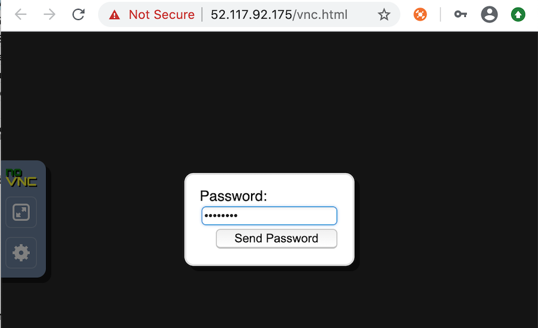
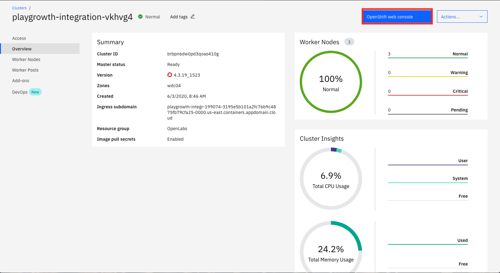
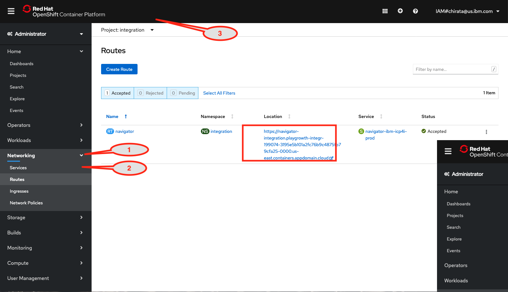
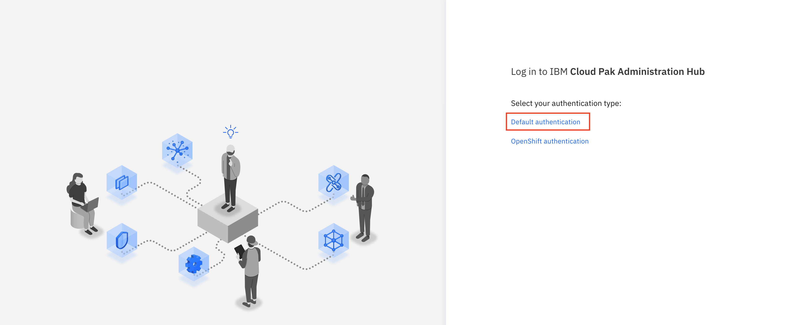

import ArticleDetails from '../../../../src/gatsby-theme-carbon/components/ArticleDetails'

In this tutorial, you use the IBM Cloud Pak for Integration 2020.3.1 to deploy an App Integration flow on containers and expose it as a secure rate-limited API on RedHat OpenShift 4.4.

Extend your back-end integrations securely to partners and developers.
Extending access via APIs to your back-end integrations empower your partners and developer community to create new business value, technical value, and customer experiences for your products and offerings. Spur innovations where a number of technologies are combined to create something new, for example, extending the ability apply for loan pre-approvals that can be used within apps that search for cars or real estate. To do this, you must first create the back-end integrations, which combine data from existing core systems, disparate assets, or SaaS services with the ability to send critical data between systems reliably. Second, you need to provide APIs to your back-end integrations that secure access and apply rate limits.
In this tutorial, you learn how to deploy an app integration flow that takes data from one source and sends it to a message queue for reliable delivery. Then, you expose this integration as a rate-limited API secured by a key and secret. This integration flow is deployed quickly and easily as an independent, auto-scalable microservice running on containers. By using RedHat OpenShift as a foundation.


<AnchorLinks>
  <AnchorLink>Introduction</AnchorLink>
  <AnchorLink>Preparing the environment</AnchorLink>
  <AnchorLink>Configuring IBM MQ</AnchorLink>
  <AnchorLink>Creating a BAR File</AnchorLink>
  <AnchorLink>Deploying a BAR file</AnchorLink>
  <AnchorLink>Configuring API Connect</AnchorLink>
  <AnchorLink>Sharing the API</AnchorLink>
  <AnchorLink>Using Operational Dashboard</AnchorLink>
  <AnchorLink>Summary</AnchorLink>
</AnchorLinks>

## Introduction

Implement enterprise grade messaging that is secure and reliable for any application across your backend integration architecture. Modern applications and APIs all need the ability to communicate data reliably between mission critical systems across internal/external data sources, networks, and regions. In mission critical environments your messaging infrastructure must be robust, reliable, and secure with the ability to integrate into your applications and APIs at pace and scale. In this tutorial, you create a message queue that receives order data from an API call to a retail ordering system. The red box in the diagram shows what you are creating and where it fits in the overall architecture of a mobile retail buying application.

### Takeaways

- Exploring multiple integration capabilities within a single platform
- Configuring IBM MQ
- Creating an integration flow that connects to a message queue
- Deploy the integration flow as a container in Kubernetes
- Checking the message using MQ Web Console
- Checking this message using Operational Dashboard (tracing)


## Task 1 - Preparing the environment

As this is a new deployment of the Cloud Pak for Integration, you must execute some steps to prepare the environment. Initial setup steps are only needed for a fresh installation of the platform. They do not need to be repeated.
You can use your workstation (MAC OSX) for working in this lab.

In your workstation open a browser and enter http://cloud.ibm.com and enter your ibmid  and click continue and password to login IBM Cloud.


Use the password specified in parenthesis to login to VNC



1.In your workstation open a browser and enter http://cloud.ibm.com and enter your **ibmid** and click continue and password to login IBM Cloud.


2.Enter your IBM userid  and the password and then enter the verify code.


3.In the IBM Cloud Dashboard. You see all information about the infrastructure. On the Resource summary. Observe if you have one cluster and click **Cluster** link.


4.You see the  available resources for your cluster. Select Clusters arrow and click your cluster line.


5.In the cluster page, you see the status of your cluster infrastructure,. such as worker node, CPU and Memory usage. Click **OpenShift Web Console**.



6.In the OpenShift console. Select the following:

```
    1. **Networking**

    2. **Routes**

    3. Drill down the Project to **Integration**

    4. Click the **Navigator** link.

```


7.Select **Default authentication** as authentication type.



8.You might need to login screen for IBM Cloud Pak might be displayed, enter the username: admin and Password (Enter the 32 characters password that you created when you made the Cloud Pak provisioning) and Click Log in.
Tip: You might need to use the password. You can use the Clipboard to save the password.


9.In the Cloud Pak Welcome page, you see Capabilities and Runtimes instances.


10.You need to have access to Openshift cluster. In a browser go to **Openshift Console** and right top click **IAM#(your userid)** and click **Copy Login Command**.


11.Click Display Token link and then copy the log in command:


12.Open a terminal window and Paste the oc command.


## Task 2 – Configuring MQ

Configure Message Queue (MQ) to Authorize and Accept Data.

As this is a brand-new deployment of the Cloud Pak for Integration, all instances of integrations, message queues, and event streams are deployed as microservices. We need to authorize the Message Queue service to accept incoming data from the integration running on a separate server.
Cloud Pak for Integration provides a single solution for all of your enterprise integration needs. The platform provides a comprehensive set of industry-leading capabilities. Use any of them on their own or together through a single interface. Create, manage, and monitor all of your integrations across SaaS applications, messaging, streams, APIs, high-speed transfer, and more.
Unlock the power of your data and support the scale required for all of your integration and digital transformation initiatives.
