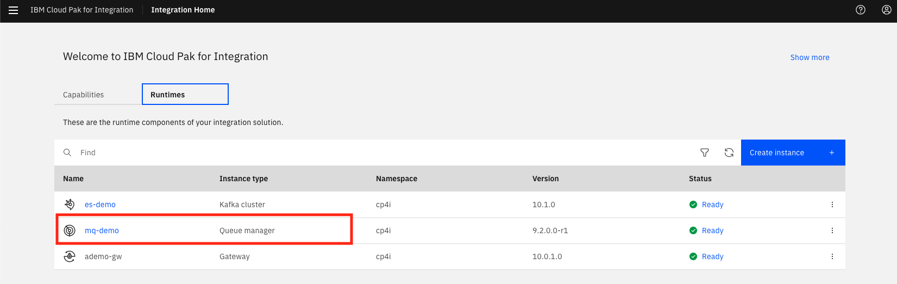
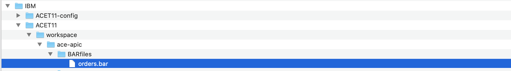
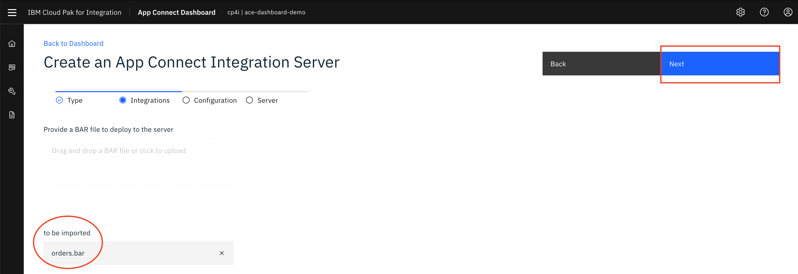
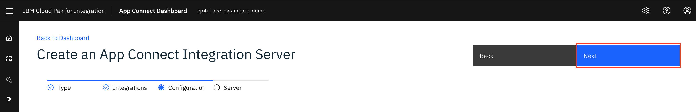
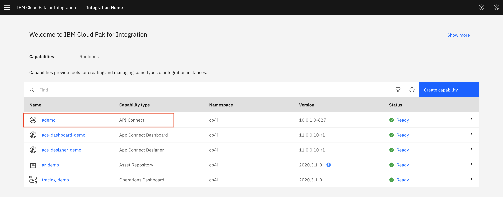
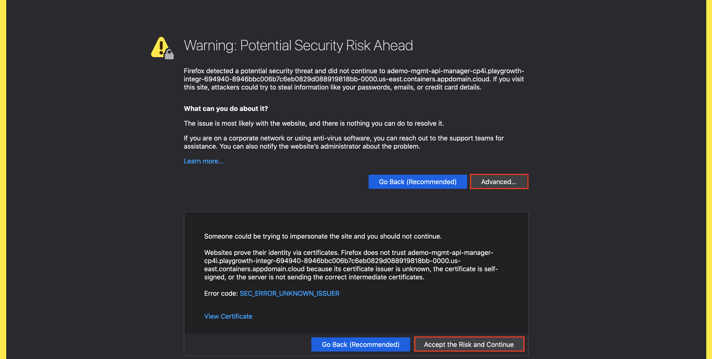
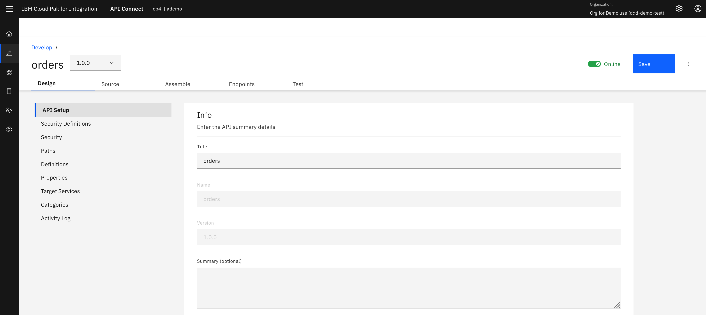
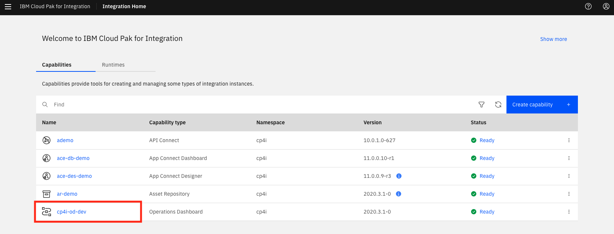

import ArticleDetails from '../../../../src/gatsby-theme-carbon/components/ArticleDetails'

In this tutorial, you use the IBM Cloud Pak for Integration 2020.4.1 to deploy an App Integration flow on containers and expose it as a secure rate-limited API on RedHat OpenShift 4.6.

Extend your back-end integrations securely to partners and developers.
Extending access via APIs to your back-end integrations empower your partners and developer community to create new business value, technical value, and customer experiences for your products and offerings. Spur innovations where a number of technologies are combined to create something new, for example, extending the ability apply for loan pre-approvals that can be used within apps that search for cars or real estate. To do this, you must first create the back-end integrations, which combine data from existing core systems, disparate assets, or SaaS services with the ability to send critical data between systems reliably. Second, you need to provide APIs to your back-end integrations that secure access and apply rate limits.
In this tutorial, you learn how to deploy an app integration flow that takes data from one source and sends it to a message queue for reliable delivery. Then, you expose this integration as a rate-limited API secured by a key and secret. This integration flow is deployed quickly and easily as an independent, auto-scalable microservice running on containers. By using RedHat OpenShift as a foundation.


<AnchorLinks>
  <AnchorLink>Configuring IBM MQ</AnchorLink>
  <AnchorLink>Creating a BAR File</AnchorLink>
  <AnchorLink>Deploying a BAR file</AnchorLink>
  <AnchorLink>Configuring API Connect</AnchorLink>
  <AnchorLink>Sharing the API</AnchorLink>
  <AnchorLink>Using Operations Dashboard</AnchorLink>
  <AnchorLink>Summary</AnchorLink>
</AnchorLinks>

## Introduction

Implement enterprise grade messaging that is secure and reliable for any application across your backend integration architecture. Modern applications and APIs all need the ability to communicate data reliably between mission critical systems across internal/external data sources, networks, and regions. In mission critical environments your messaging infrastructure must be robust, reliable, and secure with the ability to integrate into your applications and APIs at pace and scale. In this tutorial, you create a message queue that receives order data from an API call to a retail ordering system. The red box in the diagram shows what you are creating and where it fits in the overall architecture of a mobile retail buying application.

### Takeaways

- Exploring multiple integration capabilities within a single platform
- Configuring IBM MQ
- Creating an integration flow that connects to a message queue
- Deploy the integration flow as a container in Kubernetes
- Checking the message using MQ Web Console
- Configuring API in API connect
- Sharing API in Asset Repository
- Checking this message using Operational Dashboard (tracing)


## Configuring IBM MQ


### Task 1 - Configure Message Queue (MQ) to Authorize and Accept Data.

As this is a brand-new deployment of the Cloud Pak for Integration, all instances of integrations, message queues, and event streams are deployed as microservices. We need to authorize the Message Queue service to accept incoming data from the integration running on a separate server.
Cloud Pak for Integration provides a single solution for all of your enterprise integration needs. The platform provides a comprehensive set of industry-leading capabilities. Use any of them on their own or together through a single interface. Create, manage, and monitor all of your integrations across SaaS applications, messaging, streams, APIs, high-speed transfer, and more.
Unlock the power of your data and support the scale required for all of your integration and digital transformation initiatives.


1.You need to configure the MQ security .Open a browser and enter https://github.com/ibm-cloudintegration/dte-labs/tree/master/Lab1-BuildAndDeployAPIs/resources .


2.Select **ace-apic.zip** and the click **Download**.


3.Repeat step 2 and download **mqconf.zip**.

4.The files **ace-apic.zip** and **mqconf.zip** are in **~/Downloads**. Uncompress the **mqconf.zip** (use **unzip mqconf.zip**), the unzip generates a directory **mqconf** with two files **loadmq.sh** and **mq_ace_lab.mqsc**.


5.Go to **mqconf** directory and execute the shell script **loadmq.sh**. (use **./loadmq.sh**). You are already logged in Openshift cluster and mq configuration is loaded .


6.Click the IBM Cloud Pak for Integration Platform Navigation. Locate MQ and click the MQ instance name: **mq-demo**.



7.You might need to login screen for IBM Cloud Pak might be displayed, enter the username: **admin** and Password (**Enter the 32 characters password that you created when you made the Cloud Pak provisioning**) and Click **Log in**.


8.In the **Welcome IBM MQ page** (**QUICKSTART** is the name of queue manager). This page, you can manage queue manager, create queues, learn MQ basics, and get more information about IBM MQ. Click **Create a queue**.


9.In Create a queue page. You can choose queue type: Local, Alias, Remote, and Model. Click **local** to create a queue.


10.Enter the queue name: **ORDERS (this is case-sensitive)** and keep the default values and the click **Create**.


11.Click **Manage QUICKSTART** and You see the queues window. You see queue names, type and queue depth.


## Creating a BAR file

### Task 2 – Configuring the integration flow using App Connect Enterprise Toolkit

This task covers opening and examining an application integration flow in the IBM App Connect Enterprise Toolkit. With the Toolkit you can build powerful and complex integration applications, services, and APIs quickly and easily using a visual designer. Your integration solutions can be directly deployed to the Cloud Pak for Integration on IBM Cloud Pak running on-premise, in any cloud, or combinations of both.

1.In the desktop click the right mouse to open a terminal window. If you are using MAC click App Connect Enterprise Toolkit icon and go to the Step 3.

2.In the terminal window, type ace toolkit to open the App Connect Enterprise Toolkit.


3.In the Workspace Launcher window, choose the workspace **~/IBM/ACET11/workspace/ace-apic**. Create the path routes to the folder: **ace-apic**. **Click OK**.


4.If you are using MAC OS, you need to import **ace-apic.zip** into App Connect Enterprise toolkit (the **ace-apic.zip** should be in your **~/Downloads** directory). The toolkit opens the project. To view the integration flow that you deploy, click **orders -> Resources -> Subflows -> getOrder.subflow** .


5.Check the MQ node by clicking the MQ Output Node. Click Properties and select **Basic**, and enter the queue name (you created in MQ Task) **ORDERS**.


6.Select the MQ connection tab. App Connect Enterprise uses a mq client connection:

```

1.	Select MQ client connection properties.
2.	Type Destination queue manager name: QUICKSTART.
3.	Type Queue manager host name: 172.21.157.216 .
4.	Type port number: 1414.
5.	Type Channel name: SYSTEM.DEF.SVRCONN.
6.	Save the flow (Control + S)

```


7.In the Application Development view on the left, on orders flow, right-click and then select **New -> BAR file**.


8.Enter the name of BAR file: **orders** and click **Finish**. App Connect Enterprise is creating an empty BAR file.


9.You need to configure which artifacts are compiled in the BAR file. Check **orders** and check **Compile and in-line resources**, then click the **Build and Save** button. A pop-up window displays “Operation completed successfully.” Click **OK**.


## Deploying a BAR file

### Task 3 – Deploy Integration BAR file as containers

In this task, you deploy a BAR file in App Connect Enterprise Dashboard.

1.Open **Cloud Pak Platform Navigator** in the browser. Open Capabilities and click **ace-dashboard** link to open App Connect Enterprise Dashboard.


2.In the App Connect Enterprise Dashboard, you see the Integration Server deployed. To deploy the **orders.bar** file you saved and complied above click **Create a server**.


3.In the **Create an integration server page**. You have two option to deploy a BAR file. Deploy a BAR file from **App Connect Toolkit** or from **App Connect Designer**. In this lab you deploy BAR file from App Connect Toolkit. Select Toolkit link and then click **NEXT**.


4.You see that **orders.bar** (~/IBM/ACET11/workspace/ace-apic/BARfiles) has uploaded to be deployed. Click **Open**.



5.You see orders.bar in to be imported and click **Next**.



6.You don’t need to download configuration package (Configuration package contains the files that you can use for App Connect Enterprise works with Databases, Event Streams, etc) click **Next**.



7.In Create an App Connect Integration Server page, enter the following:

```

1	Integration Server name: **orders**.
2	Switch to **On** to **Enable Operations Dashboard tracing**.
3	Enter OO tracing instance namespace: **cp4i**.
4	Click **Create**.

```


8.During the deployment process, App Connect Enterprise opens the servers page. You see the App Connect Enterprise Dashboard with the Integration Server orders deployed and started .Click the **orders server** icon.
Note: The deployment process takes 2-3 minutes, refresh the browser to see the BAR file.


9.Click **orders API**.


10.This page displays the REST API Base URL. Copy the base URL (in the example below:
http://orders-http-cp4i.playgrowth-integr-694940-8946bbc006b7c6eb0829d088919818bb-0000.us-east.containers.appdomain.cloud:80/orders/v1 ).

### Keep the browser opened


11.From the terminal window, execute the following curl command and complete with 0000. Enter: curl -k --request GET http://orders-http-cp4i.playgrowth-integr-694940-8946bbc006b7c6eb0829d088919818bb-0000.us-east.containers.appdomain.cloud:80/orders/v1 /0000.
If the API call is successful, you see JSON reply with {"accountid":"ABC-1234567890","orderid":"0000000"}


12.You check the message arrived in queue **ORDERS** in MQ You can check using MQ Console. Open a browser and go to **Cloud Pak Platform Navigator** and click **mq link**. Click **Manage QUICKSTART**.


13.You see in the queues on QUICKSTART. The queue ORDERS has a message (look at Queue Depth)


## Configuring API Connect

### Task 4  – Configuring API Connect to test the integration

You've created an application integration flow and successfully called it via a REST API call! Now, to make it accessible to the rest of the world, it's important to add security around it—at least in the form of a client ID .This way, in addition to access control, you can get insights into which teams or customers are the least and most active. Adding security to an API is simply done via an OpenAPI configuration parameter. We can add rate limits to the API to increase the calls per second, minute, or hour to scale up as much as you need.

1.Open the browser window opened where you have the orders API window open. Click the Download **Open API Document** icon. You save as **orders-1.0.0.yaml** file in **~/Downloads** directory.


2.In **Welcome IBM Cloud Pak for Integration** – **Capabilities**, click **API Connect** link name.



3.You might receive a Warning: Potential Security Risk Ahead. Click Advanced and then Accept the Risk and Continue.



4.In the **API Connect** page, click **IBM Common Services user registry**.


5.Click **Develop APIs and Products**.


6.Click **Add**, then choose **API** from the drop-down menu.


7.Choose **From an existing OpenAPI service**, scroll down and click **Next**.


8.Click **Drag and drop files here or click to upload** to load **order-1.0.0.yaml** in **~/Downloads** directory. And then click **Next**.


9.Confirm the Info about API and click **Next**.


10.Keep the security settings and click **Next**.


11.Your API with Client ID is created! Click **Edit API**.


12.In the API Setup page. You have configured your API and you need to switch Online. Switch **Online** and click **Save**.



13.To test the API, Click **Assemble**, then click the **Test** link and replace **{order}** for **0000** in **GET** command. Click **Send**.


14.Scroll down and see Body and check the results. You see a status code: **200** created with a response body containing the results details.


15.You need to get the Developer Portal and go to **Welcome to API Manager** page, click **Manage** on the left.


16.	Select the **Catalog Sandbox**.


17.We already configure the portal for you.In Sandbox page, click Catalog settings and click Portal and copy the Portal URL:  https://ademo-ptl-portal-web-cp4i.playgrowth-integr-694940-8946bbc006b7c6eb0829d088919818bb-0000.us-east.containers.appdomain.cloud/ddd-demo-test/sandbox.


18.	Login to Developer Portal server using the link you copied in the browser.


19.	Sign in using ibmuser and password Passw0rd!.


20.In the Developer Portal, explore products clicking **orders auto product 1.0.0** icon.


21.You need to subscribe to Default Plan, clicking **Subscribe**.


22.Create an Application, clicking **Create Application**.


23.Create an application called **myapp** and click **Save**. You will be this application for testing the API.


24.You receive credentials API Key and secret. You don’t need to use for this lab, just close the window.


25.Click **myapp** icon to select Application.


26.Confirm the subscription for **orders auto product**. Click **Next**.


27.The subscription is completed and then click **Done**.


28.Click the icon **orders 1.0.0**, to open the API.


29.In orders 1.0.0 page:

```
1.Select GET/{order}
2.Select Try it
3.Enter order numbering 0000
4.Click Send.

```


30.The results are shown in the response string.


## Sharing the API

### Task 5 - Share the API

Now that you've built, secured, published, and tested your API, the last step is to add it to the Asset Repository. With the Asset Repository, your organization can store, manage, and share all of your integration assets in one central location. Sharing assets in this way increases collaboration between teams, avoids unnecessary duplication and boosts productivity.

1.If you using the Asset Repository for the first time, it must be initialized. Open assetrepo link from the **Capabilities** and select **Initialize**.


2.To push our new API to **Asset Repository** we must return to the API Manager. In **Welcome IBM Cloud Pak for Integration – Capabilities**, click **API Connect** link name.


3.In the API Manager screen, click **Develop APIs and Products**.


4.Returning to the Develop Screen, select the menu next to your API and from the drop-down, click **Push to asset repository**.


5.Once the upload completes, you see a success dialogue at top-right.


6.To access the **Asset Repository**, click asset-repo link.


7.You see the orders asset you pushed from API Connect in the previous tasks. Click the ellipsis and choose **Open** from the drop-down menu.to check orders API.


8.You check the API overview.


9.Click **Get/{order}** link you see the API parameters.


10.Click Definitions and then click the Arrow (Order). You see an example of results.


You’ve successfully added a review. Now your teammates know that this asset is reusable and reliable. Additional information about the asset is available in the sidebar including when the file was created, a description that explains the purpose and use, and any relevant tags

## Using Operations Dashboard

### Task 6 – Using Operations Dashboard (tracing)


Cloud Pak for Integration - Operations Dashboard Add-on is based on Jaeger open source project and the OpenTracing standard to monitor and troubleshoot microservices-based distributed systems. Operations Dashboard can distinguish call paths and latencies. DevOps personnel, developers, and performance engineers now have one tool to visualize throughput and latency across integration components that run on Cloud Pak for Integration. Cloud Pak for Integration - Operations Dashboard Add-on is designed to help organizations that need to meet and ensure maximum service availability and react quickly to any variations in their systems.

1.Go to the IBM Pak Cloud Integration main page  select View events and  click tracing to open the Operations Dashboard instance.



2.In the Tracing page, check the **Overview page**. You see all products that you can use this tool: APIC ,APP Connect and MQ. (more tracing products will add in the future releases).


3.You can monitor each product separately. Click **App C overview**.


4.See API Connect overview.


5.Operations Dashboard generated a list of tracing. Select a line to analyze the trace of MQ  App Connect Enterprise, and API Connect. select **Traces** icon the menu on the left. Select the line that you want to see the trace. Enter the name of App Connect server name: **ORDERS** and click the line (**gen.orders**).


6.Take look at the charts for each component for these labs.


## Summary

### Summary

You have successfully completed this lab. In this lab you learned how to:

 - Deploy a back-end integration to containers that are readily available as a scalable web service.
 - Secure access to the back-end integration by creating a secure, governed API using the OpenAPI definition of the integration.
 - Use Operations Dashboard to tracing  MQ, APIC and APPC

### Now that you’ve made your back-end integrations ready for external distribution, your developer community is able to access the APIs via a developer portal. The developer portal is included in the platform and provides a full-featured experience to onboard and nurture your API consumers. To try out more labs, go to Cloud Pak for Integration Demos. For more information about Cloud Pak for Integration, go to https://www.ibm.com/cloud/cloud-pak-for-integration
