import ArticleDetails from '../../../../src/gatsby-theme-carbon/components/ArticleDetails'


<FeatureCard
  title="Build and deploy new integrations and securely expose them as APIs"
  color="dark"
  >


</FeatureCard>

<AnchorLinks>
  <AnchorLink>Lab Overview</AnchorLink>
  <AnchorLink>Prerequisites</AnchorLink>
  <AnchorLink>Business Context</AnchorLink>
  <AnchorLink>Configuring IBM MQ</AnchorLink>
  <AnchorLink>Creating a BAR File</AnchorLink>
  <AnchorLink>Deploying a BAR file</AnchorLink>
  <AnchorLink>Configuring API Connect</AnchorLink>
  <AnchorLink>Sharing the API</AnchorLink>
  <AnchorLink>Using Operations Dashboard</AnchorLink>
  <AnchorLink>Summary</AnchorLink>
</AnchorLinks>

***

## Lab Overview

In this tutorial, you use the IBM Cloud Pak for Integration 2021.1.1 to deploy an App Integration flow on containers and expose it as a secure rate-limited API on RedHat OpenShift 4.6.

Extend your back-end integrations securely to partners and developers.
Extending access via APIs to your back-end integrations empower your partners and developer community to create new business value, technical value, and customer experiences for your products and offerings. Spur innovations where a number of technologies are combined to create something new, for example, extending the ability apply for loan pre-approvals that can be used within apps that search for cars or real estate. To do this, you must first create the back-end integrations, which combine data from existing core systems, disparate assets, or SaaS services with the ability to send critical data between systems reliably. Second, you need to provide APIs to your back-end integrations that secure access and apply rate limits.
In this tutorial, you learn how to deploy an app integration flow that takes data from one source and sends it to a message queue for reliable delivery. Then, you expose this integration as a rate-limited API secured by a key and secret. This integration flow is deployed quickly and easily as an independent, auto-scalable microservice running on containers. By using RedHat OpenShift as a foundation.

***

## Prerequisites

  - You need to have your personal CP4I on ROKS environment. [Check here how to request it](https://ibm-garage-tsa.github.io/cp4i-demohub/cp4i-on-roks/)
  - You need to have the OC CLI and you should have logged in your ROKS cluster via command line. [Check here how to do it](https://ibm-garage-tsa.github.io/cp4i-demohub/cp4i-on-roks/#access-your-roks-cluster-by-command-line)
  - You should have an MQ Queue Manager runtime pre-created in your CP4I on ROKS environment.
  - You need to have the IBM App Connect Enterprise Toolkit installed in your desktop. Follow the sections **Download IBM App Connect Enterprise for Developers** and **Install IBM App Connect Enterprise** from [this tutorial](https://www.ibm.com/docs/en/app-connect/11.0.0?topic=started-get-hands-experience) to install it.


***

## Business Context

Implement enterprise grade messaging that is secure and reliable for any application across your backend integration architecture. Modern applications and APIs all need the ability to communicate data reliably between mission critical systems across internal/external data sources, networks, and regions. In mission critical environments your messaging infrastructure must be robust, reliable, and secure with the ability to integrate into your applications and APIs at pace and scale. In this tutorial, you create a message queue that receives order data from an API call to a retail ordering system. The red box in the diagram shows what you are creating and where it fits in the overall architecture of a mobile retail buying application.

### Takeaways

- Exploring multiple integration capabilities within a single platform
- Configuring IBM MQ
- Creating an integration flow that connects to a message queue
- Deploy the integration flow as a container in Kubernetes
- Checking the message using MQ Web Console
- Configuring API in API connect
- Sharing API in Asset Repository
- Checking this message using Operational Dashboard (tracing)

***

## Configuring IBM MQ


### Task 1 - Configure Message Queue (MQ) to Authorize and Accept Data.

As this is a brand-new deployment of the Cloud Pak for Integration, all instances of integrations, message queues, and event streams are deployed as microservices. We need to authorize the Message Queue service to accept incoming data from the integration running on a separate server.
Cloud Pak for Integration provides a single solution for all of your enterprise integration needs. The platform provides a comprehensive set of industry-leading capabilities. Use any of them on their own or together through a single interface. Create, manage, and monitor all of your integrations across SaaS applications, messaging, streams, APIs, high-speed transfer, and more.
Unlock the power of your data and support the scale required for all of your integration and digital transformation initiatives.


1.You need to configure the MQ security.  Open a browser and enter https://github.com/ibm-cloudintegration/dte-labs/tree/master/Lab1-BuildAndDeployAPIs/resources .

  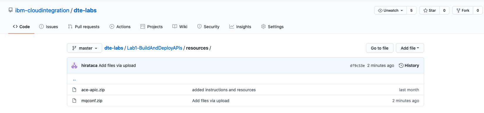

2.Select **ace-apic.zip** and the click **Download**.

  

3.Repeat step 2 and download **mqconf.zip**.

4.The files **ace-apic.zip** and **mqconf.zip** are in **~/Downloads**. Uncompress the **mqconf.zip** (use **unzip mqconf.zip**), the unzip generates a directory **mqconf** with two files **loadmq.sh** and **mq_ace_lab.mqsc**.

  

5.In terminal window, check the name of MQ pods in your environment, using this command: **oc get pods | grep mq**. Your MQ pod is the pod that starts with mq-quickstart. Take note of the pod name (e.g.: mq-quickstart-ibm-mq-0).

  

6.Execute the shell script to run MQ configuration (update the channel and security). Go to **~/Downloads/mqconf** directory and enter **./loadmq.sh mq-quickstart-ibm-mq-0**. The MQ configuration will be updated for this lab.

  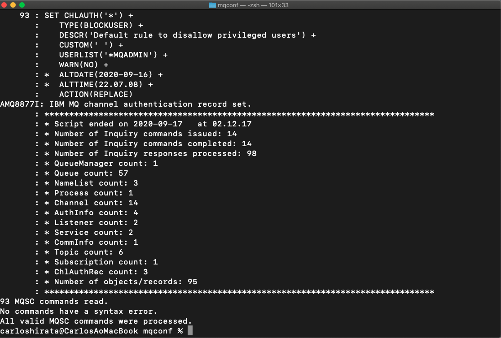

7.Open a browser and go to your **Cloud Pak for Integration Platform Navigation**. On the **Message** box, click to open your **MQ Queue Manager Runtime**.

  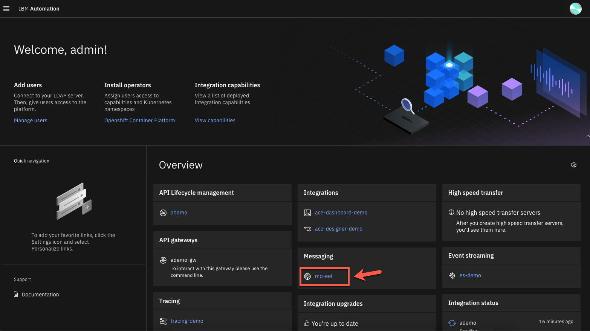

8.You might need to login screen for IBM Cloud Pak might be displayed, enter the username: **admin** and Password (**Enter the 32 characters password that you created when you made the Cloud Pak provisioning**) and Click **Log in**.

  

9.In the **Welcome IBM MQ page**. This page, you can manage queue manager, create queues, learn MQ basics, and get more information about IBM MQ. Click **Create a queue**.

  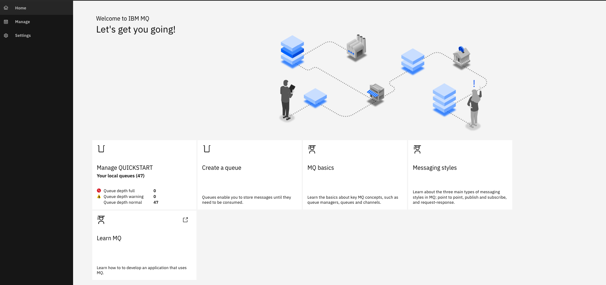

10.In Create a queue page. You can choose queue type: Local, Alias, Remote, and Model. Click **local** to create a queue.

  

11.Enter the queue name: **ORDERS (this is case-sensitive)** and keep the default values and the click **Create**.

  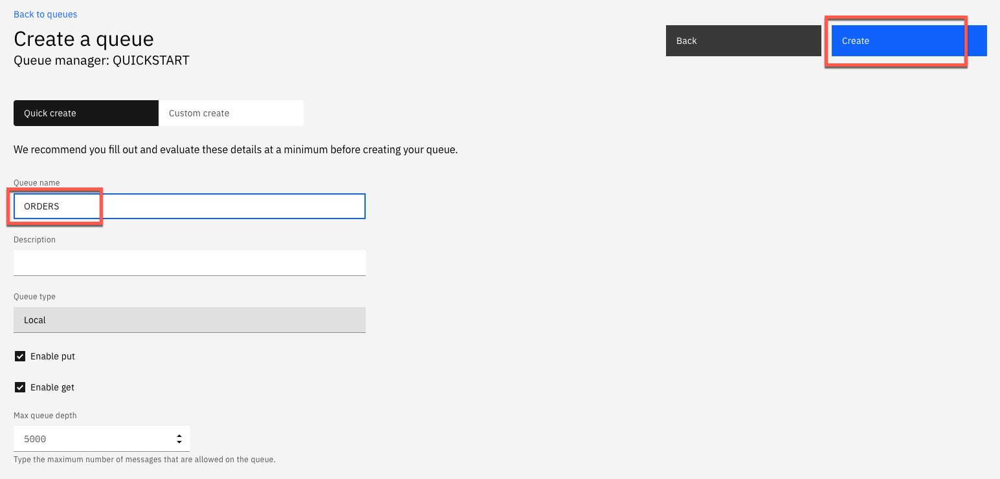

12.Click **Manage QUICKSTART** and You see the queues window. You see queue names, type and queue depth.

  

***

## Creating a BAR file

### Task 2 – Configuring the integration flow using App Connect Enterprise Toolkit

This task covers opening and examining an application integration flow in the IBM App Connect Enterprise Toolkit. With the Toolkit you can build powerful and complex integration applications, services, and APIs quickly and easily using a visual designer. Your integration solutions can be directly deployed to the Cloud Pak for Integration on IBM Cloud Pak running on-premise, in any cloud, or combinations of both.

1.Open a terminal window. If you are using MAC click App Connect Enterprise Toolkit icon and go to the Step 3.

2.Before starting App Connect Enterprise toolkit, let’s check IBM MQ IP address. In th terminal window, enter the OpenShift command, **oc get svc -n cp4i | grep mq** to get a list of services in the namespaces. and copy the IP address (**172.30.152.157**) which the port is **1414**.

  

3.Open your App Connect Enterprise Toolkit by clicking the icon or executing **ace toolkit** in terminal window (depends of your operational system).

4.In the Workspace Launcher window, choose the workspace **~/IBM/ACET11/workspace/ace-apic**. **Click OK**.

  

5.The toolkit opens the project. Import the **ace-apic.zip** file that you downloaded ( see ~/Downloads/ace-apic.zip ). Select **File->Import->Project Interchange** and click **Next**.

  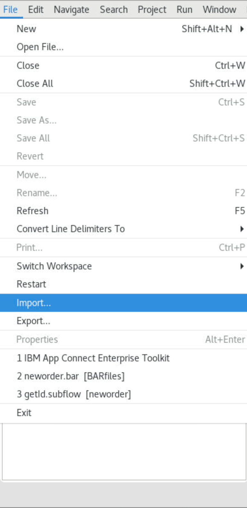

  

6.The toolkit opens the project. To view the integration flow that you deploy, click **orders -> Resources -> Subflows -> getOrder.subflow** .

  

7.Check the MQ node by clicking the MQ Output Node. Click Properties and select **Basic**, and enter the queue name (you created in MQ Task) **ORDERS**.

  

8.Select the MQ connection tab. App Connect Enterprise uses a mq client connection. Select **MQ client connection properties** (1). Type Destination queue manager name: **QUICKSTART** (2). Enter the IP of your **MQ Queue manager host**, identified the beginner of this task (3). 	Type port number: 1414 (4). Type Channel name: SYSTEM.DEF.SVRCONN (5). 	**Save** the flow (**Control + S**).

  

9.In the Application Development view on the left, on orders flow, right-click and then select **New -> BAR file**.

  

10.Enter the name of BAR file: **orders** and click **Finish**. App Connect Enterprise is creating an empty BAR file.

  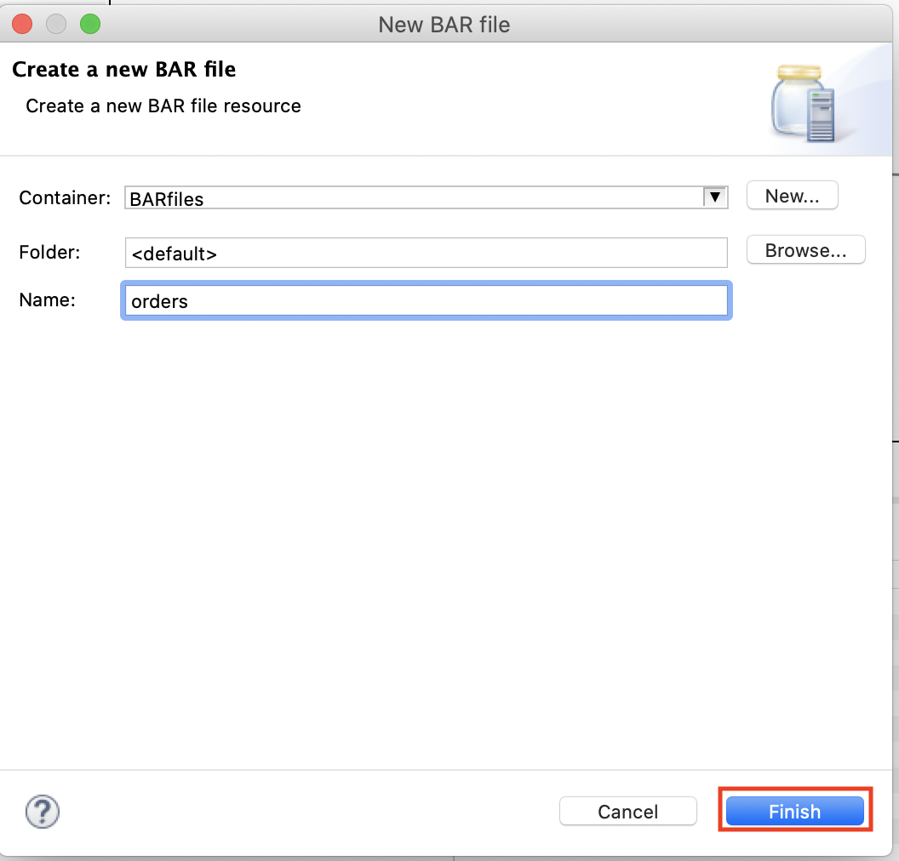

11.You need to configure which artifacts are compiled in the BAR file. Check **orders** and check **Compile and in-line resources**, then click the **Build and Save** button. A pop-up window displays “Operation completed successfully.” Click **OK**.

  

***

## Deploying a BAR file

### Task 3 – Deploy Integration BAR file as containers

In this task, you deploy a BAR file in App Connect Enterprise Dashboard.

1.Back to the **Cloud Pak Platform Navigator** in the browser. Open the **Menu** and on the **Run** section, open the **Integrations** dashboard.

  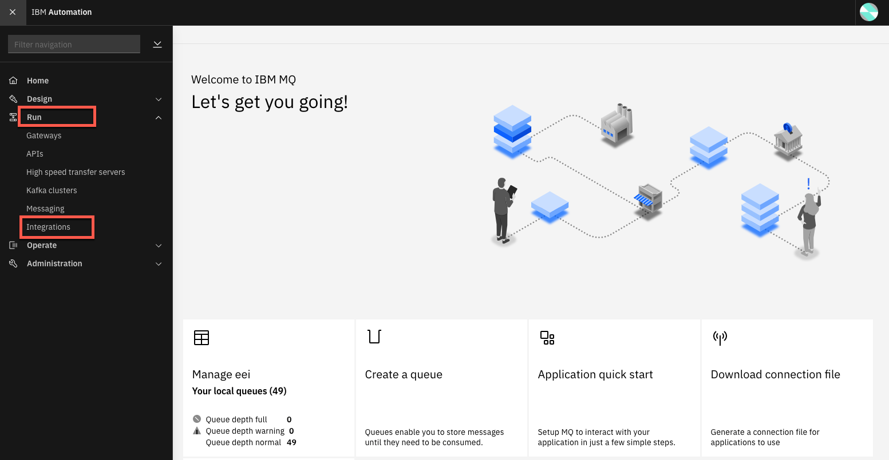

2.In the *App Connect Dashboard*, you can see the Integration Server deployed. To deploy the **orders.bar** file you saved and complied above click **Create a server**.

  

3.In the *Create an Integration Server* page, you have two optiond to deploy a BAR file: Deploy a BAR file from *App Connect Toolkit* or from *App Connect Designer*. In this lab you deploy BAR file from App Connect Toolkit. Select **Quick start toolkit integration** option and click **NEXT**.

  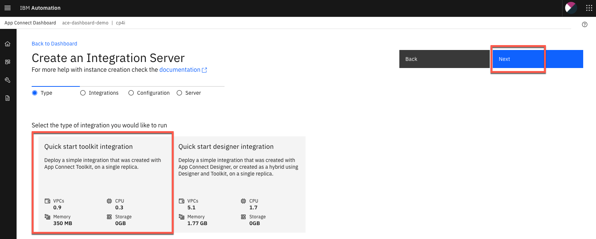

4.Click to upload your BAR File. And select the **orders.bar** (~/IBM/ACET11/workspace/ace-apic/BARfiles). And click **Next**.

  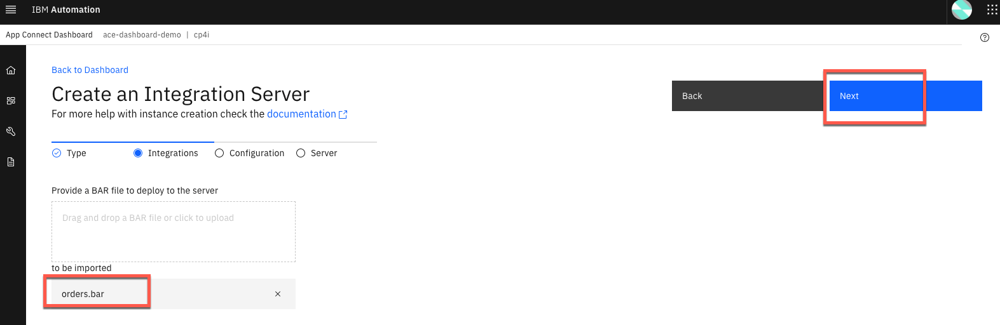

5.You don’t need to download configuration package (Configuration package contains the files that you can use for App Connect Enterprise works with Databases, Event Streams, etc) click **Next**.

  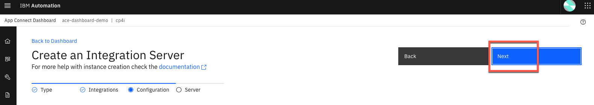

6.In Create an App Connect Integration Server page: enter the fIntegration Server name: **orders** (1). Switch to **On** to **Enable Operations Dashboard tracing** (2). Enter the namespace: **cp4i** (3). Then click **Create** (4).

  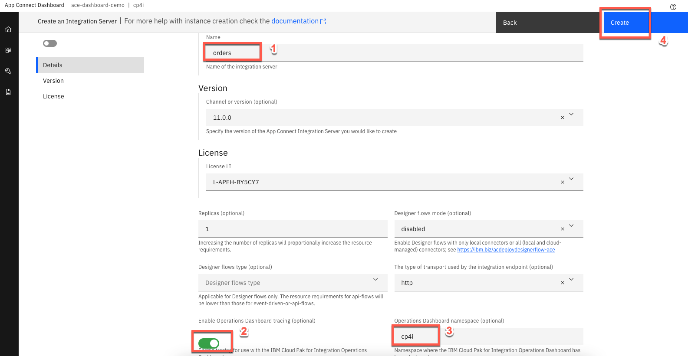

7.During the deployment process, App Connect Enterprise opens the servers page. You see the App Connect Enterprise Dashboard with the Integration Server orders deployed and started .Click the **orders server** icon.

  *Note: The deployment process takes 2-3 minutes, refresh the browser to see the BAR file.*

  

8.Click **orders API**.

  

9.This page displays the REST API Base URL. Copy the base URL (in the example below: http://orders-http-cp4i.playgrowth-integr-694940-8946bbc006b7c6eb0829d088919818bb-0000.us-east.containers.appdomain.cloud:80/orders/v1 ).

  

10.From the terminal window, execute the following curl command and complete with 0000. Enter:

```
  curl -G -k http://orders-http-cp4i.playgrowth-integr-694940-8946bbc006b7c6eb0829d088919818bb-0000.us-east.containers.appdomain.cloud:80/orders/v1/0000.
```

  If the API call is successful, you see JSON reply with {"accountid":"ABC-1234567890","orderid":"0000000"}

  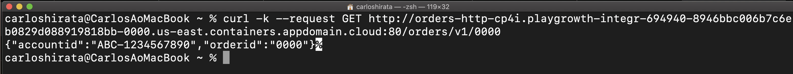

11.You check the message arrived in queue **ORDERS** in MQ You can check using MQ Console. Open a browser and go to **Cloud Pak Platform Navigator** and click **mq link**. Click **Manage QUICKSTART**.

  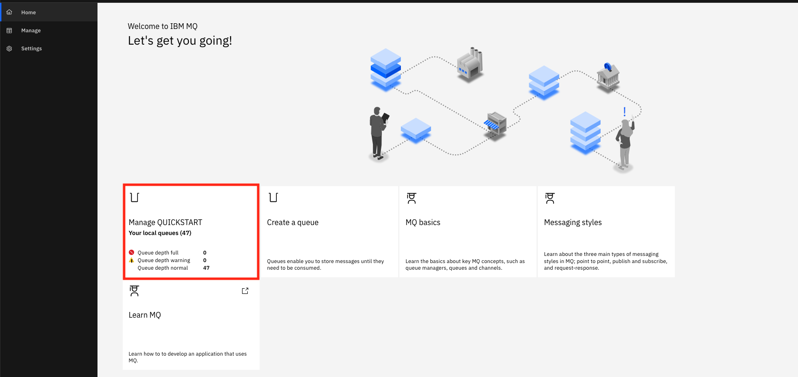

12.You see in the queues on QUICKSTART. The queue ORDERS has a message (look at Queue Depth)

  

***

## Configuring API Connect

### Task 4  – Configuring API Connect to test the integration

You've created an application integration flow and successfully called it via a REST API call! Now, to make it accessible to the rest of the world, it's important to add security around it—at least in the form of a client ID .This way, in addition to access control, you can get insights into which teams or customers are the least and most active. Adding security to an API is simply done via an OpenAPI configuration parameter. We can add rate limits to the API to increase the calls per second, minute, or hour to scale up as much as you need.

*Note: During some tests, we found some issues to execute this task on Chrome browser, because of security certification issues. We recommend to use Firefox during this task.*

1.Open the **orders API**. Then click **Download OpenAPI Document** link. The file is saved as **orders-1.0.0.yaml** file in **~/Downloads** directory.

  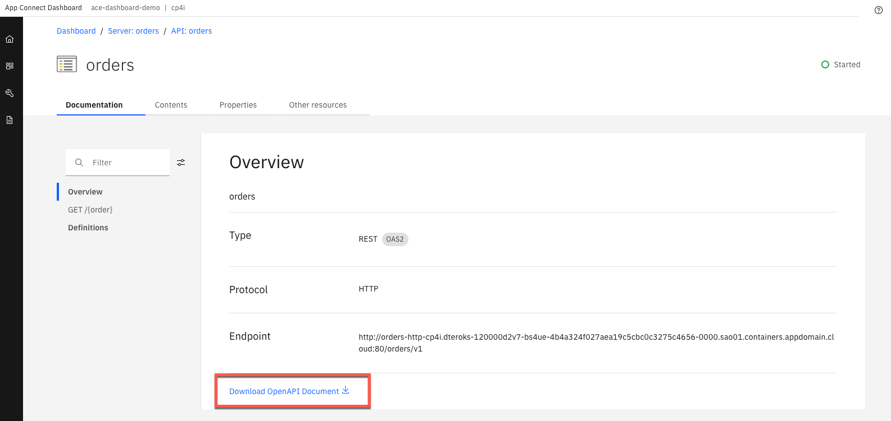

2.Now, you will do a manual edition of the Open API YAML file. Open your YAML file with any editor and manually add the attribute below at the end of your document:

```
x-ibm-configuration:
  gateway: datapower-api-gateway
```

  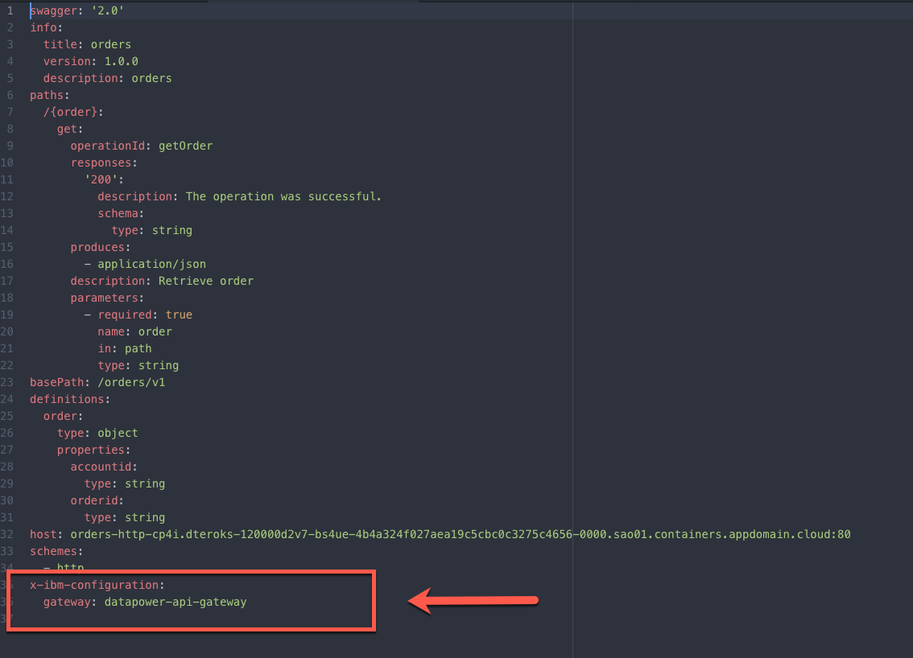


3.Open the **Menu** and on **Run** section, select **APIs**.

  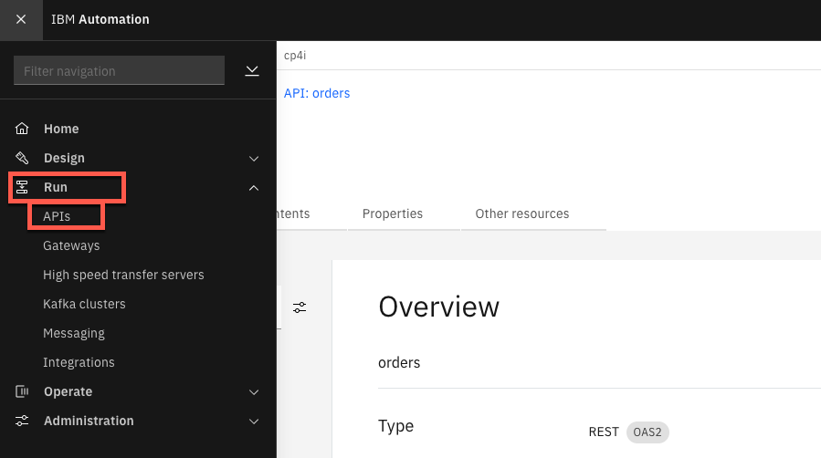

  *You might receive a Warning: Potential Security Risk Ahead. Click Advanced and then Accept the Risk and Continue.*

4.In the **API Connect** page, click **IBM Common Services user registry**.

  

5.Click **Develop APIs and Products**.

  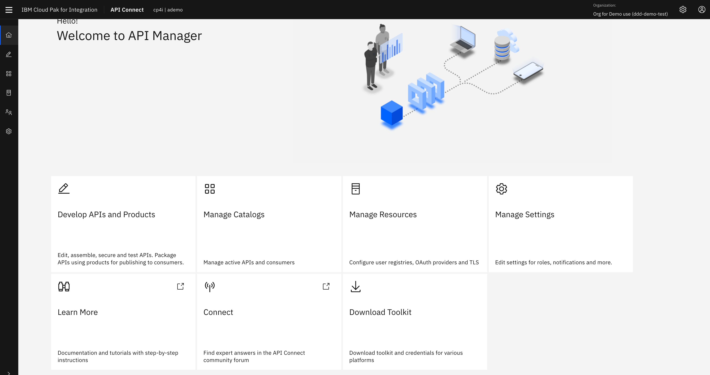

6.Click **Add**, then choose **API (from REST, GraphQL or SOAP)** from the drop-down menu.

  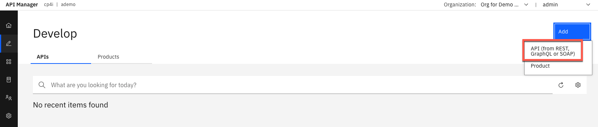

7.Choose **From an existing OpenAPI service**, scroll down and click **Next**.

  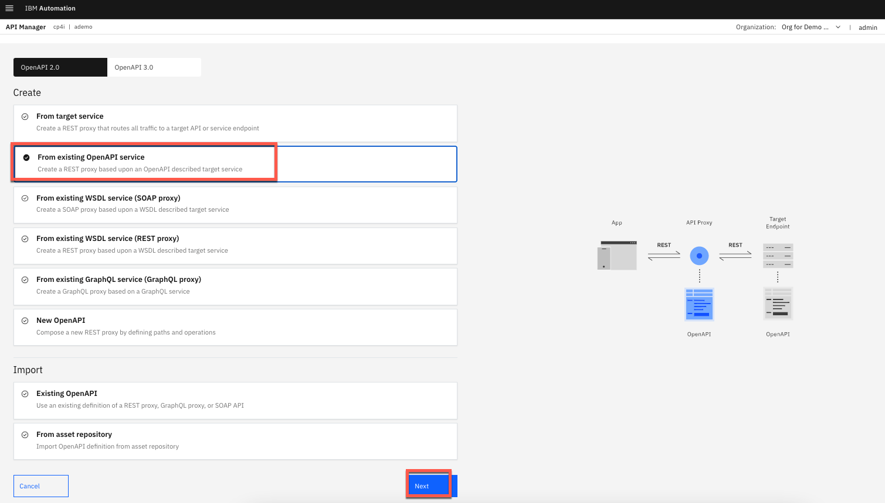

8.Click **Drag and drop files here or click to upload** and select **order-1.0.0.yaml** from **~/Downloads** directory. Then click **Next**.

  

9.Confirm the Info about API and click **Next**.

  

10.Keep the security settings and click **Next**.

  

11.Your API with Client ID is created! Click **Edit API**.

  

12.In the API Setup page. Let's put our API **Online** (1) and click **Save** (2).

  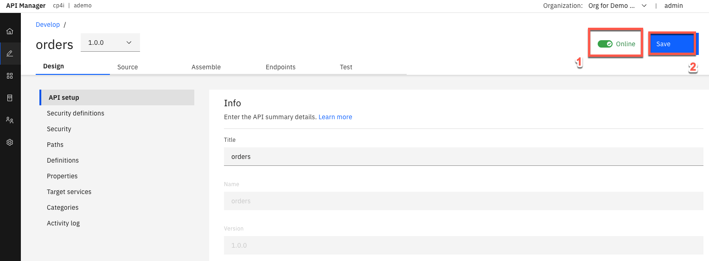

13.Let's test the API. Click the **Test** link and replace **{order}** for **0000** in **GET** command. Click **Send**.

  

14.Scroll down and see Body and check the results. You see a status code: **200** created with a response body containing the results details.

  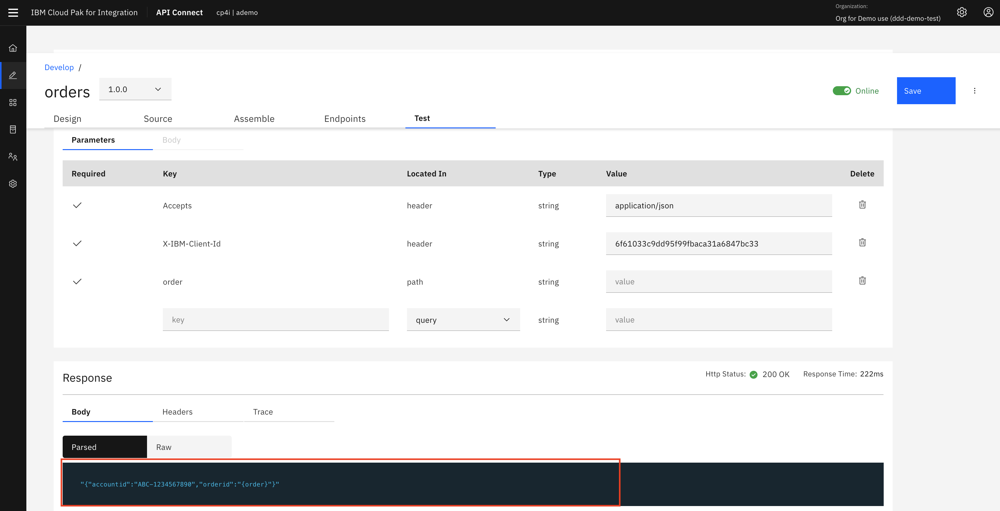

15.You need to get the Developer Portal, click **Manage** icon on the left navigator.

  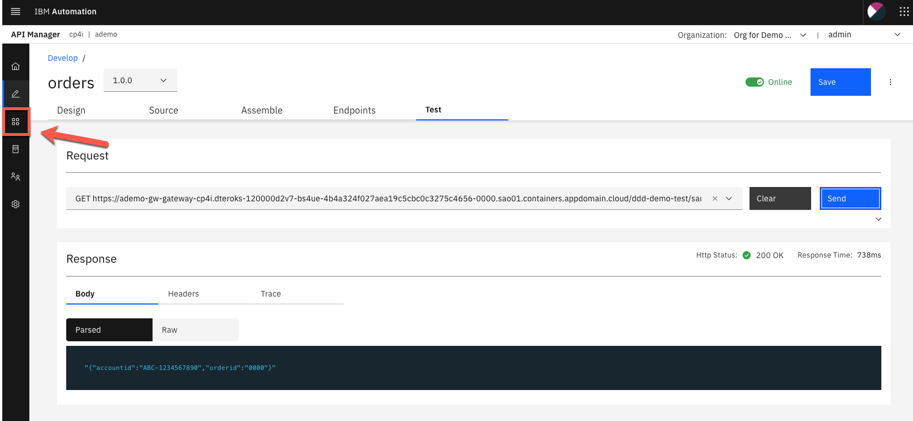

16.Click on **Sandbox**.

  

17.In Sandbox page, click **Catalog settings** and click **Portal**. Now, just copy the **Portal URL**:  https://ademo-ptl-portal-web-cp4i.playgrowth-integr-694940-8946bbc006b7c6eb0829d088919818bb-0000.us-east.containers.appdomain.cloud/ddd-demo-test/sandbox.

  *Note: You should have the Portal already configured (if not, go ahead and configure, it is really simple).*

  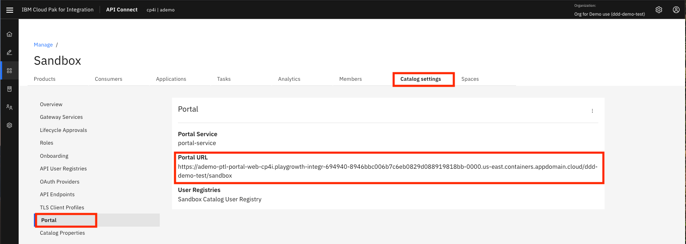

18.Open a new browser tab, and go to the Developer Portal server using the Portal URL. Click **Create account** to create a developer account.

  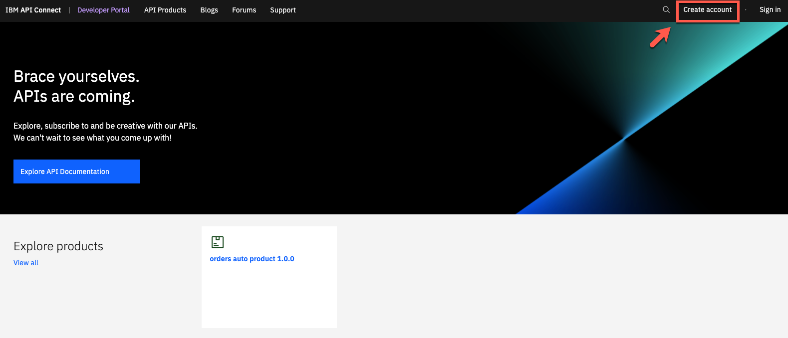

19.Go ahead and complete the Registration Form. Then activate the new account from the email link. When is ready, log in with the new developer user.

  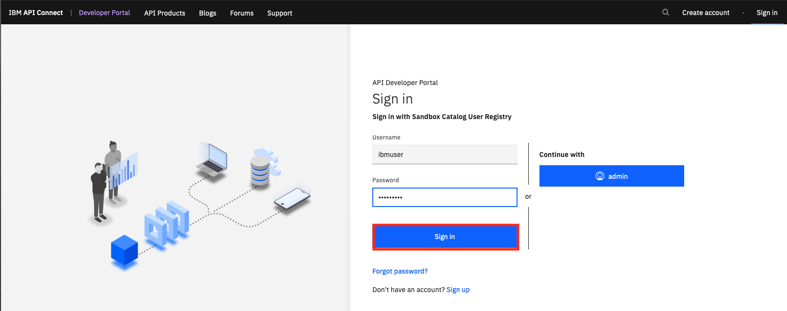

20.In the Developer Portal, on the *Explore products* section, click **orders auto product 1.0.0**.

  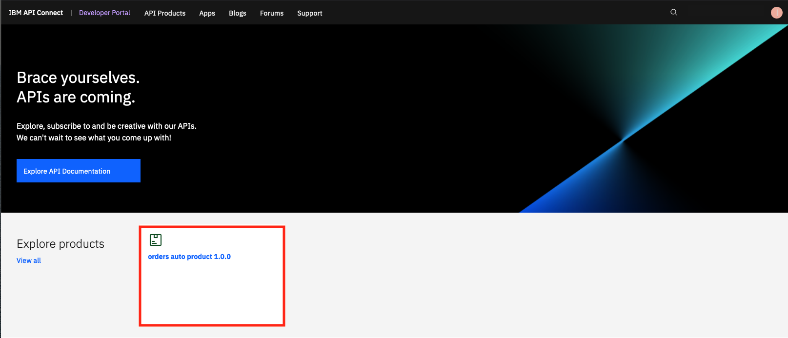

21.You need to subscribe to Default Plan, clicking **Subscribe**.

  

22.Create an Application, clicking **Create Application**.

  

23.Create an application called **myapp** and click **Save**. You will use this application to test the API.

  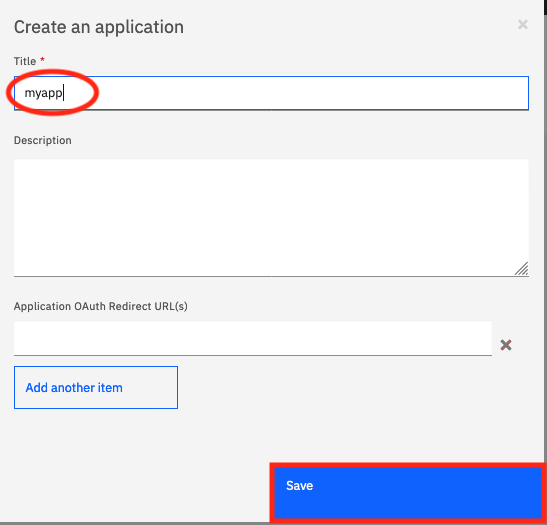

24.Here you can see the credentials for your new application (API Key and secret). You will not use this credential in this lab, just close the window.

  

25.Click **myapp** icon to select Application.

  

26.Confirm the subscription for **orders auto product**. Click **Next**.

  

27.The subscription is completed. Now click **Done**.

  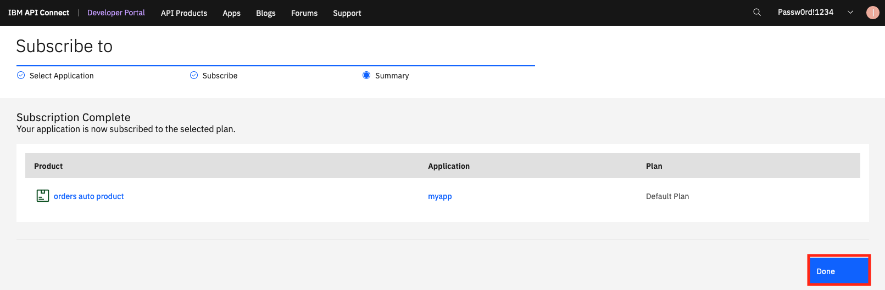

28.Click **orders 1.0.0**, to open the API.

  

29.In orders 1.0.0 page, select **GET/{order}** (1). Click on **Try it** (2). Enter **0000* as order parameter (3). Click **Send**.

  

30.The results are shown in the response string.

  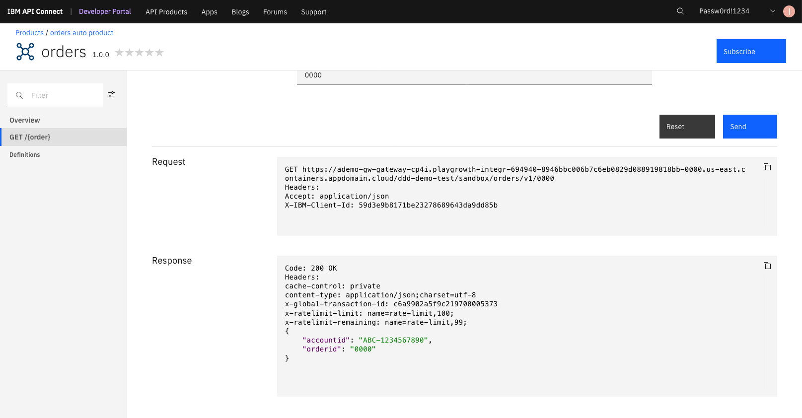

***

## Sharing the API

### Task 5 - Share the API

Now that you've built, secured, published, and tested your API, the last step is to add it to the Asset Repository. With the Asset Repository, your organization can store, manage, and share all of your integration assets in one central location. Sharing assets in this way increases collaboration between teams, avoids unnecessary duplication and boosts productivity.

1.To push our new API to **Asset Repository** you will use the API Manager. Back to the Cloud Pak for Integration Navigator Platform browser tab. Open the **Menu** and on **Run** section, select **APIs**.

  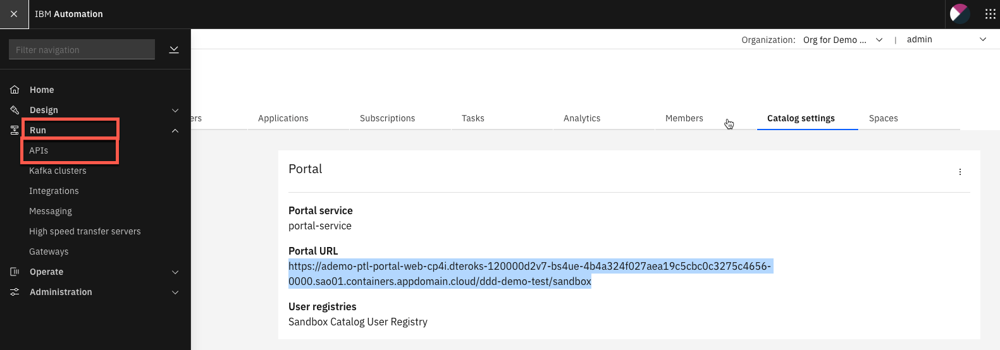

2.In the API Manager screen, click **Develop APIs and Products**.

  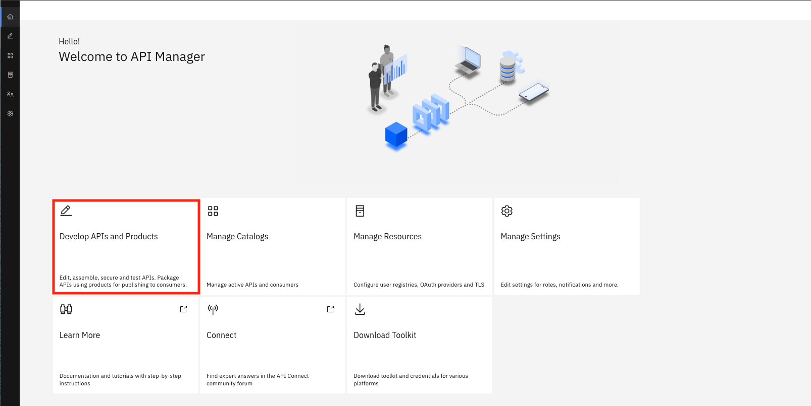

3.On the Develop Screen, select the menu next to your API and from the drop-down, click **Push to asset repository**.

  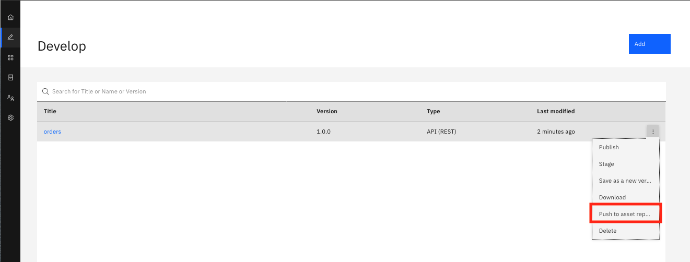

4.Once the upload completes, you see a success dialogue at top-right.

  

5.Now, let's explore the Asset Repository. Open the **Menu** again and select **Integration Capabilities**.

  

6.Click on the **Automation assets** capability link.

  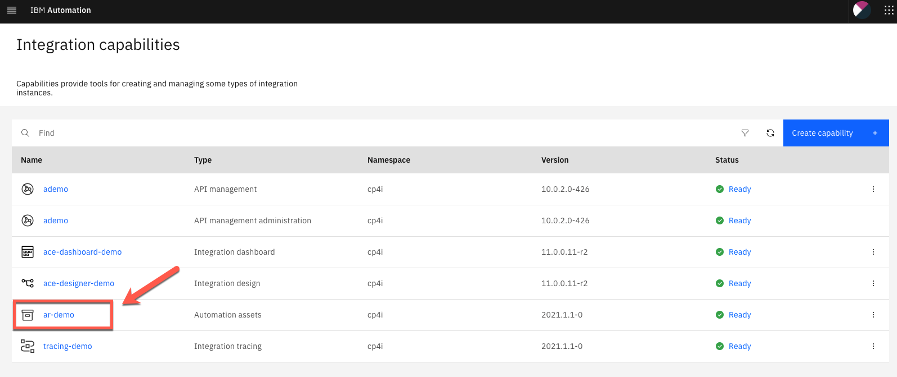

7.Here you see the orders asset that you pushed from API Connect in the previous step. Open the context menu and choose **Open** to check the orders API.

  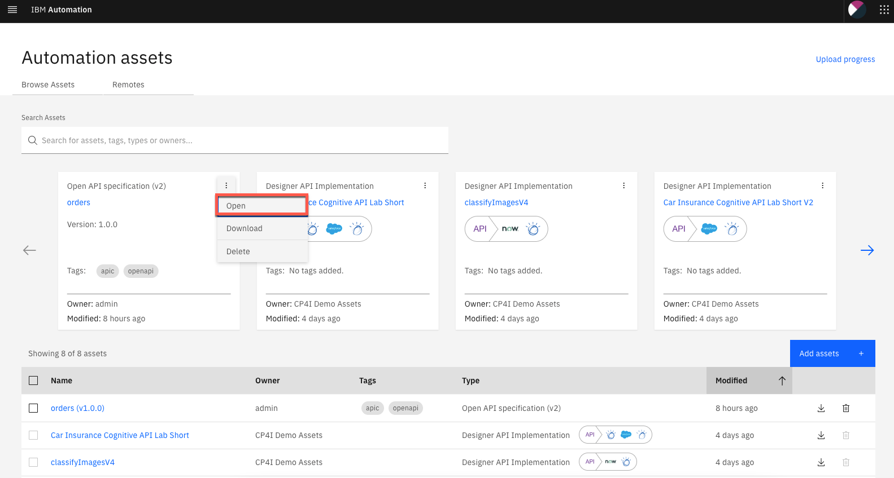

8.Here you can see the API overview.

  

9.Click **Get/{order}** link. Here you can see the API parameters.

  

10.Click Definitions and then click the **arrow** on **order**. Here you can see an example of results.

  

Great! Here you learned how developers can leverage the Automation Assets repository to implement a culture of reusability. Additional information about the asset is available in the sidebar including when the file was created, a description that explains the purpose and use, and any relevant tags

***

## Using Operations Dashboard

### Task 6 – Using Operations Dashboard (tracing)


Cloud Pak for Integration - Operations Dashboard Add-on is based on Jaeger open source project and the OpenTracing standard to monitor and troubleshoot microservices-based distributed systems. Operations Dashboard can distinguish call paths and latencies. DevOps personnel, developers, and performance engineers now have one tool to visualize throughput and latency across integration components that run on Cloud Pak for Integration. Cloud Pak for Integration - Operations Dashboard Add-on is designed to help organizations that need to meet and ensure maximum service availability and react quickly to any variations in their systems.

1.Let's explore the Operations Dashboard. Open again the **Menu**, and on the **Administration** section, open **Integration capabilities**.

  

2.From the Capabilities list, open *Integration tracing* link: **tracing-demo**.

  

3.In the Tracing page, check the **Overview page**. You see all products that you can use this tool: APIC ,APP Connect and MQ. (more tracing products will add in the future releases).

  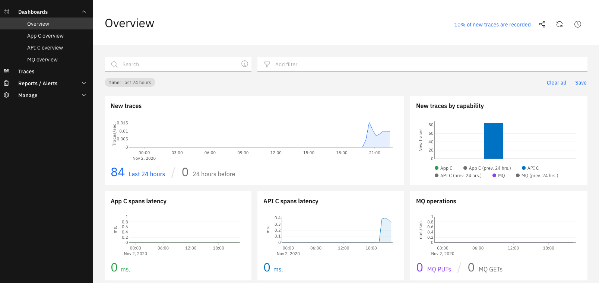

4.You can monitor each product separately. Click **App C overview**.

  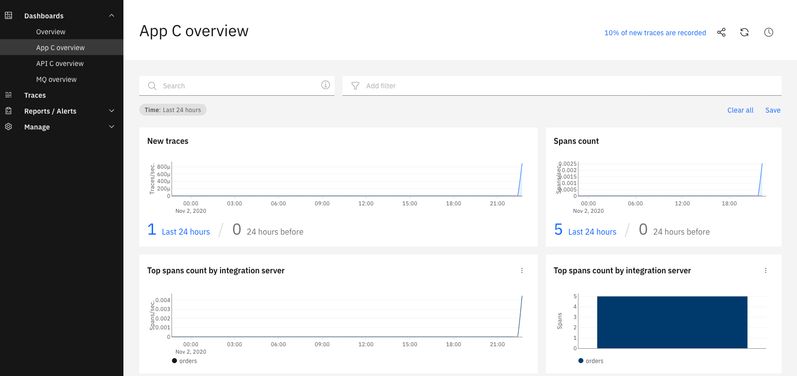

5.Now, let's explore the **API C overview**.

  

6.Operations Dashboard generated a list of tracing. Select **Traces** on the left menu. And select the line that you want to see the trace.

  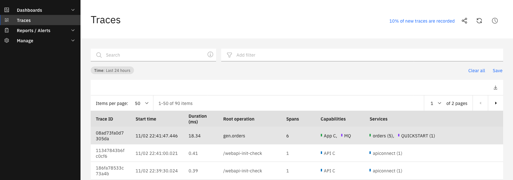

7.You are welcome to explore the tracing.

  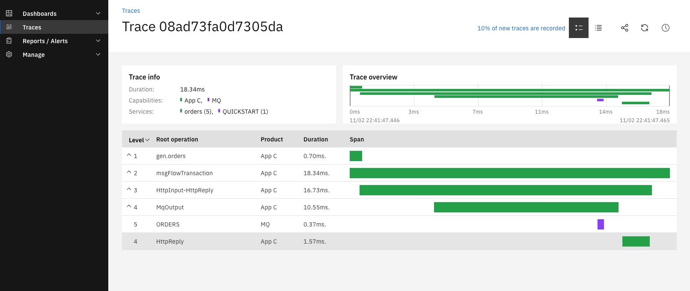

***

## Summary

You have successfully completed this lab. In this lab you learned how to:

 - Deploy a back-end integration to containers that are readily available as a scalable web service.
 - Secure access to the back-end integration by creating a secure, governed API using the OpenAPI definition of the integration.
 - Use Operations Dashboard to tracing  MQ, APIC and APPC

Now that you’ve made your back-end integrations ready for external distribution, your developer community is able to access the APIs via a developer portal. The developer portal is included in the platform and provides a full-featured experience to onboard and nurture your API consumers.  For more information about Cloud Pak for Integration, access [here](https://www.ibm.com/cloud/cloud-pak-for-integration).
