import ArticleDetails from '../../../../src/gatsby-theme-carbon/components/ArticleDetails'

<ArticleDetails name="Carlos Hirata, Ravi Katikala" lastUpdated="October 2020" readTimeMinutes="60" />

In this tutorial, you use the Cloud Pak for Integration 2020.3.1 to create an App Integration flow (IBM App Connect Enterprise) that sends messages to a queue (IBM MQ) on OpenShift 4.4 .

<AnchorLinks>
  <AnchorLink>Starting the Environment</AnchorLink>
  <AnchorLink>Event Streams Topic</AnchorLink>
  <AnchorLink>Configuring App Connect Enterprise</AnchorLink>
  <AnchorLink>Deploying App Connect Enterprise</AnchorLink>
  <AnchorLink>Testing App Connect Enterprise</AnchorLink>
  <AnchorLink>Operations Dashboard (tracing)</AnchorLink>
  <AnchorLink>Summary</AnchorLink>
</AnchorLinks>

## Introduction

Augment existing business functions with new applications using Kafka.

The most interesting and impactful new applications in an enterprise are those that provide interactive experiences by reacting to existing systems carrying out a business function. In this tutorial, we take a look at an example from the retail industry. Starting with an existing API orchestrating the business function to "place an order". Let's say that when a customer places an order, we want to provide a real-time response. We want to reward the customer with points in a customer loyalty app or gamification experience or sign them up for a certain email nurture program. To do that, we need each order to emit an event. The Cloud Pak for Integration combines integration capabilities with Kafka based event streaming to make the data available for cloud-native applications to subscribe to a Kafka topic and use it for various business purposes.

In this tutorial, you create a topic in Kafka, modify an integration flow to call an API, emit an event onto the topic, and use the tracing tool to verify the message from App Connect Enterprise to Event Streams.
The Cloud Pak for Integration - Operations Dashboard Add-on provides cross-component monitoring and tracing capabilities that enable IT personnel to quickly analyze performance bottlenecks and latency problems across integration components to help ensure high levels of service.

## Takeaways

- Starting IBM Cloud Pak for Integration Environment
- Creating and Configuring an Event Streams Topic
- Configure App Connect Enterprise message flow using App Connect Enterprise toolkit
- Configuring App Connect Enterprise service
- Deploying App Connect BAR file on App Connect Enterprise Server
- Testing App Connect Enterprise API sending a message to Event Streams
- Checking this message using Operations Dashboard (tracing).


## Starting the Environment

### Task 1 - Start IBM Cloud Pak for Integration Environment

This is a new deployment of the Cloud Pak for Integration, you must execute some steps to prepare the environment. Initial setup steps are only needed for a fresh installation of the platform.
All work for this lab is done in your workstation (MAC OSX).

1.In your workstation open a browser and enter http://cloud.ibm.com and enter your **ibmid** and click continue and password to login IBM Cloud.

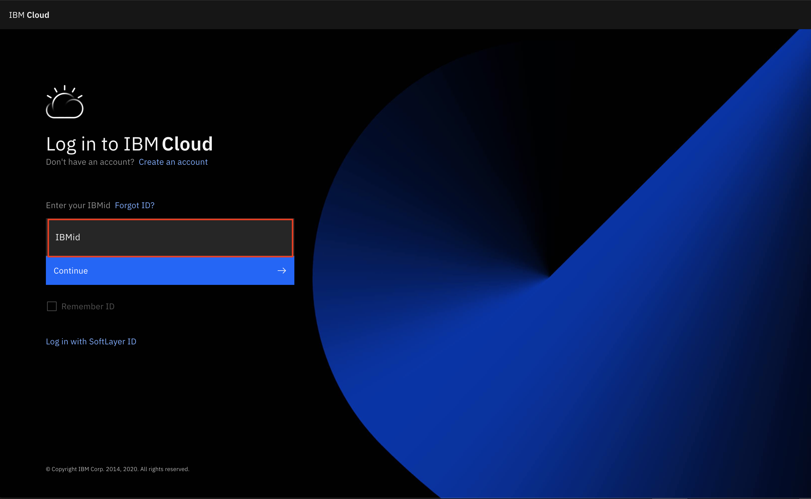

2.Enter your IBM userid and the password and then enter the verify code.


3.In the IBM Cloud Dashboard. You see all information about the infrastructure. On the **Resource summary**. Observe if you have one cluster and click **Cluster** link .

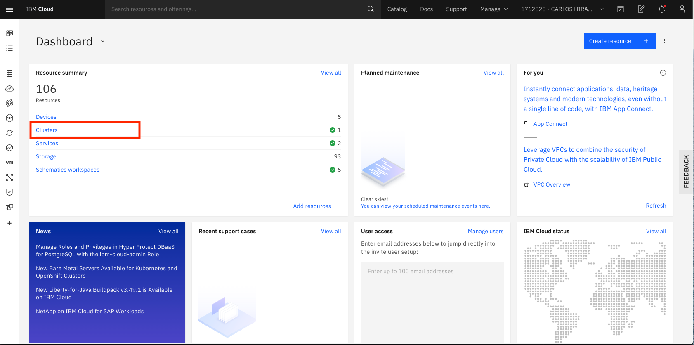

4.You see the available resources for your cluster. Select Clusters arrow and click your cluster line.

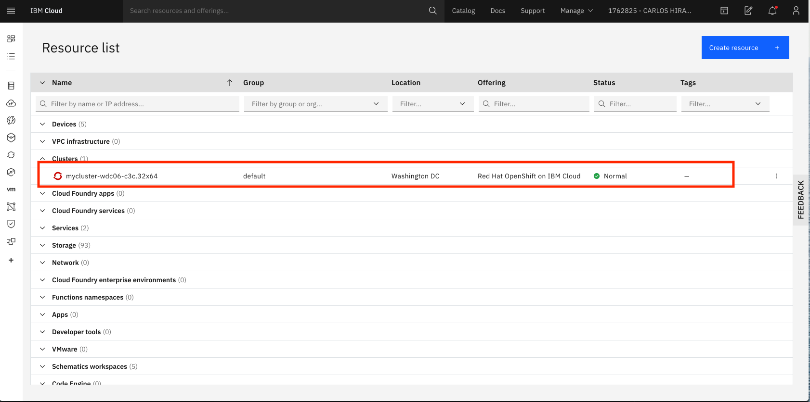

5.In the cluster page, you see the status of your cluster infrastructure,. such as worker node, CPU and Memory usage. Click **OpenShift Web Console**.

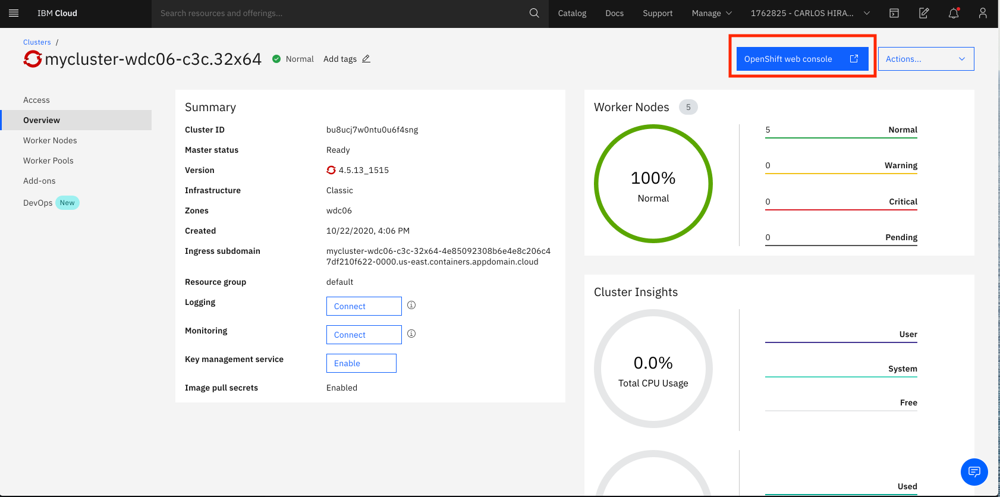

6.In the OpenShift console. Select the following:

```
1.Networking
2.Routes
3.Drill down the Project to Integration

```

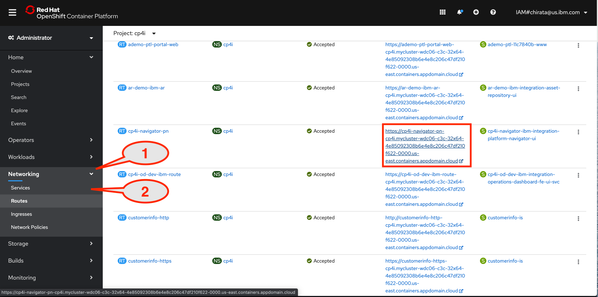

7.You might need to login screen for IBM Cloud Pak might be displayed. Click **Default authentication**.

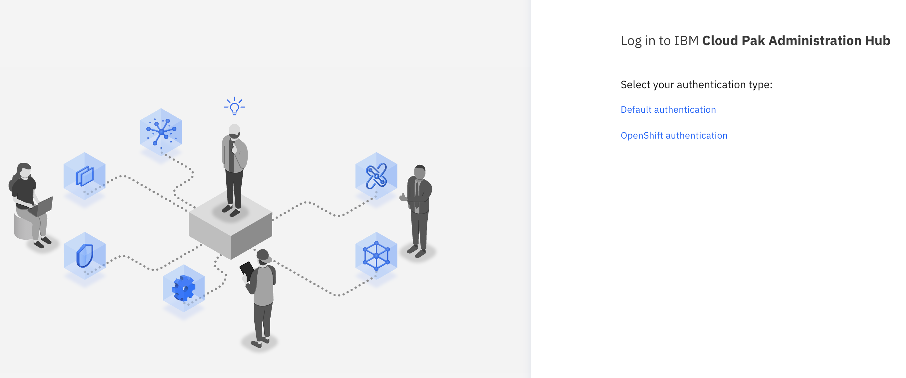

8.Enter the username: **admin** and Password (**Enter the 32 characters password that you created when you made the Cloud Pak provisioning**) and Click **Log in**.

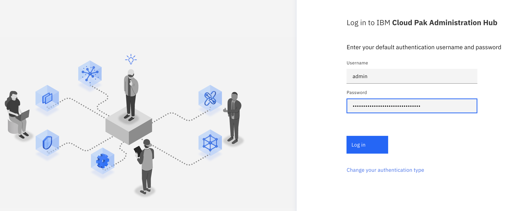

9.In the Welcome to IBM Cloud Pak for Integration. You see Capabilities and Runtime installed for your labs.


## Event Streams Topic

### Task 2 – Creating and Configuring an Event Streams Topic

Creating an Event Streams topic in the existing Event Streams instance.

1.Before you start the lab. Download **eslab.zip** from **Github**, open a browser and enter: https://github.com/ibm-cloudintegration/dte-labs/tree/master/Lab3-RespondtoEvents . Click **eslab.zip** .


2.Click **Download**. The file **eslab.zip** is in your  **~/Download** directory.


3.Execute **unzip eslab.zip** will create the work directory **~/eslab** with 3 files: **ace-es.zip** (App Connect Enterprise project), **setdbparms.txt** (App Connect configuration file) and **bootstrap.address** (you can use this file to store Event Streams Bootstrap Address).


4.In **Runtimes** click **event-streams** link (in the kafka cluster instance type).


5.In the Welcome to IBM Event Streams page. Click **System is healthy**  and check the status of the instance.


6.Verify if all Event Streams components are running and ready.


7.Click **Create a topic** to configure topic.


8.View the full range of configuration options by setting the Show all available options to on. Create the topic as follows:

```
1.In Show all available options, change to On.
2.Topic name: customerinfo.
3.Click Create topic.

```


9.The topic is created, click to **connect to this cluster**. By default Event Streams requires clients to be authorized to write to topics. The available authentication mechanisms for use with the REST Producer are MutualTLS (tls) and SCRAM SHA 512 (scram-sha-512). For more information about these authentication mechanisms (https://en.wikipedia.org/wiki/Salted_Challenge_Response_Authentication_Mechanism).


10.To connect an application or tool to this cluster, you need the address of a Kafka listener, a credential to authenticate with, and a certificate depending on the listener.
For this lab, use an External listener. App Connect needs securities parameters to access Event Streams, the truststore password, certificate and SCRAM user ID and password.
Save the bootstrap server **External (1)**, clicking the **copy icon**. You can use **bootstrap.address** file.
For this lab you use external listener to verify how to access Event Streams as external application.


11.Click **Generate SCRAM credentials** .


12.The Generate credentials for your application window you create credential name and how your application works with Event Streams. Credential name, it is your kafkauser. You can see this in the OpenShift console.

```
1.	Enter the credential name: customerinfoapp.
2.	Check Produce and consume messages, and read schemas.
3.	Click Next.

```


13.In the window, Which topics does the application need to access?, you can specify which the topics, the application accesses.

```
1.	Check All topics.
2.	Click Next.

```


14.In the window, **Which consumer group does the application need to access?**, a consumer group is a group of consumers cooperating to consume messages from one or more topics. The consumers in a group all use the same value for the group ID configuration.

```
1.	Check All consumer groups.
2.	Click Next.

```


15.In the window, **Choose which transactional IDs the application can access?**, you can control the ability to use the transaction capability in Kafka.

```
1.Keep No transactional IDs checked.
2.Click Generate credentials.

```


16.Back to **Cluster connection** window. Verify the bootstrap server as an external listener, the username and password in **Generated Scram Credentials**. Scroll to **Certificates** and click **Download certificate**. Save **es-cert.p12** and click **OK**. This file is in **~/Downloads**.


17.Back to **Cluster Connection**. Verify the Certificate password (it might be different for you).


**Keep this window open**.

18.Open a terminal window, go to directory you created **~/eslab**. Open setdbparms.txt file and replace the parameters:

```

1.Enter over <securityIdentity> customerinfoapp from the Cluster Connection window, click copy icon from SCRAM username and paste over <SCRAM USER>.
2.From the Cluster Connection window, click copy icon from SCRAM password and paste over <SCRAM PASSWORD>.
3.From the Cluster Connection window, click copy icon from PKCS12 certificate and paste over <TRUSTSTORE PASSWORD>.
4.Enter a name customer in <anyname> and click Save.

```


## Configuring App Connect Enterprise

### Task 3 - Configuring App Connect Enterprise flow using App Connect Enterprise Toolkit


Before you start the lab, make sure that you have installed **IBM App Connect Enterprise toolkit**. Go to  this link https://www-01.ibm.com/marketing/iwm/mrs/DirectDownload?source=swg-wmbfd&lang=en_US and make the installation.

You have created a topic in Event Streams created. App Connect Enterprise produces a message and send it to the Event Streams topic. In this task, you configure an App Connect Enterprise message flow and generate a BAR file to deploy in the App Connect Enterprise Dashboard.

1.Start IBM App Connect Enterprise. Create the App Connect Enterprise workspace directory as **ace-es** folder (**~/IBM/ACET11/workspace/ace-es**). Click **OK** to open App Connect Enterprise toolkit.


2.Import a new workspace. In the **Application Development** window, right mouse button and click **Import**.


3.Select in IBM Integration folder, **Project Interchange**. Click **Next**.


4.Locate in es-lab folder ace-es.zip file and click **Browse** and select **ace-es.zip** file to import.


5.Verify that you imported the correct zip file to correct project. Click **Finish**.


6.Before working on the message flow, create a policy. Click **New ->Start by creating a Policy project**. Policies can control particular node properties, such as connection credentials, and certain aspects of message flow behavior, including flow rate. Policies provide a shared and managed definition that you can reuse.


7.In the **Create a Policy project**, enter the policy name **customerpolicy** (this is the policy associated in Kafka Producer) and click **Finish**.


8.You created a policy project. Click **customerpolicy->(New..)**.


9.In the pop-up window. Click **Policy** link.


10.Enter **customer** as policy name and click **Finish** .


11.In the Policy enter or replace the policy configuration.

```

1.Change Type to Kafka.
2.Automatically Template changes to Kafka.
3.Enter the Bootstrap servers: es-demo-kafka-bootstrap-cp4i.mycluster-wdc06-c3c-32x64-4e85092308b6e4e8c206c47df210f622-0000.us-east.containers.appdomain.cloud:443 (You can copy from bootstrap.address file).
4.Select SASL_SSL as Security Protocol.
5.Enter SCRAM-SHA-512 as SASL Mechanism.
6.Enter customerinfoapp as Security Identity (DSN).
7.Set the SASL config property to org.apache.kafka.common.security.scram.ScramLoginModule required; (Important consider “ required;“ both are part of the value). This value specifies the SASL configuration to be used when connecting to the Kafka cluster.
8.Delete default JKS as SSL keystore type.
9.Enter /home/aceuser/truststores/es-cert.p12 as the SSL truststore location.
10.In SSL truststore type, replace default JKS to PKCS12.
11.Set truststorePass in SSL truststore security identity.
12.Save the policy with CTRL+S.

**Keep the rest as default**

```


12.In Application Developer on the left bar, select **customerinfo -> Resources -> Subflows**.

```
1.Click getid.subflow. Some errors might appear , you fix this after you complete and save message flow.
2.Select customerinfo node (Kafka Producer node)
3.Click Properties.
4.Select Basic properties
5.Enter topic name: customerinfo (the topic name that you created in Event Streams).
6.Paste the Bootstrap servers address: es-demo-kafka-bootstrap-cp4i.mycluster-wdc06-c3c-32x64-4e85092308b6e4e8c206c47df210f622-0000.us-east.containers.appdomain.cloud:443(the address is found in Event Streams, in Connect to this cluster->Cluster connection or you can edit ~/eslab/bootstrap.address file))

```


13.In the Security Tab, set the **Security Protocol** to **SASL SSL** and **SSL protocol** to **TLSv1.2**.


14.In **Properties**, select **Policy** and click **Browse** to assign a policy to the Kafka Node.


15.Select the policy that you created and saved **{customerpolicy}:customer**.


16.Save the message flow, click the Save button.


17.You need to deploy the **customerinfo** application in App Connect Enterprise server. Select the **customerinfo application**. Click **File-> New-> BAR** file.


18.Enter the suggested BAR file name: **customerinfo** and click **Finish** .


19.Check **customerinfo** application box on the REST API tree. If necessary scroll right to check **Compile and in-line resource** and click **Build and Save**.


20.A pop-up window displays the message “Operation completed successfully.” Click **Ok** to confirm and close the App Connect Enterprise.

21.Check **Policies** and **customerpolicy**. Click **Build and Save** and **OK** on Override Configurable Properties.


22.You have a **BAR** file and **policy** document created in App Connect Enterprise workspace. Find **IBM ->ACET11->workspace->ace-es**. You see folders, locate **customerpolicy** folder and Compress (zip).


## Deploying App Connect Enterprise

### Task 4 – Deploying App Connect BAR file on App Connect Enterprise Server

The App Connect Enterprise toolkit generated a BAR file. The BAR file has all information to run an App Connect Enterprise instance.
This release introduces a new Operator-based approach for packaging, deploying, and managing App Connect in a containerized environment. The IBM App Connect Enterprise certified container is now deployed to a Red Hat OpenShift cluster by using the new IBM App Connect Operator. This Operator is distributed through the IBM Entitled Registry, and can be installed from the Red Hat OpenShift OperatorHub. We’ve updated the look of our user interfaces to help improve the way you work.

1.Open a browser and click **IBM Cloud Pak for Integration&& toolbar. Click **Capabilities** and select the **App Connect Dashboard** link.

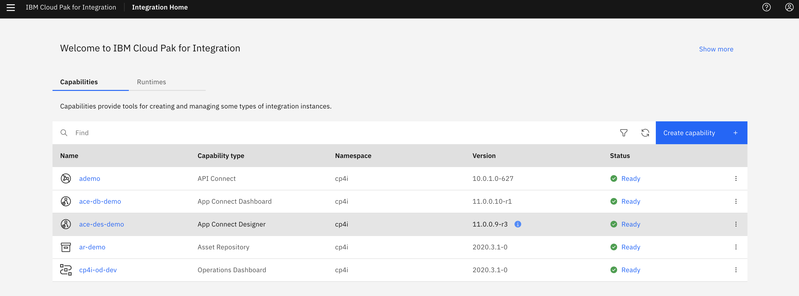

2.If you might receive the login page, click **Log in**. (the username and password are saved).
3.On the left menu, select **Configuration** icon.


4.Click **Create configuration**.


5.Click the arrow and select **Policy Project**. In the **Import compressed policy project**, move the mouse and click **Drag and drop a file or click to upload**.


6.Open **~/IBM/ACET11/workspace/ace-es** and select **customerpolicy.zip** and click **Open**. To upload to App Connect Dashboard and click **Create**.


7.Check if the **customerpolicy.zip** is uploaded and Click **Create**.


8.Upload the **sertdbparms.txt**. Click **Create configuration**.


9.Click on the Import **setdbparams.txt** icon.


10.Click on the Import s**etdbparams.txt** icon and click **Drag and drop a setdbparms.txt file or click to upload**.


11.In the **file upload**, open **~/eslab**, select **setdbparms.txt** and click **Open**.


12.Verify the setdbparms is loaded and click **Create**.


13.The same process, upload the **truststore** certificate. Click **Create configuration**.


14.Select **Truststore** and click **Drag and drop a truststore file to upload**.


15.In **File Upload**, go to **~/Downloads**, select **es-cert.p12** file and click **Open**.

16.Click **Create** to upload the file to App Connect Dashboard.


17.You have uploaded three configuration files. Now, you upload and configure the BAR file in App Connect Dashboard. Click the **Home** icon on the left.


18.In the **Welcome to IBM App Connect** page. Click **Create a server**.


19.In this version, you two ways to create a BAR file: using App Connect Toolkit or App Connect Designer (App Connect Designer provides an authoring environment in which you can create, test, and share flows for an API. You can share your flows by using the export and import functions, or by adding them to an Asset Repository for reuse). Select **Toolkit integration** and click **Next**.


20.Upload the BAR file, clicking **Drag and drop a BAR file or click to upload**.

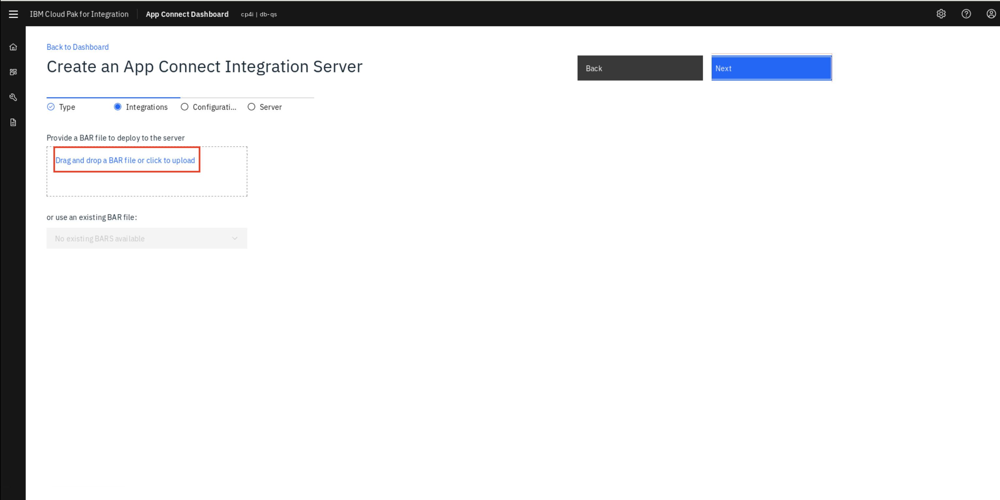

21.In File Upload, go to **~/IBM/ACET11/workspaces/ace-es/BARfiles**, select **customerinfo.bar**, click **Open**, and click **Next**.

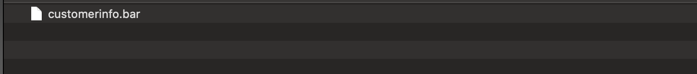

22.You have uploaded the configuration files, check all three files (**customerpolicy.zip, setdbparms.txt and es-cert.p12**) and click **Next**.


23.Configure the Integration Server.

```
1.Enter the server name: customerinfo .
2.Switch to On Enable Operations Dashboard
3.Enter cp4i as Operations Dashboard namespace.

```


## Testing App Connect Enterprise

### Task 5  – Testing App Connect Enterprise API sending a message to Event Streams

You verify if the message you created in App Connect Dashboard (Integration server) arrived in Event Streams topics.

1.App Connect Dashboard will create **customerinfo server**. After 5 minutes, refresh the Browser and see the server is **Started**. Click **customerinfo icon**.


2.Click the **customerinfo API** icon.


3.On the Documentation tab, the overview section displays the type of API and the base URL for the API endpoint. A **Download Open API Document** link is also provided for the **OpenAPI** document that describes the API. If downloaded, the document is saved as a YAML file to the default download location that is configured for your browser. Copy the Endpoint.


4.Open a terminal window, enter the **CURL** command: “ curl --request GET --url http://customerinfo-http-cp4i.mycluster-wdc06-c3c-32x64-4e85092308b6e4e8c206c47df210f622-0000.useast.containers.appdomain.cloud:80/customerinfo/v1/00000 “. Paste the Endpoint and complete after v1/**00000**. Check the results.


5.A message was sent from App Connect (Integration Server) to IBM Event Streams. Go to **IBM Cloud Pak for Integration**.  Select **Runtimes** and click **Event Streams** application.


6.In Welcome to IBM Event Streams page, Click Topics on the left, to open the topics list of this Event Streams instance.


7.In the Topics page, click the topic **customerinfo** to open the topic page.


8.Click **Messages** to check if the message from App Connect Enterprise has arrived. You see the list of messages that are stored on the Event Streams topic. Take time to look at the monitor to explore the information.


9.Click the message and Verify the message on the customerinfo topic. Verify the Customerid:**0000**.


10.Click **Monitor** icon on the left to look at Event Streams monitor.


11.You can analyzing the incoming and outcoming messages, per period (hour, day, week, and month).


## Operations Dashboard (tracing)

### Task 6 - Using Operations Dashboard (tracing)

The Operations Dashboard collects data from all the registered capabilities (such as MQ) in real time. By default, and for this lab, 10 percent of traffic is sampled.

IBM Cloud Pak for Integration Operations Dashboard has adopted OpenTracing API specification for collecting tracing data. OpenTracing is comprised of an API specification for distributed tracing, frameworks and libraries that have implemented the specification and documentation.

o	Trace: The description of a transaction as it moves through IBM Cloud Pak for Integration platform.
o	Span: A named, timed operation representing a piece of the workflow (e.g. calling an API, invoking a message flow or placing a message in a queue or a topic).
o	Span context: Trace information that accompanies the distributed transaction, including when it passes the service to service over the network or through a message bus.

1.Go to the **IBM Cloud Pak for Integration**. Click the **tracing** application  to open the Operations Dashboard instance.

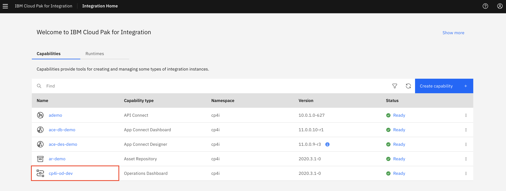

2.In the Tracing page, check the Overview page. You see all the products that you can use this tool: **APIC (including DataPower), APP Connect and MQ**. You see all the tracing of MQ, App Connect and APIC (You see how to configure tracing in APIC lab). Operations Dashboard Add-on is based on Jaeger open source project and the OpenTracing standard to monitor and troubleshoot microservices-based distributed systems. Operations Dashboard can distinguish call paths and latencies. DevOps personnel, developers, and performance engineers now have one tool to visualize throughput and latency across integration components that run on Cloud Pak for Integration. Cloud Pak for Integration - Operations Dashboard Add-on is designed to help organizations that need to meet and ensure maximum service availability and react quickly to any variations in their systems.


3.You can monitor each product separately. Click **App C overview**.


4.In the tracing page, select **traces** the menu on the left.


5.	You see the list of tracing, select the **customerinfo** line to analyze the trace of the application **customerinfo**.


## Summary


You have successfully completed this lab. In this lab you learned how to:

•	Create a topic in Kafka.
•	Create an integration between an API service and Kafka
•	Deploy the new integration as containers in Kubernetes.
•	Use Operations Dashboard tool

Now that you’ve created a topic in Kafka (Event Streams), applications are able to subscribe and received data. To try out more labs, go to Cloud Pak for Integration Demos. For more information about the Cloud Pak for Integration, go to https://www.ibm.com/cloud/cloud-pak-for-integration.
