import ArticleDetails from '../../../../src/gatsby-theme-carbon/components/ArticleDetails'


<FeatureCard
  title="Augment existing business functions with new applications using Kafka"
  color="dark"
  >


</FeatureCard>

<AnchorLinks>
  <AnchorLink>Lab Overview</AnchorLink>
  <AnchorLink>Prerequisites</AnchorLink>
  <AnchorLink>Creating a Development Event Streams Instances</AnchorLink>
  <AnchorLink>Event Streams Topic</AnchorLink>
  <AnchorLink>Configuring App Connect Enterprise</AnchorLink>
  <AnchorLink>Deploying App Connect Enterprise</AnchorLink>
  <AnchorLink>Operations Dashboard</AnchorLink>
  <AnchorLink>Summary</AnchorLink>
</AnchorLinks>

***

<ArticleDetails name="Carlos Hirata, Ravi Katikala" lastUpdated="April 2021" readTimeMinutes="60" />

***

## Lab Overview

In this tutorial, you use the Cloud Pak for Integration 2021.1.1 to create a topic in Kafka, modify an integration flow to call an API, emit an event onto the topic, and use the tracing tool to verify the message from App Connect Enterprise to Event Streams.

The most interesting and impactful new applications in an enterprise are those that provide interactive experiences by reacting to existing systems carrying out a business function. In this tutorial, we take a look at an example from the retail industry. Starting with an existing API orchestrating the business function to "place an order". Let's say that when a customer places an order, we want to provide a real-time response. We want to reward the customer with points in a customer loyalty app or gamification experience or sign them up for a certain email nurture program. To do that, we need each order to emit an event. The Cloud Pak for Integration combines integration capabilities with Kafka based event streaming to make the data available for cloud-native applications to subscribe to a Kafka topic and use it for various business purposes.

### Takeaways

- Creating and Configuring an EventStreams Topic
- Configure App Connect Enterprise message flow using App Connect Enterprise toolkit
- Configuring App Connect Enterprise service
- Deploying App Connect BAR file on App Connect Enterprise Server
- Testing App Connect Enterprise API sending a message to EventStreams
- Checking this message using Operations Dashboard (tracing).

***

## Prerequisites

  - You need to have your personal CP4I on ROKS environment. [Check here how to request it](https://ibm-garage-tsa.github.io/cp4i-demohub/cp4i-on-roks/)
  - You need to have the OC CLI and you should have logged in your ROKS cluster via command line. [Check here how to do it](https://ibm-garage-tsa.github.io/cp4i-demohub/cp4i-on-roks/#access-your-roks-cluster-by-command-line)
  - You need to have the IBM App Connect Enterprise Toolkit installed in your desktop. Follow the sections **Download IBM App Connect Enterprise for Developers** and **Install IBM App Connect Enterprise** from [this tutorial](https://www.ibm.com/docs/en/app-connect/11.0.0?topic=started-get-hands-experience) to install it.

***

## Creating a Development EventStreams Instances

With the OneClick install you should have an EventStreams instance ready for a basic demo. However for this tutorial, we need at least an instace with basic security feature. Because of that, in this section you will create a Development Event Stream instace. Let's do it!

1.On a browser tab, open your ROKS cluster console (you should have an email with a link to OpenShift Console, you received this e-mail when you requested the ROKS environment).


2.On the left menu, open **Operators > Installed Operators**.

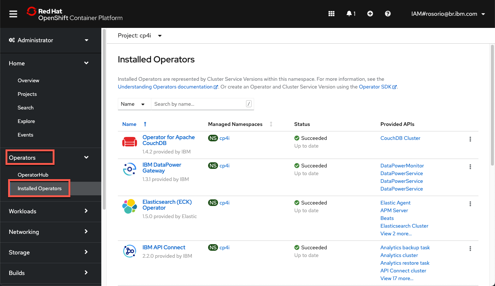

3.Scroll down and click on **IBM EventStreams** operator (if necessary you can use the project combobox to filter to *cp4i* project).

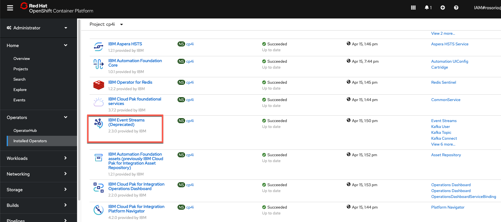

4.Open the **Event Streams** tab to see the instances.

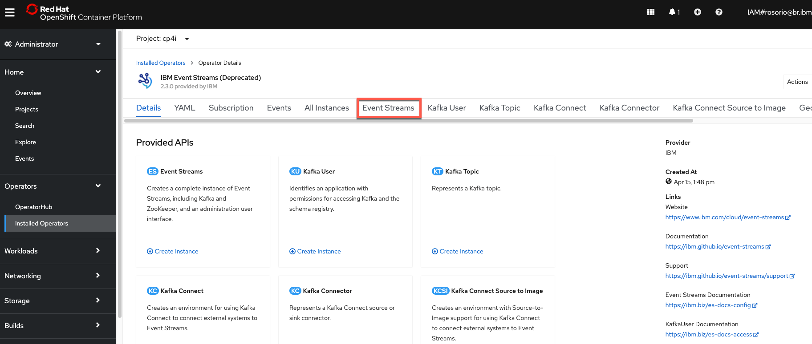

5.Click **Create EventStreams** button to create a new runtime.

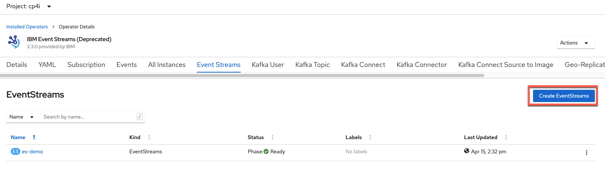

6.Select to configure the new instance using the **YAML View**.

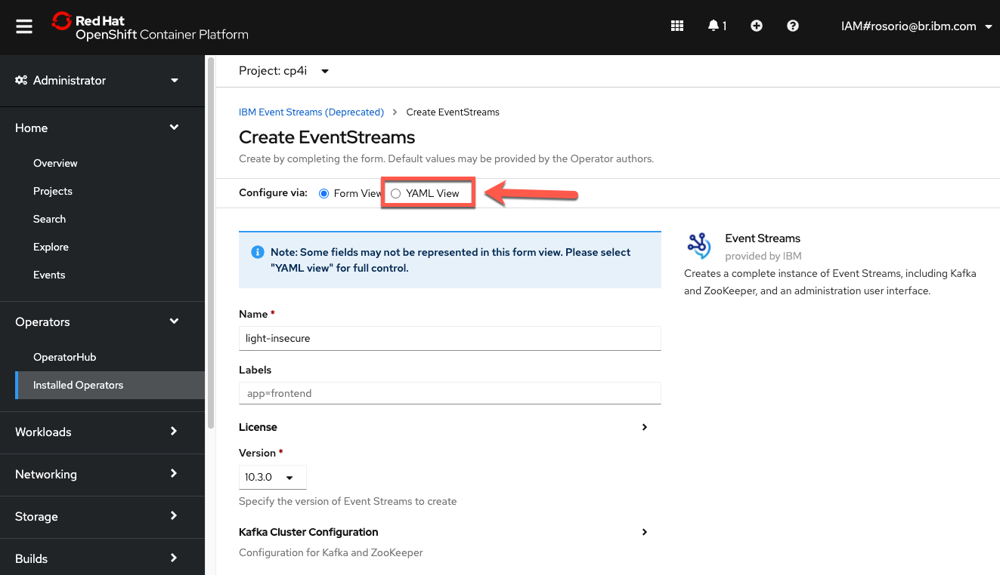

7.On the right side, there are some YAML file samples, that we can use to simplify our instance create. Open the **Samples** tab to explore them.

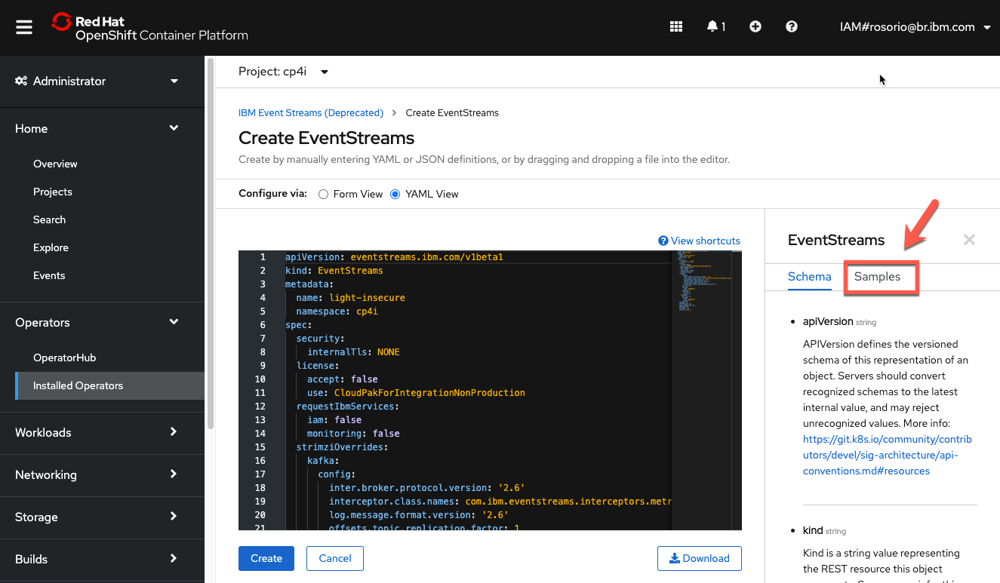

8.There is a Development type. Let's use it! On *Development* type, click **Try it**.

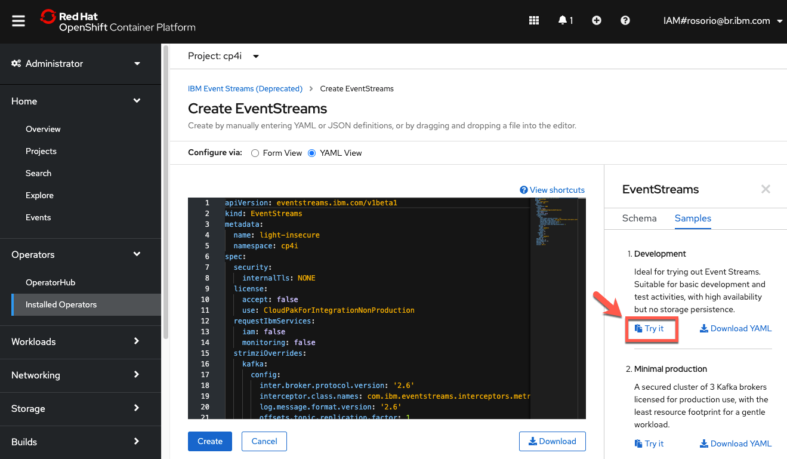

9.Just to follow the current standard, change the **metadata > name** to **es-dev** (1). Change the **spec > license > accept** to **true** (2). Then click **Create** (3).

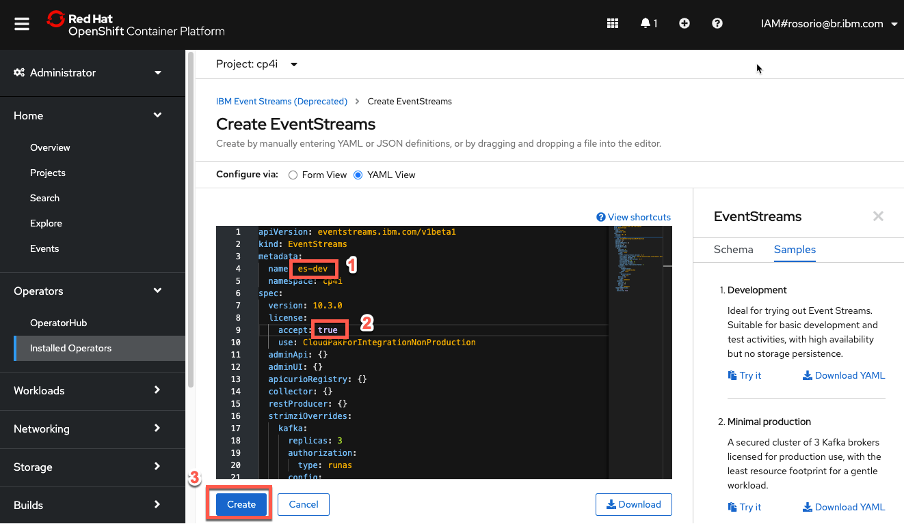

10.You need to wait few minutes to see your new instance as *Ready*.

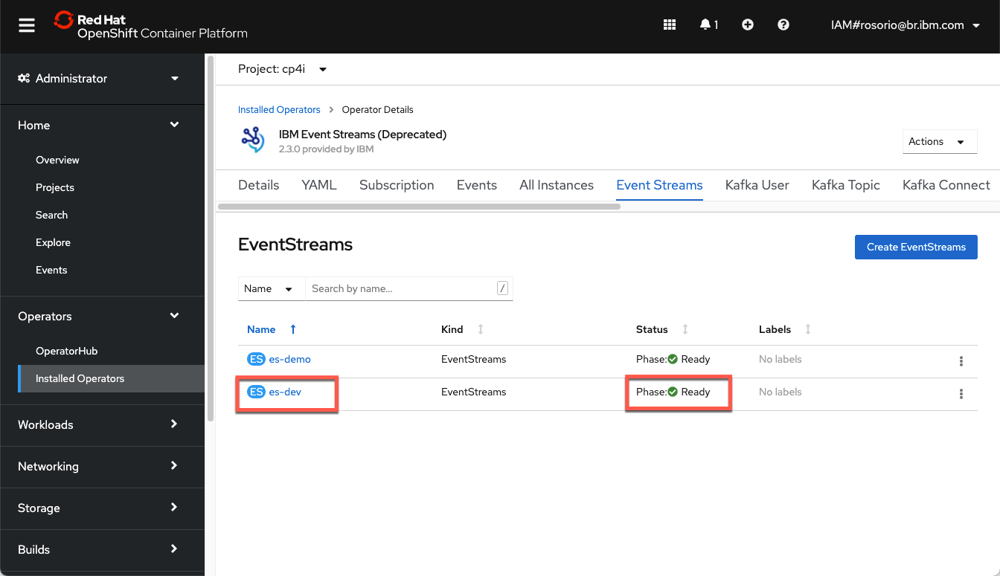

  Great! Now you have an Event Strams Development instance to complete the lab.

***

## Event Streams Topic

### Task 1 – Creating and Configuring an Event Streams Topic

Creating an Event Streams topic in the existing Event Streams instance.

1.Before you start the lab. Download **eslab.zip** from Github. Open a browser and enter: https://github.com/ibm-cloudintegration/dte-labs/tree/master/Lab3-RespondtoEvents . Click **eslab.zip** .

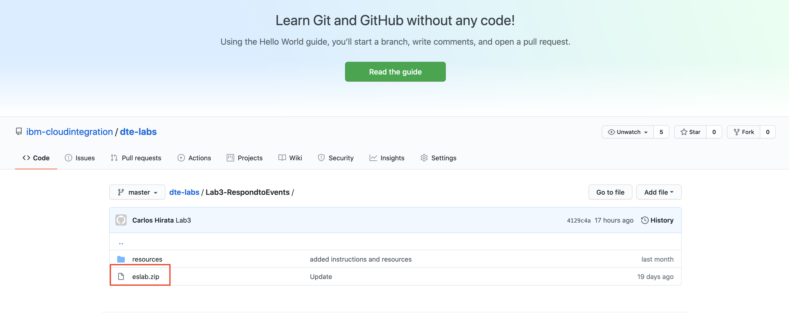

2.Click **Download**. The file **eslab.zip** is in your  **~/Download** directory.

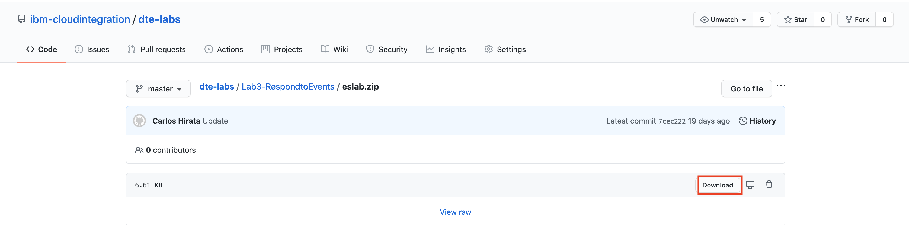

3.Execute **unzip eslab.zip** will create the work directory **~/eslab** with 3 files: **ace-es.zip** (App Connect Enterprise project), **setdbparms.txt** (App Connect configuration file) and **bootstrap.address** (you can use this file to store Event Streams Bootstrap Address).

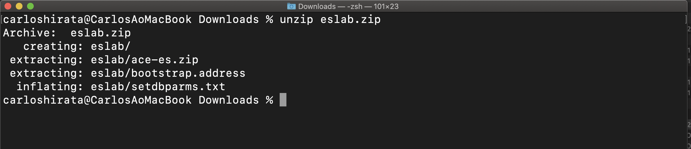

4.Open a browser and go to your **Cloud Pak for Integration Platform Navigation**. From here, you are able to navigate to all the integration runtimes and capabilities available in the platform. Capabilities include: EventStreams, API Connect, App Connect Dashboard, App Connect Designer , Asset Repository and Operations Dashboard. Let's explore the Event streaming runtimes. On the *Cloud Pak for Integration Home*, scroll down to see the **Event streaming** box, and click to open your **es-dev** instance.

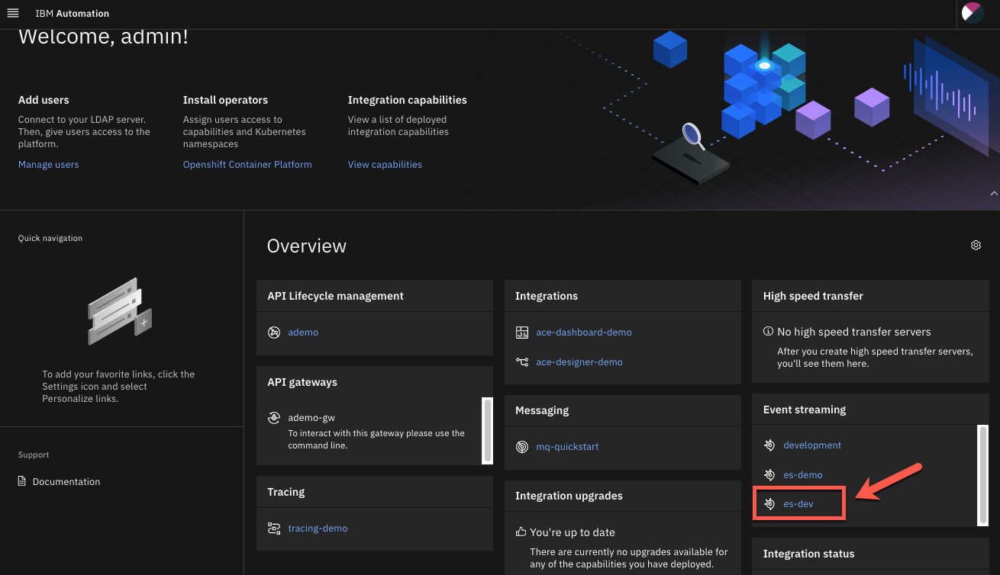

5.In the Welcome to IBM Event Streams page. Click **System is healthy**  and check the status of the instance.


6.Verify if all Event Streams components are running and ready.

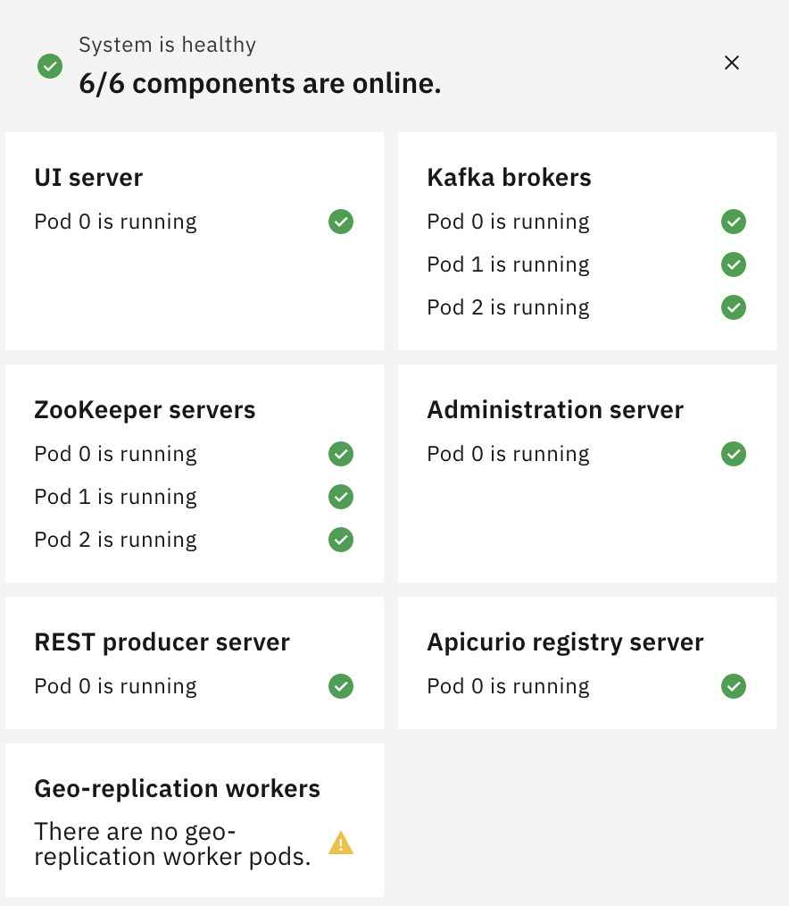

7.Click **Create a topic** to configure topic.

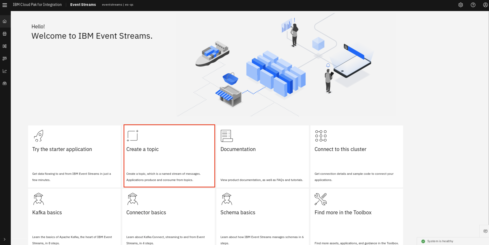

8.View the full range of configuration options by setting the *Show all available options* to **On** (1). Enter **customerinfo** as *Topic name* (2). Click **Create topic**.

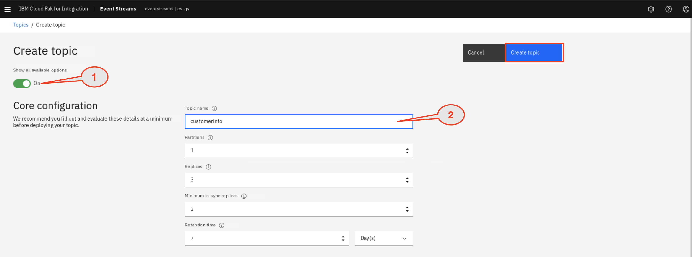

9.The topic is created, click to **connect to this cluster**. By default Event Streams requires clients to be authorized to write to topics. The available authentication mechanisms for use with the REST Producer are MutualTLS (tls) and SCRAM SHA 512 (scram-sha-512). Check this [page](https://en.wikipedia.org/wiki/Salted_Challenge_Response_Authentication_Mechanism) to know more about these authentication mechanisms.

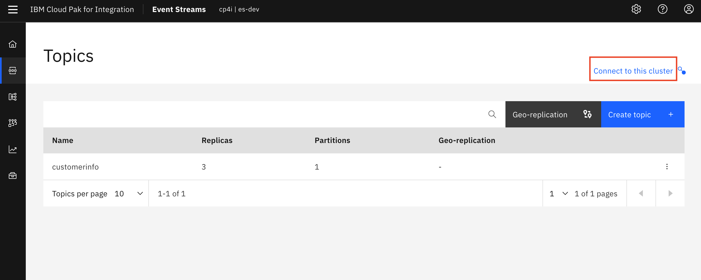

10.To connect an application or tool to this cluster, you need the address of a Kafka listener, a credential to authenticate with, and a certificate depending on the listener.
For this lab, you use an External listener. App Connect needs securities parameters to access Event Streams, the truststore password, certificate and SCRAM user ID and password.
Copy the bootstrap server **External (1)**, by clicking the **copy icon**, you need that later in this lab. Another option is to use **bootstrap.address** file.
But, for this lab you use external listener to verify how to access Event Streams as external application.


11.Click **Generate SCRAM credentials**.

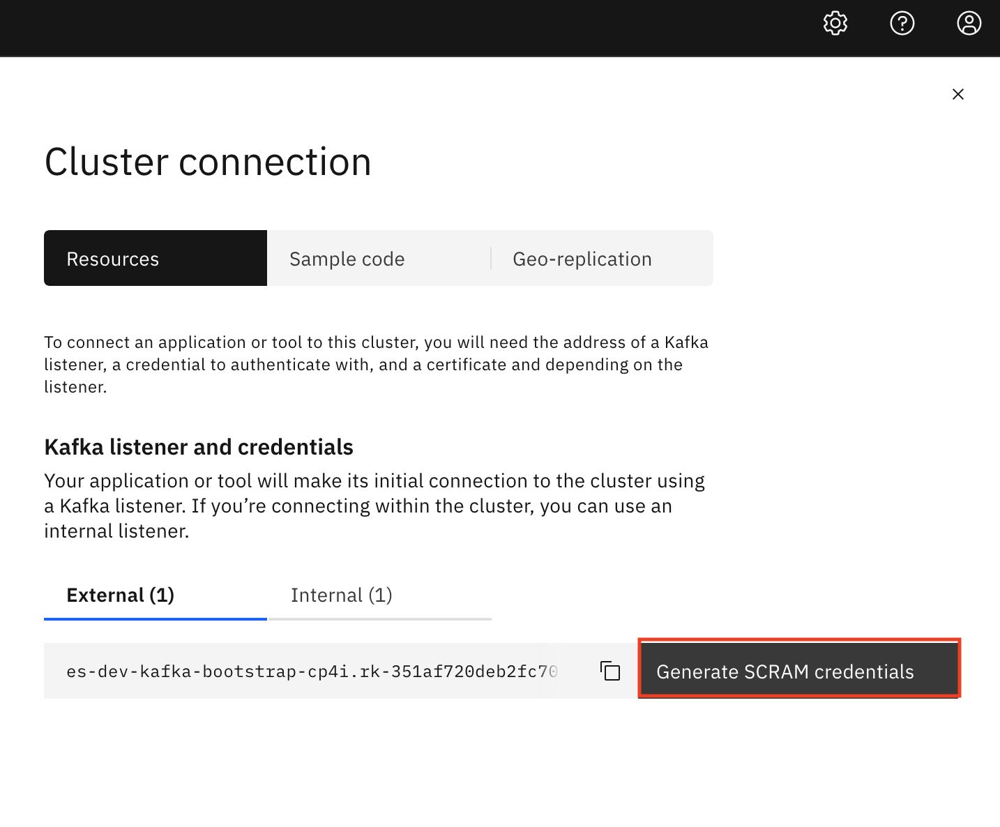

12.On the *Generate credentials for your application* dialog, you create credential name and how your application works with EventStreams. The credential name is your kafkauser. In the *Credential name* field, enter **customerinfoapp** (1). Check **Produce and consume messages, and read schemas** (2). Click **Next**.

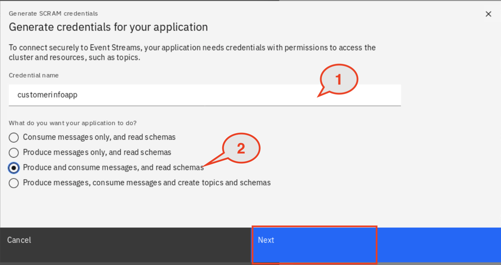

13.In the dialog *Which topics does the application need to access?* you can specify which the topics, the application accesses. Check All topics (1). Click **Next**.

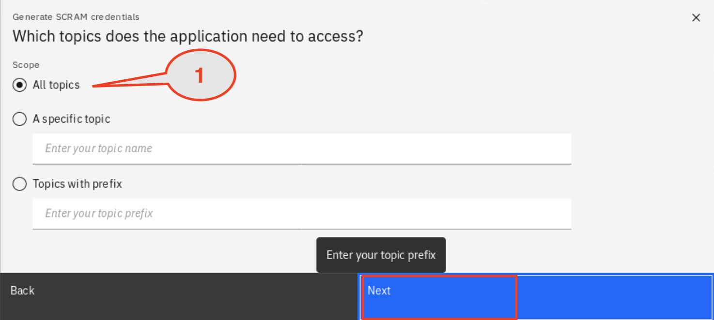


14.In the dialog *Which consumer group does the application need to access?*, a consumer group is a group of consumers cooperating to consume messages from one or more topics. The consumers in a group all use the same value for the group ID configuration. Check **All consumer groups** (1). Click **Next**.


15.In the dialog, *Choose which transactional IDs the application can access?*, you can control the ability to use the transaction capability in Kafka. Keep **No transactional IDs** checked (1). Click **Generate credentials** (2).

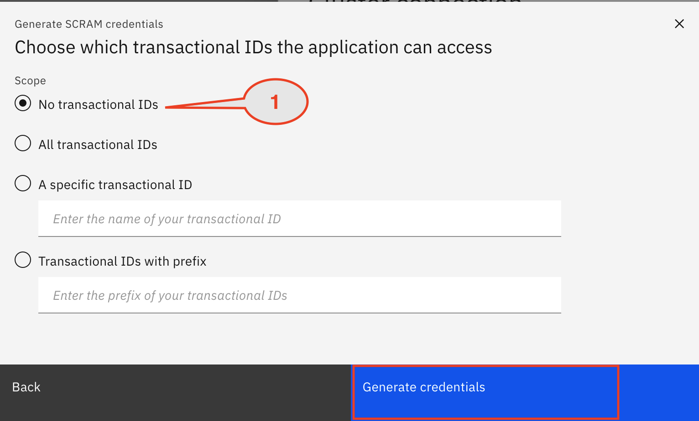

16.Back to **Cluster connection** page. Verify the bootstrap server as an external listener, has a *username* and *password*. Scroll to *Certificates* section and on PKCS12 certificate, click **Download certificate**. Save the certificate.

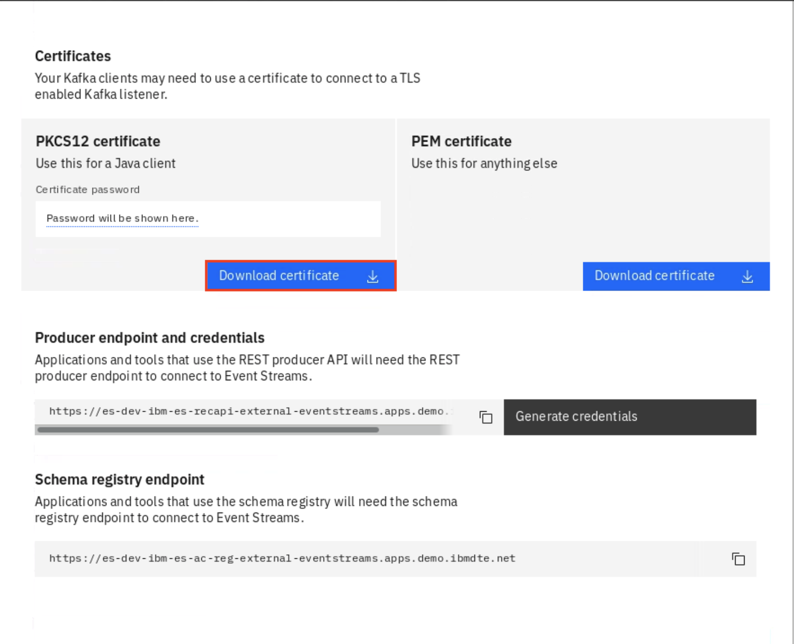

17.Now you can see the certificate password (it might be different for you).


18.Now, let's add our passwords in a configuration file. Open a **terminal window**, go to directory you created **~/eslab**. Open to edit the **setdbparms.txt** file. Replace \<securityIdentity\> with **customerinfoapp**. Copy the *SCRAM username* (1) and paste over **\<SCRAM USER\>**. Now, copy the *SCRAM password* (2) and paste over **\<SCRAM PASSWORD\>**. Copy the *PKCS12 certificate - Certificate password* (3) and paste over **\<TRUSTSTORE PASSWORD\>**.


19.Replace *\<anyname\>* to **customer**. Your file should looks like the picture below.

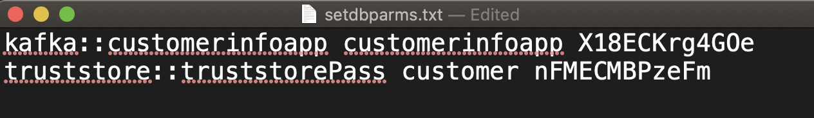

   **Save** and **close** your file.

***

## Configuring App Connect Enterprise

### Task 2 - Configuring App Connect Enterprise flow using App Connect Enterprise Toolkit

You have created a topic in EventStreams. App Connect Enterprise produces a message and send it to the EventStreams topic. In this task, you configure an App Connect Enterprise message flow and generate a BAR file to deploy in the Integrstion Dashboard.

1.Start IBM App Connect Enterprise. Create the App Connect Enterprise workspace directory as **ace-es** folder (**~/IBM/ACET11/workspace/ace-es**). Click **OK**.

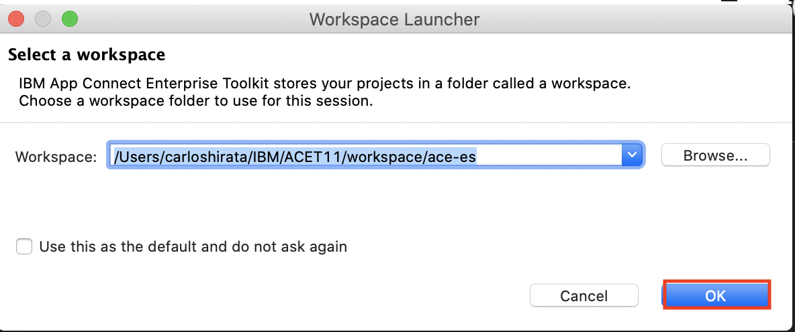

2.If necessary, close the *Welcome* page. Now, you need to import a project. In the **Application Development** window, *right click* and select **Import**.


3.Select in IBM Integration folder, **Project Interchange**. Click **Next**.

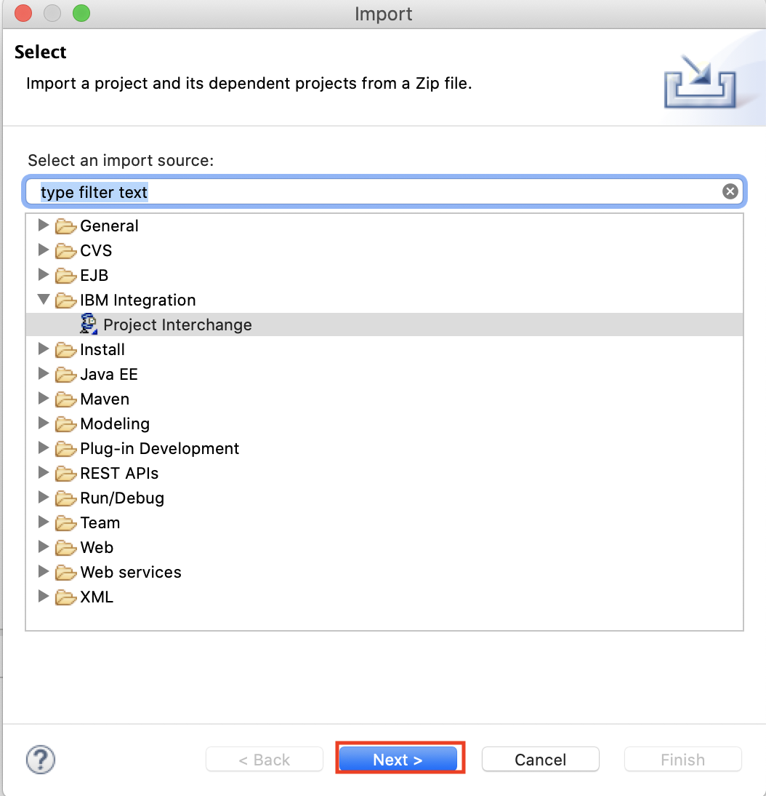

4.Locate in es-lab folder, the **ace-es.zip** file.


5.Verify that you imported the correct zip file snd click **Finish**.


6.Before working on the message flow, you need to create a policy. Click **New** and select **Start by creating a Policy project**. Policies can control particular node properties, such as connection credentials, and certain aspects of message flow behavior, including flow rate. Policies provide a shared and managed definition that you can reuse.


7.On the *Create a Policy project* dialog, enter **customerpolicy** as Policy Name and click **Finish**.

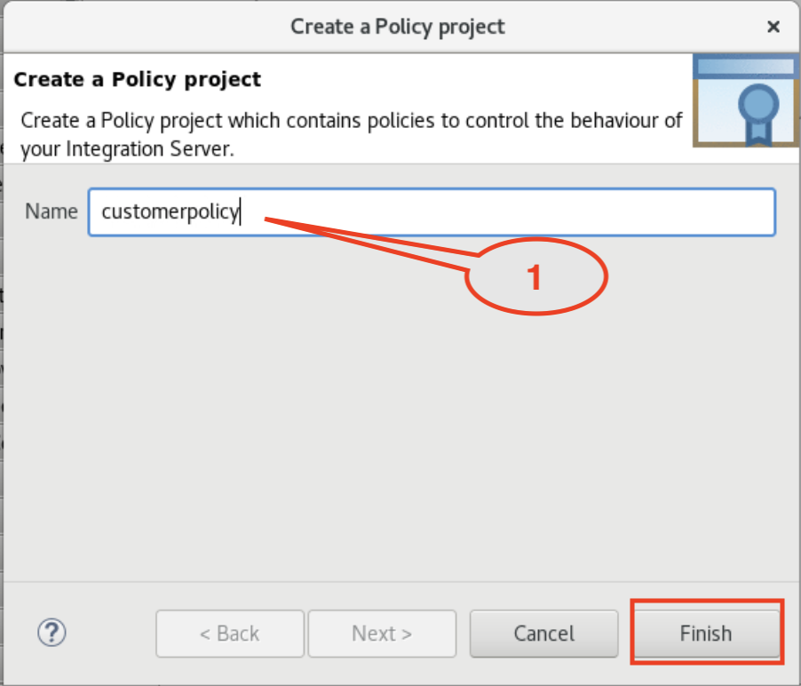

8.You created a policy project. Now, click **customerpolicy->(New..)**.


9.On the dialog, click **Policy** link.

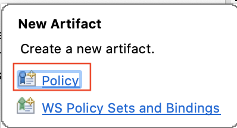

10.Enter **customer** as policy name and click **Finish** .


11.On the Policy file, you need to do some configuration change. First, change *Type* to **Kafka** (1). Automatically, the *Template* changes to **Kafka** (2). On the Bootstrap servers, copy your bootstrap server url (3) (e.g.: es-dev-kafka-bootstrap-cp4i.mycluster-wdc06-c3c-32x64-4e85092308b6e4e8c206c47df210f622-0000.us-east.containers.appdomain.cloud:443). Select **SASL_SSL** as *Security Protocol* (4). Enter **SCRAM-SHA-512** as *SASL Mechanism* (5). Enter **customerinfoapp** as Security Identity (DSN) (6). Set the *SASL config* property to **org.apache.kafka.common.security.scram.ScramLoginModule required;**  (7). *Don't forget to include “ required;“ as part of the value*. This value specifies the SASL configuration to be used when connecting to the Kafka cluster. Delete JKS as the SSL keystore type (8). Enter **/home/aceuser/truststores/es-cert.p12** as the *SSL truststore location* (9). In *SSL truststore type*, replace JKS to **PKCS12** (10). Set **truststorePass** in *SSL truststore security identity* (11). Keep the rest as default. **Save** the policy (CTRL+S).

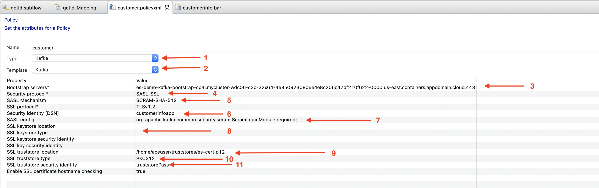

12.In Application Developer on the left bar, open **customerinfo -> Resources -> Subflows**. Click **getid.subflow** (1). Some errors might appear , you fix this after you complete and save message flow. Select **customerinfo** node (2). Click **Properties** (3). Select **Basic** properties (4). Enter **customerinfo** (5) as the *Topic name* (the topic name that you created in EventStreams). In the *Boostrap servers* field, paste your server address again (6) (e.g.: es-demo-kafka-bootstrap-cp4i.mycluster-wdc06-c3c-32x64-4e85092308b6e4e8c206c47df210f622-0000.us-east.containers.appdomain.cloud:443).

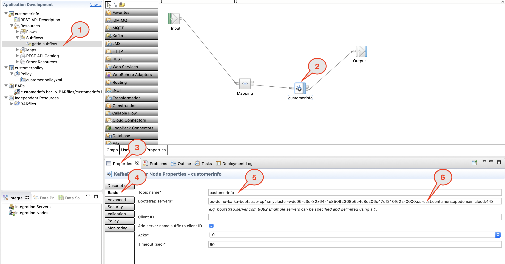

13.In the **Security** tab, set the *Security Protocol* to **SASL SSL** (1) and *SSL protocol* to **TLSv1.2** (2).


14.In *Properties*, on *Policy* field, click **Browse** to assign a policy to the Kafka Node.


15.Select the policy that you created in previous step **{customerpolicy}:customer**. Click **OK**.

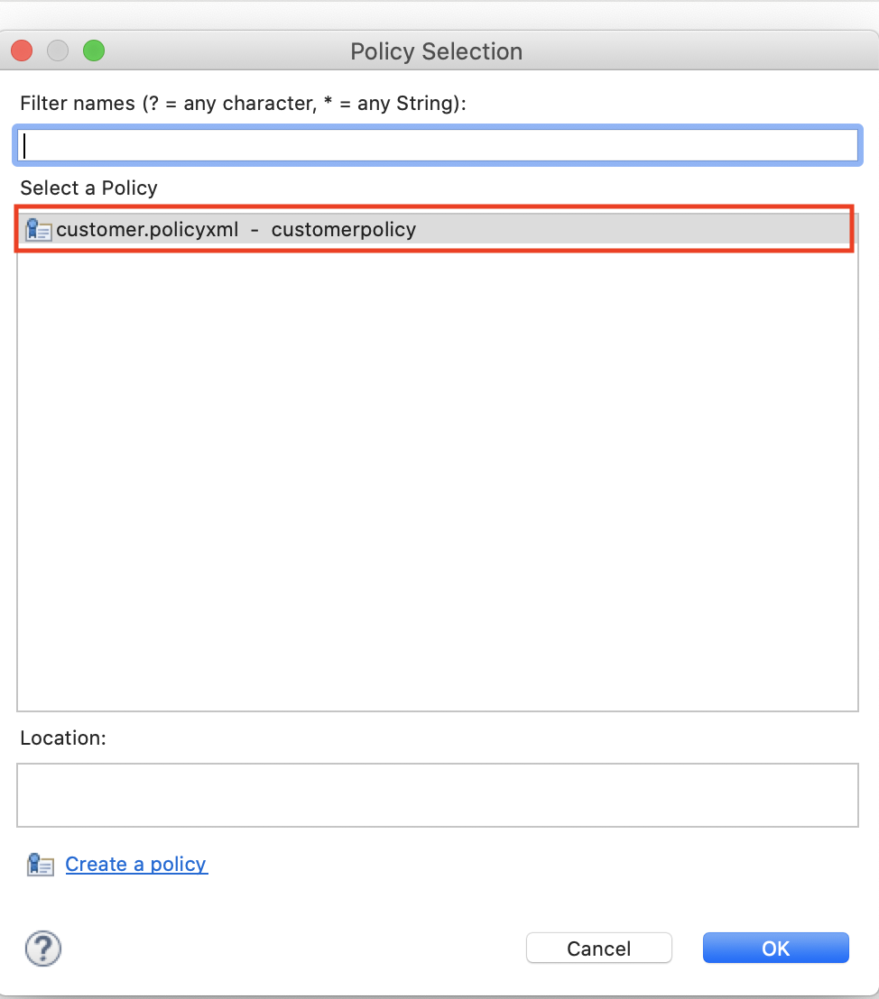

16.**Save** the message flow (CTRL+S or click Save button).

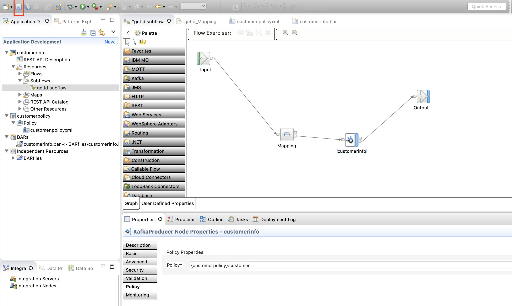

17.Now, you need to deploy the **customerinfo** application in App Connect Enterprise server. Select the **customerinfo application**. Click **File-> New-> BAR file**.

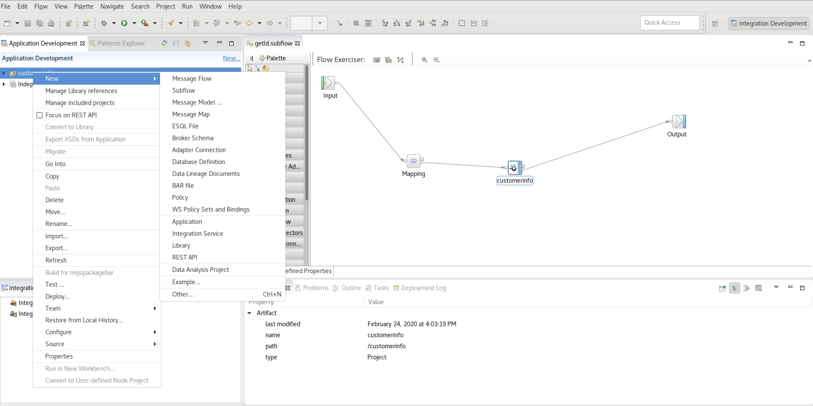

18.Enter **customerinfo** as the BAR file name and click **Finish** .

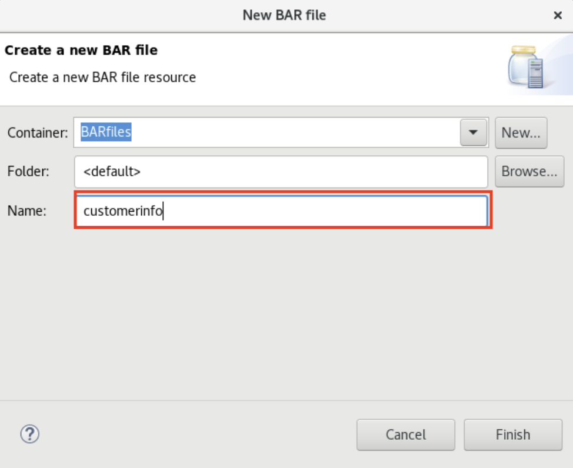

19.Check **customerinfo** application box on the REST API tree (1). If necessary scroll right to check **Compile and in-line resource** (2) and click **Build and Save**.

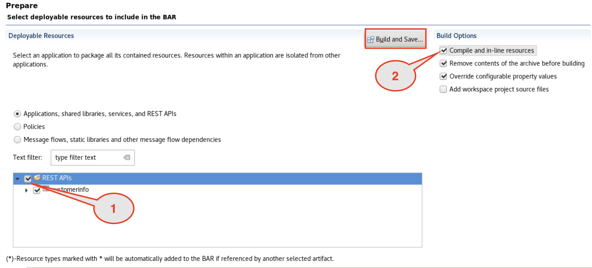

20.A pop-up window displays the message “*Operation completed successfully.*” Click **OK** to confirm and **close**.

21.Now, check **Policies** (1) and check the **customerpolicy** (2). Click **Build and Save** and **OK** on Override Configurable Properties.

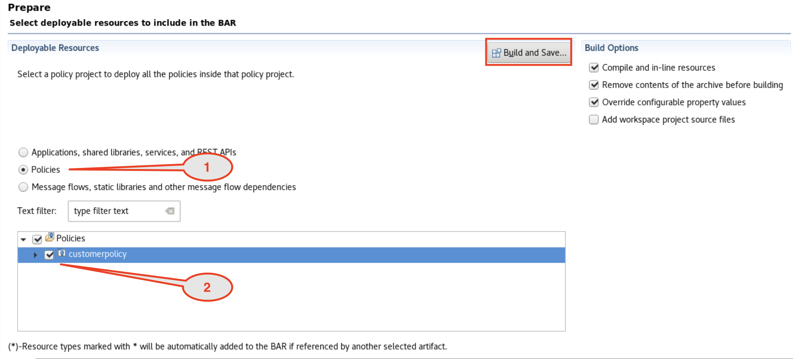

22.Great! Now, you have a *BAR file* and *policy* document created in App Connect Enterprise workspace. Find **IBM ->ACET11->workspace->ace-es**. You see folders, locate **customerpolicy** folder and Compress (zip).

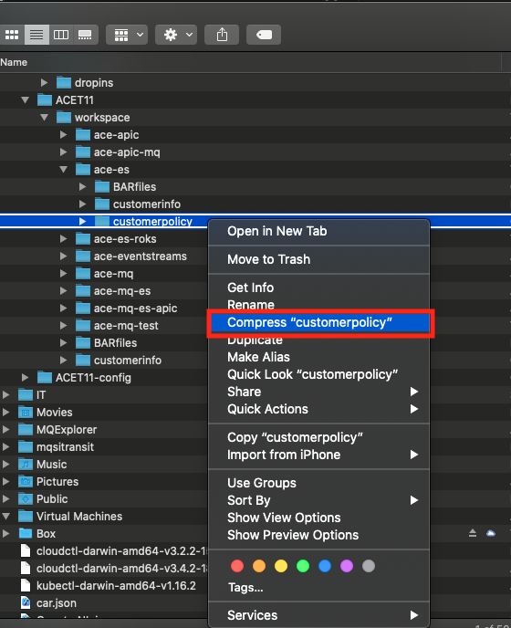

***

## Deploying App Connect Enterprise

### Task 3 – Deploying App Connect BAR file on App Connect Enterprise Server

The App Connect Enterprise toolkit generated a BAR file. The BAR file has all information to run an App Connect Enterprise instance.
This release introduces a new Operator-based approach for packaging, deploying, and managing App Connect in a containerized environment. The IBM App Connect Enterprise certified container is now deployed to a Red Hat OpenShift cluster by using the new IBM App Connect Operator. This Operator is distributed through the IBM Entitled Registry, and can be installed from the Red Hat OpenShift OperatorHub. We’ve updated the look of our user interfaces to help improve the way you work.

1.Back to the **Cloud Pak Platform Navigator** in the browser (if necessary, click IBM Automation to return to the Home page). Open the **Menu** and on the **Run** section, open the **Integrations** dashboard.


2.If you might receive the login page, log in again with your admin user.

3.On the left menu, select **Configuration** icon.


4.Click **Create configuration**.

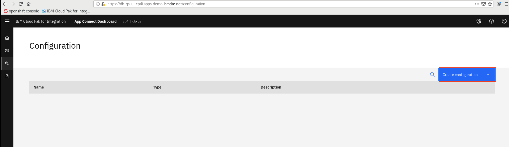

5.Click the arrow and select **Policy Project**. In the **Import compressed policy project**, move the mouse and click **Drag and drop a file or click to upload**.

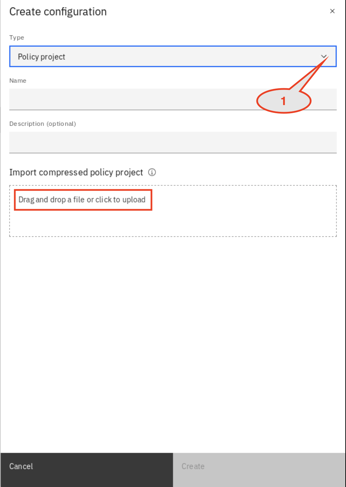

6.Open **~/IBM/ACET11/workspace/ace-es** and select **customerpolicy.zip** and click **Open**. To upload to App Connect Dashboard and click **Create**.


7.Check if the **customerpolicy.zip** is uploaded and Click **Create**.

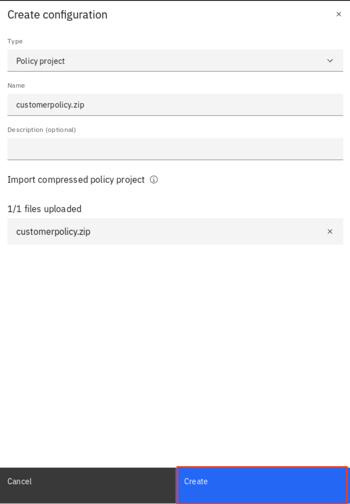

8.Upload the **sertdbparms.txt**. Click **Create configuration**.


9.Click on the Import **setdbparams.txt** icon.

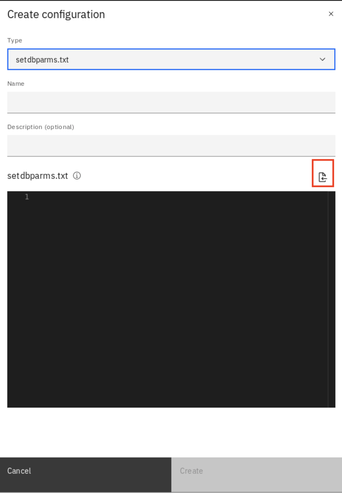

10.Click on the Import s**etdbparams.txt** icon and click **Drag and drop a setdbparms.txt file or click to upload**.


11.In the **file upload**, open **~/eslab**, select **setdbparms.txt** and click **Open**.

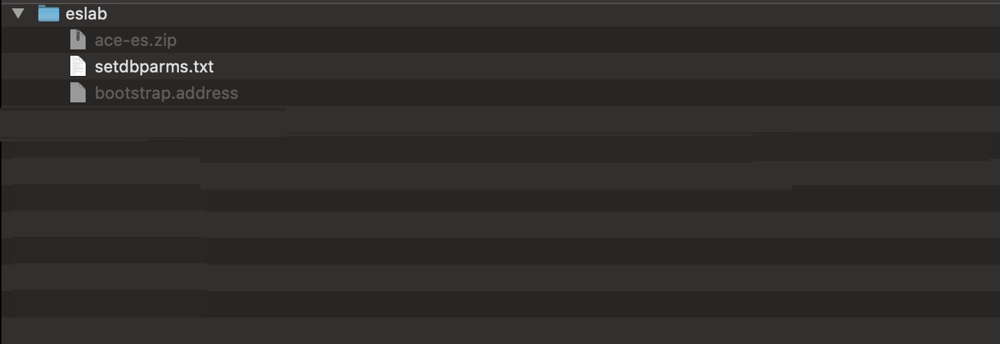

12.Verify the setdbparms is loaded and click **Create**.

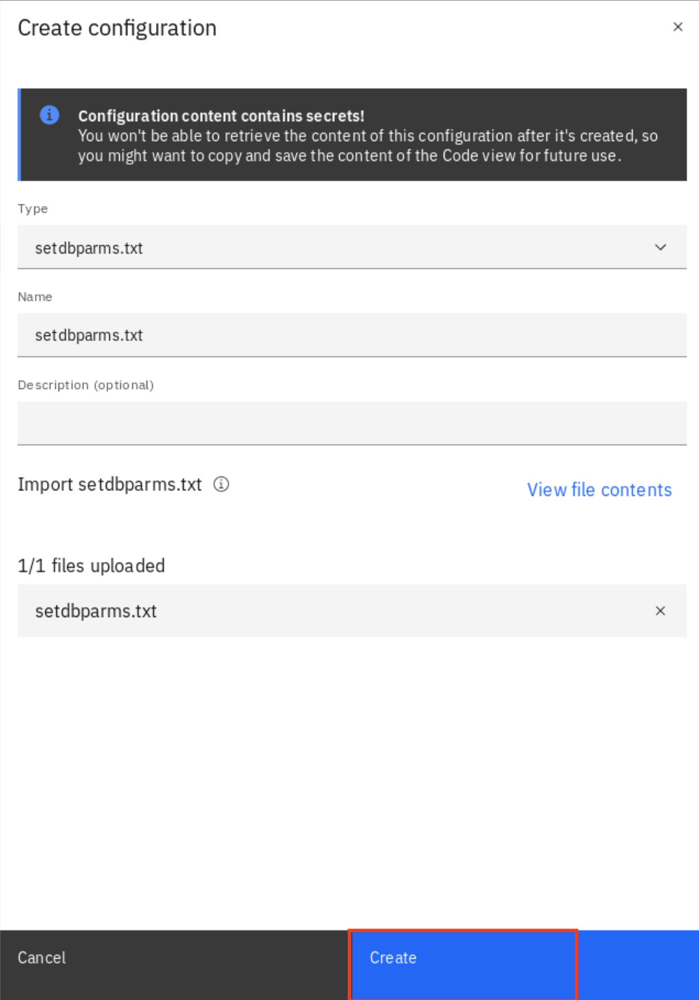

13.The same process, upload the **truststore** certificate. Click **Create configuration**.

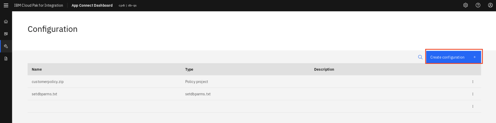

14.Select **Truststore** and click **Drag and drop a truststore file to upload**.


15.In **File Upload**, go to **~/Downloads**, select **es-cert.p12** file and click **Open**.

16.Click **Create** to upload the file to App Connect Dashboard.

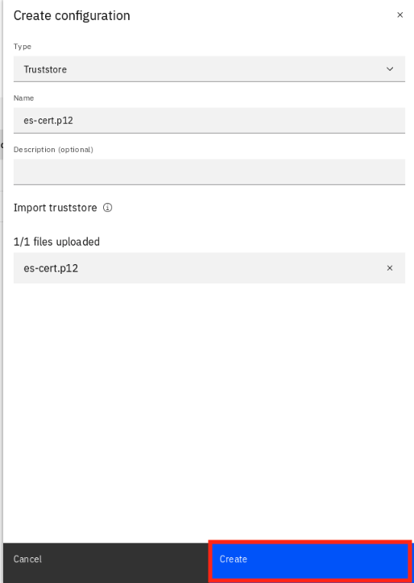

17.You have uploaded three configuration files. Now, you upload and configure the BAR file in App Connect Dashboard. Click the **Home** icon on the left.


18.In the **Welcome to IBM App Connect** page. Click **Create a server**.


19.In the *Create an Integration Server* page, you have two options to deploy a BAR file: Deploy a BAR file from *App Connect Toolkit* or from *App Connect Designer*. In this lab you deploy BAR file from App Connect Toolkit. Select **Quick start toolkit integration** option and click **NEXT**.


20.Click to upload your BAR File. And select the **customerinfo.bar** (~/IBM/ACET11/workspaces/ace-es/BARfiles). And click **Next**.

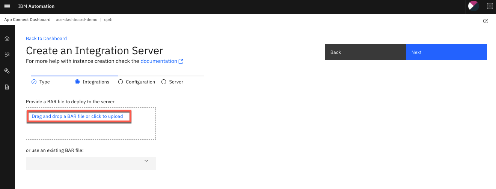

21.You have uploaded the configuration files, check all three files (**customerpolicy.zip, setdbparms.txt and es-cert.p12**) and click **Next**.


22.Configure the Integration Server. Enter **customerinfo** as the server name (1). Switch to **On** the *Enable Operations Dashboard tracing* (2). Enter **cp4i** as *Operations Dashboard namespace* (3).

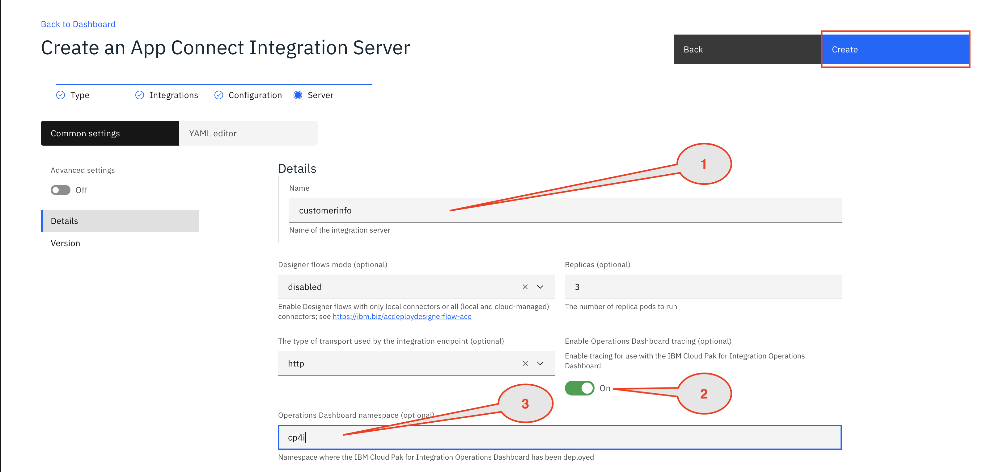

***

## Testing App Connect Enterprise

### Task 4  – Testing App Connect Enterprise API sending a message to Event Streams

You verify if the message you created in App Connect Dashboard (Integration server) arrived in Event Streams topics.

1.App Connect Dashboard will create *customerinfo* server. After 5 minutes, refresh the Browser and see if the server is *Started*. Click on **customerinfo**.


2.Click **customerinfo API**.

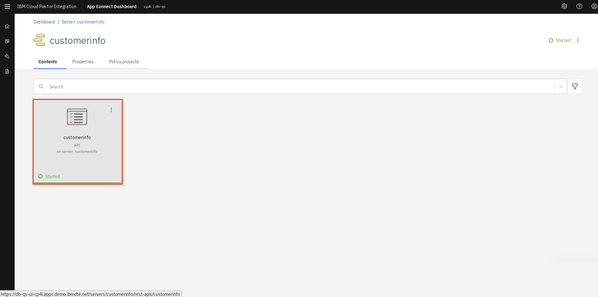

3.On the *Documentation* tab, the overview section displays the API type and the base URL for the API endpoint. A **Download Open API Document** link is also provided for the **OpenAPI** document that describes the API. For this lab, you just need to *copy* the Endpoint.


4.Open a terminal window, enter the curl command below:
```
curl -G -k http://customerinfo-http-cp4i.mycluster-wdc06-c3c-32x64-4e85092308b6e4e8c206c47df210f622-0000.useast.containers.appdomain.cloud:80/customerinfo/v1/00000
```

 *Note: Paste the Endpoint and include **00000** as order number at the end of the URL.*


5.A message was sent from App Connect (Integration Server) to IBM EventStreams. Let's check it! Back to Cloud Pak for Integration home page, open the **Menu** again, and on **Run** section, now click **Kafka clusters**.

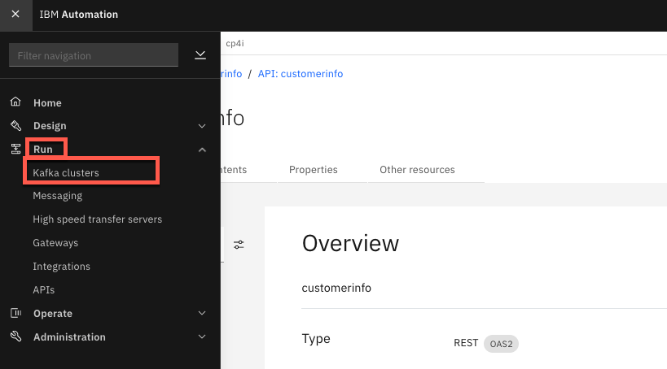

6.Select **es-dev** instance.

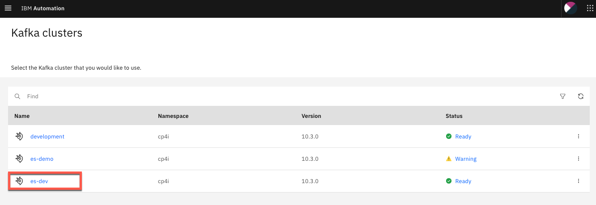

7.In Welcome to IBM Event Streams page, Click **Topics** on the left, to open the topics list of this Event Streams instance.


8.In the Topics page, click the topic **customerinfo** to open the topic page.

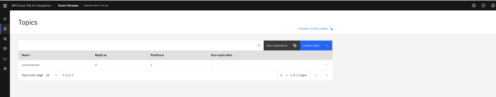

9.Click **Messages** to check if the message from App Connect Enterprise has arrived. You see the list of messages that are stored on the EventStreams topic. Take time to look at the monitor to explore the information.


10.Click the message and Verify the message on the customerinfo topic. Verify the Customerid:**0000**.


11.Click **Monitor** icon on the left to look at Event Streams monitor.

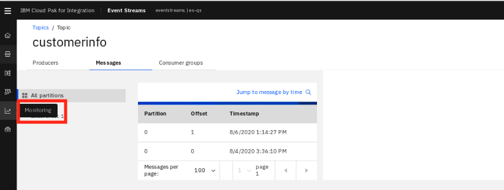

12.You can analyze the incoming and outcoming messages, per period (hour, day, week, and month). You are welcome to explore it.

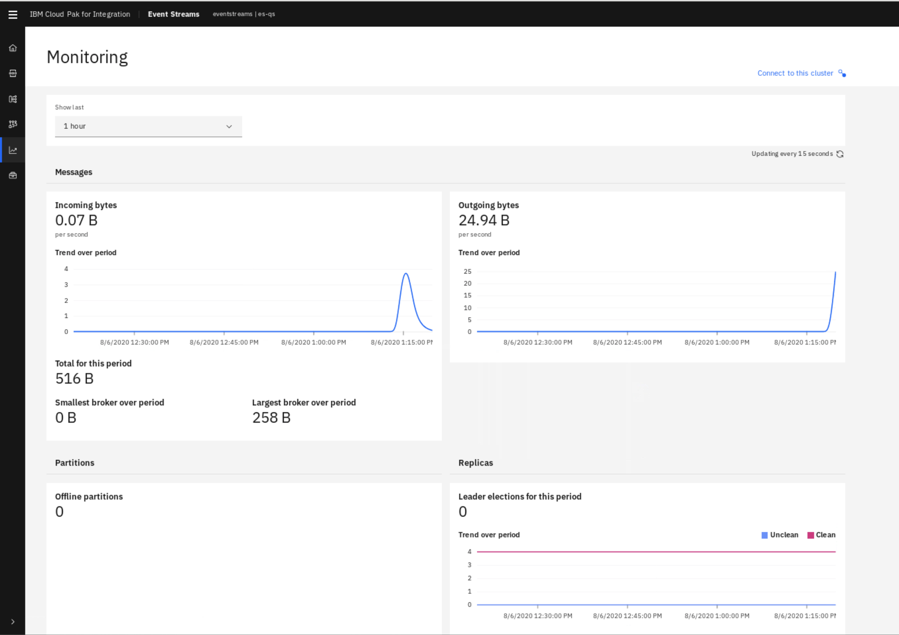

***

## Operations Dashboard (tracing)

### Task 5 - Using Operations Dashboard (tracing)

The Operations Dashboard collects data from all the registered capabilities (such as MQ) in real time. By default, and for this lab, 10 percent of traffic is sampled.

IBM Cloud Pak for Integration Operations Dashboard has adopted OpenTracing API specification for collecting tracing data. OpenTracing is comprised of an API specification for distributed tracing, frameworks and libraries that have implemented the specification and documentation.

o	Trace: The description of a transaction as it moves through IBM Cloud Pak for Integration platform.
o	Span: A named, timed operation representing a piece of the workflow (e.g. calling an API, invoking a message flow or placing a message in a queue or a topic).
o	Span context: Trace information that accompanies the distributed transaction, including when it passes the service to service over the network or through a message bus.

1.Let's explore the Operations Dashboard. Open again the **Menu**, and on the **Administration** section, open **Integration capabilities**.

  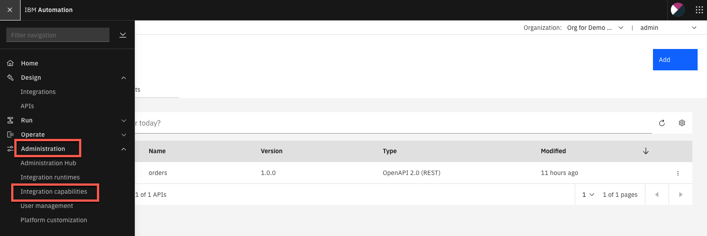

2.From the Capabilities list, open *Integration tracing* link: **tracing-demo**.

  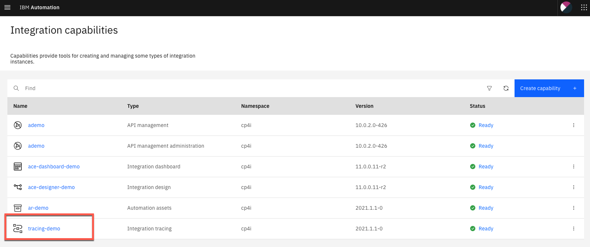

3.In the Tracing page, check the Overview page. You see all the products that you can use this tool: **APIC (including DataPower), APP Connect and MQ**. You see all the tracing of MQ, App Connect and APIC (You see how to configure tracing in APIC lab). Operations Dashboard Add-on is based on Jaeger open source project and the OpenTracing standard to monitor and troubleshoot microservices-based distributed systems. Operations Dashboard can distinguish call paths and latencies. DevOps personnel, developers, and performance engineers now have one tool to visualize throughput and latency across integration components that run on Cloud Pak for Integration. Cloud Pak for Integration - Operations Dashboard Add-on is designed to help organizations that need to meet and ensure maximum service availability and react quickly to any variations in their systems.

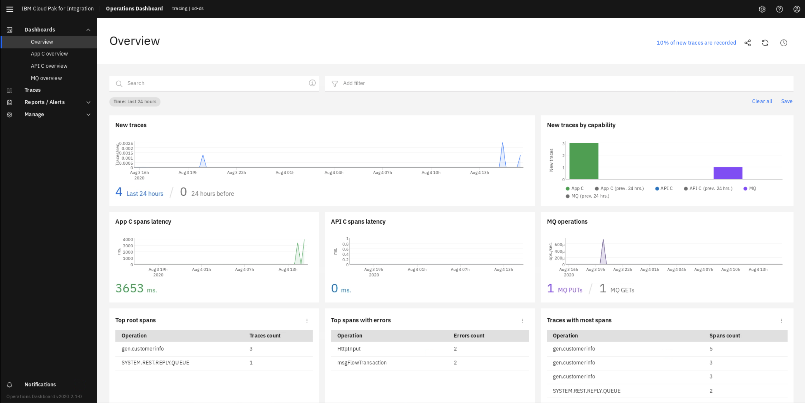

4.You can monitor each product separately. Click **App C overview**.

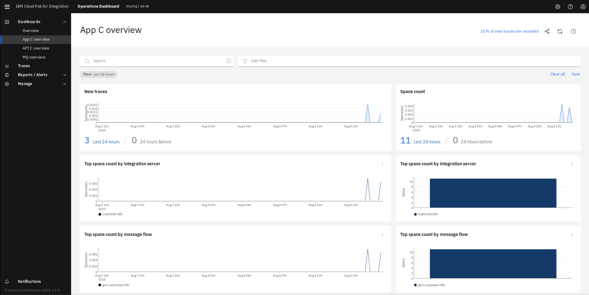

5.In the tracing page, select **traces** the menu on the left.

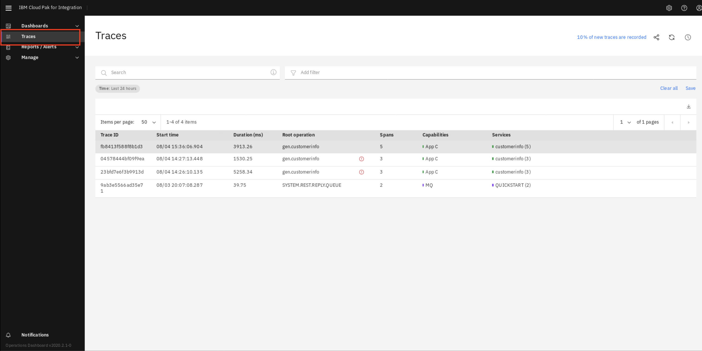

6.You see the list of tracing, select the **customerinfo** line to analyze the trace of the application **customerinfo**.

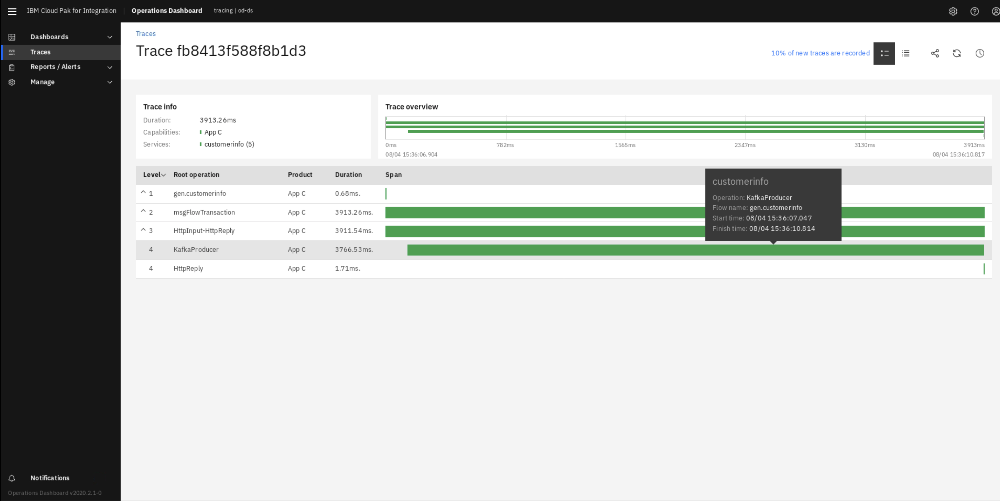

***

## Summary

You have successfully completed this lab. In this lab you learned how to:

•	Create a topic in Kafka.
•	Create an integration between an API service and Kafka
•	Deploy the new integration as containers in Kubernetes.
•	Use Operations Dashboard tool

Now that you’ve created a topic in Kafka (Event Streams), applications are able to subscribe and received data. To try out more labs, go to Cloud Pak for Integration Demos. For more information about the Cloud Pak for Integration, go to https://www.ibm.com/cloud/cloud-pak-for-integration.
