import ArticleDetails from '../../../../src/gatsby-theme-carbon/components/ArticleDetails'

<ArticleDetails name="Carlos Hirata, Ravi Katikala" lastUpdated="October 2020" readTimeMinutes="60" />

We installed IBM MQ v9.1.4 and IBM Event Streams v10 on to IBM Cloud Pak® for Integration 2020.3.1 on Red Hat® Openshift® 4.4. You can use the Kafka Connect source connector for IBM MQ to copy data from IBM MQ into IBM Event Streams or Apache Kafka.
Path

<AnchorLinks>
  <AnchorLink>Introduction</AnchorLink>
  <AnchorLink>Prepare the environment</AnchorLink>
  <AnchorLink>Configure IBM MQ</AnchorLink>
  <AnchorLink>Configure IBM Event Streams toolkit</AnchorLink>
  <AnchorLink>Setup Kafka Connect</AnchorLink>
  <AnchorLink>Setup MQ Connectors</AnchorLink>
  <AnchorLink>Configuring and running MQ Connectors</AnchorLink>
  <AnchorLink>Testing MQ Connectors</AnchorLink>
  <AnchorLink>Using Operations Dashboard (tracing)</AnchorLink>
  <AnchorLink>Summary</AnchorLink>
</AnchorLinks>


## Introduction

The most interesting and impactful new applications in an enterprise are the applications that provide new ways of interacting with existing systems by reacting in real time to mission-critical data. Leverage your existing investments, skills and even existing data, and use event-driven techniques to offer more-responsive and more-personalized experiences. IBM Event Streams has supported connectivity to the systems you’re already using. By combining the capabilities of IBM Event Streams event streams and message queues, you can combine your transaction data with real-time events to create applications and processes. These applications and processes allow you to react to situations quickly and provide a greater personalized experience.
In this tutorial, you create a bidirectional connection between IBM MQ (MQ) and Event Streams by creating two message queues and two event stream topics. One is for sending and one for receiving. You then configure the message queue source and sync connectors in order to connect between the two instances.
The connector copies messages from a source MQ queue to a target Event Streams topic. There is also an MQ sink connector that takes messages from an Event Streams topic and transfers them to an MQ queue. Running it is similar to the source connector. In this lab, we will only cover the source and sink connectors. We will then configure the source a sink connector to run some tests to a local stand-alone worker. We then adjust our configuration to send the messages to a topic in Event Streams and run a console consumer to consume the messages.

## Takeaways

```

- Configuring MQ to send and receive messages and events
- Configuring Event Streams topics
- Configuring MQ Source and Sync Connectors
- Configuring Kafka Connect and connectors
- Setting up and running MQ connectors source and sink
- Using Event Streams Monitoring
- Using tracing for MQ

```

## Task 1 - Prepare the environment

**Note: If your using this tutorial in a multi-user ROKS setup, the environment is already prepared for you. Please login to the cluster using LDAP authentication and the credentials provided by your instructor and jump to [Configuring IBM MQ](#task-2-configuring-mq). Also, maske sure that you use a prefix provided by the instructor for queue, topic and server names.**

Because this is a new deployment of the Cloud Pak for Integration that uses Red Hat OpenShift, you need to run some steps to prepare the environment. Initial setup steps are only needed for a fresh installation of the Cloud Pak. They do not need to be repeated.

**Note: For this lab, we based on MAC workstation (MAC OSX)**

Requirements:

```
-	Java Version:
    java version "1.8.0_261"
    Java(TM) SE Runtime Environment (build 1.8.0_261-b12)
    Java HotSpot(TM) 64-Bit Server VM (build 25.261-b12, mixed mode)
-	Maven:
    https://maven.apache.org/
-	Git:
    https://git-scm.com/
-	Openshift CLI installed
    https://cloud.ibm.com/docs/openshift?topic=openshift-openshift-cli#cli_oc

```

1.In your workstation open a browser and enter http://cloud.ibm.com and enter your ibmid  and click continue and password to login IBM Cloud.

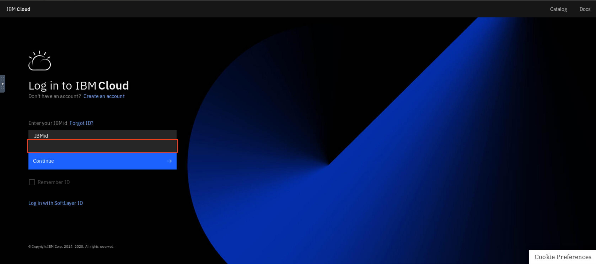

2.Enter your IBM userid  and the password and then enter the verify code.

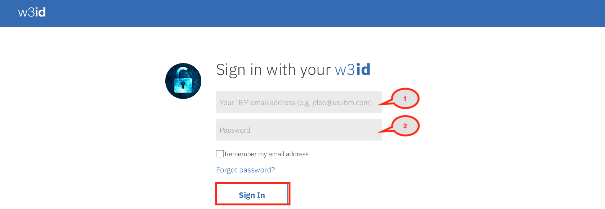

3.In the IBM Cloud Dashboard. You see all information about the infrastructure. On the left, click the Openshift icon.


4.Click your Cluster link.

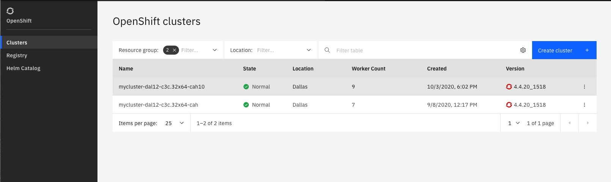

5.Click Openshift web console.

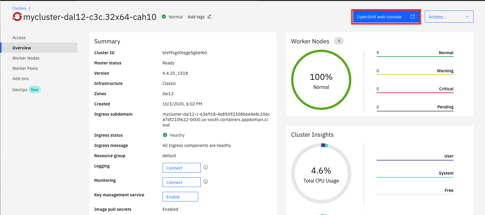

6.In the OpenShift console. Select the following:

```
1.	**Networking** .
2.	**Routes** .
3.	Drill down the Project to **cp4i** .
4.	Click link to access Cloud Pak for Integration .
```


7.Click **Default authentication** as authentication type.

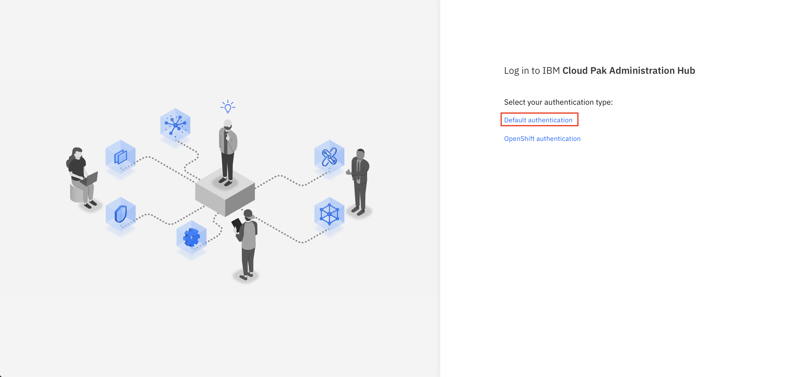

8.You might need to login screen for IBM Cloud Pak might be displayed, enter the username: **admin** and Password (**Enter the 32 characters password that you created when you made the Cloud Pak provisioning**) and Click Log in.
Tip: You might need to use the password. You can use the Clipboard to save the password.


9.In the **Cloud Pak Welcome** page, you see **Capabilities** and **Runtimes** instances.


## Task 2 - Configuring MQ

In this task, you work with the MQ Console, create two queues (MQTOEVENT and EVENTTOMQ), and change MQ Authorization. The IBM MQ Operator for Red Hat OpenShift Container Platform provides an easy way to manage the lifecycle of IBM MQ queue managers.
You need some configuration files from Github.

Connectors are available for copying data in both directions:

```
•	Kafka Connect **source** connector for IBM MQ:
  You can use the MQ source connector to copy data from IBM MQ into IBM Event Streams or Apache Kafka. The connector copies messages from a source MQ queue to a target Kafka topic.
•	Kafka Connect **sink** connector for IBM MQ:
  You can use the MQ sink connector to copy data from IBM Event Streams or Apache Kafka into IBM MQ. The connector copies messages from a Kafka topic into an MQ queue.
```
1.Open a browser and enter: https://github.com/ibm-cloudintegration/dte-labs/tree/master/Lab4-DriveDigitalTransformation/resources  and select es-mq.zip file.

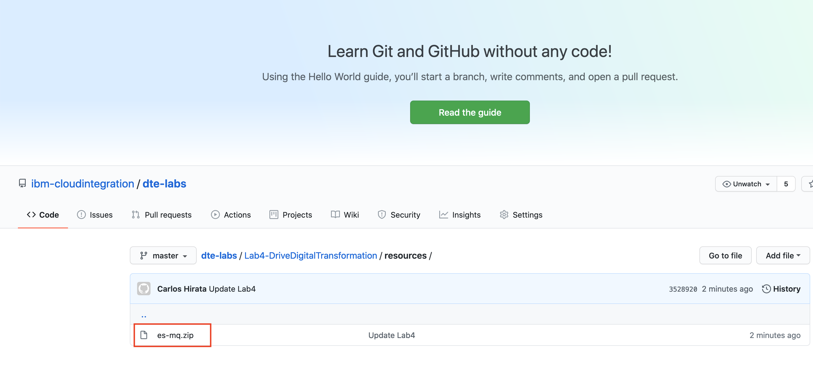

2.Click **Download**.

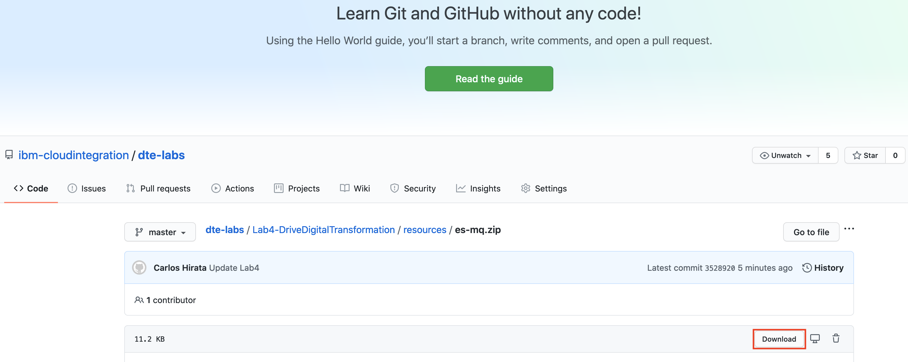

3.Open a terminal window and enter **unzip es-mq.zip**. Unzip creates a directory **es-mq** in **~/Downloads** directory.
(**Note**: Use this directory as your work directory and delete after you finish the lab).

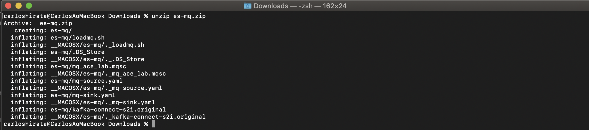

4.You need to login to the Openshift Cluster. Go to Openshift Console and locate **IAM(your ibm userid)** and click **Copy Login Command**.

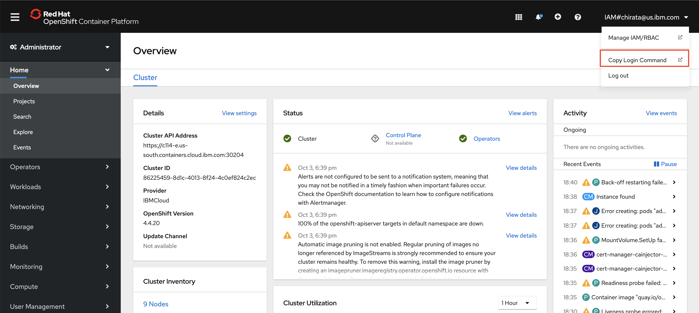

5.Click **Display Token**.


6.Copy the line **oc login  --token= ….** (all line).


7.In terminal window, go to **~/Downloads/es-mq** directory and Paste the oc login command.

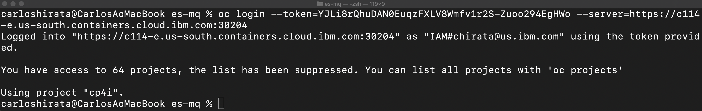

8.In **es-mq** directory, run loadmq shell script (**./loadmq.sh**) and you see mq configuration being loaded. This shell script loads server channels and changes some securities configurations.

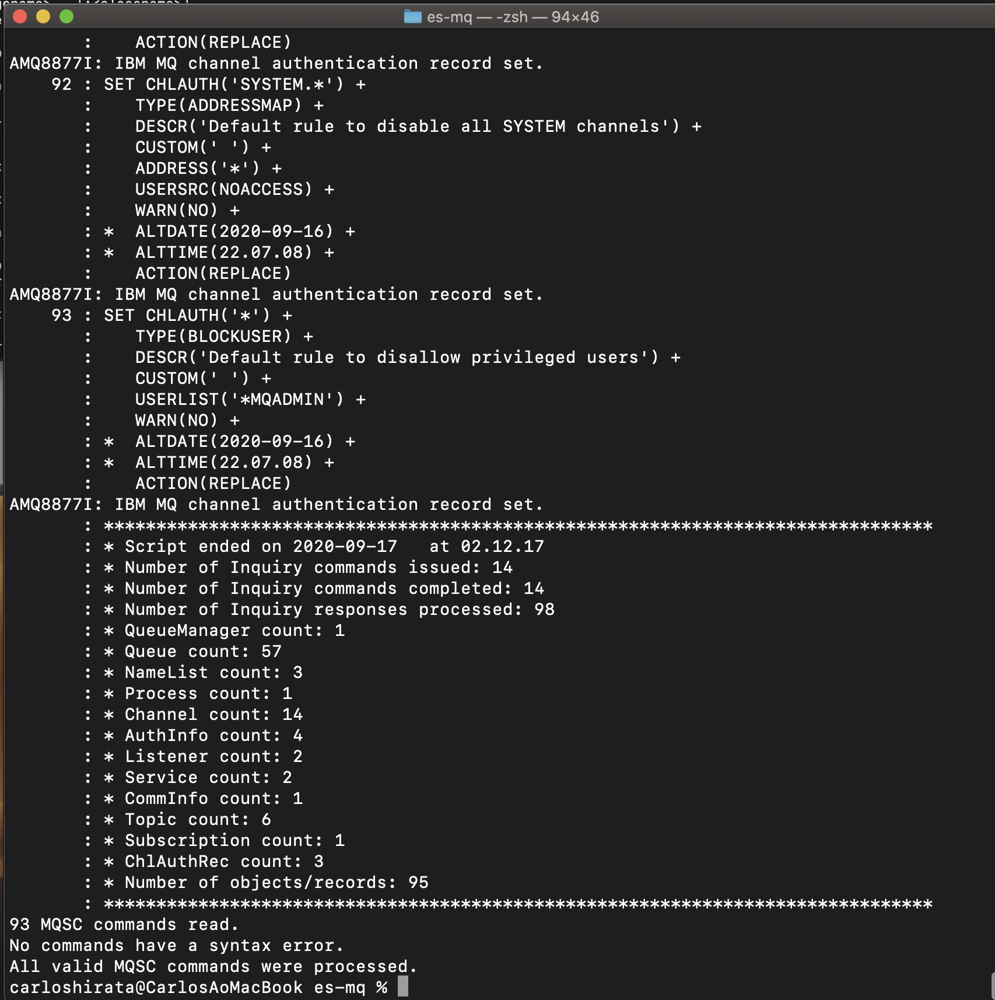

9.Prepare IBM MQ to exchange data from IBM Event Streams. You run a script file that configures MQ server (Security and Server Channel). The script creates two server channels: **EVENTTOMQ** and **MQTOEVENT**. In your browser, go to the IBM Cloud Pak Platform. You might need to log in to IBM Cloud Pak. The username and password are already cached (admin/(Enter the 32 characters password that you created when you made the Cloud Pak provisioning)). Click **Log in**.


10.In the **Welcome page of the IBM Cloud Pak for Integration**, click **Runtimes** and locate the **Queue Manager** in Instance Type and click **mq-demo**.

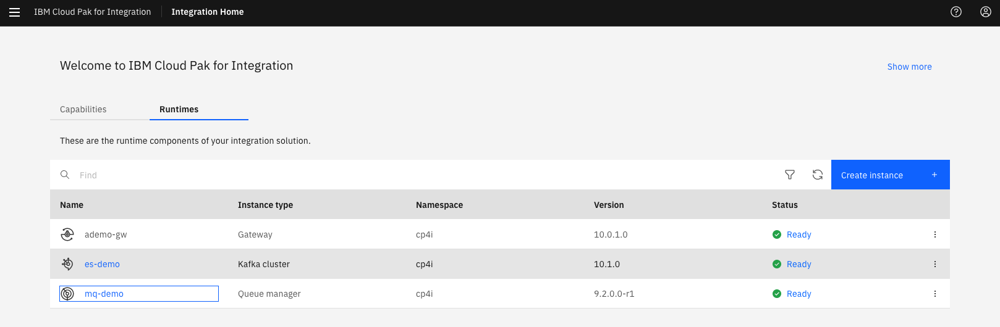

11.Firefox might warn you about a potential security risk. Click Advanced then accept the risk and Continue.
12.In Welcome to IBM MQ page, you can run and access MQ information. Click **Create a queue**.

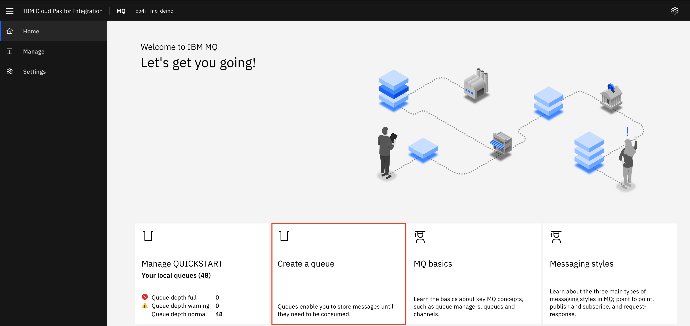

13.In Create a queue page, choose queue type: Click **Local**.

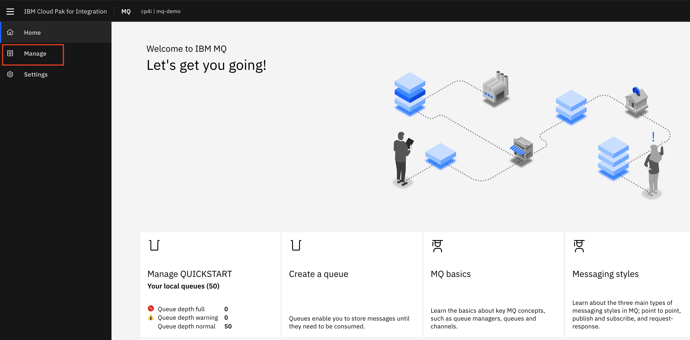

14.In the **Create a queue** page. Enter in the Queue name: **MQSOURCE**. Click **Create**.


15.And again, click Create a queue in Welcome to IBM MQ page.


16.On the Choose queue type, click Local.


17.Enter the queue name: **MQSINK** and click **Create**.

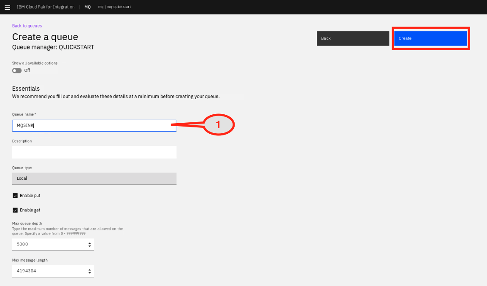

18.Click **Manage** on the menu to check MQ configurations.

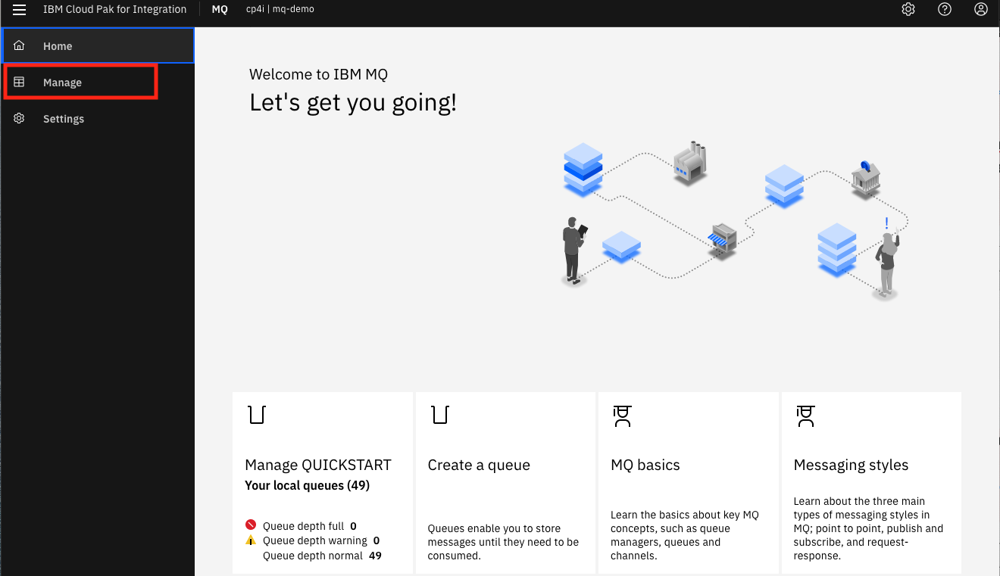

19.Verify the queues that you created and queue manager name: **QUICKSTART**. Click **Communications** to verify the channels.

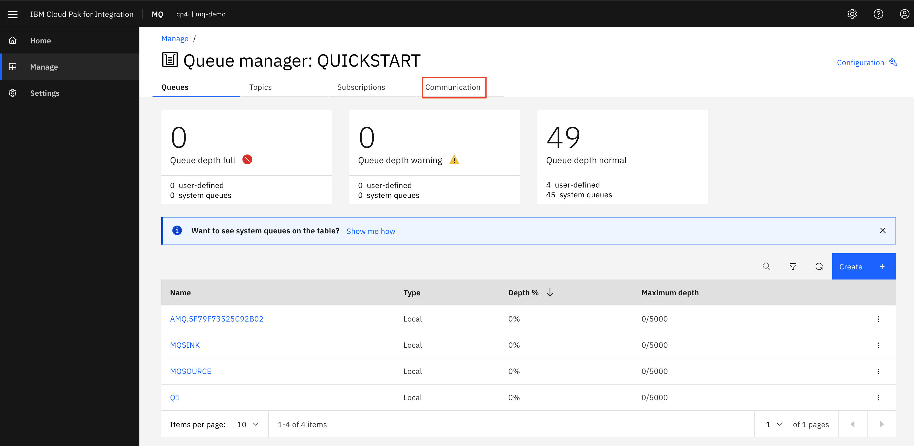

20.Verify the server channels are created. Click **App channels**. See the server channels that the **loadmq script** created: **EVENTTOMQ** to connect Event Streams to MQ and **MQTOEVENT** to connect MQ to Event Streams.

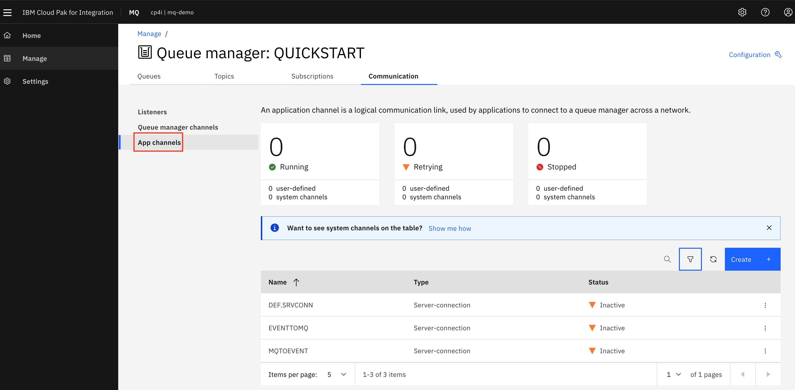

21.To connect to MQ (**QUICKSTART**), you need MQ server Address. In the Terminal. To get MQ server address, enter the OpenShift commands:

```
1. oc get svc | grep mq (list the mq services).
2. Copy the address of mq-demo-ibm-mq (**172.21.216.195**) – This address might be different.
```

## Task 3 - Configuring Event streams

Now that you are familiar with topics and creating them from the previous labs, you need to create a new topic for running the MQ source connector.
The connector requires details to connect to IBM MQ and to your IBM Event Streams or Apache Kafka cluster.
The connector connects to IBM MQ using a client connection. You must provide the following connection information for your queue manager:

```
•	The name of the IBM MQ queue manager: QUICKSTART
•	The connection name (one or more host and port pairs): * This is the MQ host address or IP address.
•	The channel name:
•	Sink: EVENTTOMQ
•	Source: MQTOEVENT
•	The name of the source IBM MQ queue: MQSOURCE
•	The name of the sink IBM MQ queue: MQSINK
•	The name of the target Kafka topic: mqtoevent
•	The name of the origin Kafka topic: eventtomq

```

1.Open a browser and go to the **IBM Cloud Pak Platform**. Select **Runtimes** and click **es-demo** for Event Streams.

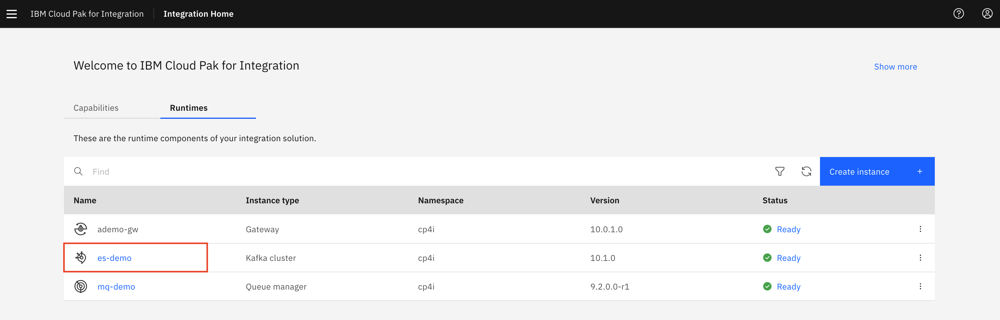

2.In Welcome to IBM Event Streams page, click Create a topic on the menu bar

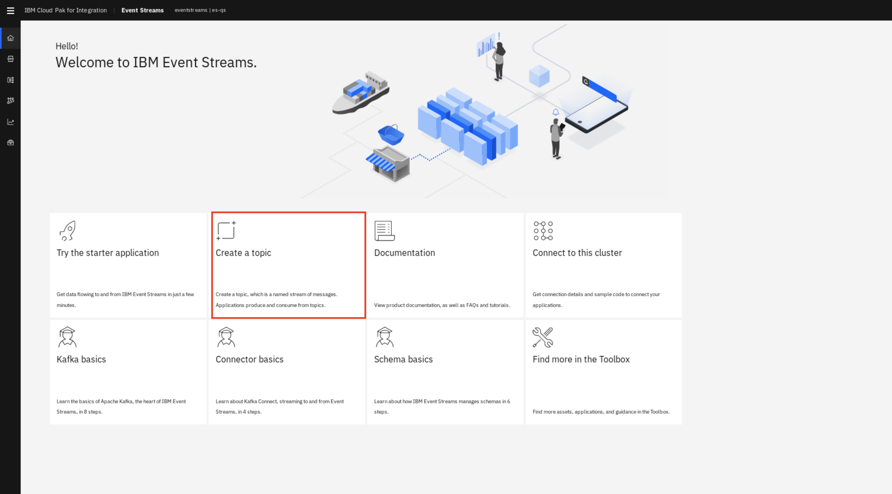

3.In the Create topic. Turn Show all available options to **On**. Use the following values when creating the topics. Create the following topics:

```
1.	Topic Name field, enter: **eventtomq**.
2.	Keep, Partitions: 1 (A partition is an ordered list of messages).
3.	Keep, Replicas: 3 (In order to improve availability, each topic can be replicated onto multiple brokers).
4.	Keep, Minimum in-sync replicas: 2 - (In order to improve availability, each topic can be replicated onto multiple brokers).
5.	Keep, Retention time: 10 minutes - (It Is time messages are retained before being deleted).
6.	Click Create topic.

```
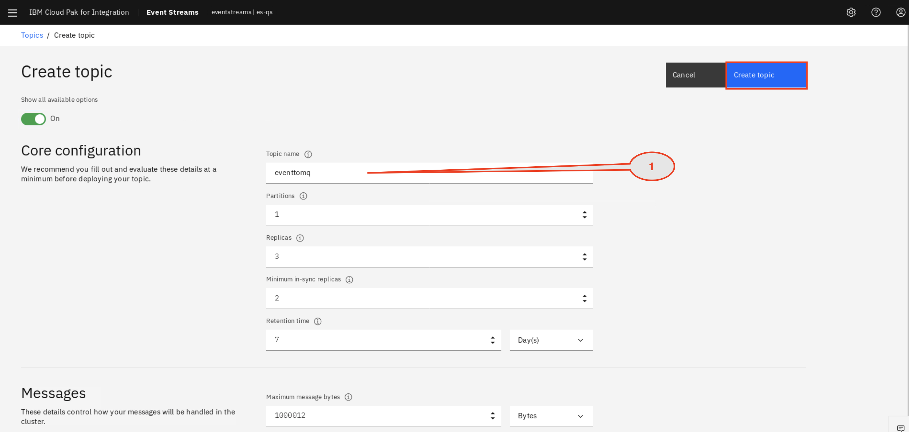

4.Repeat step 3, and create a topic **mqtoevent**.
Note: When all available options are On, you see a great amount of detail for each topic. You only need to edit the Core configuration section. If you turn the switch to Off, you need to click Next three times before the final pane where you click Create topic.

## Task 4 - Setup Kafka Connect

You can integrate external systems with IBM Event Streams by using the Kafka Connect framework and connectors.
Use Kafka Connect to reliably move large amounts of data between your Kafka cluster and external systems. For example, it can ingest data from sources such as databases and make the data available for stream processing.
Kafka Connect uses connectors for moving data into and out of Kafka. Source connectors import data from external systems into Kafka topics, and sink connectors export data from Kafka topics into external systems. A wide range of connectors exists, some of which are commercially supported. In addition, you can write your own connectors.

1.In Event Streams **Topics**, verify if the eventtomq and mqtoevent topics are created. Click **Connect to this cluster**. Kafka Connect uses an Apache Kafka client just like a regular application, and the usual authentication and authorization rules apply. Kafka Connect needs authorization to:

```
1.	Produce and consume to the internal Kafka Connect topics and, if you want the topics to be created automatically, to create these topics
2.	Produce to the target topics of any source connectors you are using
3.	Consume from the source topics of any sink connectors you are using

```
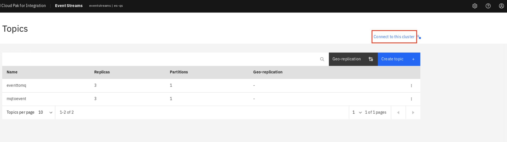

2.In Cluster connection page, save listener **External (1)**: **es-qs-kafka-bootstrap-eventstreams.apps.demo.ibmdte.net:443** (this address might be different) in a file and then click Generate SCRAM credentials. (https://en.wikipedia.org/wiki/Salted_Challenge_Response_Authentication_Mechanism).

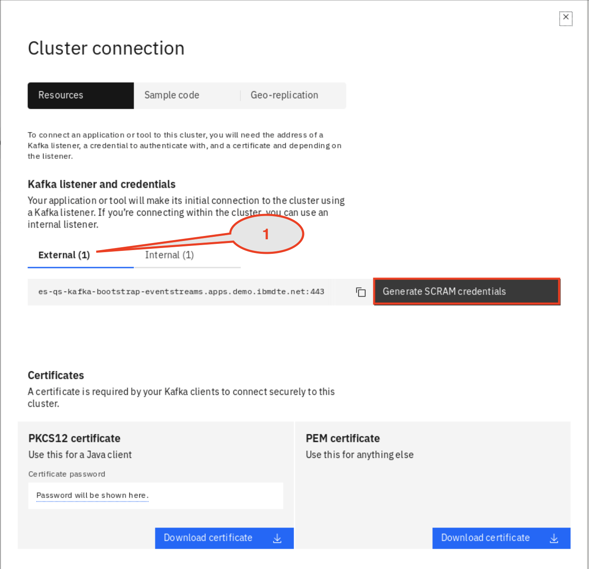

3.Enter the **credential name** (kafkauser): **mqeventstreams**, check Produce, consume messages and create topics and schemas and click **Next**.


4.In **Which topics does the application need to access?**, check **All topics** and click **Next**.

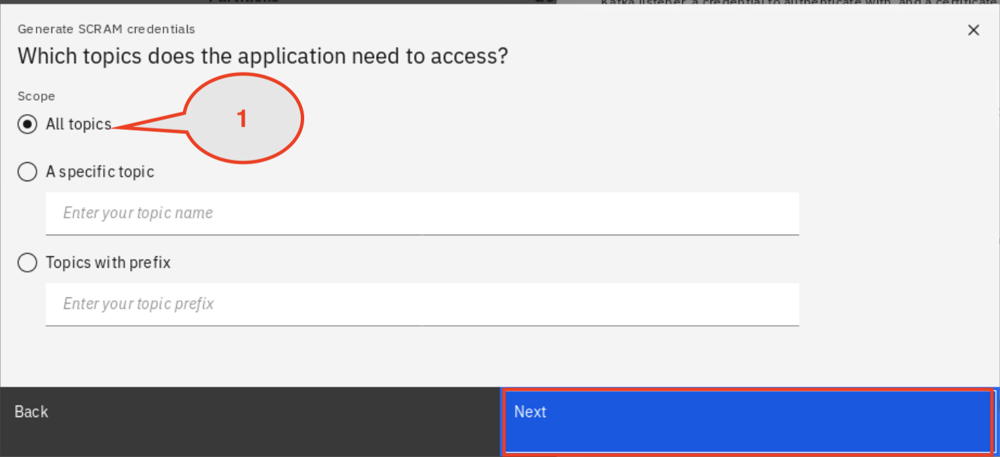

5.In **Which consumer group does the application need to access?**, check **All consumer groups** and click **Next**.


6.In **Choose which transactional IDs the application can access**, select **No transactional IDs** and click **Generate credentials**.

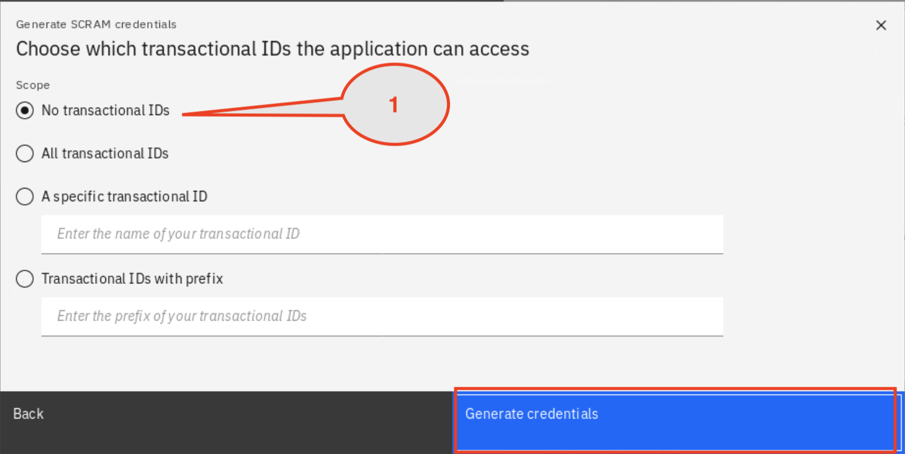

7.In **Cluster connection**. Event Streams generates the **SCRAM Credentials** as **username** and **password**. Your username is **mqeventstreams**.

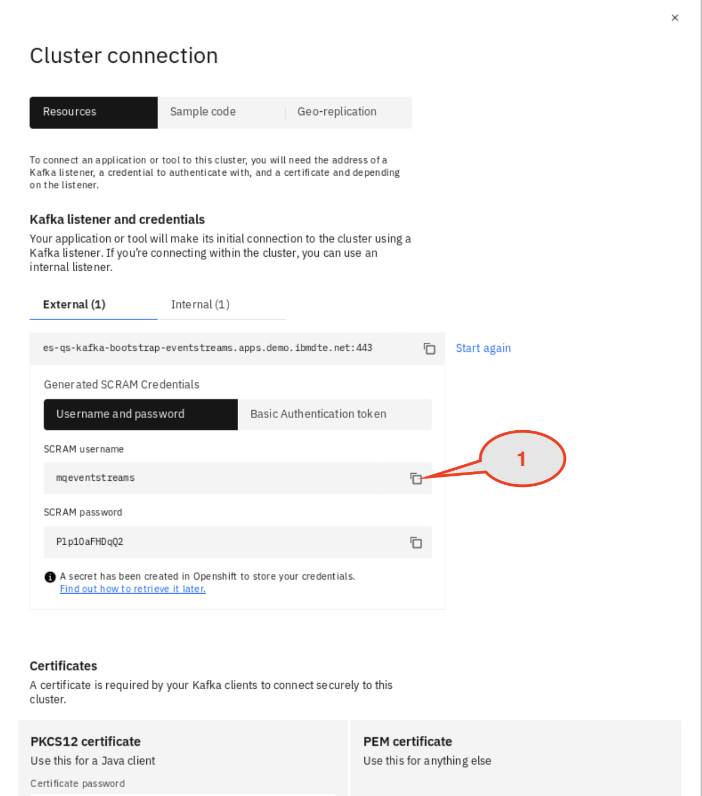

8.Click **Toolbox**. For this lab, you run two connectors (Sink and Source) as distributed mode. When running in distributed mode, Kafka Connect uses three topics to store configuration, current offsets and status. Kafka Connect can create these topics automatically as it is started by the Event Streams operator. By default, the topics are:

```
1.	connect-configs: This topic stores the connector and task configurations.
2.	connect-offsets: This topic stores offsets for Kafka Connect.
3.	connect-status: This topic stores status updates of connectors and tasks.
(If you want to run multiple Kafka Connect environments on the same cluster, you can override the default names of the topics in the configuration).

```
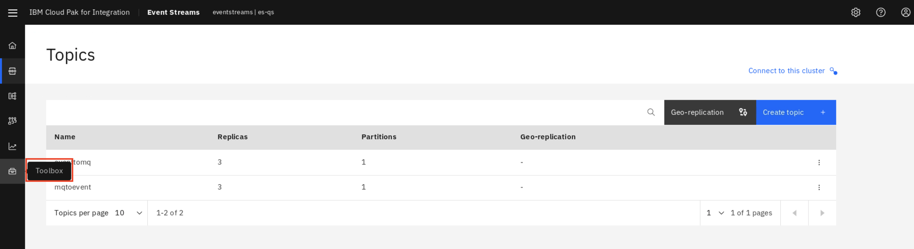

9.In **Toolbox** page, locate **Connectors** and click **Set up in Setup a Kafka Connect environment**.


10.To set up the Kafka connect environment. Click **Download Kafka Connect ZIP** to download the compressed file, then extract the contents to your preferred location. The default location is your **~/Downloads** directory. (**Do not close the browser**).

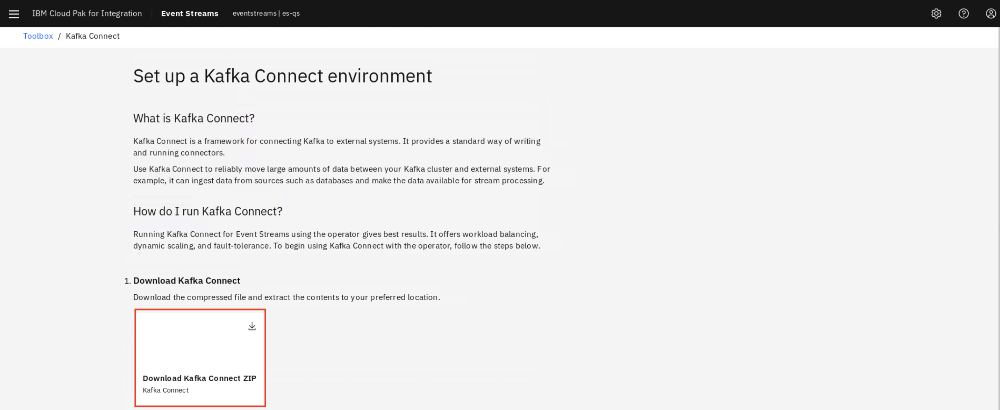

11.Open a terminal window. move **~/Downloads/kafkaconnect.zip** to  **~/Downloads/es-mq** directory (use **mv ~/Downloads/kafkaconnect.zip ~/Downloads/es-mq**).

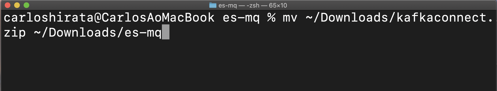

12.Extract the files in **kafkaconnect.zip**. Execute **unzip kafkaconnect.zip**. You have a Kubernetes manifest for a **KafkaConnectS2I** and an empty directory called **my-plugins**.

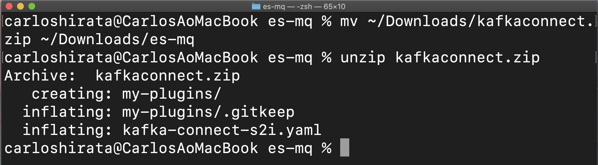

13.Provide **authentication credentials** in **authentication configuration**. Using the opened terminal window, enter **oc get secrets | grep es-demo**, locate **es-demo-cluster-ca-cert**.

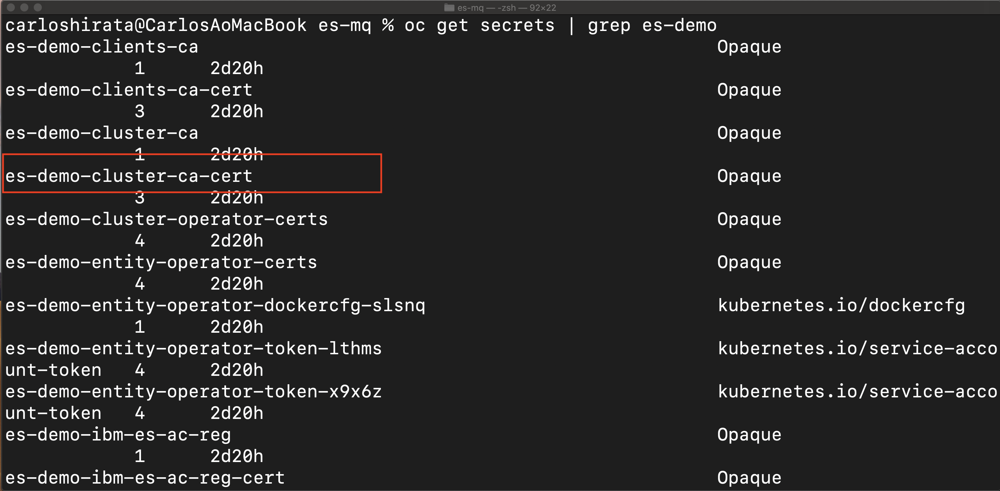

14.	In the Terminal, go to  **~/Downloads/es-mq** directory and edit **kafka-connect-s2i.yaml**. (We created a copy of **kafka-connect-s2i** as **kafka-connect-s2i.original**). Use **kafka-connect-s2i.original** as **kafka-connect-s2i.yaml**.(Do this **mv kafka-connect-s2i.original kafka-connect-s2i.yaml**).
**If your using kafka-connect-s2i.original, update the Event Streams bootstrapServers.**

```
1.	Verify the name of kafka connector: my-labconnect-cluster
2.	Enter Event Streams bootstrapServers (This address is different): es-demo-kafka-bootstrap-cp4i.mycluster-dal12-c-636918-4e85092308b6e4e8c206c47df210f622-0000.us-south.containers.appdomain.cloud:443.
3.	The productVersion should be changed to 10.1.0.
4.	The productChargedContainers should be my-labconnect-cluster.
5.	The cloudpakVersion should be: 2020.3.1 .
6.	We added this line and enter connection timeout in config: connection.timeout.ms: 50000.
7.	We added this line and enter read timeout in config: read.timeout.ms: 50000.
Remove all “#”.
8.	Enter es-demo-cluster-ca-cert as tls->trustedCertificates->secretname.
9.	Enter mqeventstreams as authentication->username.
10.	Enter mqeventstreams as authentication->passwordSecret->secretName.
11.	Enter password as authentication->passwordSecret->password (it means that you are referencing the password element in the kafkauser).

```
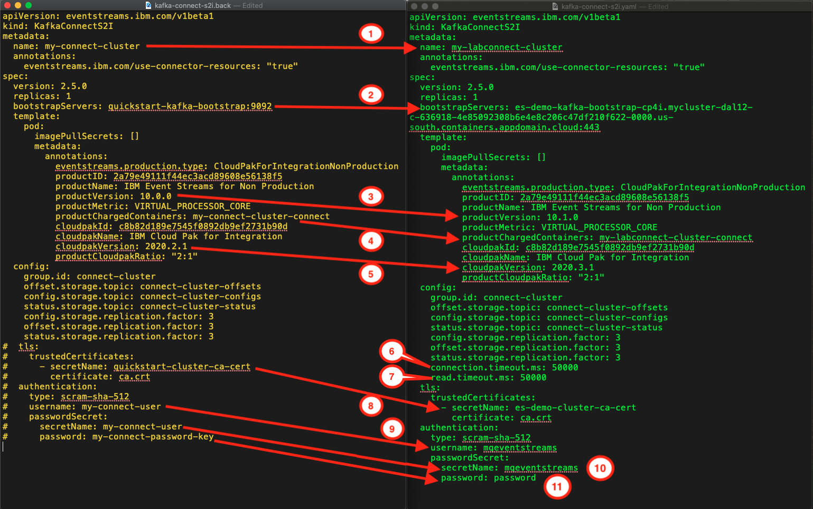

15.Deploy Kafka connect, in the terminal window in the **~/Downloads/es-mq** directory.

```
1.	Enter oc apply -f kafka-connect-s2i.yaml.
2.	Enter oc get kafkaconnects2i to verify the Kafka connect instance has been created.

```
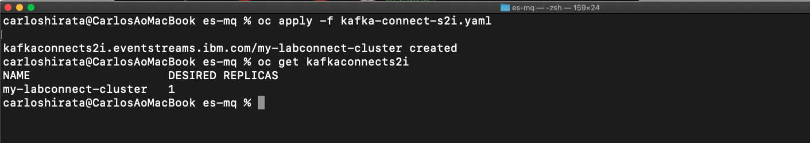

16.You have created a Kafka instance as **OpenShift Operator**, open a browser and go to OpenShift console.

```
1.	Select Operators->Installed Operators.
2.	Set Project: eventstreams. Click IBM Event Streams.
3.  Click Kafka Connect Source to Image.

```

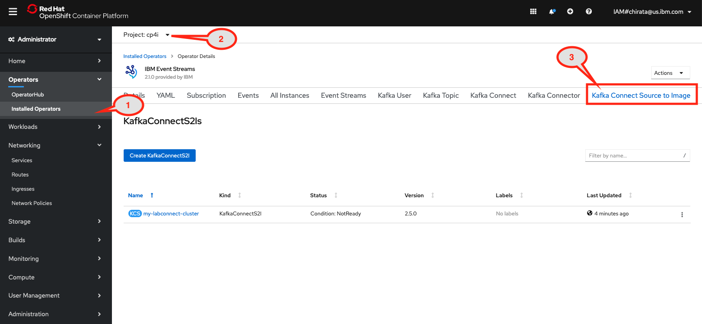

## Task 5 - Setup MQ connectors

The Event Streams connector catalog contains a list of tried and tested connectors from both the community and IBM®. Go to this page and check the IBM supported connectors (https://ibm.github.io/event-streams/connectors/).

Before you run this Task, check if you have these requirements:

```
-	Java Version:
    java version "1.8.0_261"
    Java(TM) SE Runtime Environment (build 1.8.0_261-b12)
    Java HotSpot(TM) 64-Bit Server VM (build 25.261-b12, mixed mode)
-	Maven:
    https://maven.apache.org/


```

1.Back to Set up Kafka Connect environment (you should keep the browser opened). Add two connectors in Kafka Connect Environment, select **Add connectors to your Kafka Connect environment**.

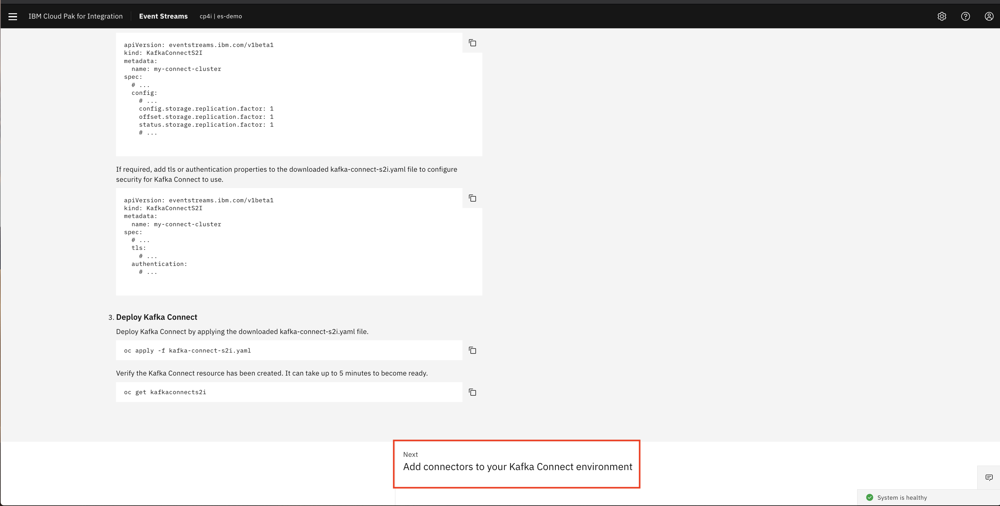

2.In Add connectors to your Kafka Connect environment, click IBM MQ Connectors.

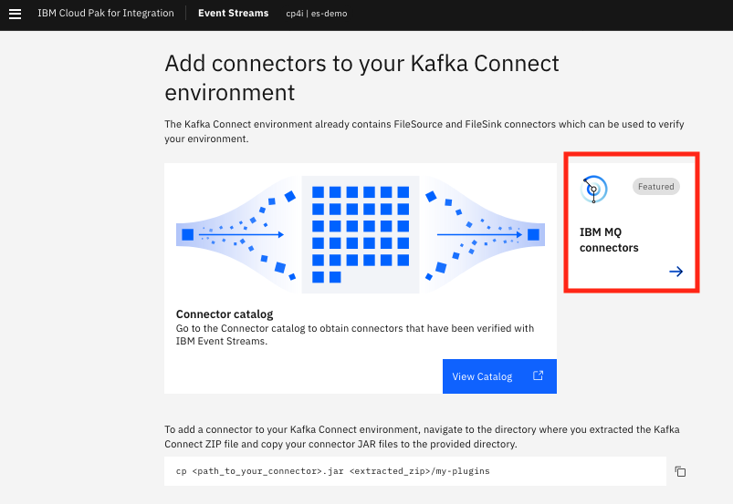

3.You can move data between **Event Streams** and **IBM MQ**. Add two connectors in the **Kafka Connect** environment. Download **MQ Source** the connector JAR and configuration. Click **Go to GitHub**.

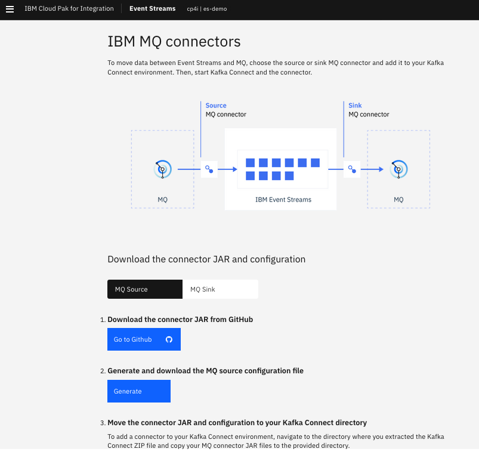

4.In the GitHub, locate Build the connector copy **git clone https://github.com/ibm-messaging/kafka-connect-mq-source.git**

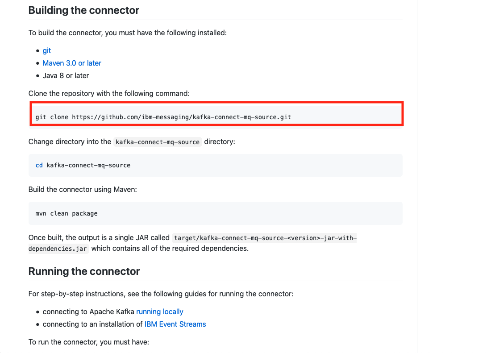

5.Open a terminal window and go to **~/Donwloads/es-mq** directory and Paste **git clone https://github.com/ibm-messaging/kafka-connect-mq-source.git**.

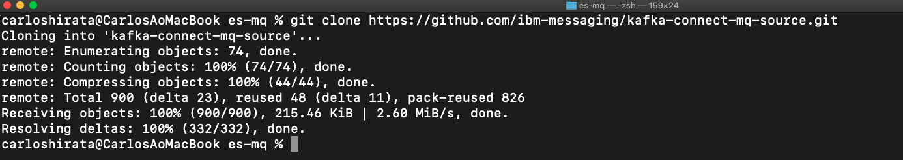

6.Go to the directory that Git creates **~/Downloads/es-mq/kafka-connect-mq-source** and enter **mvn clean package** (you should have to install MAVEN (https://maven.apache.org/ ) to build the connector (**kafka-connect-mq-source-1.3.1-jar-with-dependencies.jar**) using Maven. In the connector **kafka-connect-mq-source-1.3.1-jar-with-dependencies.jar**  is this directory:  **~/Downloads/es-mq/kafka-connect-mq-source/target/**

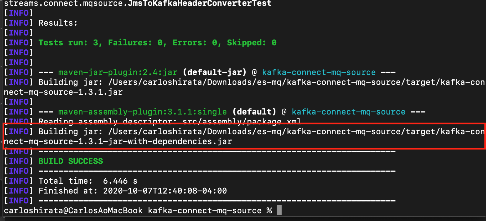

7.Back to IBM Connectors. To run IBM MQ Connector, you need mq-source properties file. This tool generates mq-source.json file, for our lab you need **mq-source.yaml** file. We generated for you in **~/Download/es-mq** directory.

8.Edit the **mq-source.yaml**. Update the mq.connection.name.list (you should save).

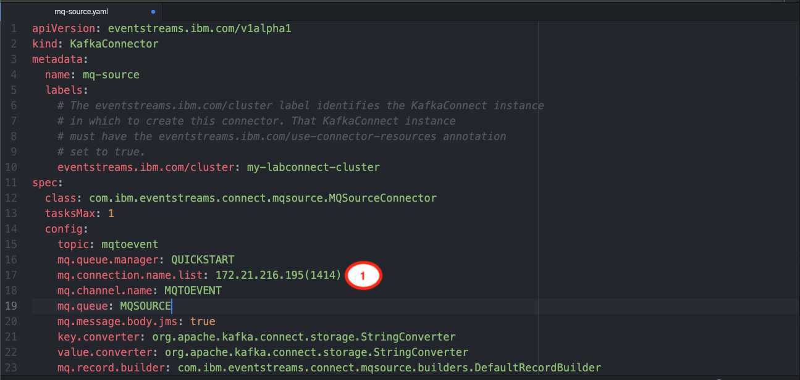

9.Change to **MQ Sink** in **IBM MQ connectors** page, clicking MQ Sink and then click Go to GitHub.

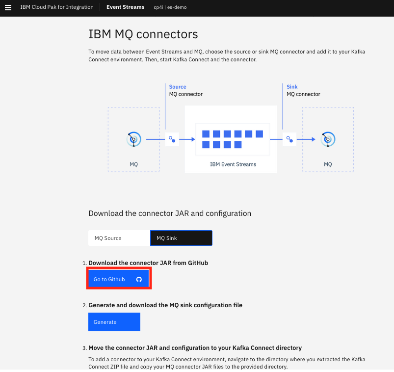

10.In the GitHub, locate Build the connector copy **git clone https://github.com/ibm-messaging/kafka-connect-mq-sink.git** .

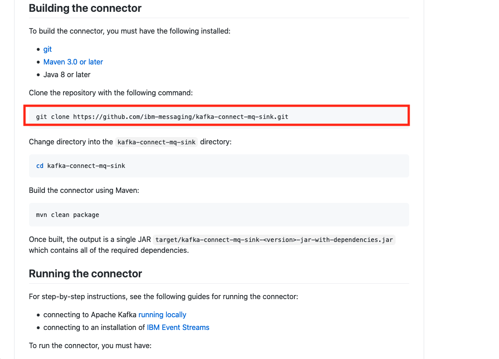

11.Open a terminal window and go to ~/Downloads/es-mq directory and Paste git clone **https://github.com/ibm-messaging/kafka-connect-mq-sink.git**.

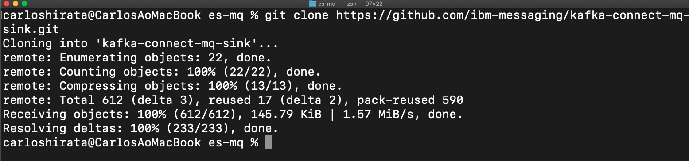

12.Go to the directory that git creates **~/Downloads/es-mq/kafka-connect-mq-sink** and enter **mvn clean package** to build the connector (**kafka-connect-mq-sink-1.3.1-jar-with-dependencies.jar**) using Maven.

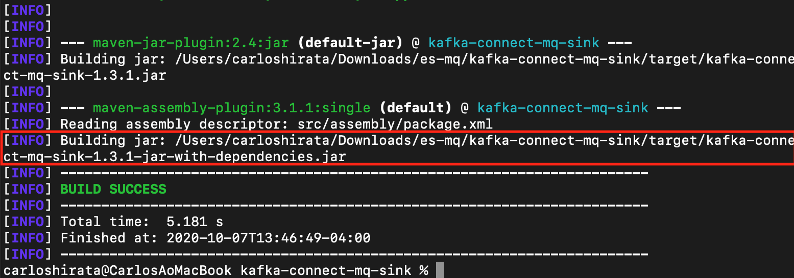

13.Back to IBM Connectors. To run IBM MQ Connector, you need mq-source properties file. This tool generates mq-sink.json file, for our lab you need mq-sink.yaml file. We generated for you in **~/Downloads/es-mq** directory.

14.Edit the **mq-sink.yaml**. Update the mq.connection.name.list (you should save).

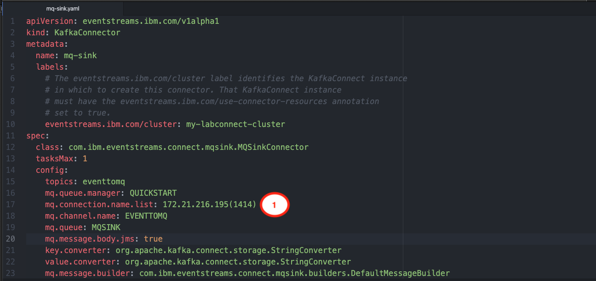

## Task 6 – Configuring and running MQ Connectors

In this task, start Kafka connect, you configured Kafka Connect S2I for your environment. Build Kafka Connect with MQ connectors (Sink and Source).

1.Open a terminal window and copy MQ source connector JAR file. Go to **~/Download/es-mq/kafka-connect-mq-source/target**. Copy **kafka-connect-mq-source-1.3.1-jar-with-dependencies.jar** to **~/Downloads/home/es-mq/my-plugins** (use **cp ~/Downloads/es-mq/kafka-connect-mq-source/target/kafka-connect-mq-source-1.3.1-jar-with-dependencies.jar ~/Downloads/es-mq/my-plugins**).

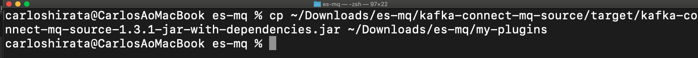

2.Do the same for MQ Sink connector JAR file. **~/Download/es-mq/kafka-connect-mq-sink/target**. Copy **kafka-connect-mq-sink-1.3.1-jar-with-dependencies.jar to ~/Downloads/es-mq/my-plugins** (use **cp ~/Downloads/es-mq/kafka-connect-mq-sink/target/kafka-connect-mq-sink-1.3.1-jar-with-dependencies.jar ~/Downloads/es-mq/my-plugins**).

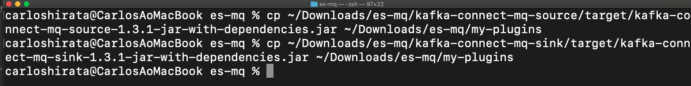

3.Go to **~/Downloads/ibmuser/es-mq** directory and build Kafka connect. Enter **oc start-build my-labconnect-cluster-connect --from-dir ~/Downloads/es-mq/my-plugins/ ** .

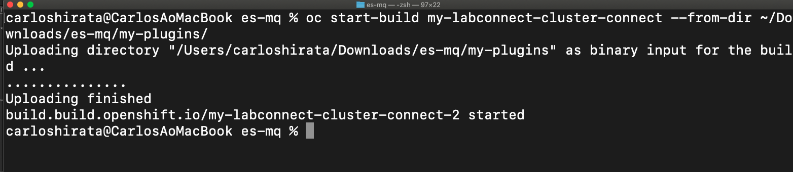

4.Check that the build is complete. Enter **oc get builds** .

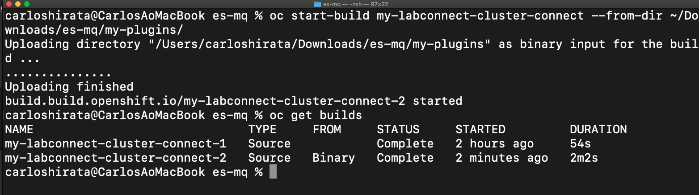

5.Check if pods are ready. Enter **oc get pods**.


6.We created **mq-source.yaml** and **mq-sink.yaml** for you in **~/Downloads/es-mq** directory.
You can find a file sample in **~/Downloads/es-mq/es-mq/kafka-connect-mq-source/deploy/strimzi.kafkaconnector.yaml** and **~/Downloads/es-mq/kafka-connect-mq-sink/deploy/strimzi.kafkaconnector.yaml**.

7.Start **mq-source connector**. Open a terminal window and go to **~~/Downloads/es-mq** directory and enter **oc apply -f mq-source.yaml** .


8.Start **mq-sink connector**. Open a terminal window and go to **~/Downloads/es-mq** directory and enter **oc apply -f mq-sink.yaml**.


9.Open a browser and click OpenShift console toolbar. Change Project to **cp4i** and select **Operators ->Installed Operators-> IBM Event Streams**.


10.Select **Kafka Connect Source to Image** and check **my-labconnect-cluster** is **Ready**.


11.Click **Kafka Connector** and verify two Kafka Connectors are Ready. Both connectors are running simultaneously.


## Task 7 – Testing MQ Connectors


Many organizations use both IBM MQ and Apache Kafka for their messaging needs. Although they’re generally used to solve different kinds of messaging problems, users often want to connect them together for various reasons. For example, IBM MQ can be integrated with systems of record while Apache Kafka is commonly used for streaming events from web applications. The ability to connect the two systems together enables scenarios in which these two environments intersect.

1.Open a browser and go to IBM Cloud Pak for Integration. Select **Runtimes** and click **mq-demo**.


2.Select Default Authentication


3.You might need to log in. Click Log in (Username and Password are cached).


4.In **Welcome to IBM MQ** page, click **Manage QUICKSTART** .


5.In **Queue Manager:QUICKSTART** page, click the queue **MQSOURCE**.


6.The Queue should be empty and to send a message, click **Create** .


7.Enter a message that you want to send to Event Streams and click **Create** (for example: **Sending a message to Event Streams**). Queue **MQSOURCE** should be empty, which indicated IBM MQ has sent the message to Event Streams


8.Back to IBM Cloud Pak for Integration. Select **Runtimes** and click **es-demo**. In the **Welcome to IBM Event Streams**, click **Topics** on the left.


9.You see the list of topics. You created **eventtomq** and **mqtoevent**. **Kafka Connector** creates three more system topics, click **mqtoevent**& topics.


10.In topics **mqtoevent**, click **Messages** and select the message.


11.Click Monitoring icon on the left and observe the **Incoming** and **Outgoing bytes**.


12.You see the incoming and outgoing bytes.


13.You need to produce to send events to MQ queue. Go to **Toolbox**.


14.In Starter Application, click **Get Started** .


15.Go to **step 1** in **Configure & run starter application** to download the JAR file for the starter application.


16.In the **GitHub**, click **demo-all.jar** file and download (the demo-all.jar file is in **~/Downloads**).


17.Back to **Configure & run starter application**. Go to **step 2**, click **Generate properties** .


18.In the window generate properties:
```

1.	Enter Starter Application Name: mqeventstreamsapp.
2.	Select Existing topic and click Select a topic: eventtomq.
3.	Click Generate and Download the compressed file.
4.	The file mqeventstreamsapp.properties.zip is in ~/Downloads.

```


19.Open a terminal window and move ~/Downloads/demo-all.jar and mqeventstreamsapp.propeties.zip to ~Downloads/es-mq directory (use mv ~/Downloads/demo-all.jar ~/Downloads/es-mq).

20.Go to **~/Downloads/es-mq** and create a directory **estomq** (Use **mkdir -p estomq**). Move, use **mv ~/Downloads/mqeventstreamsapp_properties.zip to ~/Downloads/es-mq/estomq**.


21.Go to **estomq** directory and extract the file (Use **unzip mqeventstcdreamsapp.propeties.zip**).


22.Go to **~/Download/es-mq** and run the following command with the full file path to the **kafka.properties** file and certificates downloaded: **java -Dproperties_path=estomq -jar demo-all.jar** . Check the log message: Application started in ms.


23.Back to **Configure & run starter application** page. Access the started application, clicking **localhost:8080**.


24.Insert a message in the left window (for example, **Sending events from IBM Event Streams to IBM MQ**) and click **Start producing** and then click **start consuming**. Send more than 30 messages and click to stop producing and consuming.


25.Back to **Configure & run starter application**. Click **Go to the message browse link**.


26.	See the events that have sent to MQ.
27.	Click Monitoring on the left and see the Incoming and Outgoing bytes.


28.	Check the messages incoming and outgoing.


29.	Open a browser and click IBM Cloud Pak for Integration. Select **Runtimes** and click mq-demo.

30.	Go to mq instance and In Welcome to IBM MQ page, click the menu on the left, selecting Manage.


31.In **Manage**, verify in the **Maximum depth** and click the queue **MQSINK**.


32.Check the messages have arrived in **MQSINK** queue and click one message and then click Application data and see the message.


## Task 8 - Using Operations Dashboard (tracing)

**Cloud Pak for Integration Operations Dashboard Add-on** is based on **Jaeger** open source project and the **OpenTracing** standard to monitor and troubleshoot microservices-based distributed systems. **Operations Dashboard** can distinguish call paths and latencies. **DevOps** personnel, developers, and performance specialists now have one tool to visualize throughput and latency across integration components that run on Cloud Pak for Integration.

**Cloud Pak for Integration Operations Dashboard Add-on** is designed to help organizations that need to meet and ensure maximum service availability and react quickly to any variations in their systems.

1.Go to the IBM Cloud Pak Integration main page. In the **Capabilities** section, click capability type to access tracing namespace to open the Operations Dashboard instance.


2.In the Tracing page, check the Overview page. You see all products that you can use this tool: APIC, APP Connect and IBM MQ. (more tracing products will add in the future releases). Click **MQ Overview**.


3.See IBM **MQ overview**. Click **Traces**.


4.**Operations Dashboard** generated a list of tracing. Select a line to analyze the trace of IBM MQ.


5.Check the tracing chart. Check the number of interations.


## Summary

You have successfully completed the tutorial. You were able to add a layer of secure, reliable, event-driven, and real-time data, which can be reused across applications in your enterprise. You learned how to:

•	Configure message queues
•	Create event streams topics
•	Configure message queue connectors (sink and source)
•	Start a test run of the flow and view the data
•	Analyze MQ using Operations Dashboard

To try out more labs, go to Cloud Pak for Integration Demos. For more information about the Cloud Pak for Integration, go to https://www.ibm.com/cloud/cloud-pak-for-integration.
