import ArticleDetails from '../../../../src/gatsby-theme-carbon/components/ArticleDetails'

<ArticleDetails name="Carlos Hirata, Ravi Katikala" lastUpdated="September 2020" readTimeMinutes="45" />

IBM Event Streams is based on years of operational expertise IBM has gained from running Apache Kafka® Event
Streams for enterprises. On OpenShift® 4.4 and IBM Cloud Pak for Integration 2020.2.1, IBM Event Streams offers enterprise-grade security, scalability, and reliability running on Red Hat® OpenShift® Container Platform as certified contain.

<AnchorLinks>
  <AnchorLink>Introduction</AnchorLink>
  <AnchorLink>Prepare the environment</AnchorLink>
  <AnchorLink>Create and manage Event Streams topics</AnchorLink>
  <AnchorLink>Use a Starter application to send and receive data</AnchorLink>
  <AnchorLink>Verifying the events in a topic</AnchorLink>
  <AnchorLink>Using Event Streams Monitoring</AnchorLink>
  <AnchorLink>Share the API</AnchorLink>
  <AnchorLink>Installing an IBM Event Streams v.10 instance in IBM Cloud Pak for Integration using Red Hat Operators</AnchorLink>
  <AnchorLink>Summary</AnchorLink>
</AnchorLinks>

## Introduction

Building an event-driven architecture with IBM Event Steams allows organizations to transition from traditional monolith systems and silos to more modern microservices and event streaming applications that increase their agility and accelerate their time to innovation.
IBM Event Streams is an event-streaming platform based on the Apache Kafka® project and incorporates the open source Strimzi technology. IBM Event Streams v10 includes Kafka release 2.5.0, and supports the use of all Kafka interfaces.

As this is a new deployment of the Cloud Pak for Integration, you must execute some steps to prepare the environment. Initial setup steps are only needed for a fresh installation of the platform. They do not need to be repeated.
All work for this lab is done on the Developer Machine. Open the developer Machine VM by clicking the tile.

## Takeaways

-   Preparing IBM Cloud Pak for Integration 2020.2.1 running on Red Hat OpenShift 4.4
-   Creating and managing Event Streams topics
-   Using a Starter application to send and receive data
-   Verifying the events in a topic
-   Using Event Streams Monitoring
-   Installing  an IBM Event Streams v.10 instance in IBM Cloud Pak for Integration using Red Hat Operators

## Preparing the environment

As this is a new deployment of the Cloud Pak for Integration, you must execute some steps to prepare the environment. Initial setup steps are only needed for a fresh installation of the platform. They do not need to be repeated.

1.All work for this lab is done on the Developer Machine. Open the Developer Machine VM by copying the Client VM VNC link in a browser window from your email or the Reservation Details as shown below.


Use the password specified in parenthesis to login to VNC


2.In your workstation open a browser and enter http://cloud.ibm.com and enter your **ibmid** and click continue and password to login IBM Cloud.

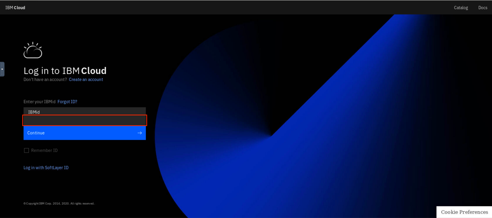

3.Enter your IBM userid  and the password and then enter the verify code.


4.In the IBM Cloud Dashboard. You see all information about the infrastructure. On the Resource summary. Observe if you have one cluster and click **Cluster** link.


5.You see the  available resources for your cluster. Select Clusters arrow and click your cluster line.


6.In the cluster page, you see the status of your cluster infrastructure,. such as worker node, CPU and Memory usage. Click **OpenShift Web Console**.


7.In the OpenShift console. Select the following:

```
    a. **Networking**

    b. **Routes**

    c. Drill down the Project to **Integration**

    d. Click the **Navigator** link.

```
  

8.Select **Default authentication** as authentication type.


9.You might need to login screen for IBM Cloud Pak might be displayed, enter the username: admin and Password (Enter the 32 characters password that you created when you made the Cloud Pak provisioning) and Click Log in.
Tip: You might need to use the password. You can use the Clipboard to save the password.


10.In the Cloud Pak Welcome page, you see Capabilities and Runtimes instances.


## Creating and managing Event Streams topics

Applications connect to Event Streams topics and write to and read from them. Topics are known groupings of related data. Topics are created and configured by the Event Streams administrator.

1.You use an existing Event Streams instance create In Runtimes and instances.

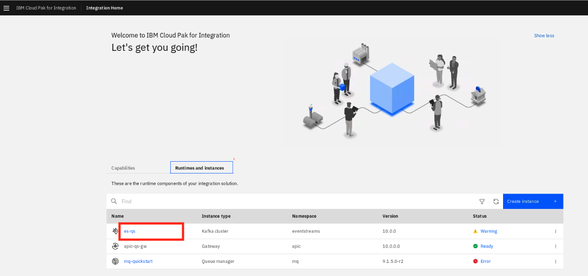

2.You see the Welcome to IBM Event Streams page. You create an Event Streams topic, select and click the Create a topic tile. From this page you can navigate and learn more about Event Streams.

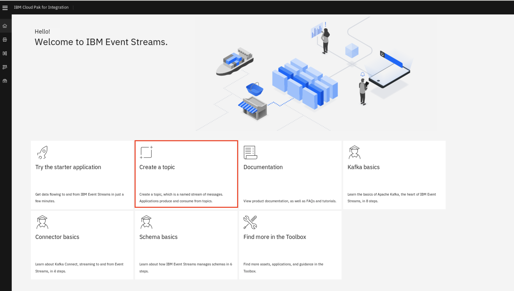

3.Enter the name of topic : **eslabtopic**, this is the name used to identify the topic in the Event Streams instance.
Note: This lab is preconfigured to connect to that specific topic. You can view the full range of configuration options by setting the **Show all available options** to on. However, this tutorial only focuses on the core set.

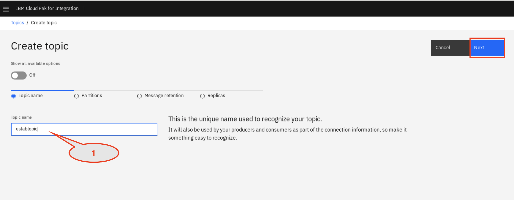

4.Change the partitions to **three** and you see the messages to be distributed across the brokers to increase the scalability. Set three partitions and click **Next**.


5.Define the message retention time. Set it to **10 minutes** for this lab. Click **Next**.

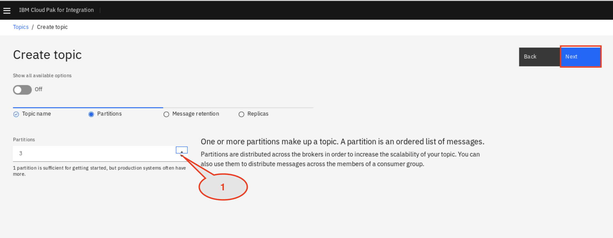

6.Define the number of replicas for your topic. Select the default setting of Replication factor: **3** and Minimum in-sync replicas: **2** and then click **Create topic**.

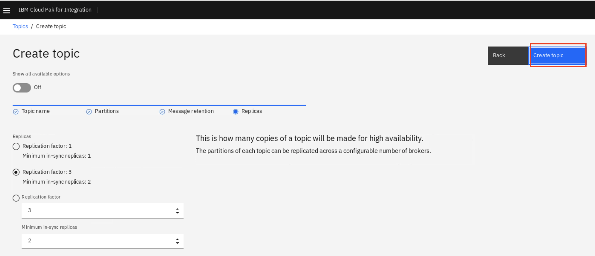

7.The **Topics** page is displayed. Your new topic is displayed along with a completion notification. You can now connect the starter application to Event Streams. On the left, click **Toolbox** icon.

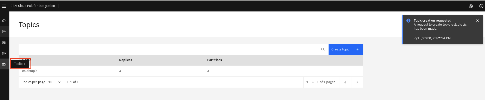

## Using a Starter application to send and receive data

In this task shows you how to generate and run a starter application. Using the starter application, you can see how producing and consuming applications connect to a topic and send messages (a message is a unit of data in Kafka). Data sent by the producer can be viewed in the topic in Event Streams. You can then view the same data in the consuming application.
Event Streams includes several tools that can be used to test Event Streams and help with the development of Event Steams-based applications.

1.In Toolbox page you can see tools that allow you test and access Event Streams topics. To test the topic that you created, click **Get Started** icon.

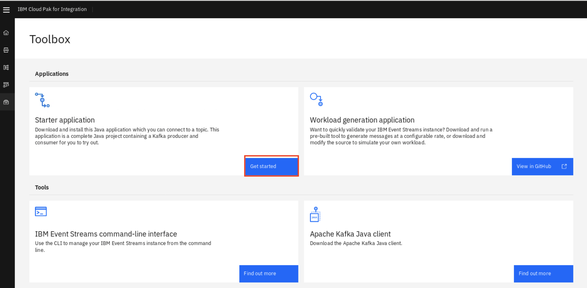

2.The **Configure & Run starter application** page is displayed where you can configure and generate an application, run an application, and send and receive messages (data). Follow the Steps, click **Download JAR from Girhub**.

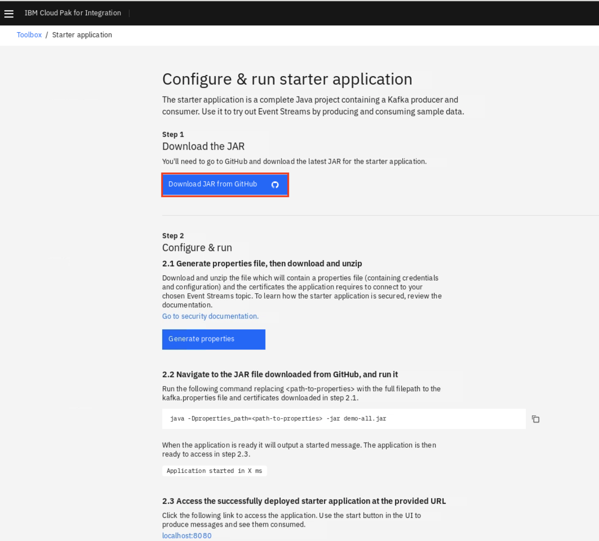

3.In the **Github page**, locate and click to download **demo-all.jar**. The **JAR** file is in your download directory **/home/student/Downloads**.

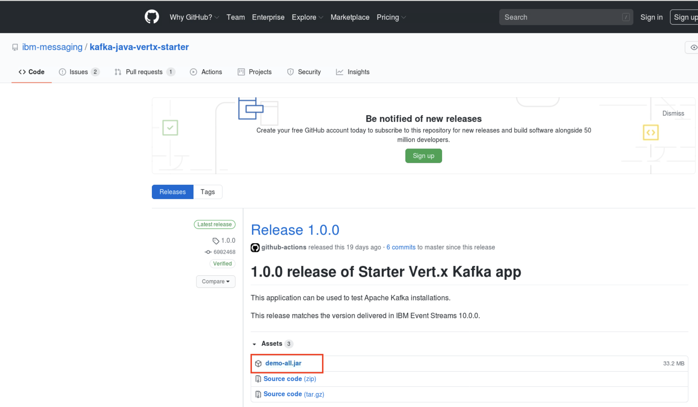

4.Back to **Configure & run starter application** page. Generate the properties .zip file (contains credentials and configuration). Click **Generate properties**.


5.In the pop window on the right, enter the following:

```

  1.Enter Starter application name: **eslabtesterapp**.
  2.Click Existing topic.
  3.Select the topic name: **eslabtopic**.
  4.Click **Generate and download .zip** file.
    This file is in the **/home/student/Downloads** directory.

```
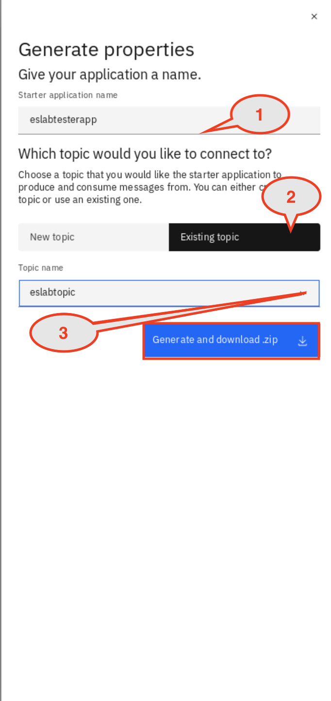

6.Do not close the browser. Open a command line.

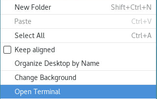

7.In the terminal:

```

  1.Create a directory. Use this command: “ mkdir -p eslab “
  2.Move demo-all.jar from Downloads directory to /home/ibmuser. Use this command “ mv ~/Downloads/demo.all.jar  . “
  3.Move from Downloads eslabtesterapp_properties.zip file to /home/student/eslab directory. Use this command: “mv  ~/Downloads/eslabtesterapp_zip ~/eslab

```


8.In terminal:

```

  1.Go to **eslab** directory, use this command:  “ **cd eslab** “
  2.uncompress the **eslabtesterapp.zip**, use this command: “**unzip eslabtester.zip**“

```
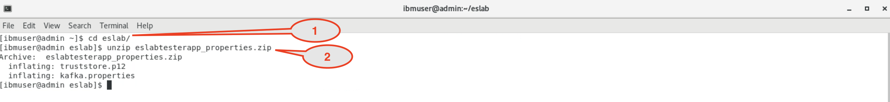

9.Do not close the window terminal. Back to **Configure & Run starter application** page. Locate **Navigate to the JAR file downloaded from GitHub and run it**, click the copy icon (this is an application that allows you send/receive messages in a topic).

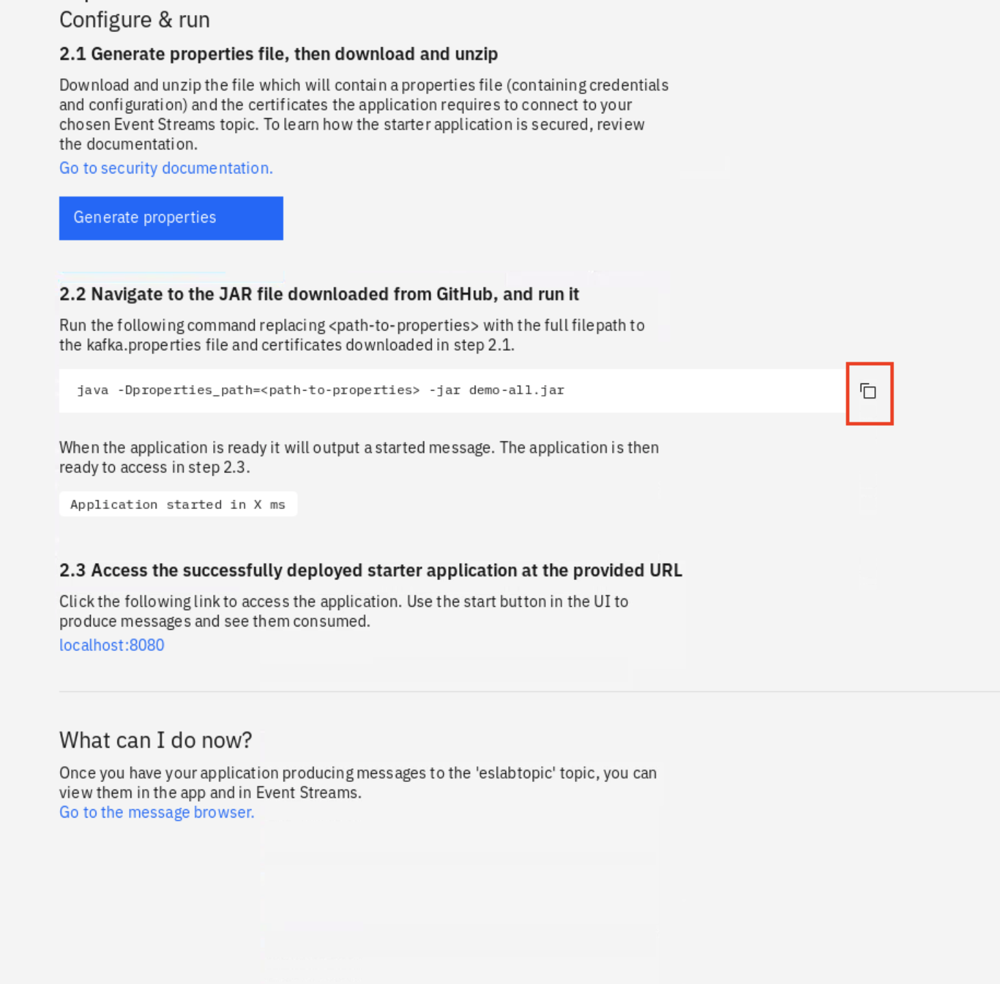

10.Do not close the browser. Open the terminal window (make sure you are in /home/ibmuser directory, use this command: “**pwd**”. Paste the command and replace **path-to-properties** to **/home/student/eslab/** execute the maven command to run the starter application.

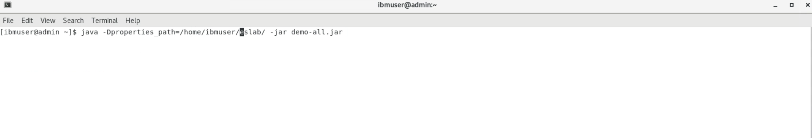

When the message **Application started in 1917ms** (This value might be different)

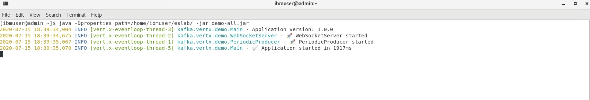

11.Back to **Configure & Run starter application** page. Locate **Access the successfully deployed starter application at the provided URL**. Click the link **localhost:8080** .

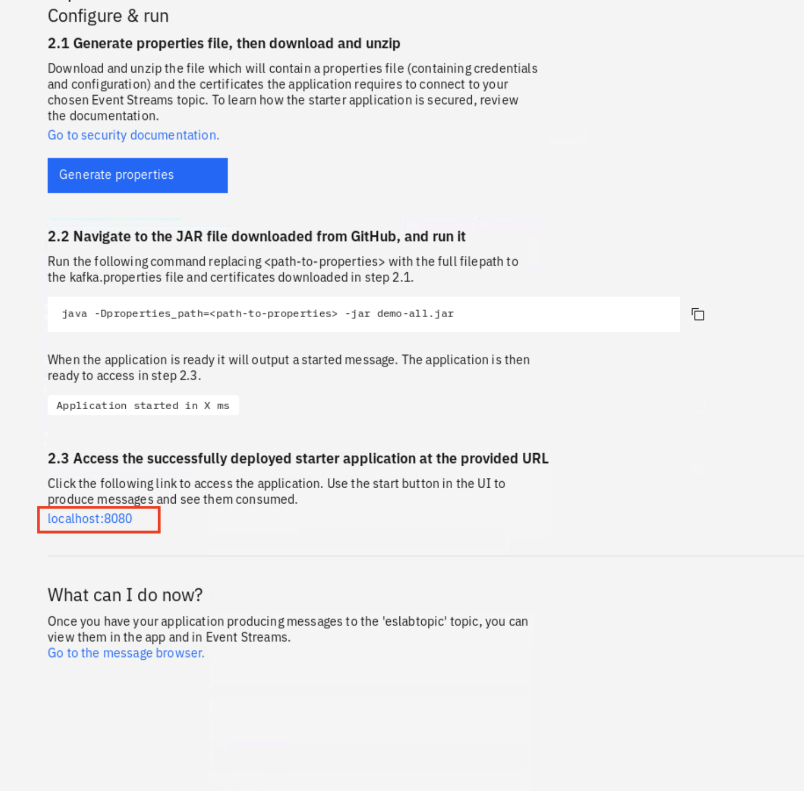

12.We see two frames:  **Producer and Consumer**. Type a message (for example: Using IBM Event Streams) in the **payload** field and click **start producing**, and click **start consuming** see messages appearing in the consuming application as they are consumed from the Event Streams topic and let the application running (**54** messages). Look at **Offset**. **Stop the Producer by clicking the start/pause button** (**play button when not active, and spinning blue circle when running**). Also, click the blue icon in the **Consumer** to stop listening for messages. You can see that the message is distributed on three partitions (0, 1, and 2).

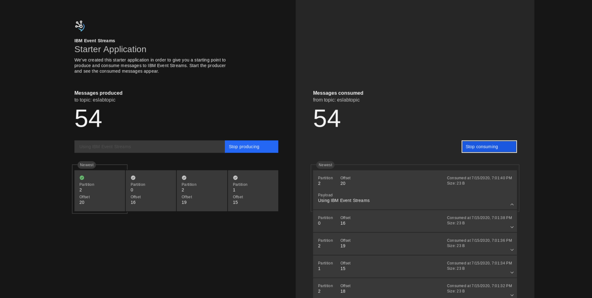

13.Back to **Configure & Run starter** application page. Locate the link **Go to the message browser** to View the messages.

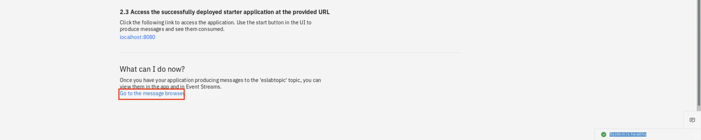

14.See the messages in the topic: **eslabtopic** and the messages in the three partitions. You can see the Event Streams monitoring tool. On the left menu, click **monitoring icon**.

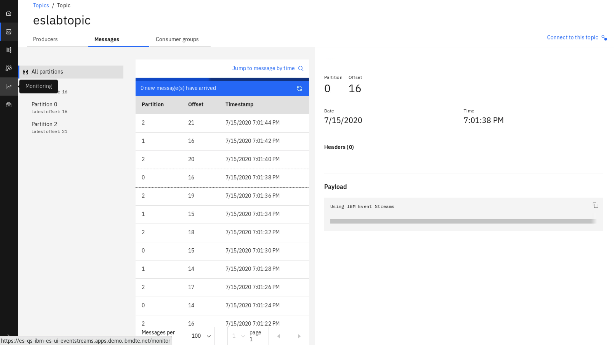

15.Use the Event Streams interface to evaluate the messages produced, for example, information such as the **Incoming bytes and Outgoing bytes**.

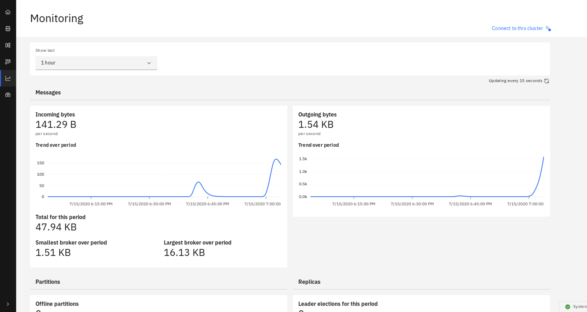

## Installing an Event Streams instance using OpenShift Operator

IBM Event Streams v10 is an operator-based release and uses custom resources to define your Event Streams configurations. The Event Streams operator uses the custom resources to deploy and manage the entire lifecycle of your Event Streams instances. You can install in any namespace for this lab use eventstreams namespaces.

1.In the browser, click the Bookmark toolbar OpenShift console. Locate **Operators -> Installed Operators** ,change project to **eventstreams** and click **IBM Event Streams**.

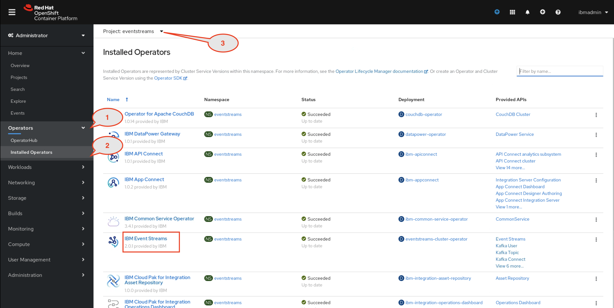

2.In the Event Streams **Operator Details**. You see all APIs available for installing, including Event Streams, Kafka and Geo-Replicator. Click in Event Streams tile **Create Instance**.

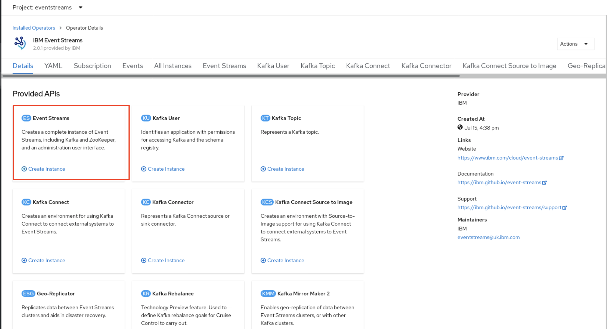

3.In the Event Streams page, you see the Event Streams installed (es-qs). To create a new Event Streams, click Create **EventStreams**.

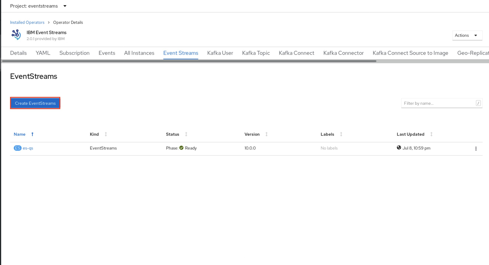

4.In **Create EventStreams** page, You see two windows, on the left it is a yaml file that contains the Event Streams configuration and on the right you can use JSON configuration. Select **Samples** link to select which instance of Event Streams (you use **Develepoment**) and then click **Try it**. After you select these the yaml file changes.


5.Now, in yaml file, enter the new name: **eslab** and accept the license enter **true**.

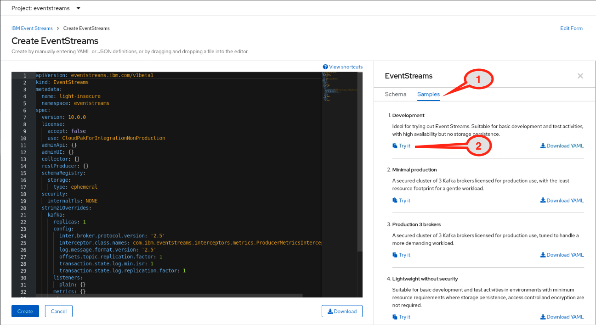

6.The installation process takes 5-10 minutes. You see the two Event Streams running in the project **eventstreams**.

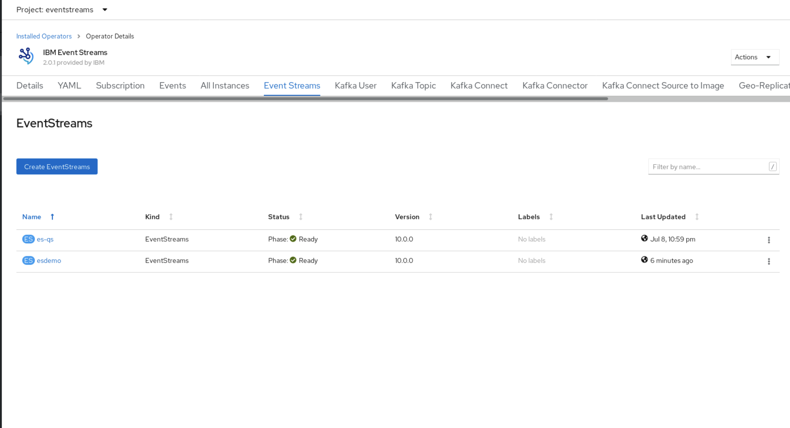

7.Go to IBM Cloud for Integration page, clicking bookmark toolbar. You see the Integration capabilities and the new event streams capability **eslab**. Click **eslab** to open the Event Streams page.

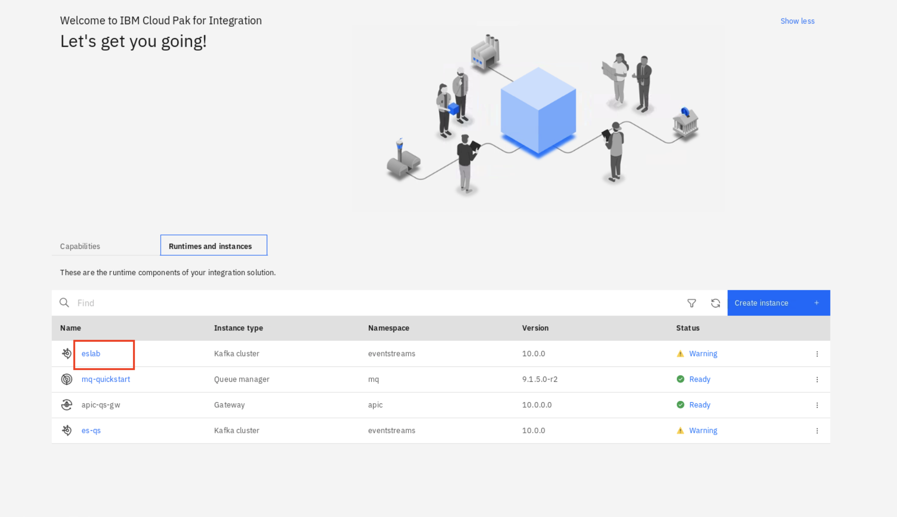

8.On the right, check if the **System is healthy**.


9.Click the tile **Create a topic** .


10.Enter the topic name: **esdemotopic** and click **Next**.

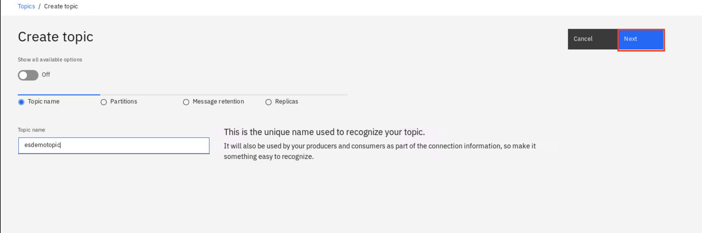

11.Change the partition to **3** and click **Next**.

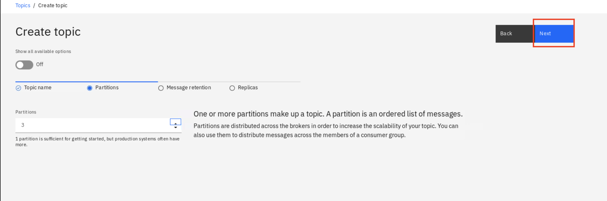

12.Change the retention period to **10 minutes** and click **Next**.

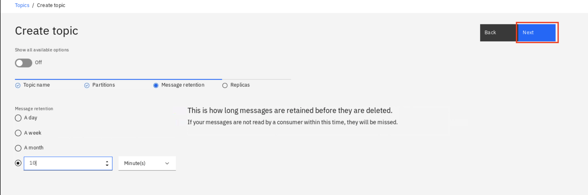

13.Keep the replication factor: **3** and click **Create a topic** .


14.Check the topic created.

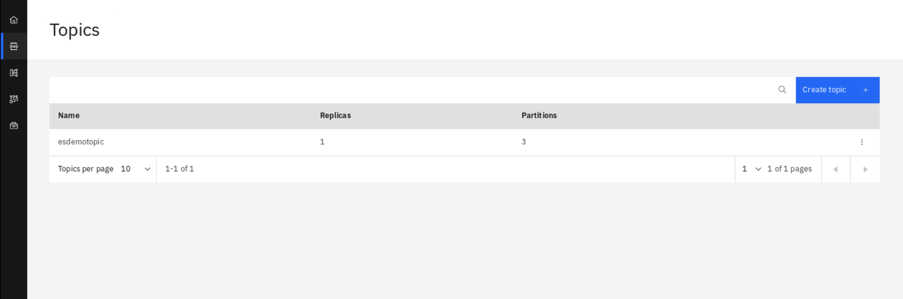

## summary

You have completed this Tutorial and you've learned how to:

•	Created a topic in an Event Streams instance
•	Used an application to test the topic
•	Browsed the message in a topic
•	Monitored the messages inbound and outbound
•	Installed an event streams instance using RedHat OpenShift Operator

To try out more labs, go to Cloud Pak for Integration Demos. For more information about the Cloud Pak for Integration, go to https://www.ibm.com/cloud/cloud-pak-for-integration .
