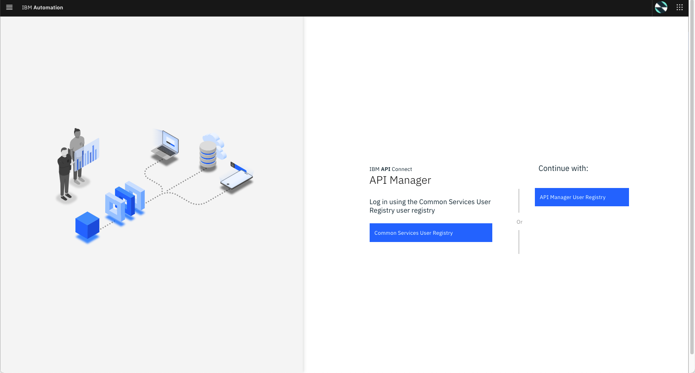

import ArticleDetails from '../../../../src/gatsby-theme-carbon/components/ArticleDetails'


<FeatureCard
  title="API Lifecycle - Manage GraphQL API"
  color="dark"
  >


</FeatureCard>

<AnchorLinks>
  <AnchorLink>Lab Overview</AnchorLink>
  <AnchorLink>Prerequisites</AnchorLink>
  <AnchorLink>Business Context</AnchorLink>
  <AnchorLink>Create a GraphQL Proxy API</AnchorLink>
  <AnchorLink>Edit and Test API</AnchorLink>
  <AnchorLink>Create a Product and apply GraphQL RateLimits</AnchorLink>
  <AnchorLink>Explore the API from Developer Portal</AnchorLink>
  <AnchorLink>Summary</AnchorLink>
</AnchorLinks>

***

<ArticleDetails name="Rafael Osorio, Ravi Katikala" lastUpdated="May 2021" readTimeMinutes="45" />

***

## Lab Overview

In this tutorial, you use the IBM Cloud Pak for Integration 2021.1.1 to define GraphQL APIs that proxy to a backend GraphQL server. GraphQL is a query language for APIs that gives an application client greater control over what data it retrieves in an API request when compared with a REST API request.

API Connect GraphQL support also allows rate limiting and other controls using API Gateway.

In this tutorial, you will explore the following key capabilities:
- Create a GraphQL Proxy API
- Learn about GraphQL introspection and Schema Editor
- Test APIs by using the built-in GraphQL editor
- Review API Assembly Policies for the cost end point

***

## Prerequisites

  - You need to have your personal CP4I on ROKS environment. [Check here how to request it](https://ibm-garage-tsa.github.io/cp4i-demohub/cp4i-on-roks/)

***

## Business Context

As a developer, you are having problems to manage the use of GraphQL APIs in your company.

GraphQL provides the following particular advantages over REST APIs:
  - The application client can request only the data that it needs. For example, when retrieving bank account records, request only the account number and current balance for each account, but not the customer name and address details. With a REST API request, either the backend REST service must provide separate endpoints for different data subsets, or the application client must retrieve the complete records and then discard the unwanted data.
  - The application client can retrieve multiple related resources in a single request. For example, a customer's bank account record might include an array that references other finance products that the customer holds. If an application client wants to retrieve the bank account details for a specific customer, and details of the other finance products for that customer, then with a REST API the client would first retrieve the bank account details, then make separate requests for each of the other products. A GraphQL API can be designed to allow the client to retrieve all this information in a single request.

However, this flexibility presents rate limiting challenges, because two seemingly very similar requests might return vastly different amounts of data, and what might have required multiple REST API requests, each counting towards the rate limit, might require only a single GraphQL API request. It is important therefore that rate limiting controls are imposed that reflect the amount of data that is retrieved. 

Cloud Pak for Integration API Connect enables you to create a GraphQL API proxy definition that proxies a backend GraphQL server.  API Connect extends the GraphQL standard by providing, in a GraphQL API definition, the ability to configure a range of settings that are used to calculate the complexity of a GraphQL request and an associated cost that counts towards the rate limit.

***

## Create a GraphQL Proxy API

1.Open a browser and go to your **Cloud Pak for Integration Platform Navigation**. On the **API Lifecycle management** box, click to open your **API Connect** Runtime.

  

2.On the Log In page, if you are using admin user, select *Common Services User Registry*. But if you are using LDAP users, you need to select your **LDAP User Registry** on the right side. Go ahead and **log in**.

  

3.Select Develop API and click Add-\>API

  

4.Enter the following values and click Next. You To create a GraphQL proxy definition, select From Existing GraphQL service. When you point to an existing GraphQL server, API Connect introspects the service and automatically creates a GraphQL proxy service.

  

5.Enter the following values and click Next. You can use default values for the rest.

  Title: accounts

  GraphQL server URL: https://graphql-test-server.us-east.cf.appdomain.cloud/accounts/graphql

  

  

6.The schema validator reports warning and errors if found. There is one warning in the accounts schema imported from the server. You can review the schema warning details and also select the end points interested for this proxy. Select all the available end points.

  

7.A review of the schema shows that no limit is set on the size of the list. You will fix this warning in later steps. Click Next to continue.

  

8.Keep both Secure Client ID and CORS checked and click **Next**.

  

9.API Connect successfully created a GraphQL proxy API.

***

## Edit and Test API

1.Now, let's edit the API to view more details on the proxy API just created. Click **EDIT API** to continue.

  

2.GraphQL APIs are structured the same as REST APIs with some additional options. Just like REST APIs, you will be able to add security definitions, properties and Activity logs from the left menu bar. You can also view the Source and Assemble tabs similar to REST APIs. You will notice a new tab for GraphQL APIs. Click on GraphQL Schema tab to view the schema.

  

3.GraphQL Schema editor displays Type and Weight information. The weighting factor is used when calculating the type cost for a request to the GraphQL API. For example, a field that requires extensive CPU or memory use on the server to retrieve its value would be given a higher cost.

  

4.Select Query to review the warning details for this type. In addition to the warning details, the Warning window gives an option to fix the warning by apply the limits. Click Apply to continue.

  

5.After applyting the recommendation the wanrning message is removed. Click **Save** to save the API definition .

  

6.Select Assemble to view the API in Assembly view. The flow is automatically created as part of the initial API creation. You may apply addition logic by dragging and dropping items from the pallet to the canvas. In this tutorial, you are not adding additional logic.

  

7.To publish the API toggle the button from offline to **online**.

  

8.After successfully publishing the API to API Gateway, additional tabs appear on the screen. Select Test tab to test the API.

  

9.To test the API select the end point by append graphql at the end of the request URL for GET method. The URL should look like this (your
value may be different):

  <https://apic-dev-gw-gateway-apic.cp4inew-138661-3195e5b101a2fc76b9c4875fb79cfa25-0000.us-south.containers.appdomain.cloud/org01/sandbox/accounts/graphql>

  Click **Send** to test the API.

  An empty string is returned since we have not specified query string yet.

10.API Connect Test feature also includes GraphQL Editor. Enter the following in in GraphQL Editor window. You may use Prettify option to view formatting string.

```
{
  accounts(limit: 2) {
    name {
      first
      last
    }
  }
}
```

11.Click Run button to send the GraphQL request to the end point. An exception window will appear when you use test the API for the first time.

12.Click accept Exception to continue.

  

  You may see an invalid certificate issue page when you continue. This is because valid certificates are not applied in this test environment. If you are using Chrome browser you can accept the exception by typing "thisisunsafe" anywhere in the window. Similar workarounds are available for other browsers. For firefox browser, follow the steps from here - <https://support.mozilla.org/en-US/kb/error-codes-secure-websites>

  

13.The results for GraphQL request are displayed on the right panel. In the request we limited the values to 2, so only two accounts are displayed. Change the value to 5 and submit the request again and notice that more accounts are returned in the results window.

  

14.You can request additional data fields (refer to the schema editor for details), GraphQL may reject if certain fields are locked or prohibited. To test this, enter CreditCard information in the request field.

  The complete request looks as follows:

```
{
  accounts(limit: 2) {
    name {
      first
      last
    }
    shippingAddress {
      building
      street
    }
  }
  creditCard {
    number
    expirationDate
  }
}
```

  You will notice that an error message is displayed in the results window instead of the account values as the server restricts the query field creditCard.

  (Note: The error message displayed may be different than what is shown in the screenshot).

  

15.Submit another request to get account and shipping address details. This time the values are turned without errors.

  

***

## Create a Product and apply GraphQL RateLimits


***

## Explore the API from Developer Portal


***

## Summary

Congratulations! You have successfully created a GraphQL Proxy API,
published the API as part of a Product, applied controls and rate
limits, and tested using Developer Portal.

To learn more about Cloud Pak for Integration and API Life Cycle
Management, visit <https://www.ibm.com/cloud/cloud-pak-for-integration>
