import ArticleDetails from '../../../../src/gatsby-theme-carbon/components/ArticleDetails'


<FeatureCard
  title="Strengthen Operational Security with IBM WebSphere Automation"
  color="dark"
  >


</FeatureCard>

<AnchorLinks>
  <AnchorLink>Introduction</AnchorLink>
  <AnchorLink>Prerequisites</AnchorLink>
  <AnchorLink>Business Context</AnchorLink>
  <AnchorLink>Accessing and starting the environment</AnchorLink>
  <AnchorLink>Receiving vulnerability notifications</AnchorLink>
  <AnchorLink>Getting configuration parameters</AnchorLink>
  <AnchorLink>Configuring Liberty server v20.0.0.12</AnchorLink>
  <AnchorLink>Configuring Liberty server v20.0.0.9</AnchorLink>
  <AnchorLink>Configuring traditional WebSphere (tWAS) v9.0.5.6</AnchorLink>
  <AnchorLink>Configuring traditional WebSphere (tWAS) v9.0.5.7</AnchorLink>
  <AnchorLink>Update Liberty server v20.0.0.9 to fix the vulnerability</AnchorLink>
  <AnchorLink>Update tWAS server v9.0.5.7 to fix the vulnerability</AnchorLink>
  <AnchorLink>Update tWAS server v9.0.5.7 to introduce the vulnerability back (optional)</AnchorLink>
  <AnchorLink>Summary</AnchorLink>
</AnchorLinks>

***

<ArticleDetails name="Tien-Thanh Le" lastUpdated="June 2021" readTimeMinutes="45" />

Need support? Contact **Rafael Osorio** and **Kevin Postreich**

***

## Introduction

Organizations are challenged to transform quickly and maximize ROI, while keeping traditional and modern applications running together securely. Reclaiming productivity is key to giving teams back the time required to innovate and build resiliency.

Unfortunately, massive transformation programs are hard to greenlight and most fail to deliver immediate results. According to Gartner, AI augmentation will recover 6.2 billion hours of worker productivity in 20211 – time that can be invested in creating a solid and secure base for WebSphere transformation.

By leveraging AI and automation, organizations can achieve immediate savings and business benefits, while laying a solid and secure technology foundation for future growth.

With AI and automation, teams can modernize and secure their IT estate as well as adapt and respond to incidents efficiently. WebSphere system administrators can reduce the cost, effort, and risk of addressing vulnerabilities and anomalies, automate critical activities, preserve uptime and remediate capacity incidents.

IBM WebSphere Automation makes business efficiency and resiliency standard. It helps teams work less on maintenance tasks and gives time back to focus more on strategic activities, to extend the life, increase the ROI, and unlock new value from WebSphere investments.

IBM WebSphere Automation is a complete solution to help administrators and operators quickly unlock value with increased security, resiliency and performance.

**Secure operations to reduce risk and meet compliance**
  – Automatically recognize and recommend relevant CVEs for specific server deployments.
  – Deliver security patches more efficiently to targeted environments.
  – Maintain the notification system for all the security response team members from a central location.

**Build operational resiliency**
  – Sense and respond to security vulnerabilities faster to avoid disruptions for WebSphere apps.

**Optimize runtimes and applications for operational performance**
  – Access consolidated information for a streamlined operational experience.
  – Reduce tedious tasks and achieve cost and time savings through optimal resource utilization, capacity provisioning and implementation of best practices across environments.

**Start small, scale and standardize on IBM Automation**
  – Build automation capabilities on top of the IBM Automation foundation for enterprise-level hybrid application management, observability, governance and compliance.

IBM WebSphere Automation is available as a stand-alone offering or as an addition to IBM Cloud Pak® for Watson AIOps. As part of IBM Automation platform, IBM WebSphere Automation includes containerized components and common software services on top of a common automation layer, to manage WebSphere’s incidents, hybrid applications, and cost with complete observability, governance and compliance. Deploy virtually anywhere through containers supported by Red Hat® OpenShift® software, on IBM Cloud®, on essentially any existing infrastructure on-premises, or through private and public clouds. Use only the capabilities you need with a fully modular approach that’s designed to be easy to consume.

***

## Prerequisites

  - You need to have the WebSphere Automation Skytap Image. [Request here](/)

***

## Business Context

You are a WebSphere Administrator part of a WebSphere Operations Team. Today, you subscribe and receive IBM Security Bulletins to be aware about vulnerabilities, its potential impact, severity and recommended solutions. Based on that you check if this CVE applies to your managed inventory. Now, your inventory is a spreadsheet, with all the information about your servers, which versions, which operational system, which iFixes were applied, etc. It is very manual process and you are trying to automate it.

You would like to have:
- **Management dashboard:** Consolidated dashboard increases awareness and response time to common vulnerabilities and exposures (CVEs).
- **Automated vulnerability tracking:** Let WebSphere Automation track new security bulletins across your existing traditional WebSphere and Liberty environments, on virtual machines or containers.
- **Contextual notifications:** Receive security bulletin notifications only when new vulnerabilities affect the environment you manage, reducing noise and interruptions to the WebSphere operations team.
- **Shared, live visibility to key stakeholders:** WebSphere operators and security compliance teams can see the real-time security posture of the WebSphere estate, accelerating action and minimizing the risk of miscommunication.

In this tutorial, you use the IBM WebSphere Automation to secure operatios to reduce risk and meet compliance.

At the end of this lab, you will be able to connect teams with the most relevant information through a single dashboard to discover, analyze and remediate common vulnerabilities and exposures across instances.

***

## Accessing and starting the environment

1.When the demo environment is provisioned you should receive the email with link and access password. Open the link and provide the password. You should see the following screen:

  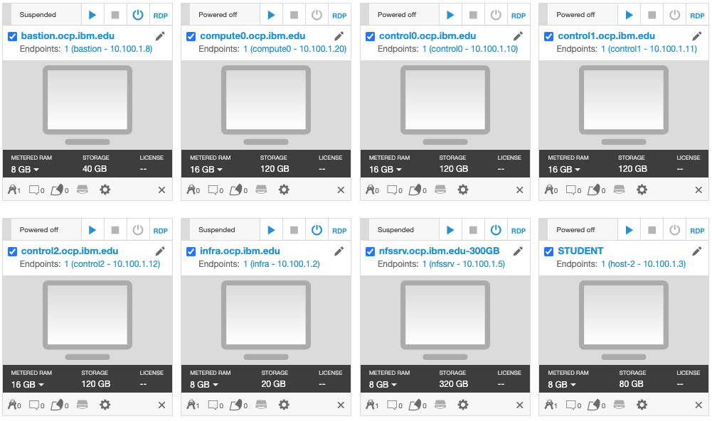

  WebSphere Automation is pre-installed in the OCP cluster hosted on the VMs.

2.Start the environment with the Play button in the top-right corner. It takes about 10-15 minutes for the environment to start and stabilize.

  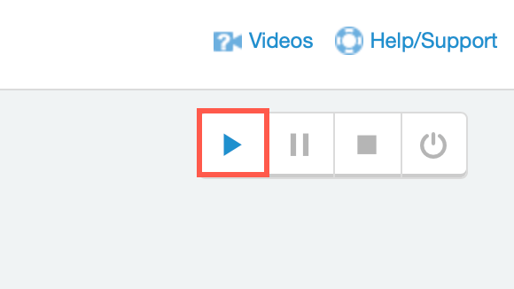

3.You will be working on the Student VM only. This VM is installed with OCP client (oc) and all thee scripts and files you need for the lab.

  All the WebSphere images and iFixes required for the lab are pre-installed:
  - /opt/IBM/WebSphere/Liberty200012/
  - /opt/IBM/WebSphere/Liberty20009/
  - /opt/IBM/WebSphere/AppServer9057/
  - /opt/IBM/WebSphere/AppServer9056/

  Click the screen representing the **STUDENT** VM.

  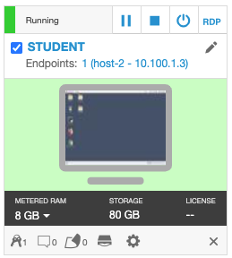

4.Once you log in to the Student VM you will see the Desktop, which contains all the programs that you will be using (browsers, terminal, etc.)

  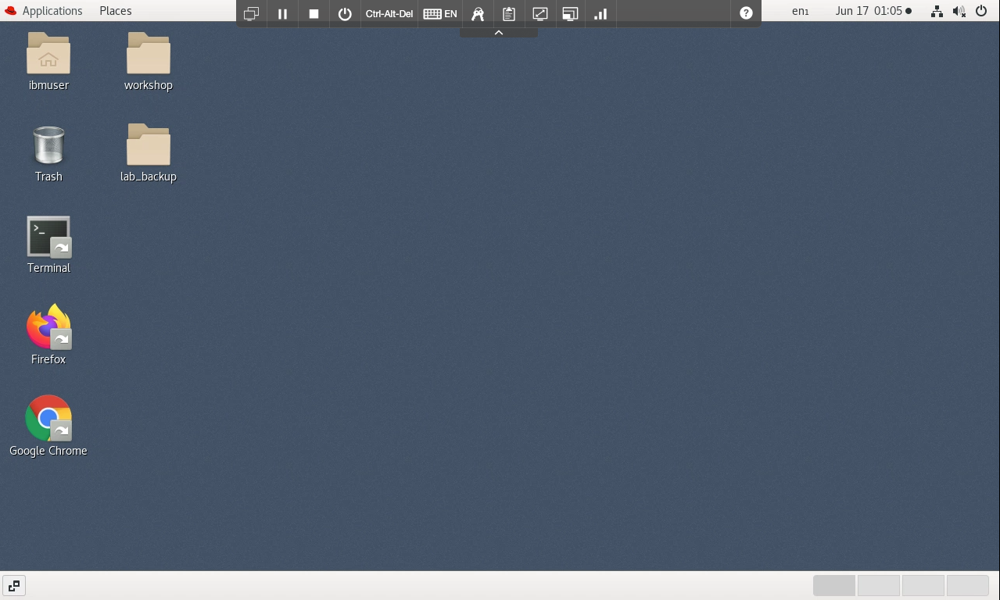

5.You can resize the virtual desktop with the Fit to window button.

  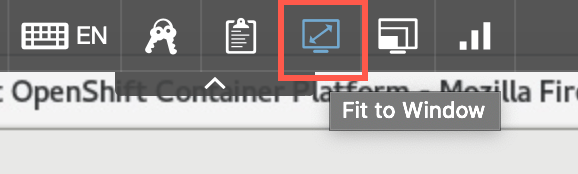

***

## Receiving vulnerability notifications

### Accessing the WebSphere Automation UI

A WebSphere administrator sets up WebSphere Automation by registering and configuring WebSphere Application Server and WebSphere Application Server Liberty servers for vulnerability tracking and by configuring email notifications. WebSphere administrators can also view the results of vulnerability assessment in WebSphere Automation to plan their response for the WebSphere Application Server and WebSphere Application Server Liberty servers that they manage.

For this tutorial, WebSphere Automation is pre-installed on an OCP cluster. You have your individual WebSphere Automation installation. Let's access your environment.

1.On the *Student VM*, open a browser and enter the following URL:
```
https://cpd-websphere-automation.apps.ocp.ibm.edu
```

  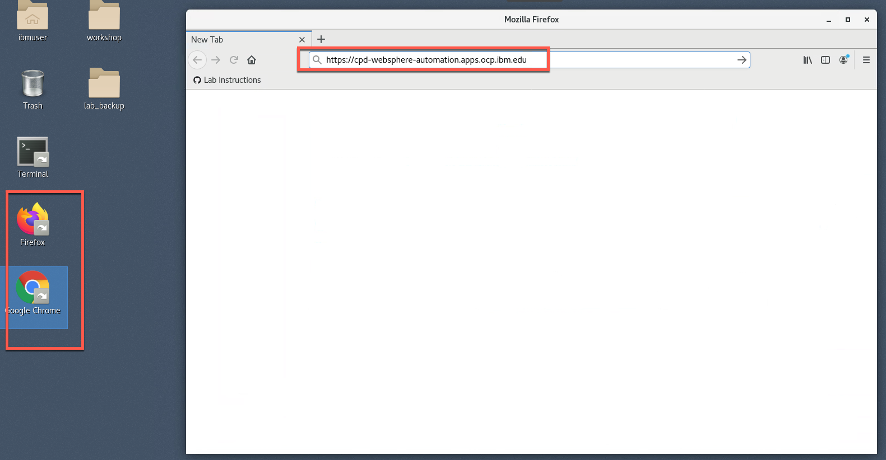

  If necessary, accept all the warnings and certificates. Depending on your browser, you might have to scroll down to permit access.

2.On the login page, select the **OpenShift authentication** as the authentication type.

  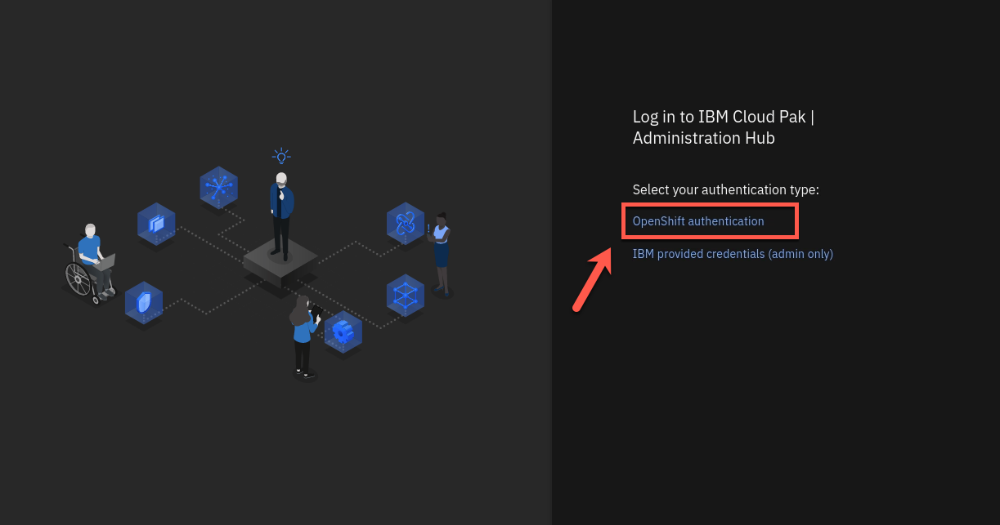

3.Enter **ocadmin** as username and **ibmocp46** as password. And click **Log In**.

  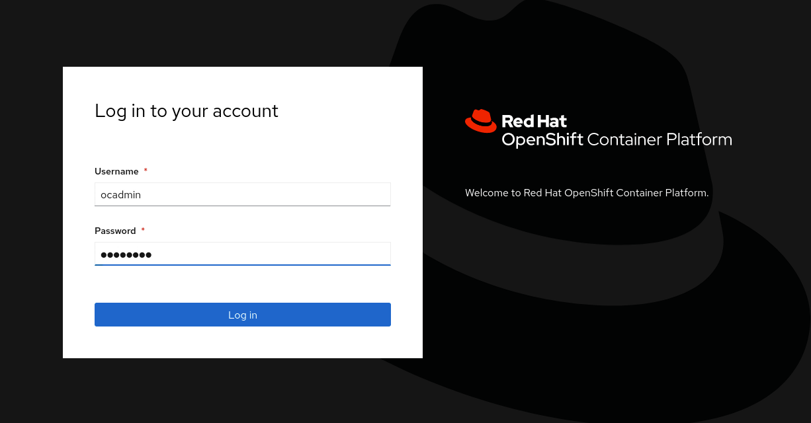

4.The *IBM Automation Welcome page* appears.

  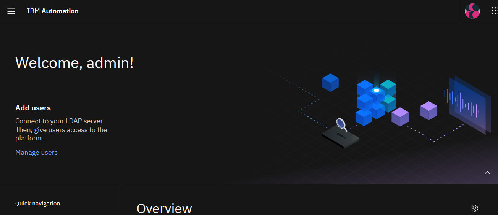

5.On the Welcome page, open the **Menu**, click **Operate**, and then click **Application runtimes**.

  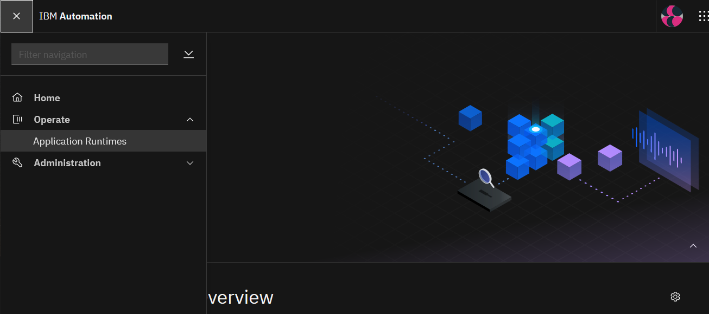

6.The Application runtimes page appears. There should be no data since no WebSphere servers are registered/configured yet.

  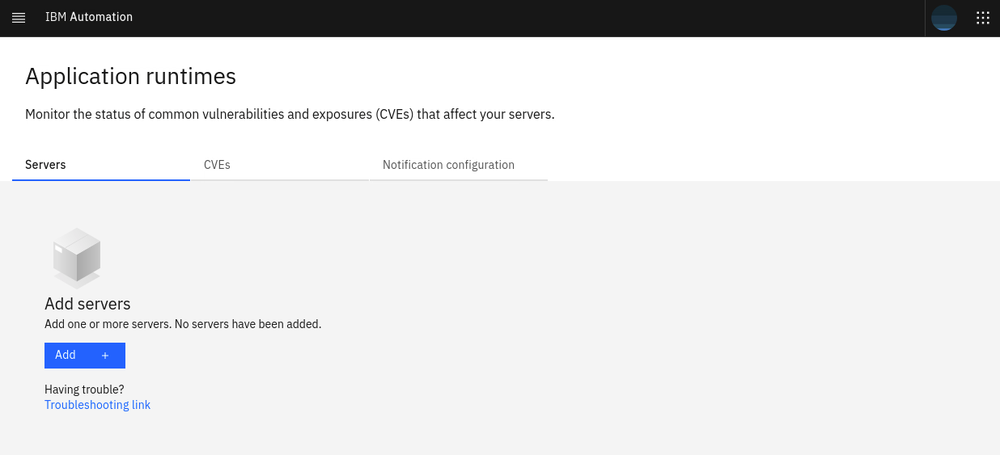

7.However, before start to register servers to our Dashboard, let's configure your email to received notifications abouts CVEs. Open the **Notification configuration** tab.

  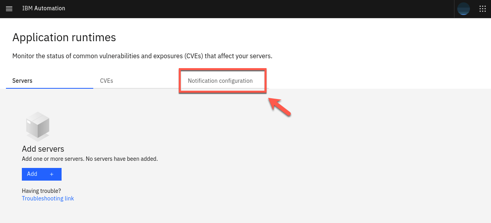

8.The Email server configuration is pre-configured for this lab. You only need to add your personal email to receive notifications of new security vulnerabilities. Click **Add email address** (1) and enter *your email* and click **Save** (2).

  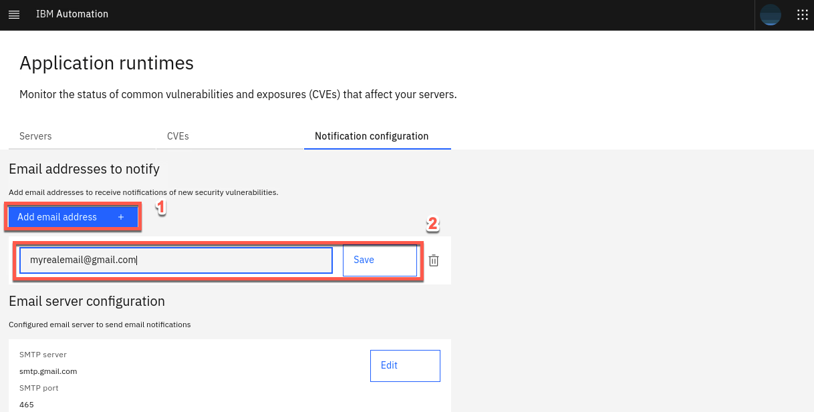

  Great! Your email is configured to receive security notifications. Next section, you start to register our servers to WebSphere Automation.

***

## Getting configuration parameters

Add each of your WebSphere® Application Server servers and WebSphere Application Server Liberty servers to WebSphere Automation by registering them with the usage metering service.

To register your application servers with the usage metering service in WebSphere Automation, you must configure the usage metering feature in each application server. To configure the usage metering feature in each of your application servers, you must obtain the following usage metering items:
- **URL**: The URL of the usage metering service in WebSphere Automation. This service registers WebSphere Application Server servers and Liberty servers with WebSphere Automation so that you can track security vulnerabilities.
- **API Key**: The token used to authenticate the WebSphere Application Server servers and Liberty servers during the registration process.
- **Usage metering certificate**: The certificate that contains the public key. This key allows an application server that is registering with WebSphere Automation to do an SSL handshake with the metering service.

In this section, you will get these configuration parameters. Let's start it!

1.Back to the desktop, open a **terminal** window.

  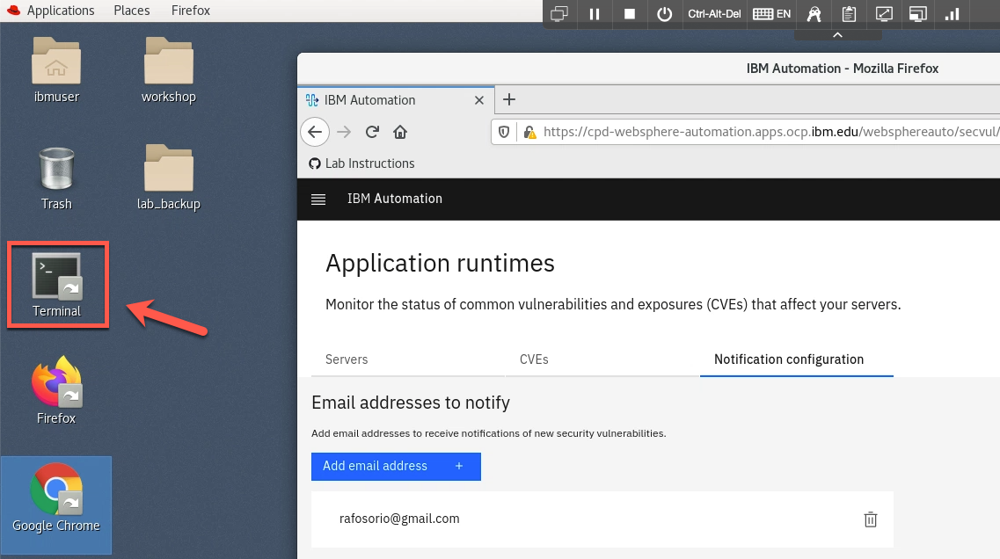

2.Log in as **root**.
```
su root
```
  Enter the following password when prompted:
```
1bm2021rhjb
```

3.Now, let's log in to the OCP Cluster using the command below:
```
oc login --username=ocadmin --password=ibmocp46 --insecure-skip-tls-verify=true --server=https://api.ocp.ibm.edu:6443
```

  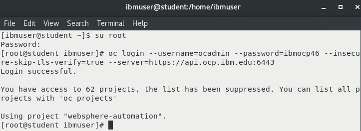

4.Make sure that the project you are working on is websphere-automation:
```
oc project websphere-automation
```

### Get usageMetering configuration parameters (url, api-key, cert)

5.Now, let's use the oc command to get the URL of the usage metering service in WebSphere Automation and save it in a file:
```
echo https://$(oc get route cpd -n websphere-automation -o jsonpath='{.spec.host}')/websphereauto/meteringapi > /opt/IBM/WebSphere/metering-url.txt
```

6.Let's get the api-key and save it a file too.
```
oc -n websphere-automation get secret automation-secure-metering-apis-encrypted-tokens -o jsonpath='{.data.automation-secure-metering-apis-sa}' | base64 -d > /opt/IBM/WebSphere/api-key.txt; echo >> /opt/IBM/WebSphere/api-key.txt
```

7.Finally, let's get the Server certificate and save it in a file.
```
oc get secret external-tls-secret -n websphere-automation -o jsonpath='{.data.cert\.crt}' | base64 -d > /opt/IBM/WebSphere/cacert.pem
```

  Great! Now you have all the configuration parameters to register your application servers with the usage metering service in WebSphere Automation. Next section, you register your first server in WebSphere Automation.

***

## Configuring Liberty server v20.0.0.12

In this section, you configure Liberty Server version 20.0.0.12 to register to WebSphere Automation.

1.Let's create a Liberty server version 20.0.0.12, using the command below:
```
/opt/IBM/WebSphere/Liberty200012/bin/server create Liberty_200012_server
```

  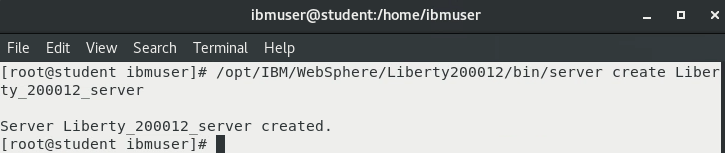

2.Now you need to configure the server to use TLS/SSL using the provided server_tls.xml file:
```
\cp -f /home/ibmuser/Desktop/lab_backup/liberty200012/server_tls.xml /opt/IBM/WebSphere/Liberty200012/usr/servers/Liberty_200012_server/server.xml
```

3.Let's start the Liberty server:
```
/opt/IBM/WebSphere/Liberty200012/bin/server start Liberty_200012_server
```

  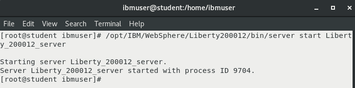

4.Now, you need to update the DefaultKeyStore with the server certificate to trust the server for https connection:
```
keytool -import -trustcacerts -file /opt/IBM/WebSphere/cacert.pem -keystore /opt/IBM/WebSphere/Liberty200012/usr/servers/Liberty_200012_server/resources/security/key.p12 -storetype PKCS12 -storepass th1nkpassword -noprompt
```

  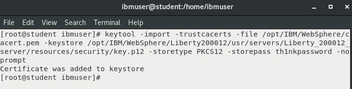

5.It's time to configure the usage metering in the new server. Edit the **server.xml** file.
```
vi /opt/IBM/WebSphere/Liberty200012/usr/servers/Liberty_200012_server/server.xml
```

6.Add the **usageMetering-1.0** feature to the existing features in the `<featureManager>` element (check the picture below)
```
<feature>usageMetering-1.0</feature>
```

  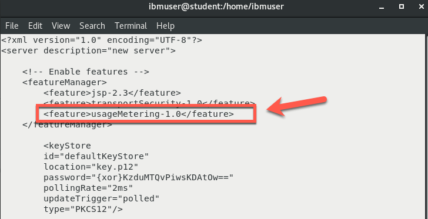

7.Add the **usageMetering** element below:
```
<usageMetering url="<metering-url>" apiKey="<api-key>" sslRef="defaultSSL"/>
```

  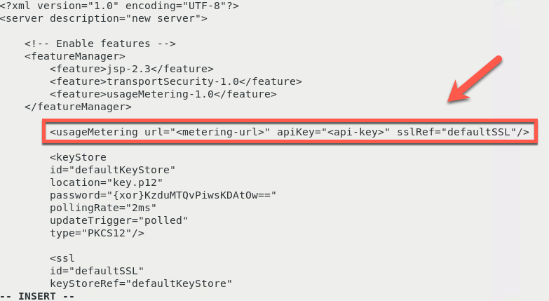

8.You need to replace the `<metering-url>` with the output of the following command. Open another terminal window, and run the cat command below:
```
cat /opt/IBM/WebSphere/metering-url.txt
```

9.Replace `<api-key>` above with the output of the following cat command. Use the second terminal to run the cat command:
```
cat /opt/IBM/WebSphere/api-key.txt
```

10.**Save** and **Close** the server.xml file.

11.Back to the WebSphere Automation Dashboard on your browser, open the **Servers** view.

12.Confirm that the Liberty server is registered to WebSphere Automation Application runtimes page.


  Maybe your server vulnerability is a little bit different of the picture above, because maybe new vulnerability was discovered.

***

## Configuring Liberty server v20.0.0.9

* Create the Liberty server version 20.0.0.9:

```
/opt/IBM/WebSphere/Liberty20009/bin/server create Liberty_20009_server
```

* Since you have already configured usageMetering feature for Liberty version 20.0.0.12, we have a provided couple of server.xml files to make the configuration simpler. First copy the tls configuration:

```
\cp -f /home/ibmuser/Desktop/lab_backup/liberty20009/server_tls.xml /opt/IBM/WebSphere/Liberty20009/usr/servers/Liberty_20009_server/server.xml

```

* Note the above command occasionally fails on the VM. Ensure that the two files are the same.

```
cmp /home/ibmuser/Desktop/lab_backup/liberty20009/server_tls.xml /opt/IBM/WebSphere/Liberty20009/usr/servers/Liberty_20009_server/server.xml && echo "files are the same, proceed to the next step"
```

* Start the Liberty server:

```
/opt/IBM/WebSphere/Liberty20009/bin/server start Liberty_20009_server
```

* Update the DefaultKeyStore with the server certificate to trust the server for https connections:

```
keytool -import -trustcacerts -file /opt/IBM/WebSphere/cacert.pem -keystore /opt/IBM/WebSphere/Liberty20009/usr/servers/Liberty_20009_server/resources/security/key.p12 -storetype PKCS12 -storepass th1nkpassword -noprompt

```

* Copy the server.xml that contains the usageMetering feature and properties (url, api-key):

```
\cp -f /home/ibmuser/Desktop/lab_backup/liberty20009/server_configured.xml /opt/IBM/WebSphere/Liberty20009/usr/servers/Liberty_20009_server/server.xml

```

* Note the above command occasionally fails on the VM. Ensure that the two files are the same.

```
cmp /home/ibmuser/Desktop/lab_backup/liberty20009/server_configured.xml /opt/IBM/WebSphere/Liberty20009/usr/servers/Liberty_20009_server/server.xml && echo "files are the same, proceed to the next step"
```

* Confirm that the Liberty server is registered to WebSphere Automation

```
https://cpd-websphere-automation.apps.ocp.ibm.edu/websphereauto/secvul/

```

* The console shows that this server is vulnerable for CVE-2020-10693

* Check your email. A mail notification (if configured) will be sent indicating the vulnerability:

  * In the email message, there will be a link that would redirect to the console to show more details on the vulnerability. Because of network restrictions in the lab environment, this link will not work.

   * The image below is where the link would have redirected to.

   


***

## Configuring traditional WebSphere (tWAS) v9.0.5.6

* Start the tWAS 9.0.5.6 server:

```
/opt/IBM/WebSphere/AppServer9056/bin/startServer.sh tWAS_9056_server

```

* Configure usage-metering:

```
/opt/IBM/WebSphere/AppServer9056/bin/wsadmin.sh -f /api-usagemetering/scripts/configuretWasUsageMetering.py url=$(cat /opt/IBM/WebSphere/metering-url.txt) apiKey=$(cat /opt/IBM/WebSphere/api-key.txt) trustStorePassword=th1nkpassword

```

* Confirm that the tWAS server is registered to WebSphere Automation

```
https://cpd-websphere-automation.apps.ocp.ibm.edu/websphereauto/secvul/
```

* You should see that this server is vulnerable to 8 CVEs

* Check your email. A mail notification (if configured) will be sent showing the vulnerability

***

## Configuring traditional WebSphere (tWAS) v9.0.5.7

* Start the tWAS 9.0.5.7 server:

```
/opt/IBM/WebSphere/AppServer9057/bin/startServer.sh tWAS_9057_server
```

* Configure usage-metering:

```
/opt/IBM/WebSphere/AppServer9057/bin/wsadmin.sh -f /api-usagemetering/scripts/configuretWasUsageMetering.py url=$(cat /opt/IBM/WebSphere/metering-url.txt) apiKey=$(cat /opt/IBM/WebSphere/api-key.txt) trustStorePassword=th1nkpassword
```

* Confirm that the tWAS server is registered to WebSphere Automation:

```
https://cpd-websphere-automation.apps.ocp.ibm.edu/websphereauto/secvul/
```

* You should see that this server is vulnerable to 1 CVE (CVE-2021-26296)

* Check your email. A mail notification (if configured) will be sent showing the vulnerability


***

## Update Liberty server v20.0.0.9 to fix the vulnerability

### By updating configuration

* Liberty 20.0.0.9 is impacted by CVE-2020-10693. This is because it configures the beanValidation-2.0 feature.

See [CVE-2020-10693](https://www.ibm.com/support/pages/node/6348216) for more info.

* We should resolve this by applying the iFix. However, for the lab, we can also do a quick test by unconfiguring this feature:

```
vi /opt/IBM/WebSphere/Liberty20009/usr/servers/Liberty_20009_server/server.xml
```
or

```
gedit /opt/IBM/WebSphere/Liberty20009/usr/servers/Liberty_20009_server/server.xml
```
  * Comment out the feature:
  ```
  <!-- <feature>beanValidation-2.0</feature> -->
  ```

* Save the server.xml file.

* Go to console to make sure that the Liberty 20.0.0.9 server does not show any vulnerabilities. The update is picked up automatically.

```
https://cpd-websphere-automation.apps.ocp.ibm.edu/websphereauto/secvul/
```

### By Applying an IFIX

* Instead of removing the beanValidationFeature-2.0, the correct process is to apply the appropriate iFix to get rid of the vulnerability:

```
vi /opt/IBM/WebSphere/Liberty20009/usr/servers/Liberty_20009_server/server.xml

```

or

```
gedit /opt/IBM/WebSphere/Liberty20009/usr/servers/Liberty_20009_server/server.xml

```
  * Uncomment out the feature:
  ```
  <feature>beanValidation-2.0</feature>
  ```

* Save the server.xml file.

* Make sure the vulnerability shows up again. An email will also be sent out.

```
https://cpd-websphere-automation.apps.ocp.ibm.edu/websphereauto/secvul
```

* Stop the server:

```
/opt/IBM/WebSphere/Liberty20009/bin/server stop Liberty_20009_server
```

* Apply the iFix:

```
/iFix/PH29942/imcl_ifix_install.sh 20009
```

* Start the server:

```
/opt/IBM/WebSphere/Liberty20009/bin/server start Liberty_20009_server
```

* Now, in your console you should notice that the CVE was removed:

```
https://cpd-websphere-automation.apps.ocp.ibm.edu/websphereauto/secvul/
```


***

## Update tWAS server v9.0.5.7 to fix the vulnerability

* Notice in the console that tWAS 9.0.5.7 is vulnerable to CVE-2021-26296. We will fix it by applying the appropriate iFix.

* First, stop the server, wait until it has stopped:

```
/opt/IBM/WebSphere/AppServer9057/bin/stopServer.sh tWAS_9057_server
```

* Run the following script to install the iFix:

```
/iFix/PH34711/imcl_ifix_install.sh 9057
```

* Start the server once the installation has completed:

```
/opt/IBM/WebSphere/AppServer9057/bin/startServer.sh tWAS_9057_server
```
* Go back to the console. Notice that there are no more CVEs under tWAS 9.0.5.7.Also, you can see on the right under "Applied iFixes" there are 4 applied fixes.

```
https://cpd-websphere-automation.apps.ocp.ibm.edu/websphereauto/secvul/
```


***

## Update tWAS server v9.0.5.7 to introduce the vulnerability back (optional)

* You can remove the iFix that was applied to confirm that the CVE-2021-26296 shows up in the unresolved CVE list

* Stop the server:

```
/opt/IBM/WebSphere/AppServer9057/bin/stopServer.sh tWAS_9057_server
```

* Uninstall the iFix:
```
/iFix/PH34711/imcl_ifix_uninstall.sh 9057
```

* Start the server:

```
/opt/IBM/WebSphere/AppServer9057/bin/startServer.sh tWAS_9057_server
```

* Go back to the console. Notice that there is now again 1 CVE under the tWAS 9.0.5.7 server:

```
https://cpd-websphere-automation.apps.ocp.ibm.edu/websphereauto/secvul/
```

* Check your email. A mail notification (if configured) will be sent showing the vulnerability.

***

## Summary

Congratulations! You have completed the WebSphere Automation lab.

With automated tooling and insights, IBM WebSphere Automation enables teams to modernize and secure IT estates, adapt and respond to incidents efficiently, and optimize WebSphere operations. WebSphere system operators and administrators can reduce the cost, effort, and risk of addressing vulnerabilities, automate critical activities, and preserve uptime with early detection, notification, and remediation of incidents.

IBM WebSphere Automation helps teams remove manual toil to work less on maintenance tasks and more on strategic activities, while unlocking new value, extending the life, and increasing ROI of WebSphere investments.

IBM WebSphere Automation is part of IBM Automation, a set of shared automation services that help you get insight into how your processes run, visualize hotspots and bottlenecks, and use financial impact information to prioritize which issues to address first.

To learn more about IBM WebSphere Automation, visit [ibm.com/cloud/websphere-automation](http://ibm.com/cloud/websphere-automation).
