import ArticleDetails from '../../../../src/gatsby-theme-carbon/components/ArticleDetails'


<FeatureCard
  title="WebSphere Automation Lab"
  color="dark"
  >


</FeatureCard>

<AnchorLinks>
  <AnchorLink>Introduction</AnchorLink>
  <AnchorLink>Lab Overview</AnchorLink>
  <AnchorLink>Prerequisites</AnchorLink>
  <AnchorLink>Business Context</AnchorLink>
  <AnchorLink>Accessing and starting the environment</AnchorLink>
  <AnchorLink>Configure your email to receive vulnerability notifications</AnchorLink>
  <AnchorLink>Edit and Test API</AnchorLink>
  <AnchorLink>Create a Product and apply GraphQL RateLimits</AnchorLink>
  <AnchorLink>Explore the API from Developer Portal</AnchorLink>
  <AnchorLink>Summary</AnchorLink>
</AnchorLinks>

***

<ArticleDetails name="Tien-Thanh Le" lastUpdated="June 2021" readTimeMinutes="45" />

Need support? Contact **Rafael Osorio** and **Kevin Postreich**

***

## Introduction

Organizations are challenged to transform quickly and maximize ROI, while keeping traditional and modern applications running together securely. Reclaiming productivity is key to giving teams back the time required to innovate and build resiliency.

Unfortunately, massive transformation programs are hard to greenlight and most fail to deliver immediate results. According to Gartner, AI augmentation will recover 6.2 billion hours of worker productivity in 20211 – time that can be invested in creating a solid and secure base for WebSphere transformation.

By leveraging AI and automation, organizations can achieve immediate savings and business benefits, while laying a solid and secure technology foundation for future growth.

With AI and automation, teams can modernize and secure their IT estate as well as adapt and respond to incidents efficiently. WebSphere system administrators can reduce the cost, effort, and risk of addressing vulnerabilities and anomalies, automate critical activities, preserve uptime and remediate capacity incidents.

IBM WebSphere Automation makes business efficiency and resiliency standard. It helps teams work less on maintenance tasks and gives time back to focus more on strategic activities, to extend the life, increase the ROI, and unlock new value from WebSphere investments.

IBM WebSphere Automation is a complete solution to help administrators and operators quickly unlock value with increased security, resiliency and performance.

**Secure operations to reduce risk and meet compliance**
  – Automatically recognize and recommend relevant CVEs for specific server deployments.
  – Deliver security patches more efficiently to targeted environments.
  – Maintain the notification system for all the security response team members from a central location.

**Build operational resiliency**
  – Sense and respond to security vulnerabilities faster to avoid disruptions for WebSphere apps.

**Optimize runtimes and applications for operational performance**
  – Access consolidated information for a streamlined operational experience.
  – Reduce tedious tasks and achieve cost and time savings through optimal resource utilization, capacity provisioning and implementation of best practices across environments.

**Start small, scale and standardize on IBM Automation**
  – Build automation capabilities on top of the IBM Automation foundation for enterprise-level hybrid application management, observability, governance and compliance.

IBM WebSphere Automation is available as a stand-alone offering or as an addition to IBM Cloud Pak® for Watson AIOps. As part of IBM Automation platform, IBM WebSphere Automation includes containerized components and common software services on top of a common automation layer, to manage WebSphere’s incidents, hybrid applications, and cost with complete observability, governance and compliance. Deploy virtually anywhere through containers supported by Red Hat® OpenShift® software, on IBM Cloud®, on essentially any existing infrastructure on-premises, or through private and public clouds. Use only the capabilities you need with a fully modular approach that’s designed to be easy to consume.

***

## Lab Overview

In this tutorial, you use the IBM WebSphere Automation to secure operatios to reduce risk and meet compliance.

At the end of this lab, you will be able to connect teams with the most relevant information through a single dashboard to discover, analyze and remediate common vulnerabilities and exposures across instances.

***

## Prerequisites

  - You need to have the WebSphere Automation Skytap Image. [Request here](/)

***

## Business Context

As a developer, you are having problems to manage the use of GraphQL APIs in your company.

GraphQL provides the following particular advantages over REST APIs:
  - The application client can request only the data that it needs. For example, when retrieving bank account records, request only the account number and current balance for each account, but not the customer name and address details. With a REST API request, either the backend REST service must provide separate endpoints for different data subsets, or the application client must retrieve the complete records and then discard the unwanted data.
  - The application client can retrieve multiple related resources in a single request. For example, a customer's bank account record might include an array that references other finance products that the customer holds. If an application client wants to retrieve the bank account details for a specific customer, and details of the other finance products for that customer, then with a REST API the client would first retrieve the bank account details, then make separate requests for each of the other products. A GraphQL API can be designed to allow the client to retrieve all this information in a single request.

However, this flexibility presents rate limiting challenges, because two seemingly very similar requests might return vastly different amounts of data, and what might have required multiple REST API requests, each counting towards the rate limit, might require only a single GraphQL API request. It is important therefore that rate limiting controls are imposed that reflect the amount of data that is retrieved. 

Cloud Pak for Integration API Connect enables you to create a GraphQL API proxy definition that proxies a backend GraphQL server.  API Connect extends the GraphQL standard by providing, in a GraphQL API definition, the ability to configure a range of settings that are used to calculate the complexity of a GraphQL request and an associated cost that counts towards the rate limit.

***

## Accessing and starting the environment

When the demo environment is provisioned you should receive the email with link and access password. Open the link and provide the password. You should see the following screen:

  

Start the environment with the Play button in the top-right corner.

  

It takes about 10-15 minutes for the environment to start and stabilize


***

## Create a GraphQL Proxy API

1.Open a browser and go to your **Cloud Pak for Integration Platform Navigation**. On the **API Lifecycle management** box, click to open your **API Connect** Runtime.

  

2.On the Log In page, if you are using admin user, select *Common Services User Registry*. But if you are using LDAP users, you need to select your **LDAP User Registry** on the right side. Go ahead and **log in**.

  

3.Select **Develop APIs and products**.

  

  Then click **Add-\>API (from REST, GraphQL or SOAP)**.

  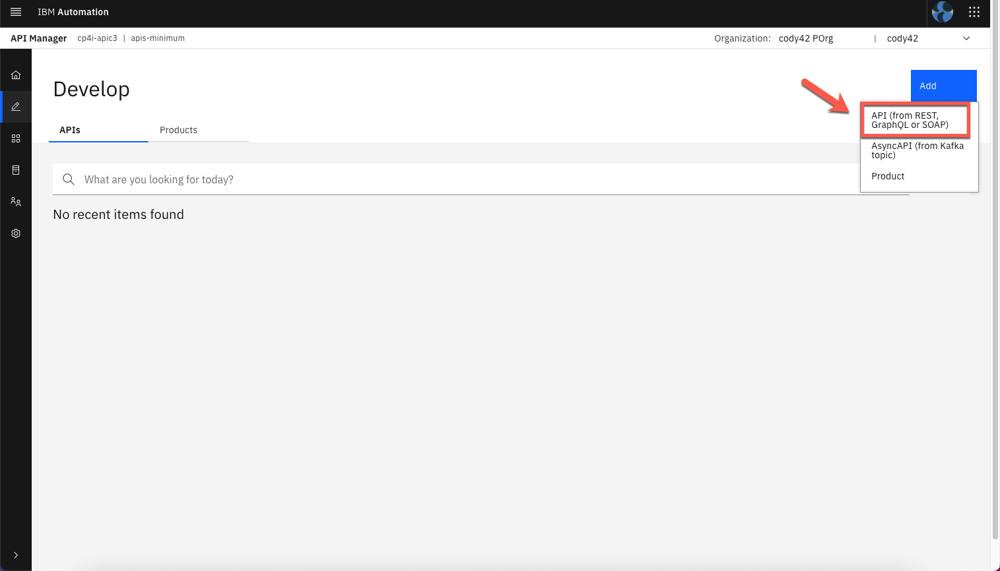

4.To create a GraphQL proxy, select **From Existing GraphQL service (GraphQL proxy)**. When you point to an existing GraphQL server, API Connect introspects the service and automatically creates a GraphQL proxy service.

  

5.Enter the following values and click **Next**. You can use default values for the rest.

  Title: **accounts**

  GraphQL server URL: **https://graphql-test-server.us-east.cf.appdomain.cloud/accounts/graphql**

  

  

6.In the Paths section, select **all** the available end points.

  

7.The schema validator reports warning and errors if found. There are two warnings in the accounts schema. Click **View** to get the Warning details. A review of the schema shows that no limit is set on the size of the list. You will fix this warning in later steps. Click Next to continue.

  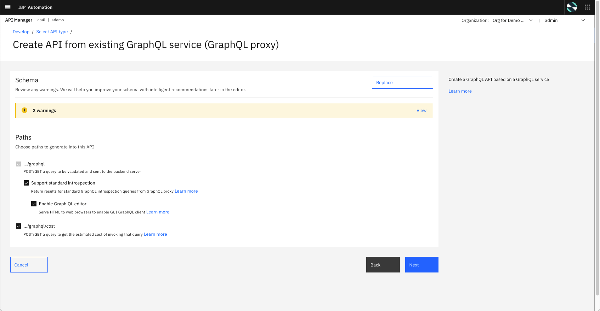

  

8.Keep both **Secure using Client ID** and **CORS** checked and click **Next**.

  

9.API Connect successfully created a GraphQL proxy API.

  

***

## Edit and Test API

1.Now, let's edit the API to view more details on the proxy API just created. Click **Edit API** to continue.

  

2.GraphQL APIs are structured the same as REST APIs with some additional options. Just like REST APIs, you will be able to add security definitions, properties and Activity logs from the left menu bar. You can also view the *Source* and *Assemble* tabs similar to REST APIs. You will notice a new tab for GraphQL APIs. Click on **GraphQL Schema** tab to view the schema.

  

3.GraphQL Schema editor displays *Type* and *Type Weight* information. The weighting factor is used when calculating the type cost for a request to the GraphQL API. For example, a field that requires extensive CPU or memory use on the server to retrieve its value would be given a higher cost.

  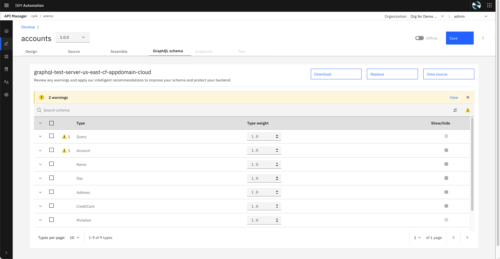

4.Let's view the *Warning* message in the *Query* field. In addition to the warning details, the Warning window gives an option to fix the warning by applying the limits. Click **Apply all** and **Apply** again.

  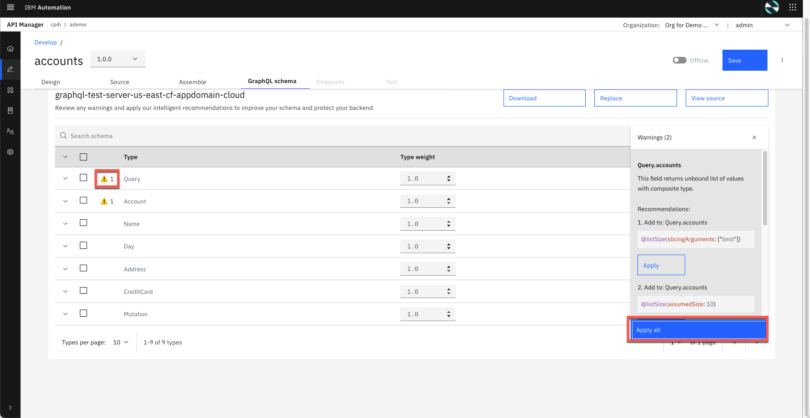

5.After applyting the recommendation the warning message is removed. Click **Save** to save the API definition .

  

6.Now, let's open the **Assembly** view. The flow is automatically created as part of the initial API creation. You may apply addition logic by dragging and dropping items from the pallet to the canvas. In this tutorial, you are not adding additional logic.

  

7.To publish the API toggle the button from offline to **online**.

  

8.After successfully publishing the API to API Gateway, additional tabs appear on the screen. Select **Test** tab to test the API.

  

9.The Test feature also includes a GraphQL Editor. Enter the following JSON in the GraphQL Editor. You may use *Prettify* option to improve the visualization of the JSON.

```
{
  accounts(limit: 2) {
    name {
      first
      last
    }
  }
}
```

10.Click **Run** button to send the GraphQL request to the end point.

  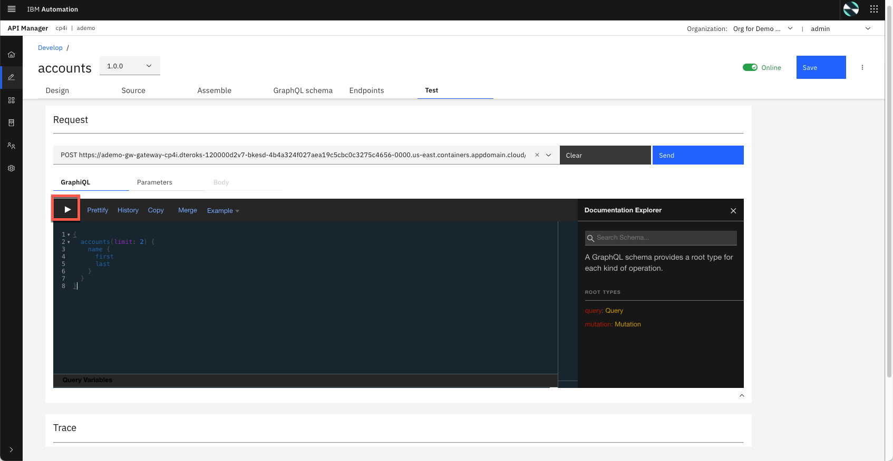

11.An exception window will appear when you use test the API for the first time. Click accept Exception to continue.

  

  You may see an invalid certificate issue page when you continue. This is because valid certificates are not applied in this test environment. If you are using Chrome browser you can accept the exception by typing "thisisunsafe" anywhere in the window. Similar workarounds are available for other browsers. For firefox browser, follow the steps from here - <https://support.mozilla.org/en-US/kb/error-codes-secure-websites>

  

12.The results for GraphQL request are displayed on the right panel. In the request we limited the values to 2, so only two accounts are displayed. Change the value to 5 and submit the request again and notice that more accounts are returned in the results window.

  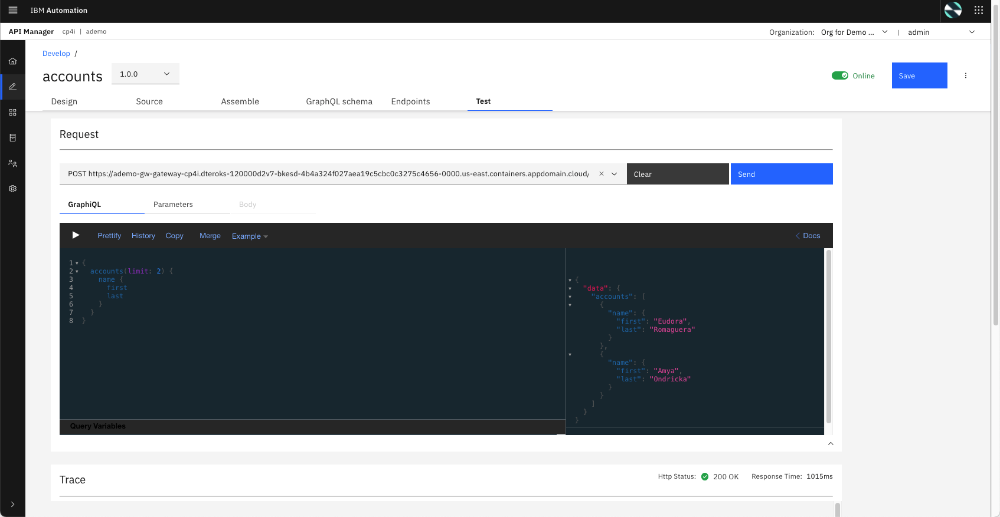

13.You can request additional data fields (refer to the schema editor for details), GraphQL may reject if certain fields are locked or prohibited. To test this, enter CreditCard information in the request field.

  The complete request looks as follows:

```
{
  accounts(limit: 2) {
    name {
      first
      last
    }
    shippingAddress {
      building
      street
    }
  }
  creditCard {
    number
    expirationDate
  }
}
```

  You will notice that an error message is displayed in the results window instead of the account values. This was caused because the server restricts the query field creditCard.


  

15.Submit another request to get account and shipping address details. This time the values are turned without errors.

```
{
  accounts(limit: 2) {
    name {
      first
      last
    }
    shippingAddress {
      building
      street
      state
      zip
    }
  }
}
```

  

16.On *breadcrumbs*, return to **Develop** page.

  


***

## Create a Product and apply GraphQL RateLimits

1.Click **Add-\>Product**.

  

2.Select **New product** and click **Next**.

  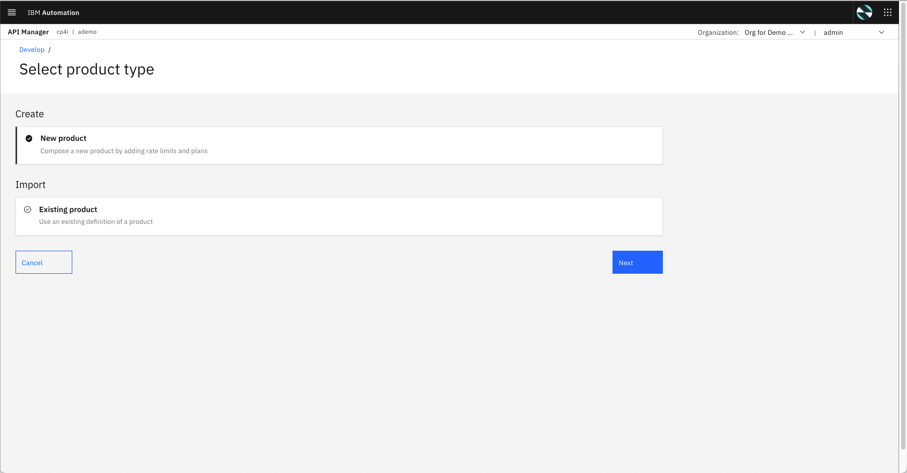

3.Name the product as **Accounts Product** and click **Next**.

  

4.Add Accounts API to the product by selecting accounts. Click Next to continue to create the accounts-product.

  

5.The *Default Plan* contains traditional rate limiting options, but in next steps, you will be able to list GraphQL Rate Limits.

  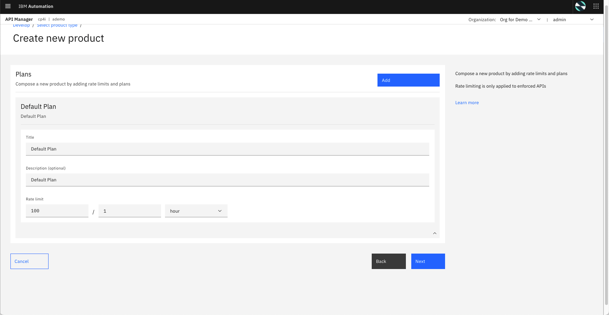

6.Publish the Product to Sandbox Catalog by selecting **Publish product**. Accept the default for *Visibility* and *Subscribability* and click **Next**.

  

7.Great! You have your ner product. Click **Done**.

  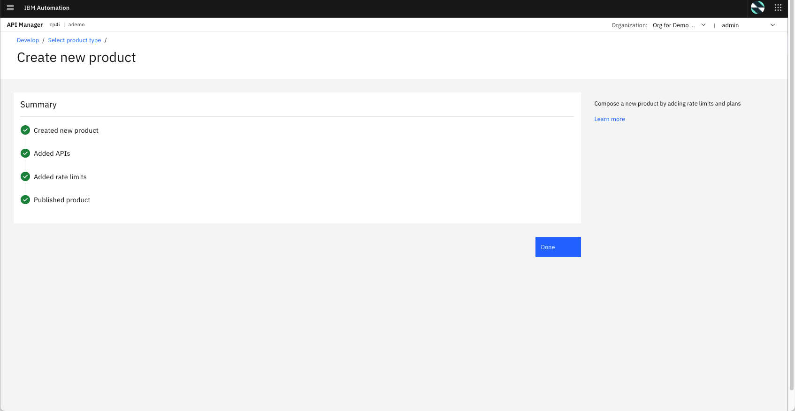

8.Back to the *Develop* view, open **Products** tab and click on **Accounts Product**.

  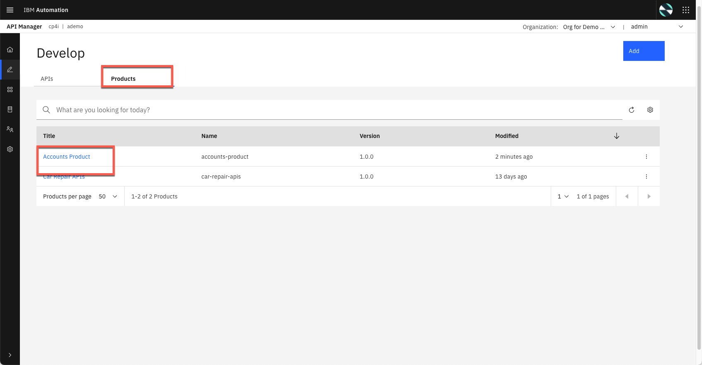

9.Open the **Plans** section, and on the *Default Plan*, open the *Context menu* and select **Edit**.

  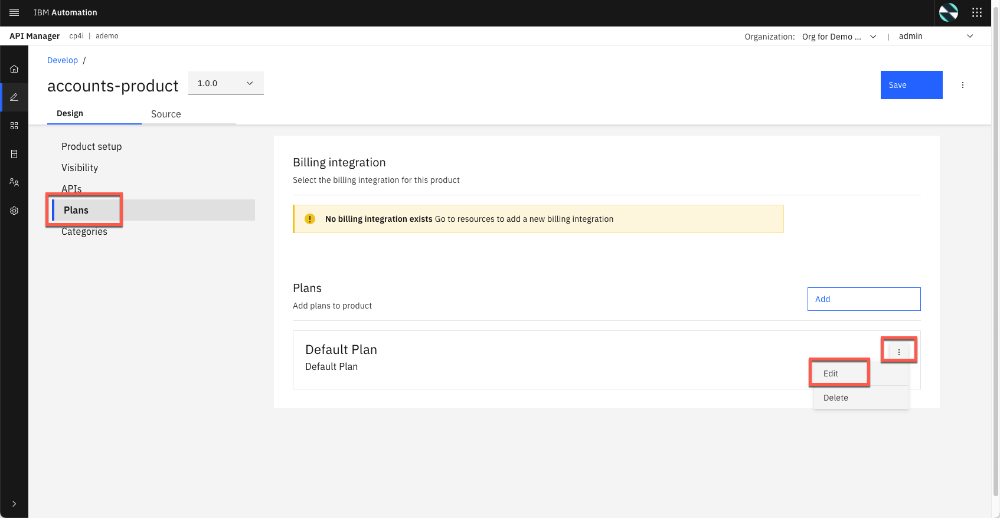

10.Scroll down, and now you can see the *GraphQL rate limits*. You will be able to adjust GraphQL cost parameters from this section (including costs per field or type). You can set a limit or make it unlimited. In this tutorial, you will not be making any changes.

  If you want to understand how the GraphQL rate limits work, check this [documentation page](https://www.ibm.com/docs/en/api-connect/10.0.x?topic=api-securing-graphql-by-using-client-id). On the left menu, click **Manage** icon to manage our Sandbox catalog.

  

***

## Explore the API from Developer Portal

Now that we’ve published our API, we need to make sure that our API consumers can discover it and use it. Our Portal will allow customers to view the APIs, sign up and subscribe to plans in a self-service manner, test the APIs, download the OpenAPI - Swagger documents and more. Let’s explore it.

1.Let's get our Portal URL. On *Manage* page, open the **Sandbox** catalog.

  

2.Click **Catalog settings** and open the **Portal** tab.

  

3.Great, here you have your *Portal URL*. **Copy** it, and open it in a new browser tab.

  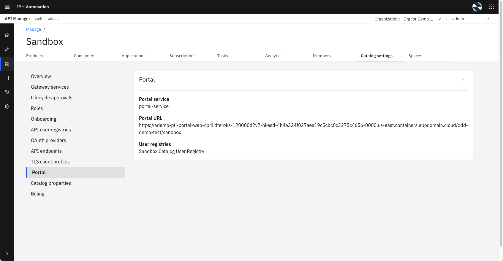

4.Sign in to Developer Portal using your developer username and password. If you don't have one, you are welcome to create a Developer account.

  

5.Developer Portal displays all the products that are currently published. Locate accounts-product and select the product.

  

6.The selected product lists one API (accounts api) and one Plan (Default Plan). Select Subscribe option to subscribe to the plan.

  

7.The Plan subscription requires an Application. You can create a new Application or select the IBM Consumer application that is already created.

  

8.Select accounts API to review and test the API. Click accounts to continue

  

9.Developer Portal displays the type as GrahQL API. Currently Client ID security is enforced. Since there is only on Plan and one Consumer Application, the Consumer ID filed is already populated.

  

10.To continue to test the API, use the GraphQL Editor. Submit requests with different field names and watch how quickly the results are returned in the results window. If this was a REST API multiple end points will be needed to achieve the same result.

  

***

## Summary

Congratulations! You have completed the WebSphere Automation lab.

To learn more about Cloud Pak for Integration and API Life Cycle Management, visit <https://www.ibm.com/cloud/cloud-pak-for-integration>
