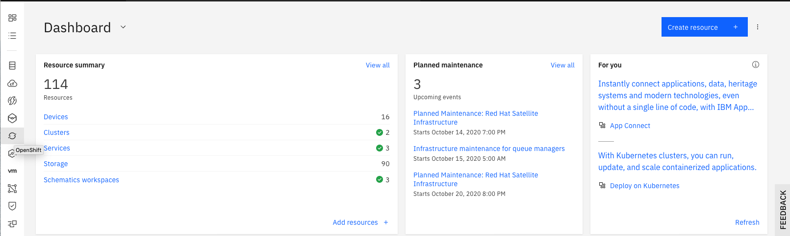
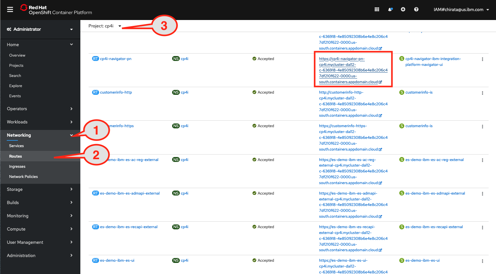
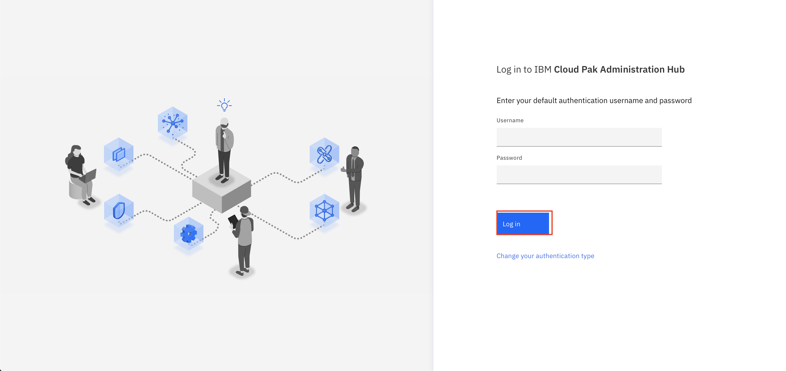
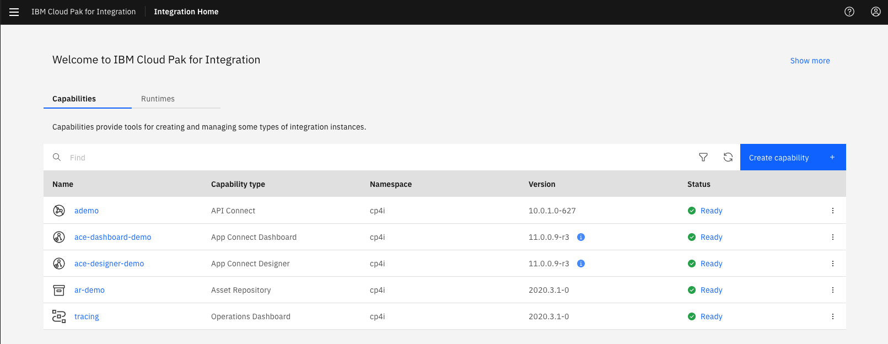

import ArticleDetails from '../../../../src/gatsby-theme-carbon/components/ArticleDetails'

<ArticleDetails name="Carlos Hirata, Ravi Katikala" lastUpdated="January 2021" readTimeMinutes="60" />

We installed IBM Cloud Pak® for Integration 2020.3.1 on Red Hat® Openshift® 4.6.

<AnchorLinks>
  <AnchorLink>Prepare the environment</AnchorLink>
</AnchorLinks>


## Prepare the environment

### Task 1 - Prepare the environment

**Note: If your using this tutorial in a multi-user ROKS setup, the environment is already prepared for you. Please login to the cluster using LDAP authentication and the credentials provided by your instructor and jump to [Configuring IBM MQ](#task-2-configuring-mq). Also, maske sure that you use a prefix provided by the instructor for queue, topic and server names.**

Because this is a new deployment of the Cloud Pak for Integration that uses Red Hat OpenShift, you need to run some steps to prepare the environment. Initial setup steps are only needed for a fresh installation of the Cloud Pak. They do not need to be repeated.

**Note: For this lab, we based on MAC workstation (MAC OSX)**

Requirements:

```
-	Java Version:
    java version "1.8.0_261"
    Java(TM) SE Runtime Environment (build 1.8.0_261-b12)
    Java HotSpot(TM) 64-Bit Server VM (build 25.261-b12, mixed mode)
-	Maven:
    https://maven.apache.org/
-	Git:
    https://git-scm.com/
-	Openshift CLI installed
    https://cloud.ibm.com/docs/openshift?topic=openshift-openshift-cli#cli_oc

```

1.In your workstation open a browser and enter http://cloud.ibm.com and enter your ibmid  and click continue and password to login IBM Cloud.


2.Enter your IBM userid  and the password and then enter the verify code.


3.In the IBM Cloud Dashboard. You see all information about the infrastructure. On the left, click the Openshift icon.



4.Click your Cluster link.


5.Click Openshift web console.


6.In the OpenShift console. Select the following:

```
1.	**Networking** .
2.	**Routes** .
3.	Drill down the Project to **cp4i** .
4.	Click link to access Cloud Pak for Integration .
```


7.Click **Default authentication** as authentication type.


8.You might need to login screen for IBM Cloud Pak might be displayed, enter the username: **admin** and Password (**Enter the 32 characters password that you created when you made the Cloud Pak provisioning**) and Click Log in.
Tip: You might need to use the password. You can use the Clipboard to save the password.



9.In the **Cloud Pak Welcome** page, you see **Capabilities** and **Runtimes** instances.



## Summary

You have successfully completed the tutorial. You were able to add a layer of secure, reliable, event-driven, and real-time data, which can be reused across applications in your enterprise.

To try out more labs, go to Cloud Pak for Integration Demos. For more information about the Cloud Pak for Integration, go to https://www.ibm.com/cloud/cloud-pak-for-integration.
